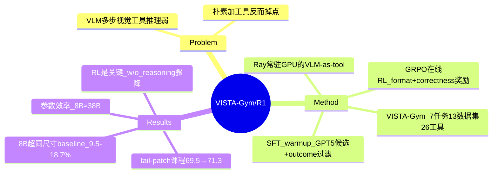

## Summary
VLM 想「think with images」（多步调用视觉工具做推理）缺乏可规模化的训练环境，本文造了 VISTA-Gym（统一 7 类任务 / 13 数据集 / 26 工具的 Gymnasium 式 RL 环境），并用「SFT warmup + GRPO 在线 RL」训出 VISTA-R1，在 11 个推理密集 VQA benchmark 上比同尺寸开源 baseline 高 9.51%–18.72%（带工具）。

## Problem & Motivation
VLM 在静态图像理解上很强，但**多步视觉交互推理**（"thinking with images"：grounding、zoom-in、解析图表）仍很弱。Tool-Integrated Reasoning（TIR）给模型外接工具理应有帮助，但作者的探索实验（500 错误样本标注）发现一个反直觉现象：**朴素地给 base VLM 加工具反而掉点**——没有指令/推理先验时，工具调用变成 distractor。失败主要来自 if/when/which/how 的工具调用（schema 错误 E1、参数错误 E2-E4）和工具输出后的错误推理（E6 占 InternVL3-8B 错误的 64.8%）。核心痛点：缺乏一个**可规模化、可验证奖励**的环境来系统训练 VLM 的 TIR 能力。

## Method
两个产物：

**VISTA-Gym（训练环境）**
- **任务**：7 个推理轴、13 个 benchmark——Chart（FigureQA/ChartQA）、Geometric（Geometry3K/GeoQA/UniGeo）、Geospatial（MapQA）、Scientific（ScienceQA/VizWiz）、Document（DocVQA）、Spatial/Compositional（CLEVR）、Others（ThinkVL/A-OKVQA）。
- **工具**：26 个预定义工具，4 个家族——Perception（GroundingDINO/SAM/EasyOCR）、Chart Understanding（ChartMoE）、Diagram Formalization（CDL/Inter-GPS）、Math Solvers（G-LLaVA/MultiMath）。计算密集的「VLM-as-tools」用 HTTP 微服务部署（FastAPI + 中间 Tool 层 + **Ray Actor 把权重常驻 GPU**，避免反复 reload）。
- **接口**：Gymnasium 式 `reset()/step()`，建模为 POMDP；可验证 reward、轨迹日志、多线程并行采样。`BaseTool` 接口支持 plug-and-play 扩工具。

**VISTA-R1（两阶段训练）**
- **Stage I 模仿学习 warmup**：合成 think→tool_call→answer 交错轨迹——GPT-5 生成候选 + **outcome-based filtering**（只留最终答案与 GT 完全匹配的）+ 用 Qwen3-VL-235B-A22B-Thinking 做 **rationale densification**（把简短 rationale 替换成长推理）。BC 目标最大化交错 thought+action 的似然。
- **Stage II 在线 RL**：可执行环境多轮 rollout，每步 `<think>` 后接 `<tool_call>`；用 **GRPO**（group-normalized advantage）。Reward = 高优先级 **repetition penalty**（dominate 其余）+ **format reward**（每轮结构合法）+ **correctness reward**（仅对无重复且格式良好的输出，按规则核对 `<answer>`）。稀疏、format-aware，避免 exploit 中间启发式。

## Key Results
- **主结果**：11 个 benchmark（5 in-distribution：ChartQA/Geometry3K/GeoQA/UniGeo/MapQA；6 OOD：TABMWP/AI2D/PlotQA/CLEVR-Math/IconQA/MathVista）。VISTA-R1-8B（InternVL3-8B 底座）全平均 **72.48 vs InternVL3-8B 65.79**；比同尺寸开源 baseline 高 **9.51%–18.72%（带工具）、2.03%–11.24%（不带工具）**。
- **RL 是关键**：消融 w/o Reasoning（暴露工具但不强化推理）骤降到 48.40；w/o Tools 63.66。两阶段都有贡献（SFT 建立工具语法先验 +3.46%，RL 再 +10.19%）。
- **参数效率**：VISTA-R1-2B 与 8B baseline 竞争；8B 与 38B baseline 相当。OOD 上 8B 接近 GPT-o3 / Claude-4.5-Sonnet。
- **消融**：GRPO > PPO/DAPO（DAPO 去掉 uniform-reward 组导致早期 batch 塌缩）；多任务数据多样性是可迁移 TIR 的关键（单任务跨域迁移弱）；工具多样性缓解 over-specialization；专家轨迹越长质量越高 → RL 越好；**tail-patch 课程**（聚焦 pass-rate 0.125–0.375 的 hard-but-learnable）把 69.54→71.27。
- **错误分析**：VISTA-Gym 训练显著修复 base 模型的 E1-E6（尤其 E6 工具输出后错误推理）。

## Strengths & Weaknesses
**Strengths**
- 切中真实空白：**视觉 TIR 缺训练环境**，VISTA-Gym 把任务+工具+可验证 reward+高吞吐基建打包成可复用的 Gym，工程价值高（Ray 常驻 GPU 的 VLM-as-tool 微服务设计实用）。
- 消融**干净地解耦了 reasoning vs tool-use**：证明「光给工具会掉点、RL 强化推理才解锁 TIR」，这个 insight 比单纯 +X% 更有信息量。
- 参数效率与 OOD 泛化的证据较扎实。

**Weaknesses / Caveats**
- **「general visual reasoning」是 overclaim**：13 个数据集高度集中在 chart / geometry / math / diagram 这类**结构化符号推理**，本质更接近「带视觉的符号求解」而非开放世界视觉推理。标题里的「Scaling」也偏弱——最大才 8B。
- **SFT 候选用 GPT-5 生成**：虽做了 outcome filtering，仍是一种蒸馏，与「自举」叙事有张力；rationale 又靠 Qwen3-235B 加密，强依赖大模型 teacher。
- 26 工具 + 微服务基建**复杂度高**，复现成本不低；gains **task-dependent**（commercial VLM 收益小，small open VLM 收益大）。
- baseline 大多 evaluated **without tool access**（作者称给工具会掉点），对比口径需要注意——「超 baseline」部分来自 baseline 本就不会用工具。

**潜在影响**：作为「VLM 工具调用 RL 训练环境」的参考实现有价值；但若想支撑「general」主张，需扩到真正开放域的视觉任务（GUI/具身/真实场景），而非停在 chart/geo/math。

## Mind Map

## Notes
- 与 [[2606-Molmo2]] 形成路线对照：本文把视觉细粒度能力**外接成工具 + RL 学调度**，Molmo2 把 grounding **内化进模型权重**。外接路线灵活、可插新工具，但受工具质量上限制约且推理链长；内化路线端到端但每加一种能力都要重训。**哪条更 simple/scalable 是开放问题**——值得作为一个 idea 方向追问：是否存在「内化 grounding + 外接专家工具」的混合最优。
- 工具调用「if/when/which/how」的失败分类（E1-E6）是个可复用的 TIR 错误 taxonomy。
- 待确认：date_publish 取 CVPR 2026（June），CVF listing 未给逐篇日期。
