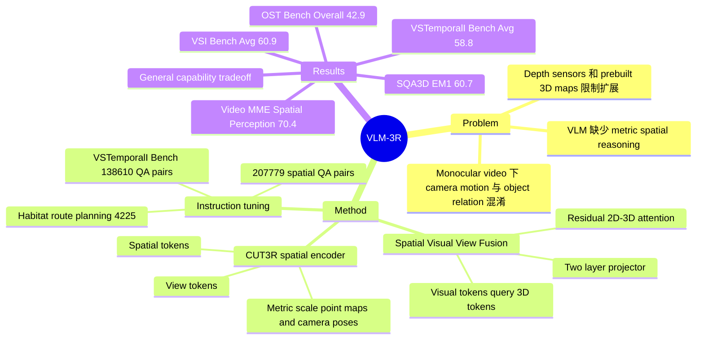

## Summary

VLM-3R 针对 video VLM 缺少 metric 3D spatial reasoning 的问题，把 CUT3R 的 implicit spatial tokens 和 camera view tokens 通过 Spatial-Visual-View Fusion 注入 LLaVA-NeXT-Video 风格 VLM，并用约 207,779 个 3D reconstructive QA pairs 做 instruction tuning。论文同时提出 VSTemporalI-Bench，用 138,610 个 QA pairs 测试 monocular video 中由 camera motion 引起的 spatio-temporal relation changes；结果显示它在 VSI-Bench、VSTemporalI-Bench、ScanQA/SQA3D 和 OST-Bench 上有明显空间推理收益，但 general video/image capability 有小幅 trade-off。

## Problem & Motivation

现有 VLM/LMM 在 open-ended image/video QA 上已经较强，但在真实物理环境交互中仍容易卡在 distance estimation、room/object size、relative direction、camera-object relation 这类需要几何理解的任务。已有 3D-LLM / geometry-augmented VLM 通常依赖 depth sensors、pre-built 3D maps、point clouds 或 off-the-shelf SLAM/reconstruction pipeline；这会限制 monocular video 的可扩展性，也容易把 scale ambiguity 带进语言模型。

作者把问题 formulation 为：能否从 raw monocular video 直接恢复足够的 metric 3D structure 和 camera motion prior，并把这些信息同 VLM 的视觉语义和语言指令对齐。这个方向对 embodied reasoning 更相关，因为它不只是问模型识别了什么，而是问模型能否在 egocentric camera movement 下维护 object layout、distance、direction 和 route-level spatial context。

## Method

VLM-3R 的核心是 3D Reconstructive Tokenization + Spatial-Visual-View Fusion。模型以 monocular video frames 和 language instruction 为输入，visual encoder 提取原始 2D visual tokens；spatial encoder 采用 frozen CUT3R，从帧序列中产生 context-aware image/spatial tokens `Ft'` 与 camera pose/view tokens `zt'`。论文强调 CUT3R 输出 metric-scale point maps 和 relative camera poses，而不是 normalized scale，这一点用于降低 spatial instruction alignment 的难度。

模型没有直接把 explicit point clouds 喂给 LMM，因为 point clouds 稀疏、跨帧大小不一、编码困难。VLM-3R 改用 implicit reconstructive tokens：把 spatial tokens 和 view tokens concat 成 `Z3D`，再让 VLM 的 native visual tokens `Hv` 作为 query，对 `Z3D` 做 cross-attention，得到 `Hattn`；随后用 residual connection 得到 `Hv' = Hv + Hattn`，再经过 two-layer projector 对齐到 LMM backbone 的输入空间，最后与 instruction tokens 一起进入 transformer。

训练上，VLM-3R 初始化自 `LLaVA-Video-7B-Qwen2`，vision tower 是 `google/siglip-so400m-patch14-384`。训练时 pre-trained visual encoder 和 CUT3R spatial encoder 冻结，更新 3D fusion attention block、projection layers，并用 LoRA fine-tune VLM；补充材料给出的关键设置包括 LoRA rank 128、alpha 256、learning rate `2e-5`、BF16/TF32、model max length 32768，训练使用 16 张 H200 GPUs，约 5 小时，原计划 5 epochs 但第一轮后结束。

数据上，训练 QA 来自 ScanNet、ScanNet++、ARKitScenes 等 3D scene datasets。作者先构建包含 `scene_metadata.json` 和 `frame_metadata.json` 的 spatio-temporal scene graph，再自动生成 object count、relative distance、relative direction、object size、absolute distance、room size、appearance order 等 QA；route planning 使用 Habitat simulator 生成导航轨迹和 turn actions。补充材料给出训练数据分布：Object Relative Direction 86,441、Object Absolute Distance 50,757、Object Relative Distance 42,025、Object Size Estimate 12,917、Object Count 9,357、Route Plan 4,225、Room Size 2,057，总计 207,779。

VSTemporalI-Bench 用同类 scene metadata 生成 temporal QA，专门测 camera displacement、camera movement direction、camera-object absolute distance、camera-object relative distance、object-object relative position。该 benchmark 当前聚焦 static 3D scenes，因此所有 apparent motion 都来自 camera movement；总量 138,610 QA pairs，其中 train 132,568、test 6,042。

## Key Results

**VSI-Bench。** VLM-3R (7B) 在 open-source VLM block 中 Avg. 60.9，排名第一，高于 LLaVA-NeXT-Video-7B 35.6、LLaVA-NeXT-Video-72B 40.9、Spatial-MLLM-4B 47.0、VG-LLM-4B 47.3，也高于两个使用同一 200K spatial QA fine-tuning 的 2D baselines：LLaVA-One-Vision-7B (Finetuned) 55.8 与 LLaVA-Next-Video-7B (Finetuned) 57.7。分项上，VLM-3R 为 Object Count 70.2、Absolute Distance 49.4、Object Size 69.2、Room Size 67.1、Relative Distance 65.4、Relative Direction 80.5、Route Plan 45.4、Appearance Order 40.1。

**VSTemporalI-Bench。** VLM-3R (7B) Avg. 58.8，排名第一，高于 InternVL2-8B 43.5、LLaVA-NeXT-Video-72B 44.0、Gemini-2.5 Pro 42.4 和 GPT-4o 38.2；但 human level 为 77.0，仍有明显差距。细分上，VLM-3R 的 Camera-Object Absolute Distance 为 39.4、Camera Displacement 39.6、Camera Movement Direction 60.6、Object-Object Relative Position 86.5、Camera-Object Relative Distance 68.6。

**ScanQA / SQA3D。** 在 video-input models 中，VLM-3R 在 ScanQA val 上达到 B1 46.2、B4 15.5、METEOR 19.7、ROUGE-L 49.1、CIDEr 101.9；在 SQA3D test 上达到 EM1 60.7、EMR1 63.4。对比 Spatial-MLLM-4B 的 ScanQA B1 44.4、B4 14.8、METEOR 18.4、ROUGE-L 45.0、CIDEr 91.8，以及 SQA3D EM1 55.9、EMR1 58.7，VLM-3R 更强；但 Video-3D LLM 的 ScanQA CIDEr 为 102.1，略高于 VLM-3R 的 101.9，不能写成所有指标都领先。

**General video/image understanding。** VLM-3R 在 Video-MME Overall 为 59.9，低于 LLaVA-NeXT-Video 的 62.7；VQA v2 Exact Match 为 52.57，也低于 base 的 54.63。但 Video-MME Spatial Perception 为 70.4，高于 base 的 66.7。加入 30K LLaVA-Video general videos 后，Video-MME Overall 从 59.9 回升到 62.1，接近 base reproduction 的 62.7。

**OST-Bench。** VLM-3R Overall 42.9，高于 base LLaVA-Video-7B 的 39.3、Spatial-MLLM 的 26.8 和 LLaVA-3D 的 30.1；在 Estimation 上 28.3 vs base 16.1，在 Agent State 上 39.9 vs base 33.5，在 AO 上 34.4 vs base 28.8。不过表中也显示 VLM-3R 在 CNT 为 49.6，低于 base 的 63.1；A.Info 为 58.1，略低于 base 的 58.3，因此 caption 中 "across all categories" 的说法与表格并不完全一致。

**Ablation。** Table 6 显示 full 2D-3D fusion Avg. 60.90，高于 w/o Spatial Token 59.46、w/o View Token 59.09、2D-2D fusion 58.12、Explicit Points Fusion 57.87、LLaVA-NeXT-Video ft (w/o C&G Tok.) 57.74；这支持 implicit spatial/view tokens 和 token-level 2D-3D attention 的价值。需要注意，正文叙述中写 w/o View Token 会 drop 到 50.09，但表格给的是 59.09，疑似论文内部笔误。Supplementary Table D 中 CUT3R overall 60.9，高于 VGGT 58.1 和 base 57.7；CUT3R 在 Room Size 67.1、Appearance Order 40.1、Route Plan 45.4 上高于 VGGT 的 54.0、34.5、44.8，支持作者关于 metric scale 和 temporal structure 的选择。

**OpenEQA zero-shot。** VLM-3R 在 OpenEQA spatial questions 上从 base 的 49.95 提升到 51.60，但 non-spatial 从 67.22 降到 65.54，overall 从 62.4 降到 61.7。和 broader baselines 比，VLM-3R overall 61.7 高于 GPT-4V (50 frames) 55.3、GPT-4V (15 frames) 54.6、Gemini-Pro 44.9、Claude 3 36.3、GPT-4 33.5 和 LLaMA2 28.3，但仍低于 Human 86.8。

## Strengths & Weaknesses

**已知：方法亮点**

1. 问题抓得准：它没有把 3D spatial reasoning 简化成更多 QA fine-tuning，而是把 metric-scale 3D reconstruction prior 和 camera motion prior 作为 VLM input representation 的一部分。
2. 架构相对简洁：CUT3R 和 visual encoder 冻结，只训练 fusion attention、projector 和 LoRA；相比显式 point cloud / depth map pipeline，token-level fusion 更容易接到现有 video VLM。
3. 数据和 benchmark 贡献都比较实用：207,779 spatial QA pairs 覆盖 measurement、configuration 和 route planning；VSTemporalI-Bench 明确把 camera motion 引发的 spatial relation changes 拿出来测，而不是只测 static scene QA。
4. Ablation 比较完整：spatial token、view token、2D-2D fusion、explicit points fusion、geometry encoder choice、general data mixing 都有对应实验，能看出收益主要来自 metric-aware geometry 和 view/camera tokens，而不是单纯扩大训练数据。

**已知：局限与负面信号**

1. VSTemporalI-Bench 仍是 static indoor scene setting，所有 apparent motion 都来自 camera movement；论文没有覆盖 dynamic objects、outdoor/extreme environments 或真实 interaction loop。
2. 论文结论明确说 broader applicability 和 ultimate performance 仍依赖 large-scale 4D data collection 与 end-to-end 3D reconstruction accuracy；这意味着方法的上限受 geometry encoder 质量限制。
3. General capability 有 trade-off：VLM-3R 在 Video-MME Overall 59.9 低于 base 62.7，在 VQA v2 52.57 低于 base 54.63；OpenEQA overall 61.7 也低于 base 62.4，虽然 spatial subset 变强。
4. OST-Bench 表格并不支持 "所有类别都超过 base"；CNT 和 A.Info 至少没有提升，这对 online embodied exploration 的泛化结论要打折。
5. Object Size 不是稳定受益项：Table 6 正文说 full model 的 Object Size 69.15 低于 LLaVA-NeXT-Video ft 的 70.82，作者把它归因于 monocular 3D reconstruction quality 仍有提升空间。

**推测**

- 对 embodied / mobile robot / XR assistant 的启发更直接：如果 agent 只能拿到 monocular camera stream，隐式 3D reconstruction tokens 可能比显式 point cloud 中间表示更适合接入 generalist VLM。这个推断由 VSI/VSTI/OST 结果间接支持，但论文没有做 closed-loop navigation 或 manipulation。
- 对 GUI-agent 的直接迁移有限，因为桌面 GUI 通常没有真实 metric 3D；但 "view tokens + spatial tokens" 的分工可类比到 viewport/scroll state 与 UI layout tokens，也许能启发 screen-grounded agent 的结构化状态表示。

**不知道**

- 论文文本中没有 DOI，也没有给出 GitHub/code URL；title page 只有项目页 `https://vlm-3r.github.io/`。
- 论文没有展示具体 failure cases，因此不知道模型在错误时主要混淆 distance scale、camera pose、object identity、temporal order，还是 language parsing。
- 数据生成依赖 source datasets 的 3D annotations、depth、camera poses 和 scene metadata；论文说明遵守 source train/test splits，但读者无法仅凭正文独立验证所有 benchmark 的 scene-level leakage 风险。

## Mind Map

## Notes

这篇论文值得和 SpatialStack、SpaceMind、G2 VLM 放在一起看：VLM-3R 更像是第一代把 3D reconstruction tokens instruction-align 到 video VLM 的路线，重点在 "monocular video -> implicit 3D tokens -> spatial QA"；SpatialStack 往 language decoder 分层注入 geometry；SpaceMind 把 camera 作为 guiding modality；G2 VLM 则把 geometry prediction 做成 VLM 内部 expert。

对 mental model 的更新是：spatial reasoning 的关键不只是添加 3D data，而是把 "scene geometry" 和 "camera/view motion" 分成不同 token 类型，让 language model 能在 egocentric frame 中解释空间关系。VLM-3R 的结果说明 view token 对 relative direction / temporal relation 很重要，但 general QA trade-off 也提醒我，spatial instruction tuning 可能会重塑模型能力分布，需要混入 general video data 或更细的 regularization。

后续最想看的实验：第一，在 camera pose / reconstruction token 加噪声时的 robustness curve；第二，动态物体和 outdoor scenes 上的 VSTI-style benchmark；第三，closed-loop embodied navigation 是否真的因为 VLM-3R 的 spatial QA 能力提升而提高 success rate；第四，把 explicit point cloud fusion、implicit token fusion、camera-guided fusion 放到同一 base VLM 和同一数据预算下比较。
