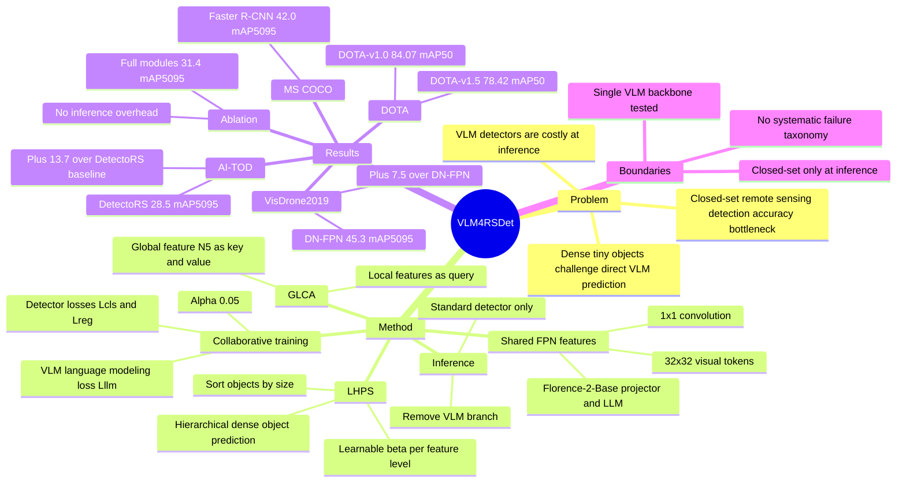

## Summary

VLM4RSDet 解决 closed-set remote sensing object detection 中传统 detector 精度瓶颈与 VLM 推理开销过高之间的矛盾。它在训练阶段把 Florence-2-Base 风格的 VLM 分支接到 detector 的 FPN 多尺度特征上，用 detection losses 和 language modeling loss 协同优化；推理阶段移除 VLM，只保留标准检测架构，因此不增加参数、FLOPs 或 FPS 开销。实验在 AI-TOD、VisDrone2019、DOTA-v1.0、DOTA-v1.5 和 MS COCO 2017 上显示稳定增益，但论文也明确承认当前方法仍局限于 closed-set tasks。

## Problem & Motivation

Remote sensing object detection 面临极小目标、尺度变化、任意朝向、背景噪声和密集分布等问题。传统 HBB / OBB detector 已经通过 label assignment、feature enhancement、coarse-to-fine detection、大 kernel、rotated convolution 等路线提升性能，但作者认为 closed-set 遥感检测仍存在明显 accuracy bottleneck，尤其缺少 VLM 这类模型中的 prior knowledge 和 contextual reasoning。

VLM 直接用于检测并不是无代价方案。论文指出，已有 VLM-based object detection 多集中在 open-vocabulary setting，例如 LLMDet、YOLO-World、Grounding DINO、CoseDet；这些方法在 closed-set remote sensing 上通常比现代传统 detector 精度低，且依赖 LLM 或额外模块会增加推理和部署成本。因此论文的问题设定是：能否把 VLM 的视觉语言先验用于训练传统 closed-set detector，同时让部署阶段仍保持普通 detector 的效率。

这个动机对 VLM / GUI grounding 有一定参考价值：它不是让 VLM 在线承担所有感知，而是把 expensive multimodal model 放到训练期，作为改进轻量检测模型的辅助监督。但论文的直接任务是 remote sensing object detection，不是 GUI agent、embodied control 或 interactive agent。

## Method

VLM4RSDet 是一个 training-time collaborative optimization framework。常规检测分支包含 backbone、FPN 和 detection head，输出 classification loss `Lcls` 与 bounding box regression loss `Lreg`。训练时，FPN 的多尺度输出 `Pi` 同时作为 VLM 分支的视觉输入：先用 `1x1` convolution 把 channel 变成 Florence-2-Base 所需的 `dv=1024`，再 interpolate 到 `32x32`，reshape 后经 projector 转成 LLM input dimension。

VLM 分支使用 Florence-2-Base 的 projector 和 large language model。对于 HBB object detection，target format 是 category 加左上、右下两点坐标；对于 OBB object detection，target format 是 category 加顺时针四个顶点坐标。同类多个 object 之间用 `<sep>` 分隔，language prompts 分别使用 `<OD>` 和 `<ROD>`。总 loss 为 `L = Lcls + Lreg + alpha * Lllm`，其中 `alpha=0.05`，因为论文指出 `Lllm` 远大于 detection losses。

**GLCA.** Global-Local Cross Attention 用最高层 feature `N5` 表示 global context，把各层 local feature `Ni` 作为 Query，`N5` 作为 Key 和 Value，通过 cross attention 将全局上下文融合回局部特征。设计动机是增强 VLM 对多尺度视觉特征的 perception ability。

**LHPS.** Learnable Hierarchical Prediction Strategy 针对遥感图像中 object densely distributed 的问题。默认 Florence-2-Base 使用单层 feature 预测所有 objects，作者认为这对密集目标不够准确；LHPS 先按 object size 升序排序，再用可学习参数 `beta_i` 归一化后决定每个层级预测的 object 数量 `Mi`，让五个 bottom-up feature levels 分别预测不同尺寸组。

**Inference.** 推理阶段完全移除 VLM 分支，只保留标准 object detection architecture。因此 VLM4RSDet 的部署形态不是一个 VLM detector，而是一个经过 VLM 协同训练增强过的 conventional closed-set detector。

实现细节中，论文使用 Florence-2-Base 作为 VLM，将视觉输入特征 resize 到 `32x32`、1024 channels，maximum generation token length 为 2048。AI-TOD 和 VisDrone2019 使用 SGD，DOTA-v1.0 / DOTA-v1.5 使用 AdamW，实验基于 4 张 NVIDIA RTX 4090、MMDetection 和 MMRotate。

## Key Results

**AI-TOD HBB detection.** 在 AI-TOD 上，DetectoRS baseline 为 **14.8 mAP0.5:0.95 / 32.8 mAP0.5**，DetectoRS w/ VLM4RSDet 达到 **28.5 / 59.9**，提升 **+13.7 mAP0.5:0.95**。相比表中的最新方法 DetectoRS w/ Bian et al. **24.3 mAP0.5:0.95**、TTFNet w/ GA **24.2**、MENet **23.2**，VLM4RSDet 的最好结果为 **28.5**；论文还报告 APvt / APt 为 **18.8 / 31.6**。

**VisDrone2019 HBB detection.** 在 VisDrone2019 上，DN-FPN 为 **37.8 mAP0.5:0.95 / 62.7 mAP0.5**，DN-FPN w/ VLM4RSDet 达到 **45.3 / 70.5**，对应论文摘要中的 **+7.5 mAP0.5:0.95** SOTA 提升。DetectoRS w/ VLM4RSDet 为 **31.4 / 53.0**，高于 DetectoRS baseline 的 **25.7 / 41.7**。

**DOTA-v1.0 OBB detection.** 在 DOTA-v1.0 上，LEGNet-S 为 **80.03 mAP0.5**，LEGNet-S w/ VLM4RSDet 达到 **84.07 mAP0.5**。O-RCNN w/ VLM4RSDet 为 **81.76 mAP0.5**，高于 O-RCNN baseline **75.87**；论文正文还指出 Rotated FCOS、Rotated Faster R-CNN、O-RCNN 分别提升 **+6.08 / +6.90 / +5.89 mAP0.5**。

**DOTA-v1.5 OBB detection.** 在 DOTA-v1.5 上，LEGNet-S 为 **72.89 mAP0.5**，LEGNet-S w/ VLM4RSDet 达到 **78.42 mAP0.5**。RetinaNet-O w/ VLM4RSDet 为 **68.01**，FR-O w/ VLM4RSDet 为 **69.08**，均高于对应 baseline **59.16** 和 **62.00**。

**MS COCO 2017 general object detection.** 为验证方法不只适用于遥感，论文在 MS COCO 2017 上报告 RetinaNet 从 **36.5** 提升到 **41.3 mAP0.5:0.95**，FCOS 从 **36.6** 提升到 **41.7**，Faster R-CNN 从 **37.4** 提升到 **42.0**，对应提升 **+4.8 / +5.1 / +4.6**。

**Module ablation on VisDrone2019.** 以 DetectoRS 为 backbone，baseline 为 **25.7 mAP0.5:0.95 / 41.7 mAP0.5**。只加入 collaborative optimization new structure 后为 **28.5 / 46.5**；再加 GLCA 为 **29.8 / 48.3**；再加 LHPS 为 **30.2 / 49.8**；完整 New Structure + GLCA + LHPS 达到 **31.4 / 53.0**。这支持三个模块都有贡献，其中完整组合相对 baseline 提升 **+5.7 mAP0.5:0.95**。

**Loss weight and efficiency.** `alpha=0.05` 在 VisDrone2019 ablation 中最好，达到 **31.4 mAP0.5:0.95**；`0.03 / 0.04 / 0.06 / 0.07` 分别为 **28.1 / 29.8 / 30.3 / 29.6**。推理开销消融显示 VLM4RSDet 不改变 baseline detector 的 inference params、FLOPs 和 FPS，例如 RetinaNet 仍为 **36.5M / 212.9G / 55.3 FPS**，FCOS 仍为 **32.1M / 201.6G / 56.5 FPS**，Faster R-CNN 仍为 **41.4M / 239.0G / 52.8 FPS**；代价主要在训练阶段，training FPS 分别从 **20.1 / 20.7 / 18.5** 降到 **15.2 / 16.3 / 14.2**。

## Strengths & Weaknesses

**已知 Strengths.** 论文的问题 formulation 比直接做另一个 open-vocabulary detector 更清楚：closed-set detector 在实际部署中仍有精度和效率优势，而 VLM prior 可以作为训练期辅助信号。推理阶段完全移除 VLM 的设计，让它的效率 claim 更容易验证；Table 8 明确给出了参数、FLOPs、FPS 与 training FPS，而不是只报告精度。

**已知 Strengths.** 实验覆盖 HBB 遥感检测、OBB 遥感检测和通用 MS COCO detection，baseline 包含 conventional detector、VLM-based detector 和 remote sensing SOTA。消融也比较完整：New Structure、GLCA、LHPS、`alpha` 和时空开销都被单独报告，支持主要增益不是只来自某一个不可解释的训练 trick。

**已知 Boundaries.** 作者明确写到当前方法仍 confined to closed-set tasks，因为 inference only uses the standard detection architecture。也就是说，VLM4RSDet 的部署模型并不具备 open-vocabulary recognition、language-conditioned detection 或在线视觉语言推理能力；论文的 future work 是进一步 fully integrating VLMs 以实现 efficient open-vocabulary detection system。

**已知 Boundaries.** VLM 分支使用 Florence-2-Base，论文没有比较不同 VLM backbone、不同 prompt format、不同 language modeling target 或不用 language modeling loss 的 teacher-style control。因而目前能确认的是 Florence-2-Base 辅助训练在这些 benchmark 上有效，不能直接推出任意 VLM prior 都会带来同样收益。

**已知 Limitations.** 论文没有提供系统性 failure case taxonomy。Figure 4 主要展示 AI-TOD 上相对 baseline 减少 FP / FN 的定性成功案例，但没有分析 VLM4RSDet 何时会失败，例如极端密集小目标、低质量影像、类别混淆、跨传感器数据或严重 domain shift。论文也没有报告 random seed variance。

**推测.** 对 GUI agent 的启发是训练/部署分离：可以考虑用 VLM 或 multimodal generation loss 在训练期增强 GUI element detector、screen parser 或 grounding model，然后在线部署轻量 detector，避免每一步调用大 VLM。但这是跨任务推测，论文没有评估 GUI、web、mobile screen、robotics 或 embodied agent setting。

**不知道.** 论文正文没有给出 arXiv id 或 DOI。代码链接在摘要中给出，但正文无法判断 release 是否包含完整训练脚本、数据预处理、evaluation scripts、配置文件和权重。也不知道该方法在 SAR、multispectral、hyperspectral remote sensing 或真实部署环境中的鲁棒性。

## Mind Map

## Notes

这篇论文最值得记住的是：VLM 不一定要作为最终 detector 部署，它也可以是训练期的 dense visual prior / auxiliary task。这个思路比“把所有 detection 都交给 VLM 生成坐标串”更务实，尤其适合对 latency、FLOPs 和部署稳定性敏感的视觉系统。

需要继续追问的不是它是否在遥感 benchmark 上涨点，而是协同优化到底学到了什么：是 Florence-2 的 semantic prior、coordinate sequence modeling、multi-scale auxiliary supervision，还是额外 loss 带来的 regularization。如果要迁移到 GUI grounding，关键实验应该是 same detector、same data、不同 VLM teacher / 无语义 token / 随机 prompt / GUI-specific prompt 的对照。
