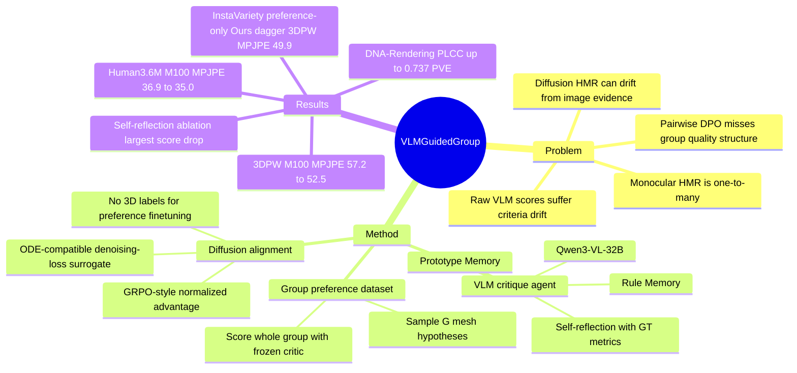

## Summary
本文针对 diffusion-based monocular Human Mesh Recovery 中“多 hypothesis 能表达不确定性但容易牺牲准确性/物理合理性”的问题，提出一个带 dual-memory 和 self-reflection 的 VLM HMR critique agent，并用其生成 group-wise preference signals 来 finetune diffusion HMR model。核心贡献不是让 VLM 直接预测 mesh，而是把 VLM 的 pose semantics、contact relation、spatial consistency 判断蒸馏成 group preference alignment loss；实验显示其在 3DPW、Human3.6M 以及 HMR scorer correlation benchmark 上优于 ADHMR / ScoreHypo / HMR-Scorer 等基线。

## Problem & Motivation
单张 RGB 图像到 3D human mesh 的恢复天然是一对多问题：同一个 2D observation 可能对应多个 3D pose，尤其在 occlusion、depth ambiguity、cluttered in-the-wild scene 中更明显。deterministic HMR 方法通常只输出一个 mesh；probabilistic / diffusion-based HMR 方法可以生成多个 hypothesis，但论文指出它们常出现与输入图像不一致、物理不合理、self-penetration、floating feet 等问题。

ADHMR 用 Diffusion-DPO 和 HMR-Scorer 做 pairwise preference alignment，但作者指出它的 image-driven scorer 容易被 silhouette alignment 误导，在遮挡、复杂背景或错误 contact 下会偏好看似贴合 2D 轮廓但 3D 不合理的姿态。同时，DPO 的 pairwise comparison 没有利用同一图像下多个 mesh prediction 之间的相对质量结构。本文的动机是：VLM 已经编码了一些 human pose semantics、contact relation、spatial consistency 先验，但 raw VLM judgment 存在 criteria drift 和 subjective biases，因此需要一个更稳定、可解释、可冻结的 VLM-based critique agent，再把它的 group-wise 判断转移给 diffusion HMR model。

## Method
**任务设定。** 输入图像为 `I`，输出 SMPL pose parameters `theta in R^{24x3}` 和 shape parameters `beta in R^{10}`。模型沿用 diffusion HMR formulation，`x` 表示 joint swing / twist parameters，最终转换为 SMPL pose；reference diffusion model `epsilon_ref` 采用 ADHMR / ScoreHypo 相关架构并通过不同 initial noise 对同一图像采样多个 mesh hypotheses。

**VLM-Guided HMR Critique Agent。** critique agent 输入原始 RGB image 和叠加到图像上的多个 predicted mesh overlays，输出每个 overlay 的 `[0, 100]` score 和一句 textual critique。实现中使用 `Qwen3-VL-32B` 作为 VLM。它包含两类 memory：

- **Rule Memory**：保存 assessment rule text、semantic tags、use count、success count，用于表达 “self-penetration should be penalized”“feet grounding should be checked” 这类可复用判断规则。
- **Prototype Memory**：保存过去已评价 mesh overlay 的 CLIP visual embedding、rationale / score、semantic tags，用于检索视觉上相似的历史案例。

评分时，agent 先按 CLIP cosine similarity 检索 top-K prototype，再用 tag relevance 加 UCB exploration score 检索 rule，最后把相关 prototypes 和 rules 拼入 memory-augmented prompt 交给 VLM 输出 score / critique。探索阶段中，agent 在 HI4D、BEDLAM、DNA-Rendering、GTA-Human II、SPEC 等有可靠 3D ground truth 的数据上自建 memory：它把自己的 score ranking 与 GT metrics 的 Spearman rank correlation 对齐，相关性超过阈值的 rule 会增加 success count；同时让 VLM 反思自身输出与 GT metric 的差异，提出 1-2 条新的可测试 rule。评估阶段 memory 和 learning loop 冻结，只做 retrieval-augmented scoring，以减少 criteria drift。

**Group-wise HMR Preference Dataset。** 对每张训练图像，冻结的 reference diffusion HMR model 用不同 noise 采样 `G` 个 mesh predictions。critique agent 同时评价整个 prediction group，得到 scores `{s_i}`，最终形成 `G_HMR = {I, (m_1, s_1), ..., (m_G, s_G)}`。这种数据不需要人工逐个比较复杂 3D mesh，也不要求用于 finetuning 的图像有 3D annotation。

**Group Preference Alignment。** 作者借鉴 GRPO 的 group-relative advantage，但避免把 diffusion sampler 改成 stochastic SDE trajectory training。对同一组 scores 计算：

`A_i = (s_i - mean({s_i})) / std({s_i})`

随后用 advantage-weighted diffusion surrogate objective finetune `epsilon_theta`：直觉上，高分 mesh 的 denoising loss 应低于 reference model，低分 mesh 则被往相反方向推。最终 loss 写成 `beta T lambda_t sum_i A_i (L_DM^theta(x_t^i, epsilon) - L_DM^ref(x_t^i, epsilon))`。这使方法兼容 ODE-based diffusion sampling，不需要沿完整 stochastic trajectory 做 reinforcement learning。

实现细节：critique agent 使用 `Qwen3-VL-32B`；preference finetuning learning rate 为 `1e-4`，batch size 为 80 images，training group size 为 `G = 20`。

## Key Results
**Human mesh recovery，3DPW / Human3.6M（Table 1）。** 在 probabilistic methods 的标准评估中，作者生成 `M` 个 estimates 并报告 minimum PVE / MPJPE / PA-MPJPE。3DPW 上，`M=100` 时 ADHMR 为 **65.4 / 57.2 / 33.5**，Ours 为 **60.9 / 52.5 / 31.5**；作者报告这相对 ADHMR 带来 **8.2% MPJPE improvement**。加入 InstaVariety preference-only finetuning 的 Ours† 在 3DPW `M=100` 达到 **59.5 / 49.9 / 31.9**，`M=200` 达到 **57.7 / 48.5 / 30.5**。

Human3.6M 上，`M=100` 时 ADHMR 为 **45.9 / 36.9 / 24.8**，Ours 为 **43.8 / 35.0 / 23.9**；Ours† 为 **43.2 / 34.3 / 23.5**。`M=200` 时，Ours 为 **42.4 / 34.0 / 23.2**，Ours† 为 **42.0 / 33.2 / 22.8**。这些数字说明 group preference alignment 不只是改善 in-the-wild 3DPW，也能提升 Human3.6M 的标准 metric。

**Preference finetuning ablation，3DPW（Table 2，M=100，均在 InstaVariety finetune）。** Base Diffusion Model 为 **73.4 / 63.0 / 37.6**，supervised finetuning on noisy pseudo labels 只到 **70.2 / 61.3 / 36.5**；Ours 达到 **59.5 / 49.9 / 31.9**。若用同一个 critique agent 但改成 DPO pairwise variant，结果为 **63.9 / 53.1 / 33.4**；若移除 critique agent、用 HMR-Scorer 构建 preference dataset，则为 **65.4 / 54.9 / 34.7**。作者据此认为性能来自两部分：更高质量的 VLM critique signal，以及 group-wise alignment 比 pairwise DPO 更适合 multi-hypothesis HMR。

**Critique agent group-wise score prediction（Table 3）。** 在 GTA-Human II 上，Ours 的 PVE / MPJPE / PA-MPJPE SRCC 为 **0.605 / 0.615 / 0.528**，KRCC 为 **0.539 / 0.556 / 0.461**；HMR-Scorer 对应为 **0.578 / 0.588 / 0.489** SRCC 和 **0.506 / 0.513 / 0.428** KRCC。DNA-Rendering 上，Ours 的 PVE / MPJPE / PA-MPJPE SRCC 为 **0.633 / 0.588 / 0.510**，KRCC 为 **0.556 / 0.532 / 0.433**，也高于 HMR-Scorer 的 **0.610 / 0.562 / 0.475** SRCC 和 **0.540 / 0.508 / 0.393** KRCC。

**Critique agent point-wise score prediction（Table 4）。** GTA-Human II PLCC 上，Ours 的 PVE / MPJPE / PA-MPJPE 为 **0.695 / 0.697 / 0.653**，高于 HMR-Scorer 的 **0.634 / 0.627 / 0.565**。DNA-Rendering PLCC 上，Ours 为 **0.737 / 0.717 / 0.700**，高于 HMR-Scorer 的 **0.664 / 0.659 / 0.620**。

**Critique agent component ablation（Table 3 / 4）。** 移除 self-reflection 是最伤的 ablation：GTA-Human II group-wise PA-MPJPE KRCC 从 full model 的 **0.461** 降到 **0.285**，DNA-Rendering 从 **0.433** 降到 **0.298**。移除 rule memory 或 prototype memory 也会降级，例如 GTA-Human II PVE KRCC full model 为 **0.539**，w/o rule memory 为 **0.491**，w/o prototype memory 为 **0.455**。这支持作者关于 dual-memory + reflection 能稳定 VLM scoring 的主张。

## Strengths & Weaknesses
**已知的强点：**

1. 问题 formulation 有价值：它不是把 VLM 当成黑盒 pose regressor，而是把 VLM 用作可解释的 HMR critic，再通过 group preference 把 critic 的判断蒸馏到 diffusion HMR model。
2. group-wise preference 比 pairwise DPO 更贴合 probabilistic HMR 的多 hypothesis 输出形式；Table 2 中 DPO variant 明显弱于完整方法。
3. dual-memory 设计把 VLM-as-judge 的 criteria drift 问题具体化为 rule / prototype retrieval 和 frozen evaluation phase，且 component ablation 支持 self-reflection、rule memory、prototype memory 都有贡献。
4. finetuning 不依赖目标 in-the-wild 数据的 3D labels：Ours† 在 InstaVariety 上只使用 preference signals，而不是 noisy pseudo 3D labels。

**已知的局限 / failure cases：**

1. 论文展示的主要 failure cases 来自 ADHMR 或 HMR-Scorer：ADHMR 在遮挡手臂、打电话时手臂和头部 depth relation、self-penetration、重遮挡 depth ambiguity 上失败；HMR-Scorer 会给 flawed pose 高分、给更合理的 surfing pose 低分。论文没有系统报告 Ours 自身的 failure case taxonomy。
2. critique agent 的探索阶段仍使用带 3D GT 的 studio / synthetic datasets 来建立 rule 和 prototype memory；因此“without 3D supervision”主要成立于后续 preference finetuning 阶段，而不是整个 critic 构建过程完全无监督。
3. VLM 使用 `Qwen3-VL-32B`，且需要对 prediction group 做视觉评分；论文没有报告 scoring runtime、API / GPU cost、memory size、prompt length 或 deployment latency。
4. score calibration 使用 quadratic programming 学到对 HMR-Scorer numeric range 的 linear scale-and-shift transformation；这说明 score 数值可比性仍依赖后处理，而不是 VLM 原始输出天然稳定。
5. 没有 human preference study 或下游 embodied / robotics task 验证；实验指标集中在 PVE / MPJPE / PA-MPJPE 和 score-metric correlation，尚不能证明这种 mesh improvement 会直接改善机器人理解或交互任务。

**推测 / 不知道：**

- 推测：对 GUI-agent / embodied-agent 研究更可迁移的部分不是 HMR 本身，而是“用 VLM critic 对一组候选状态做相对评分，再把 group preference 蒸馏给生成/预测模型”的训练范式。
- 不知道：正文没有给出 exact prompts、retrieval top-K、reflection threshold `tau`、memory growth 上限等细节；复现时这些可能显著影响 VLM scoring 稳定性。
- 不知道：论文没有报告换用更小 VLM 或不同 VLM 的 ablation，因此无法判断提升主要来自 framework，还是部分依赖 `Qwen3-VL-32B` 的强先验。

## Mind Map

## Notes
- 这篇对当前 vault 的主要价值在于 VLM-as-critic / VLM-as-judge 的工程化：作者没有假设 raw VLM score 足够可靠，而是显式处理 memory、reflection、calibration、frozen evaluation。
- 对 agent 方向的启发是 relative group preference 可能比 pairwise preference 更适合多候选状态选择，例如 screen grounding、trajectory proposal、action candidate reranking；但本文没有在 GUI 或 action domain 验证，需要避免外推过度。
- 需要把 claim 边界说清楚：论文证明的是 HMR benchmark 和 score correlation 的提升，不是通用 3D reasoning 或 embodied interaction 能力的提升。
