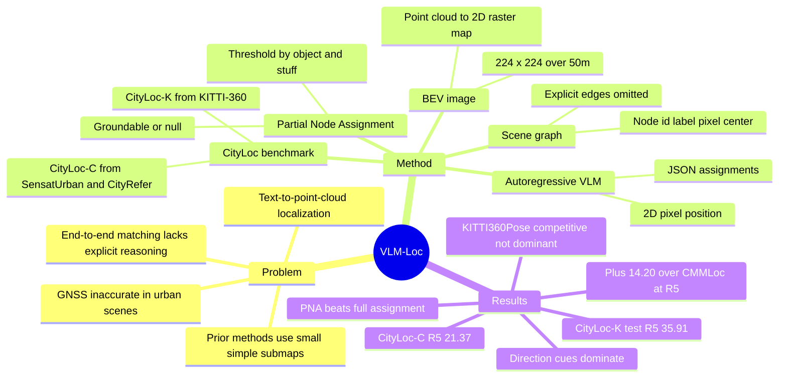

## Summary
VLM-Loc 用 VLM 做 text-to-point-cloud localization：把 point cloud map 转成 BEV image 和 scene graph，再通过 Partial Node Assignment 显式对齐文本线索与图节点，最后自回归输出 2D 位置。论文同时提出 CityLoc benchmark；在 CityLoc-K test 上达到 R@5/10/15m = 35.91/63.81/76.79，较 CMMLoc 提升 +14.20/+17.14/+10.79，但 benchmark 文本主要来自规则模板，真实自由描述泛化仍未证明。

## Problem & Motivation
论文关注 T2P localization：给定描述目标位置周围物体的自然语言，在 point cloud map 中预测 2-DoF ground-plane location。作者的动机来自 robotaxi / embodied localization 场景：GNSS 在城市环境会受 multipath effect 和 atmospheric delay 影响，乘客或用户的自然语言描述可以提供额外定位线索。

现有 Text2Pos、Text2Loc、MNCL、CMMLoc 等方法多采用 text-point cloud correspondence 或 coarse-to-fine localization，但 fine localization 阶段常在小而简单的 submap 上做端到端位置回归，缺少显式 spatial reasoning。作者认为真实场景需要在更大、更复杂的局部地图中理解 "east / south / on-top of object" 这类空间关系，因此引入 VLM 的 multimodal spatial reasoning 能力。

这篇论文对当前研究兴趣是 on-topic 的：它不是 GUI agent 论文，但核心是 VLM + 结构化空间表示 + grounding 到 scene graph，对 embodied localization、semantic map、GUI/screen graph grounding 都有方法论参考价值。

## Method
**Task formulation.** 输入是文本描述 `T` 和 point cloud map `M`，输出目标位置 `xi=(x,y)`。论文假设局部地面近似 planar，并只预测 ground plane 上的 2D 坐标。每条文本 query 由 `Nt=6` 个 hints 组成，每个 hint 描述一个物体的 semantic label、color，以及相对 query location 的方向关系。

**CityLoc benchmark.** CityLoc 分成两个子集：CityLoc-K 来自 KITTI-360 vehicle-mounted LiDAR，用于训练、验证和测试；CityLoc-C 来自 SensatUrban / CityRefer photogrammetric point clouds，用于跨域测试。补充材料给出规模：CityLoc-K 包含 2,767 / 300 / 1,027 个 train / val / test maps，以及 16,113 / 1,772 / 6,109 个 queries；CityLoc-C 包含 875 个 maps 和 4,487 个 queries。文本 query 不是人工自由书写，而是规则模板 `"The pose is <direction> of <color> <semantic>."`，方向来自相对几何关系，颜色来自预定义 color palette 最近邻匹配。

**Map-to-VLM representation.** VLM-Loc 先把 point cloud map 投影成 224 x 224 的 BEV image，覆盖 `S=50m` 的空间范围；像素颜色由对应 object instance 的平均 RGB 得到，object category 在 rasterization 时优先覆盖 stuff category。与此同时构造 scene graph `G=(V,E)`：每个 node 包含 node id、semantic label、BEV pixel centroid。论文称 pixel coordinates 已经编码相对空间关系，因此实践中省略显式 edges；这个 graph 更像 object list with locations，而不是完整 relational graph。

**Partial Node Assignment (PNA).** PNA 是论文的关键机制。由于 map 只覆盖有限区域，文本中提到的物体可能不在 map 内；VLM-Loc 对每个 hint 判断其是否 groundable，并把可见文本物体对齐到 scene graph node。训练标签由几何阈值生成：object classes 使用 `tau=5m`，stuff classes 使用 `tau=15m`；超过阈值则标为 False / null。推理时模型自回归输出 JSON，包括每个 object phrase 的 grounded boolean、matched node id，以及最终 `point 2d`。

**Training.** 主模型使用 Qwen3-VL-8B-Instruct，训练通过 Swift + LoRA 完成：LoRA rank `r=8`、scaling `alpha=16`，插入所有 linear layers；vision encoder、vision adapters 和 language backbone frozen，只更新 LoRA 参数。训练 2 epochs，global batch size 4，8 x RTX 4090，AdamW learning rate `1e-4`，warm-up ratio 0.05，bfloat16。

## Key Results
- **CityLoc-K / Table 5.** VLM-Loc 在 test set 上达到 R@5/10/15m = 35.91/63.81/76.79；最强 baseline CMMLoc 为 21.71/46.67/66.00，因此提升 +14.20/+17.14/+10.79。val set 上 VLM-Loc 为 36.23/63.66/77.77，CMMLoc 为 20.77/48.65/67.89，提升 +15.46/+15.01/+9.88。
- **CityLoc-C cross-domain / Table 6.** 直接把 CityLoc-K 训练的模型迁移到 CityLoc-C，VLM-Loc 达到 R@5/10/15m = 21.37/49.12/68.26；Text2Pos 为 8.11/27.21/50.01，Text2Loc 为 9.45/29.44/51.17，MNCL 为 13.68/35.93/53.78，CMMLoc 为 11.68/34.79/54.71。
- **Component ablation / Table 1.** 在 CityLoc-K test 上，BEV-only 为 13.21/33.86/51.40，SG-only 为 24.62/51.25/69.46，SG+PNA 为 32.34/61.34/74.94，BEV+SG 为 29.79/57.57/73.78，BEV+SG+PNA full model 为 35.91/63.81/76.79。这个结果支持两点：scene graph 比纯 BEV image 更关键，PNA 对 R@5m 有明显增益。
- **Partial vs full assignment / Table 2.** CityLoc-K test 上，Full node assignment 为 17.81/41.55/60.67，Partial node assignment 为 35.91/63.81/76.79；R@5m 提升 +18.10。作者的解释是 partial visibility 建模避免把不可见物体强行匹配到同类 node。
- **Text query components / Table 3.** CityLoc-K test 上，只用 semantic cue 为 16.93/40.81/60.22；semantic+color 为 18.01/42.95/61.47；semantic+color+direction 为 35.91/63.81/76.79。direction cue 是主要贡献，color 更像补充 appearance grounding。
- **Backbone ablation / Table 4.** Qwen3-VL-2B-Instruct 在 CityLoc-K test 上为 34.70/63.19/76.49，4B 为 34.23/61.37/75.18，8B 为 35.91/63.81/76.79，32B 为 41.05/67.47/79.39；InternVL3.5-8B 为 38.14/63.66/77.25。更大 VLM 有收益，但 2B/4B/8B 已经相近。
- **KITTI360Pose supplementary / Table 8.** 在 KITTI360Pose test set 11,404 samples、采用 CMMLoc 的 Top-1 retrieval protocol 下，VLM-Loc 为 R@5/10/15m = 40.36/51.69/54.74；CMMLoc 为 37.81/51.84/55.02。这里 VLM-Loc 只在 R@5m 更好，R@10/15m 与 CMMLoc 基本持平或略低，说明优势主要体现在论文新提出的复杂 CityLoc setting。
- **Inference / Table 9.** CityLoc-K val 上，Qwen-VL-2B-Instruct 为 0.36 FPS、8.50 GB peak memory、2.14B params；Qwen-VL-8B-Instruct 为 0.23 FPS、33.65 GB peak memory、8.79B params。论文认为 T2P localization 可接受，并指出量化、小 backbone 和部署优化可降低成本，但没有给出优化后的实测结果。

## Strengths & Weaknesses
**已知的强点。** 论文的问题 formulation 清楚：不是让 VLM 直接看 raw point cloud，而是把 map 转成 BEV image + scene graph，让 2D VLM 可以消费结构化空间信息。PNA 是有针对性的设计，解决文本描述和局部地图之间的 partial visibility mismatch，并且有 Table 2 的强消融支撑。CityLoc-K / CityLoc-C 的双来源设置也比只在 KITTI360Pose 上验证更有信息量，特别是 CityLoc-C 用不同 sensing modality 和城市区域测试跨域鲁棒性。

**已知的局限。** 文本 query 是规则模板生成，覆盖 semantic label、color、direction 三类线索；这能控制变量，但离真实用户自由描述仍有距离。Scene graph 实践中没有显式 edges，空间关系主要由 node pixel centroid 和 prompt 中的坐标规则表达，因此"graph reasoning"的强度有限。任务只预测 2D ground-plane coordinates，并假设局部 ground surface planar；对多层结构、室内楼层、非平地或 6-DoF pose localization 没有验证。绝对定位性能也还不够高：CityLoc-K test R@5m 为 35.91%，CityLoc-C R@5m 为 21.37%，说明它更像显著进步的研究 benchmark result，而不是可直接部署的可靠定位系统。

**失败模式 / 边界。** 论文没有系统 failure case taxonomy；qualitative figures 展示了若干成功/失败可视化，但没有拆分错误来源，例如 node assignment 错、方向歧义、同类物体过多、BEV rasterization 损失、VLM 坐标输出误差或跨域语义分布偏移。Table 4 说明更大 backbone 有收益，但 8B 推理为 0.23 FPS / 33.65 GB peak memory，当前成本对实时交互系统仍偏高。KITTI360Pose 结果也提醒：在较小、传统 benchmark 上，VLM-Loc 并非全面碾压 CMMLoc。

**推测。** 对 GUI-agent / computer-use 的可迁移启发主要是机制层面的：把 screen elements 构造成 node list / graph，再让 VLM 显式输出 partial grounding 和目标坐标，可能比端到端点击坐标回归更可解释、更容易调试。但这是跨 domain 类比，论文没有在 GUI、web、mobile 或 agent benchmark 上实验。

**不知道 / 未证实。** 论文正文没有给出 DOI。论文称 code、model、dataset available at repository，但没有在正文文本中给出具体 URL，因此当前无法判断 artifact 是否完整可复现。作者在 Future work 中提到更长、更 compositional 的文本描述以及从 passive localization 走向 active agent / planning / navigation，但这些不是本文已验证结果。

## Mind Map

## Notes
这篇论文最值得保留的 insight 是：localization 的 bottleneck 不只是 cross-modal feature alignment，而是要处理"文本提到的对象有些在当前 map 内、有些不在"这种 partial grounding 问题。PNA 把这个 mismatch 显式建模，给 VLM 一个可监督、可解析的中间输出，这比直接让模型吐坐标更符合 evidence-driven debugging。

对 embodied research 来说，CityLoc 的价值在于把 T2P localization 从小 submap 推到更复杂的 50m local map，并加入跨 sensing modality 的 CityLoc-C。但由于语言描述来自模板，后续真正要验证的是：当描述变成真实人类语言、包含指代、省略、组合关系和错误线索时，PNA 还能否保持收益。

对 GUI agent 的间接启发是中间监督形式：先对齐 textual hints 与 screen / scene graph nodes，再输出位置或 action。这个模式适合需要可解释 grounding 的 agent，但不能直接把本文的数值结论迁移到 GUI；本文证据只覆盖 point cloud maps、BEV projections 和 T2P localization。
