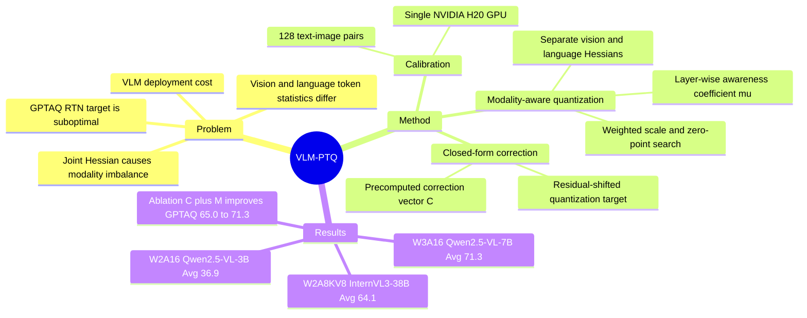

## Summary

VLM-PTQ 是一个面向 large Vision-Language Models 的 training-free post-training quantization 框架，目标是在低比特量化下减少 VLM 部署成本，同时保持 multimodal reasoning / OCR / document QA 等能力。核心改动有两点：在 GPTAQ-style asymmetric calibration 中加入 closed-form correction term，修正 RTN 对残差偏移的忽略；再用 modality-aware importance vector 区分 vision tokens 与 language tokens 对通道重要性的贡献。实验覆盖 Qwen2.5-VL 与 InternVL3 的 1B-72B 模型，在 W3/W2 weight-only 与 W2A8KV8 设置下均相对 GPTQ/GPTAQ 提升平均准确率。

## Problem & Motivation

作者要解决的问题是：已有 LLM PTQ 方法直接迁移到 VLM 时，在低比特设置下不能稳定保留视觉-语言能力。GPTQ 只做 symmetric layer-wise weight compensation；GPTAQ 引入 asymmetric calibration，把前层量化导致的 output residual 传递到当前层，但仍用 RTN 直接量化原始 weight。论文指出，在 asymmetric objective 下，最优离散量化点并不是离原始 weight 最近的 level，而是离 residual-corrected target 最近的 level。

第二个动机来自 VLM 的 token mixture：vision tokens 与 language tokens 的统计分布、信息密度不同，但标准 PTQ 在计算 Hessian / quantization parameters 时把所有 input channels 统一处理。由于 Hessian over all tokens jointly，某一 modality 的更大 Hessian magnitude 会主导 quantizer，造成 modality imbalance。这个问题对部署重要，因为 Qwen2.5-VL / InternVL3 这类 VLM 规模可达 72B 参数，原始 FP16 模型在 edge device 和数据中心推理上都有 memory / compute 成本压力。

## Method

VLM-PTQ 建立在 weight-compensation PTQ 上，主要修改 GPTAQ 的两个环节。

第一，作者重新分析 GPTAQ 的 asymmetric calibration objective。GPTAQ 的残差定义为 `r = wX̃ - wX`，其中 `X̃` 是 full-precision layer input，`X` 是前面量化层传来的 quantized input。把补偿项代回 per-column loss 后，作者推导出连续最优量化目标为 `wq + rX^T H^{-1}_{:,q}`，而不是 `wq` 本身；因此离散最优为 `RTN(wq + δ)`。在矩阵实现中，残差可写成 `r = WΔX`，并预计算 correction vector `C = diag(ΔXX^T H^{-T}) ⊙ diag(H^{-T})`，最终对第 `q` 列使用 `RTN(W:,q * (1 + Cq))`。论文强调 `ΔXX^T` 已在原 pipeline 的 residual decomposition 中计算，因此该 correction 的额外开销较小。

第二，作者提出 modality-aware quantization。给定 vision mask `v`，分别计算 vision Hessian `Hv = X:,v X:,v^T` 与 language Hessian `Hl = X:,¬v X:,¬v^T`，再取对角线构成通道重要性。每层用 awareness coefficient `µ` 融合两者：`Mµ = µ * diag(Hv) + (1 - µ) * diag(Hl)`，并在 scale / zero-point 搜索中用 `Mµ` 作为 weighted reconstruction objective 的权重。`µ` 不是固定超参，而是在少量候选值上做 lightweight grid search，选择能最小化小 calibration batch 上 `||WX̃ - ŴµX||²` 的值。

实验实现上，作者只量化 VLM 中的 language model 部分以保证公平比较；模型包括 Qwen2.5-VL-3B/7B/72B-Instruct 与 InternVL3-1B/14B/38B-Instruct。校准集从 ShareGPT4V 改进的 COCO Caption 数据集中随机采样 128 个 text-image pairs；主设置包含 2-bit per-group asymmetric weight quantization、3/4-bit per-channel symmetric weight quantization，以及 per-token asymmetric activation quantization。所有模型在单张 NVIDIA H20 96GB GPU 上完成量化。

## Key Results

- **W3A16 weight-only / Qwen2.5-VL-7B-Instruct**：在 ChartQA、DocVQA-val、MME-RealWorld English/Chinese、OCRBench、ScienceQA、SeedBench 2 Plus、TextVQA-val 八个 benchmark 上，平均准确率从 GPTQ 63.8%、GPTAQ 65.0% 提升到 **71.3%**；DocVQA-val 从 GPTAQ 87.6% 到 **92.3%**，MME-RealWorld English 从 38.4% 到 **51.3%**。
- **W2A16 weight-only / Qwen2.5-VL-3B-Instruct**：平均准确率从 GPTQ 21.7%、GPTAQ 22.8% 提升到 **36.9%**；DocVQA-val 从 GPTAQ 22.8% 到 **45.0%**，MME-RealWorld Chinese 从 3.2% 到 **25.8%**，TextVQA-val 从 37.4% 到 **53.6%**。
- **W3A16 weight-only / large models**：InternVL3-38B-Instruct 平均准确率为 **78.2%**，高于 GPTAQ 72.7% 且接近 FP16 80.2%；Qwen2.5-VL-72B-Instruct 平均准确率为 **76.9%**，高于 GPTAQ 71.2%，保留论文报告的 FP16 performance 的 98.3%。
- **W2A16 weight-only / large models**：InternVL3-38B-Instruct 平均准确率从 GPTAQ 62.9% 到 **69.4%**；Qwen2.5-VL-72B-Instruct 从 61.4% 到 **67.8%**，其中 DocVQA-val 从 69.3% 到 **86.5%**。
- **W2A8KV8 weight-activation quantization**：Qwen2.5-VL-7B-Instruct 平均准确率为 **44.6%**，高于 GPTAQ 39.3%；InternVL3-14B-Instruct 为 **55.0%**，高于 GPTAQ 46.1%；InternVL3-38B-Instruct 为 **64.1%**，高于 GPTAQ 57.3%；Qwen2.5-VL-72B-Instruct 为 **63.2%**，高于 GPTAQ 55.9%。
- **Ablation / Qwen2.5-VL-7B W3A16**：GPTAQ baseline 平均准确率 65.0%。只加入 correction term `C` 得到 **66.2%**；使用固定 `µ=0.5` 的 modality vector 得到 **69.8%**；自适应 `Mµ*` 得到 **70.4%**；完整 VLM-PTQ 达到 **71.3%**。MME-RealWorld English 上，完整方法从 GPTAQ 的 38.4% 提升到 **51.3%**。
- **Calibration overhead**：在同一 ablation 中，GPTAQ 每层校准为 0.7GB / 921s，完整 VLM-PTQ 为 **0.9GB / 1020s**；相对 GPTAQ 增加约 0.2GB memory 与 99s calibration time，但平均准确率提升 6.3 points。

## Strengths & Weaknesses

**已知**

- 贡献点比较干净：closed-form correction term 对应 asymmetric objective 的目标偏移，modality-aware quantization 对应 VLM token mixture 的通道重要性偏差；两者都有独立 ablation，且组合效果最好。
- 实验覆盖两个 VLM family、1B 到 72B 参数规模、weight-only 与 weight-activation 两类低比特设置，benchmark 也覆盖 ChartQA、DocVQA、MME-RealWorld、OCRBench、ScienceQA、SeedBench 2 Plus、TextVQA 等不同能力面。
- 方法保持 training-free，不需要梯度更新；作者报告所有模型可在单张 NVIDIA H20 96GB GPU 上量化，这对已有 VLM 的部署前压缩流程有实际吸引力。
- Ablation 显示 modality-aware component 比 correction term 带来的平均收益更大：在 Qwen2.5-VL-7B W3A16 上，`C` 只从 65.0% 到 66.2%，而 `Mµ*` 到 70.4%；这说明 VLM 中 modality imbalance 可能是比 RTN target shift 更主要的误差源。

**局限**

- 论文主要报告 accuracy 与 calibration overhead，没有给出真实 inference latency、throughput、energy 或端到端部署 memory footprint；因此“efficient”目前最强证据是低比特设置下 accuracy 保持较好，而不是实测推理加速。
- 作者为了公平比较只量化 VLM 的 language model 部分；vision encoder、adapter 或完整 multimodal stack 的量化效果没有系统报告，因此不能推出 VLM-PTQ 已经解决全模型压缩。
- Calibration 依赖 128 个 ShareGPT4V/COCO Caption text-image pairs，并通过小样本 proxy 搜索 `µ`；论文没有系统分析 calibration set 分布变化、样本数量变化或 vision/language token ratio 对 `µ` 稳定性的影响。
- 低比特下仍有明显退化：例如 Qwen2.5-VL-7B W2A16 的平均准确率 **48.4%**，距离 FP16 **77.2%** 仍有大 gap；W2A8KV8 下 Qwen2.5-VL-7B 平均 **44.6%**，说明 extreme compression 还不是无损部署方案。
- 论文没有报告 failure cases 或 qualitative examples；我们能看到哪些 benchmark 掉点，但不知道具体错误来自 OCR、visual grounding、cross-modal alignment 还是 language generation。

**推测**

- 对 GUI agent / computer-use agent 来说，这类 VLM PTQ 可能有价值，因为 GUI grounding、OCR-heavy screen understanding 和 document/UI QA 往往依赖大 VLM；若部署瓶颈是显存或模型驻留成本，VLM-PTQ 的 low-bit 保真性可能帮助把更强 VLM 放进在线 agent pipeline。
- Modality-aware Hessian 的思想可能迁移到 GUI screenshots：screen tokens、OCR/text tokens、instruction tokens 的信息密度不同，统一 Hessian 也可能掩盖关键通道。不过论文没有在 GUI benchmark 或 screen-agent 模型上验证这一点。

**不知道**

- 不知道该方法在真实 GUI-agent 或 embodied-agent 闭环任务中是否能保持 action success rate；论文只评估静态 VLM benchmark。
- 不知道与 AWQ、SmoothQuant、OmniQuant、rotation-based PTQ 等更多 VLM/LLM quantization baseline 的直接比较结果；正文主 baseline 是 GPTQ 与 GPTAQ。
- 不知道代码是否会公开；论文正文和参考文献中没有给出 repository 链接。

## Mind Map

## Notes

这篇论文对当前 vault 的直接价值在于 VLM deployment：它不是新的 multimodal reasoning architecture，而是把已有 GPTQ/GPTAQ 类 PTQ 方法中被 VLM token mixture 放大的两个误差源具体化。后续如果关注 GUI agent 的本地化或低成本在线推理，可以把 VLM-PTQ 作为 screen-understanding VLM 的压缩候选，但需要补做 GUI-specific benchmark、真实 latency、以及完整 vision encoder / adapter 量化实验。
