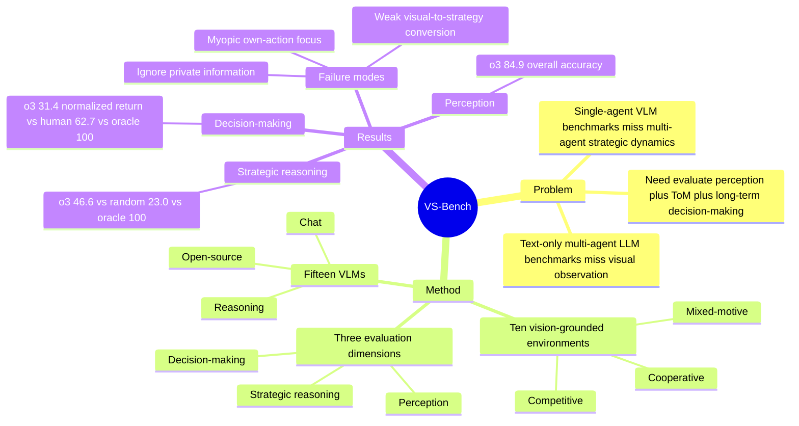

## Summary
VS-Bench 提出一个面向 VLM 的 multimodal multi-agent benchmark，用十个 vision-grounded 游戏环境评估 perception、strategic reasoning 和 decision-making。主要结论是：当前 VLM 的基础视觉识别尚可，但在 theory-of-mind 式 next-action prediction 和长期交互决策上距离 oracle 与人类仍有明显差距。

## Problem & Motivation
已有 VLM agent benchmark 多集中在 single-agent 场景，例如 GUI interaction、game play、embodied control 或 coding；已有 multi-agent LLM benchmark 又多是 text-only，无法测试视觉观察和策略交互的耦合难点。论文关注的问题是：VLM 在 multi-agent environments 中是否具备 strategic abilities，包括理解其他 agent 的意图、在 non-stationary dynamics 下做长期决策，以及在 cooperative / competitive / mixed-motive 情境中平衡自身收益与群体收益。

已知：作者认为真实世界更接近 multi-agent setting，结果不仅取决于自身 action，也取决于其他 agent 的 action。推测：这个 benchmark 对 GUI-agent 研究的间接价值在于补足“视觉输入 + 多主体策略推理”的评估维度，但论文没有直接评估 GUI 操作任务。未知：VS-Bench 上的提升是否能迁移到真实网页、桌面或机器人多主体协作场景，论文没有给出跨域验证。

## Method
VS-Bench 将 multi-agent environment 形式化为 Partially Observable Markov Game，并将每个 agent 的 observation 设为 multimodal observation：image observation 与 text observation；模型输出 text action，再映射到原始 action space。

Benchmark 包含十个 vision-grounded environments，覆盖三类 interaction dynamics。Cooperative 包括 Hanabi、Overcooked、Knights Archers Zombies (KAZ)；Competitive 包括 Breakthrough、Kuhn Poker、Atari Pong、Multi-agent Particle Environment (MPE)；Mixed-motive 包括 Coin Dilemma、Monster Hunt、Battle of the Colors。环境要求的能力包括 spatial perception、Theory of Mind、long-term planning 和 team collaboration。

评估分三条线：

- Perception：每个环境构造 400 个样本，测量 object position、agent orientation、game status 等基础视觉元素识别准确率。
- Strategic reasoning：每个环境构造 400 个样本，用 other agents' next-action prediction accuracy 测 theory-of-mind 能力；数据来自不同来源，包括 VLM 轨迹、人类 Overcooked 轨迹、minimax / Nash equilibrium / heuristic strategies 等。
- Decision-making：让 VLM self-play 或与 conventional agents 交互，报告 normalized episode return；random agent 归一化为 0，oracle / optimal baseline 归一化为 100。

实验覆盖 15 个 VLM：6 个 commercial reasoning models、6 个 commercial chat models、3 个 open-source models。作者还做了 multimodal vs text-only observation、CoT / reasoning test-time scaling、social behavior / persona、人类基线与 failure case 分析。

## Key Results
- 在 VS-Bench Perception evaluation 上，所有模型 overall accuracy 至少为 67.8%，最佳模型 o3 达到 84.9%；这支持“当前 VLM 有一定基础视觉识别能力”，但不说明其已经能完成策略推理。
- 在 VS-Bench Strategic Reasoning evaluation 上，random overall accuracy 为 23.0，oracle 为 100.0；最佳 o3 只有 46.6，claude-3-7-sonnet 为 40.4，gemini-2.5-pro 为 39.6，说明 next-action prediction 仍远低于 oracle。
- Strategic reasoning 中，三类模型平均表现分别约为 reasoning VLMs 38.8、chat VLMs 30.3、open-source VLMs 29.3；open-source top model Qwen2.5-VL-72B-Instruct overall 为 32.2，接近 commercial chat 平均。
- 在 VS-Bench Decision-Making evaluation 上，random normalized return 为 0，oracle 为 100；最佳 o3 overall normalized return 只有 31.4，gemini-2.5-pro 为 23.2，doubao-1-5-thinking-pro 为 20.3，且 15 个模型中有 4 个 overall performance 低于 random。
- Human study 中，26 名人类参与者的 overall normalized return 平均为 62.7；o3 为 31.4，只超过 12.9% 的人类结果。表 10 中 gpt-4.1 为 4.8，Qwen2.5-VL-72B-Instruct 为 3.0。
- Multimodal / text-only 对比显示，多数模型在 Hanabi、Breakthrough、Monster Hunt 的 text-only setting 上更好；例如 decision-making 中 o3 在 Monster Hunt text-only 为 45.3±7.7，multimodal 为 24.0±3.2。这说明视觉信息并没有稳定转化为更好的策略表现。
- CoT prompting 能明显提高 chat / open-source VLM 表现；例如 gpt-4.1 在 strategic reasoning 的 Hanabi 从 multimodal 23.0 提升到 CoT 49.8，在 Breakthrough 从 22.5 提升到 27.5，但 CoT 后仍非 oracle-level。

## Strengths & Weaknesses
强项：VS-Bench 的贡献主要是 problem formulation 和 evaluation design，而不是提出新模型。它把 VLM agent benchmark 从 single-agent 视觉任务推进到 multi-agent strategic ability，并把 perception、next-action prediction、episode return 分开评估，有助于定位 failure 是视觉识别、对手建模还是长期决策问题。

强项：环境选择覆盖 cooperative、competitive、mixed-motive 三类机制，并且很多环境来自 game theory 或 MARL 文献。论文还给出人类基线、text-only 对照、CoT / reasoning 对照、persona 分析和具体 failure cases，比只给 leaderboard 更有诊断价值。

局限：Decision-making 的 normalized return 依赖 self-play 或与 conventional agents 交互；论文自己也承认，用 diverse opponents population 会更能评估 generalization 和 adaptability。部分 “optimal” baseline 也不是严格意义的全局最优，例如 Breakthrough 使用 depth-5 minimax，作者说明它不保证 optimal，只是在实验中能完胜 MCTS baseline；MPE 使用 heuristic value 0 作为 optimal baseline。

局限：主实验主要是 two-player games，虽然附录给了 three-player Hanabi 和 three-player Coin Dilemma 的 preliminary experiments，但更大规模 n-agent 场景尚未系统评估。另一个边界是环境仍是 synthetic games，论文没有证明这些 strategic abilities 与真实 GUI-agent、web-agent 或 embodied collaboration 的任务成功率存在直接相关。

Failure cases：strategic reasoning 中常见错误包括忽略历史与 private information；例如 Hanabi 中模型会用自己可见但对方未必知道的信息预测对方出牌。Decision-making 中常见错误包括过度关注自身动作而忽略对手；例如 Breakthrough 中模型持续推进自己的棋子，却没有防守对手即将获胜的 threat。Overcooked failure case 还显示模型会忽略三颗 onion 的数量约束，Atari Pong 中会因为过度调整 paddle 而错过落点。

## Mind Map

## Notes
这篇论文对我最有价值的是它把 “VLM 看懂画面” 和 “VLM 在多主体环境中做对的策略动作” 明确拆开：perception 分数高并不自动带来 decision-making 分数高。对 GUI-agent / computer-use agent 的启发是，未来 benchmark 可能需要加入多用户、竞争性目标、协作冲突或隐藏信息，而不是只评估单个 agent 是否能完成界面操作。

值得继续追问：如果把 VS-Bench 的 decision-making 任务转化为显式 state abstraction、memory、opponent model 或 planning module，性能瓶颈会主要来自视觉 grounding，还是来自策略搜索 / long-horizon credit assignment？另一个疑问是，论文中的 persona prompting 能显著改变 mixed-motive behavior，这对 agent alignment 很重要，但目前还只是行为观察，没有机制解释。
