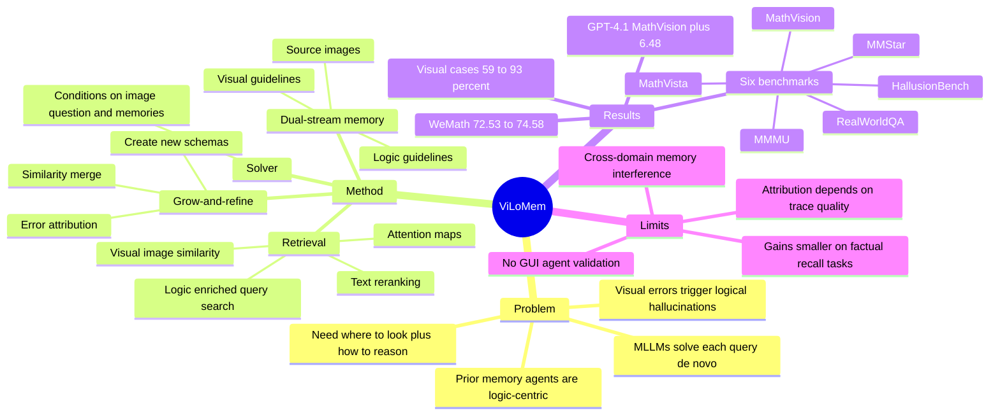

## Summary

ViLoMem 针对 MLLMs 每道题 de novo 推理、反复犯同类视觉/逻辑错误的问题，提出一个 plug-in dual-stream memory framework，把 visual distraction patterns 和 logical hallucination errors 分别存成可检索、可合并的 schema。它用 grow-and-refine memory cycle 在错误发生后自动归因、更新 memory，并在新问题中检索 logic guideline、visual guideline 与 question-aware attention map 来辅助求解。论文在 MMMU、MathVista、MathVision、HallusionBench、MMStar、RealWorldQA 六个 benchmark 上报告 pass@1 改进，但提升并非对每个模型的每个 benchmark 都严格超过原始 baseline。

## Problem & Motivation

现有 MLLM 在孤立问题上有较强 reasoning，但通常每个 query 独立求解，缺少从过去成功/失败经验中积累可复用知识的机制。已有 memory agents 主要保存文本轨迹或逻辑摘要，容易受 brevity bias 影响，并且会丢失 multimodal reasoning 中很关键的 visual grounding 和 perceptual cues。

论文的核心问题设定是：多模态错误往往不是单纯“推理错”或“看错”，而是视觉注意力错误会级联诱发逻辑 hallucination。作者在引言和 Figure 4 中强调，六个 benchmark 上 visual error summaries 的占比高于 logical memory errors，visual memory generation 占 stored cases 的 59%-93%，说明视觉误读是主要瓶颈之一。因此，logic-only memory 对 multimodal problem solving 不够，需要把“where to look”和“how to reason”拆开存储、联合检索。

## Method

**Memory Cycle.** 对输入 $x_i=(I_i,q_i)$，ViLoMem 维护两个 memory bank：logic memory $M^L$ 存 textual reasoning guidelines，visual memory $M^V$ 存 visual guidelines 及其 source images。新问题先并行检索两个 memory bank，把 retrieved memories 交给 solver 生成答案；Verifier 对照 ground truth 检查候选答案，若错误则触发 memory generation，更新两个 stream。这个设计强调 test-time / lifelong style 的经验积累，而不是改模型权重。

**Visual Memory Generation.** visual stream 由 MLLM 根据原图、问题、错误 reasoning trace 和 ground truth 同时输出 error indicator 与 Visual Guideline，覆盖 object confusion、遗漏视觉符号、空间关系误解等错误类型。写入 memory 前用 text embedding 和已有 visual guidelines 做 similarity check；超过阈值则 merge，否则新增 memory entry，并保留对应 source image 供之后 image similarity retrieval 使用。

**Logical Memory Generation.** logic stream 由 LLM 只看文本问题、错误 reasoning trace 和 ground truth，归因 non-visual errors，例如 computation mistakes、formula misapplications、logical fallacies。生成的 Logic Guideline 同样经过 similarity-based merge/create，目标是把具体失败轨迹抽象成可复用的规则，而不是存完整 trajectory。

**Retrieval.** visual retrieval 是 two-stage multimodal-to-text pipeline：先用 multimodal embedding 对 query image 和 memory images 做 image similarity，召回 top-k visual candidates；再把原问题与 LLM 分析出的 subject/domain/key concepts 拼成 enriched query，用 text similarity rerank/filter visual guidelines。logic retrieval 则直接基于 enriched query 和 text embedding 检索相关 logical guidelines。最后 solver 条件化于原图、原问题、retrieved logic memories 和 retrieved visual memories 生成答案。

**Attention Map.** 除 textual visual guideline 外，ViLoMem 还基于 retrieved visual memory 和历史 error pattern 生成 question-aware attention maps，显式标出 query image 中历史上容易出错、当前问题相关的区域。论文把它作为 auxiliary visual input；ablation 显示它在 MMMU 上有额外收益，但在 MathVista 上几乎没有提升。

**Experimental setup.** 实验使用 GPT-4.1、Qwen3-VL-235B-A22B-Instruct、Qwen3-VL-8B-Instruct 三个 solver；memory generation 使用 Qwen3-235B-A22B-Instruct 做 logical memory、Qwen3-VL-235B-A22B-Instruct 做 visual memory；retrieval 使用 Qwen3-Embedding 和 Qwen2.5-VL-Embedding。评估指标是 VLMEvalKit 的 pass@1 accuracy，必要时用 LLM-as-a-judge 辅助处理 rule-based matching 的格式误差。

## Key Results

**Main results across six benchmarks.** 与 step-by-step prompting 相比，GPT-4.1 + ViLoMem 在六个 benchmark 均提升：MMMU 74.16→77.26、MathVista 74.27→76.88、MathVision 47.47→53.95、HallusionBench 74.44→75.29、MMStar 70.43→72.43、RealWorldQA 72.03→74.38。最明显的是 MathVision +6.48 和 MathVista +2.61，符合论文关于 visual-grounded mathematical reasoning 更依赖 visual-logical memory 的解释。

| Model / setting | MMMU | MathVista | MathVision | HallusionBench | MMStar | RealWorldQA |
|---|---:|---:|---:|---:|---:|---:|
| GPT-4.1 step | 74.16 | 74.27 | 47.47 | 74.44 | 70.43 | 72.03 |
| GPT-4.1 + ViLoMem | 77.26 | 76.88 | 53.95 | 75.29 | 72.43 | 74.38 |
| Qwen3-VL-235B step | 75.97 | 83.66 | 62.17 | 74.58 | 76.16 | 78.66 |
| Qwen3-VL-235B + ViLoMem | 79.40 | 84.98 | 62.83 | 75.21 | 78.31 | 77.22 |
| Qwen3-VL-8B step | 65.52 | 77.80 | 48.35 | 73.08 | 70.22 | 70.85 |
| Qwen3-VL-8B + ViLoMem | 69.90 | 77.87 | 49.34 | 73.19 | 72.13 | 73.59 |

**对 baseline 的边界要看清楚。** Qwen3-VL-8B + ViLoMem 相比其 baseline 在六个 benchmark 都更高，例如 MMMU 66.38→69.90、HallusionBench 61.10→73.19、RealWorldQA 71.50→73.59。但 Qwen3-VL-235B + ViLoMem 在 RealWorldQA 为 77.22，低于 baseline 79.30 和 step 78.66；在 MMStar 为 78.31，也略低于 baseline 78.40。这说明“consistent improvements”更稳妥地理解为多数 setting/相对 step prompting 的整体趋势，而不是每个数字都单调提升。

**Dual-stream ablation.** 在 GPT-4.1 上，完整 ViLoMem 在 MMMU / MathVista 为 77.26 / 76.88；去掉 logic memory 后为 76.64 / 75.59，去掉 visual memory 后为 76.88 / 75.66，均低于完整模型。加入 attention map 后 MMMU 从 77.26 提到 78.21，但 MathVista 为 76.87，几乎等于完整 ViLoMem 的 76.88，作者解释为 diagram-based tasks 需要更细粒度的 vertex attention 和 spatial precision。

**Memory usage.** Figure 4 显示 visual memory generation 占 stored cases 的 59%-93%，但 retrieval 时两个 stream 的使用更均衡，说明 stored error type 不等于最终利用比例。这个结果支持论文的一个关键 claim：visual perception 是主要错误来源，但实际求解仍需要 visual 与 logic memory 协同。

**Cross-model memory transfer.** 对 Qwen3-VL-8B，使用其他模型生成的 memory 反而超过 self-generated memory：MMMU 69.90→71.26，MathVista 77.87→79.20。对 GPT-4.1，cross memory 在 MMMU 77.26→78.21，但 MathVista 76.88→76.58；对 Qwen3-VL-235B，cross memory 在 MMMU 79.40→79.26、MathVista 84.98→84.21，略低于 self-generated memory。论文据此认为 stronger models 可以给 smaller solvers 蒸馏更高质量 error patterns，但大模型自己的 memory 已接近最优。

**Cross-benchmark generalization.** Qwen3-VL-8B 从其他 benchmark 合并 memory 而排除 task-specific memory 后，MathVision 49.34→50.00 有小幅提高，RealWorldQA 73.59→71.63 仍高于 step 70.85；但 MMMU 69.90→65.14、MathVista 77.87→76.10、HallusionBench 73.19→70.66 均下降。论文结论是跨域 memory 有部分收益，但 task-aligned memory 对 optimal performance 仍必要，domain mismatch 会带来 mild interference。

**Memory scalability.** 在 WeMath 上，作者按 MathGlance→MathVista→MathVision→MathVerse 逐步累积 math-domain memory，从 15k tokens / 0.1k samples 扩到 150k tokens / 3k samples，accuracy 从 72.53 提升到 74.58。这个 progressive memory 结果还高于直接在 WeMath 上生成 memory 的 73.85，支持论文关于 long-term memory scaling 和跨 math task 抽象迁移的 claim。

## Strengths & Weaknesses

**已知 Strengths.** 这篇工作的好处是把 multimodal memory 拆成两个较清楚的 error channels：logic guideline 负责公式、计算、推理规则；visual guideline 和 attention map 负责误看、漏看、视觉注意力陷阱。这个 formulation 比单纯保存完整成功/失败轨迹更贴近 MLLM 的实际错误结构，也更容易解释为什么视觉错误会在几何、图表、幻觉 benchmark 中反复出现。

**已知 Strengths.** 实验不只报 main table，还覆盖了 component ablation、memory usage statistics、cross-model transfer、cross-benchmark transfer 和 memory scalability。尤其 Table 2 能验证 dual-stream complementarity，Table 4 能暴露 domain mismatch interference，Table 5 则给出 grow-and-refine memory 随 token/sample 增长的正向证据。

**已知 Weaknesses / boundary.** 论文依赖强 verifier / generator 来做 memory attribution：logical memory 用 Qwen3-235B-A22B-Instruct，visual memory 用 Qwen3-VL-235B-A22B-Instruct。若 solver 的 reasoning trace 本身缺少视觉描述，论文指出 verifier 难以生成有效 visual memory；若 solver 对复杂 diagram 感知太差，verifier 会倾向把错误归到 logical stream，导致 mixed memory updates。这说明 memory 质量受上游 trace quality 和 attribution quality 限制，不是纯粹的外部存储问题。

**已知 Weaknesses / boundary.** ViLoMem 对 knowledge-intensive benchmark 的提升相对温和，因为这些任务更依赖 factual recall，而不是可迁移的 visual-logical error pattern。Qwen3-VL-235B 在 RealWorldQA 和 MMStar 上没有稳定超过 baseline，也提醒我们 memory augmentation 可能会引入不匹配的 priors 或 retrieval noise。

**已知 Limitations / failure cases.** 论文没有给出一个独立的 failure case taxonomy，但正文明确给出两个 bottlenecks：强 textual bias 会让 trace 中 visual information 不足，导致 visual memory 生成失败；复杂 diagram 感知低质量会让 verifier 难以定位视觉错误，进而污染 logic stream。cross-benchmark 实验还显示 MathVista、HallusionBench 这类 domain gap 大的任务会和外域 memory 冲突。

**推测.** 对 GUI agent / computer-use agent 来说，ViLoMem 的思想可能有启发：把历史失败分成 UI perception memory（看错控件、误判状态、忽略高亮/disabled cue）和 task logic memory（流程规则、表单约束、工具调用策略）可能比只存文字 reflection 更稳定。但这是从 paper 的 multimodal reasoning setting 外推；论文没有在 GUI 或 interactive environment 上验证。

**不知道.** 论文正文没有说明 code release 或 GitHub 链接，只在首页标注了 project page；也没有在当前正文中给出 appendices 的具体 hyperparameters、memory thresholds、retrieval top-k、memory token budget 对 latency/成本的完整分析。因此还不知道 ViLoMem 在真实长期部署中 memory bank 增大后检索延迟、错误归因成本和 stale memory 清理会如何变化。

## Mind Map

## Notes

- 最值得借鉴的是 dual error-channel memory，而不是具体 embedding/retrieval 配方。对 agent memory 来说，失败轨迹需要先问“这是 perception bottleneck 还是 reasoning bottleneck”，否则 reflection 容易把视觉错误误写成逻辑规则。
- 这篇论文对“记忆是否越多越好”给出了较谨慎的答案：同域 math memory scale up 有收益，但跨 benchmark memory 会出现明显 domain mismatch。后续如果做 GUI memory，也应该按 app/domain/task type 分 bank，而不是把所有经验塞进一个 global memory。
- `code` 字段留空是因为论文正文只给出 project page，没有在正文中明确给出 GitHub/code link；`arxiv_id` 也留空，因为页眉没有出现 arXiv id。
