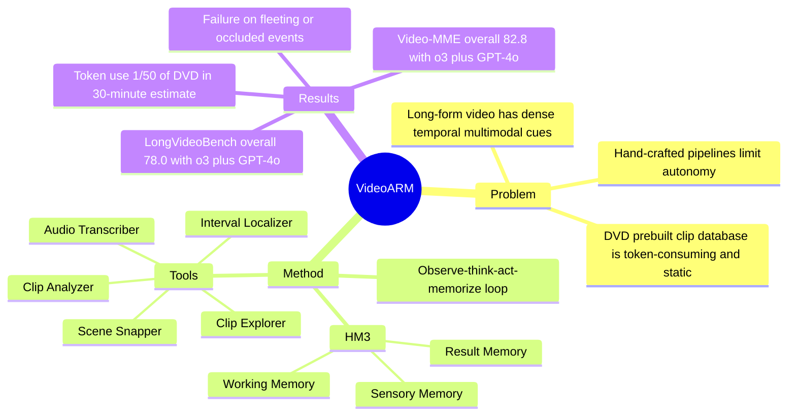

## Summary
VideoARM 提出一个面向 long-form video understanding 的 Agentic Reasoning-over-hierarchical-Memory 范式：让 controller 在 observe-think-act-memorize 循环中动态调用 temporal scoping 与 multimodal understanding tools，并把证据写入 hierarchical multimodal memory。它的核心贡献不是训练新 Video MLLM，而是在 training-free API setting 下，用 query-guided coarse-to-fine reasoning 替代静态预处理/检索数据库，从而同时提升准确率并显著降低 token 消耗。

## Problem & Motivation
长视频理解的难点在于时间跨度长、信息密度高，并且问题相关证据可能分散在视觉、音频和文本线索中。论文指出，LLoVi、VideoTree 等方法依赖 hand-crafted reasoning pipeline，限制了 MLLM 的自主推理；DVD 虽然引入 ReAct-like agent，但需要把视频预切为 10 秒 clips 并对每个 clip 做 MLLM 分析来构建数据库，token 消耗高且包含大量与 query 无关的冗余。另一个关键问题是 retrieval-centric database 在执行过程中不能被动态更新，难以支持 observation/reflection 的迭代。VideoARM 的动机是让 agent 根据当前问题按需观察、逐步缩小时间范围，并把中间证据以可更新 memory 的形式保留下来。

## Method
VideoARM 由两个核心组件组成：Hierarchical and Multimodal Memory (HM3) 与一个 coarse-to-fine video reasoning agent。整体运行方式是 observe-think-act-memorize loop：controller 读取 HM3 中的当前证据，判断缺什么信息，选择一个 tool 及参数，执行后把 observation 写回 memory；当 controller 选择 Answer 或达到 step budget \(N\) 时停止。

HM3 分三层。Sensory Memory 保存原始感知信息，其中 long-term perception pool 维护当前关注的 base interval，short-term perception pool 暂存 local exploration 的 clips/audio；Result Memory 记录每轮 tool 输出、时间区间和中间结果，帮助 controller 避免重复动作并基于已得证据调整策略；Working Memory 记录 controller 在 tool invocation 前的 reasoning traces 和 intended objectives，使 tool 相关上下文可以在每次调用后清理，降低 context 冗余。

Toolset 分为两类。Temporal Scoping Tools 包括 Interval Localizer 和 Clip Explorer：前者根据 HM3 定位 query-relevant intervals，并自适应决定采样帧数 \(N_1\)，再把采样帧组成带 frame index 的 3x2 image grids；后者在当前关注区间附近做更细粒度的局部探查，并把 frames/audio 放入 short-term perception pool。Multimodal Understanding Tools 包括 Scene Snapper、Audio Transcriber 和 Clip Analyzer：Scene Snapper 对 long-term pool 的帧生成 concise caption，Audio Transcriber 用 whisper-1 转写局部音频，Clip Analyzer 对 short-term pool 的 frames 回答 sub-question 并给出 confidence score。

实验实现上，论文使用 OpenAI o3 作为 Controller 和 Temporal Scoping Tools，whisper-1 作为 Audio Transcriber，并用 GPT-4.1 或 GPT-4o 作为 Scene Snapper / Clip Analyzer；ablation 默认用 GPT-4.1。Interval Localizer 的 \(N_1\) 在 30 到 150 之间，Clip Explorer 的 audio segment 受 whisper-1 限制控制在 25 MB，默认 step budget \(N=10\)。

## Key Results
- **Video-MME (w/o subtitles)**：VideoARM (o3+GPT-4.1) 达到 Short 86.4、Medium 78.4、Long 75.3、Overall 80.1 accuracy；VideoARM (o3+GPT-4o) 达到 Short 85.8、Medium 81.3、Long 81.2、Overall 82.8。对比 DVD，VideoARM (o3+GPT-4.1) 在 Video-MME Long 上为 75.3 vs 67.3。
- **LongVideoBench / EgoSchema**：VideoARM (o3+GPT-4.1) 在 LongVideoBench Long/Overall 为 69.2/73.7，在 EgoSchema 为 78.2；DVD 对应为 68.6/71.6 和 76.6。VideoARM (o3+GPT-4o) 在 LongVideoBench Long/Overall 为 76.4/78.0，在 EgoSchema 为 76.2。
- **MLVU / LVBench**：VideoARM (o3+GPT-4.1) 在 MLVU 上为 81.2，强于 VideoLucy 76.1、VideoChat-Flash-7B 74.7、GPT-4o 64.6；在 LVBench 上为 79.7，强于 DVD 76.0、VideoLucy 58.8、GPT-4o 48.9。
- **Token efficiency**：理论估算中，30 分钟视频、1 个 query 下 DVD 至少消耗 3.98M visual tokens，而 VideoARM 约 0.08M tokens，即 DVD 的 1/50；Video-MME 实验中，10 个视频、30 个 queries、平均 41.3 分钟视频下，DVD 为 64.21M tokens，VideoARM 为 1.89M tokens，即 DVD 的 1/34。
- **Ablation: tools**：在 Video-MME Long 200-sample subset 上，完整 SS+AT+CA 为 76.5；去掉 Scene Snapper 后为 69.0，去掉 Audio Transcriber 后为 70.5，去掉 Clip Analyzer 后为 75.5，说明 global summarization 和 audio grounding 的贡献最大。
- **Ablation: memory / budget / sampling**：完整 HM3 为 76.5；去掉 short-term perception pool 降到 72.5，去掉 long-term perception pool 降到 67.0，去掉 Working Memory 降到 75.5，仅依赖 controller context 为 74.5，去掉 Result Memory 会产生无效结果。step budget 从 \(N=3\) 到 \(N=10\) 时，Video-MME Long 从 72.0 提升到 76.5，LongVideoBench 从 67.5 提升到 70.5，但 Video-MME Short 从 87.5 降到 84.0；adaptive \(N_1\) 平均 49.8 frames，在 Video-MME Long / LongVideoBench 为 76.5 / 70.5，优于 fixed \(N_1=30\) 的 73.5 / 68.0。

## Strengths & Weaknesses
**已知。** VideoARM 的强点是把 long-video reasoning 变成可审计的 tool-use loop：每次观察都有 interval、tool output 和 reasoning trace，HM3 使 evidence accumulation 不只是把所有 clip caption 塞进上下文。相比 DVD，它避免了 exhaustive clip-level database construction，因此 token efficiency 的优势非常明确，并且主结果覆盖 Video-MME、LongVideoBench、EgoSchema、MLVU、LVBench，而不是单一 benchmark。

**已知。** 方法的关键依赖也很清楚：controller 与 worker agents 主要依赖 proprietary closed-source MLLMs。论文自己的 ablation 显示，在 Video-MME Long 上 OpenAI o3 + GPT-4o tools 为 80.0，OpenAI o3 + GPT-4.1 tools 为 76.5；而 Qwen3-VL controller/tools 为 54.9，GPT-4o controller/tools 为 40.5，说明 controller 的 multi-step reasoning / hierarchical planning 能力是瓶颈之一。

**已知。** 论文显式讨论了 sampling bottleneck：若初始 temporal/visual sampling 漏掉短暂但关键的事件、小物体、细微动作或单帧变化，agent 可能无法启动正确的 reasoning trajectory；Temporal Scoping Tools 有时能通过附近重采样恢复，但没有显式机制检测 early mis-localization 并触发 targeted re-exploration。失败案例中，“carousel starts spinning for the first time” 这类短时且遮挡严重的事件导致 VideoARM 定位到错误 frame interval，即使后续推理继续细化也无法得到正确答案。

**推测。** 这类 HM3 + tool scheduling 设计对 GUI agent / embodied agent 有可迁移价值：GUI 或机器人任务同样需要在长时程交互中保存局部 evidence、避免重复观察、按 query/action goal 自适应缩小搜索范围。但论文没有在 GUI、robotics 或 embodied benchmark 上验证，所以这里只能作为结构启发，不能视作跨域结论。

**不知道。** 论文没有报告真实 API dollar cost、wall-clock latency、失败重试率，也没有给出完全 open-source/self-hostable implementation 的完整结果。token 数降低不必然等价于端到端成本降低，尤其当 controller/tool calls 需要多轮 closed-source MLLM API 时，这部分仍需单独验证。

## Mind Map

## Notes
- 对 agent 研究最有价值的点不是“再做一个 memory”，而是 memory 的层次与 tool abstraction 的耦合：Temporal Scoping Tools 改变可观察范围，Multimodal Understanding Tools 产出可写入 Result Memory 的证据，Working Memory 则保存 why this tool call。
- 读这篇时要避免 overclaim：实验表明 VideoARM 在长视频 QA benchmarks 上有效，但它仍是基于强 proprietary MLLM 的 orchestration framework，不是一个已证明可在开源小模型或真实在线交互环境中稳定运行的通用 agent。
