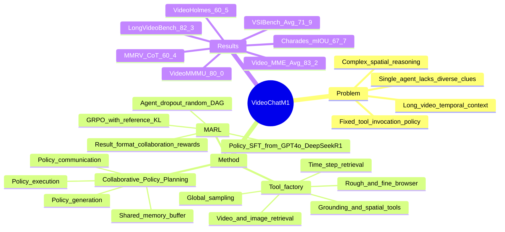

## Summary
VideoChat-M1 解决 agent-based video understanding 中 tool invocation policy 通常固定、不可学习的问题，提出 Collaborative Policy Planning (CPP) 让多个 policy agents 生成、执行、交流并动态修正工具调用计划。它再用 Multi-Agent Reinforcement Learning (MARL) 联合优化最终答案、格式约束和协作过程，在 long video QA、video reasoning、spatial intelligence、temporal grounding 的 8 个 benchmark 上报告 SOTA 结果。

## Problem & Motivation
现有 MLLMs 在短视频上进展明显，但面对长时序上下文或复杂空间结构时，直接输入大量 frames 往往难以稳定检索关键线索。已有 agent-based video understanding 方法通过 retrieval、memory、search tools 等降低长视频负担，但论文指出这些系统大多遵循单一或固定的 tool invocation policy，缺少 query-adaptive policy learning。作者关心的核心问题不是再堆一个更大的 video backbone，而是让多个 agents 针对同一 video query 形成多样化工具计划，并在执行中交换中间线索、更新策略。这个问题对 long video QA 和 video reasoning 重要，也与 GUI / computer-use agent 中“如何学习动态调用观察工具”有方法层面的相似性。

## Method
VideoChat-M1 的核心是 **Collaborative Policy Planning (CPP)**。给定 video `V` 和 query `Q`，系统包含 policy agents `G`、video perception tools `T` 和 shared memory buffer `M`。每个 agent 先在 policy generation 阶段生成自己的工具调用计划 `P_i`，再在 policy execution 阶段逐步调用工具分析视频并产生 intermediate answers；执行过程中，agent 会把中间结果写入 shared memory，并在 policy communication 阶段读取其他 agents 的线索，决定继续原计划或修改后续 policy steps。多选题用 majority voting 得到最终答案，open-ended 和 temporal grounding queries 由组内表现最好的模型汇总。

工具层面，论文图示的 tool factory 包括 Global Sampling、Video Retrieval、Image Retrieval、Time Step Retrieval、Rough Browser、Fine Browser、Grounding Tool 和 Spatial Tool。CPP 的设计意图是让不同 agents 探索不同 temporal / spatial clues，而不是所有模型共享同一条固定检索路径。

训练分两步。第一步是 **Policy SFT**：作者用 GPT-4o 和 DeepSeek-R1 组成 high-performance team，通过 CPP 自动为开源视频数据生成 policy plans，并只保留能得到正确答案且无需 policy modification 就能执行成功的 plans，随后用 cross-entropy fine-tune 每个 agent。第二步是 **MARL**：把每个 agent 当成 policy model，用 `R = Rres + Rformat + Rcol` 训练；`Rres` 奖励最终答案正确性，`Rformat` 奖励 parsable plans / valid tool calls，`Rcol` 用 GPT-4o 作为 external evaluator 对 memory buffer 中的 intermediate planning trajectory 做 binary scoring，并对超过 5 次 tool calls 的轨迹施加强惩罚。优化使用 GRPO，并带 reference KL penalty；训练中还用 agent dropout，从 fully connected agent graph 随机采样 DAG 作为 communication topology，以降低 co-adaptation。

实现细节上，实验使用 8 张 A100 80G GPUs；SFT learning rate 为 `1e-6`、MARL learning rate 为 `1e-7`，SFT 跑 1 epoch、batch size 32；最佳设置是 200 steps MARL、4 rollouts、batch size 8。

## Key Results
- **主结果 / 8 benchmarks**：VideoChat-M1 (37B) 在 **LongVideoBench** 达到 **82.3%**，在 **Video-MME** 达到 **83.2% Avg**（M **84.2%**、L **76.7%**），在 **MLVU** 达到 **83.4 M-avg / 5.92 G-avg**，在 **Video-Holmes** 达到 **60.5%**，在 **VideoMMMU** 达到 **80.0%**，在 **MMR-V CoT** 达到 **60.4%**，在 **VSIBench** 达到 **71.9% Avg**（Dist **88.3%**、Dir **70.8%**、Order **66.7%**），在 **Charades-STA** 达到 **67.7 m-IOU**。
- **相对 closed-source baselines**：在 **LongVideoBench**，VideoChat-M1 的 **82.3%** 高于 Gemini 2.5 Pro 的 **78.7%** 和 GPT-4o 的 **66.7%**，论文报告分别提升 **3.6%** 和 **15.6%**；在 **Video-Holmes**，它的 **60.5%** 相比 Gemini 1.5 Pro 的 **45.7%** 高 **14.8%**；在 **MMR-V CoT**，它的 **60.4%** 相比 GPT-4o 的 **46.1%** 高 **14.3%**。
- **专业任务**：论文报告在 **VSIBench** spatial intelligence 上有 **2.4%** lead，在 **Charades-STA** temporal grounding 上有 **1.8%** lead；表中对应完整结果为 VSIBench Avg **71.9%**、Charades m-IOU **67.7**。
- **效率**：VideoChat-M1 平均只用 **69.9 frames / video**、**19.8s** inference time，同时 LongVideoBench / Video-MME 为 **82.3% / 83.2%**。对比 GPT-4o 为 **384 frames**、**153.6s**、**66.7% / 71.9%**，Gemini 1.5 Pro 为 **568 frames**、**227.2s**、**64.0% / 75.0%**，Qwen2-VL-72B 为 **568 frames**、**90.5s**、**55.6% / 71.2%**。
- **agent 数量与组合消融**：在 Video-Holmes / LongVideoBench 上，单 agent 最好约 **31.2 / 61.9**，2-agent 最好 **43.5 / 67.9**，3-agent 最好 **55.9 / 78.9**，4-agent heterogeneous group 达到 **60.5 / 82.3**；作者据此认为 agent 数量增加和参数规模提升都有帮助，但 homogeneous agents 超过 4 个后收益趋于饱和。
- **与 untrained foundation LLM teams 对比**：同样 CPP protocol 下，`2x GPT-4o + 2x DeepSeek-R1` 为 **56.2 / 75.9**，`4x GPT-4o` 为 **52.7 / 72.9**，`4x DeepSeek-R1` 为 **51.8 / 71.4**；VideoChat-M1 为 **60.5 / 82.3**，说明 MARL fine-tuning 带来 task-specific coordination。
- **MARL components**：完整配置在 Video-Holmes / LongVideoBench 为 **60.5 / 82.3**；去掉 collaboration reward 为 **59.4 / 81.1**，去掉 format reward 为 **60.2 / 82.0**，去掉 agent dropout 为 **58.5 / 79.9**，去掉 result reward 降到 **32.4 / 63.8**。这表明 final answer reward 是基本信号，process reward、format reward 和 dropout 也有增益。
- **SFT 与 MARL / RFT**：没有 SFT 和 MARL 时为 **52.1 / 69.3**；仅 SFT 为 **55.2 / 75.9**；仅 MARL / RFT 为 **57.9 / 80.2**；二者结合达到 **60.5 / 82.3**。
- **tuning 与讨论机制**：LoRA 只更新约 **2%** 参数时达到 **59.4 / 81.2**，full-parameter finetuning 为 **60.5 / 82.3**。聚合策略上，Best Score 为 **59.9 / 81.2**，Decide by Agent 为 **60.2 / 81.6**，Vote 最好，为 **60.5 / 82.3**。

## Strengths & Weaknesses
**已知 / Strengths**
- 论文的关键 insight 比“multi-agent 投票”更进一步：它让 tool invocation policy 本身变成可生成、可通信、可 RL 优化的对象，这比静态 tool routing 更接近 agentic system 中真正需要学习的部分。
- 主实验覆盖 long video QA、video reasoning、spatial intelligence、temporal grounding，baseline 包括 GPT-4o、Gemini 1.5 Pro / 2.5 Pro、Qwen3-VL-235B、InternVL-3.5-241B、VideoRAG、VideoChat-A1 等，比较面比较宽。
- 多个消融支撑了核心设计：4-agent heterogeneous group 明显优于小规模组合，MARL 训练优于 untrained GPT-4o / DeepSeek-R1 teams，SFT 与 MARL 叠加优于单独使用。
- 效率证据比较强：69.9 frames 和 19.8s 的平均推理成本显著低于 GPT-4o / Gemini 1.5 Pro 表中设置，同时 LongVideoBench 和 Video-MME 分数更高。

**局限 / Caveats**
- 训练数据中的 policy plans 由 GPT-4o + DeepSeek-R1 自动标注，collaboration reward 也依赖 GPT-4o evaluator；因此“学到协作 policy”的监督与奖励都部分绑定在强闭源 LLM 的判断上。
- `Rcol` 是 binary reward，并由 LLM 评估 plan feasibility、tool appropriateness、step management；论文没有报告 evaluator agreement、reward noise、或 GPT-4o 误判对训练的影响。
- 论文没有系统性 failure-case taxonomy，也没有展示哪些视频问题会因 agent communication 变差、哪些 tool calls 最容易失败。
- baseline 口径仍需谨慎：表中不同 closed / open models 的可用字幕、frame 输入、test-time compute、tool budget 未必完全等价；论文主要报告 aggregate score，没有逐任务成本-收益曲线。
- 虽然作者提到受 multi-agent GUI pipelines 启发，但实验只在 video understanding benchmarks 上进行，没有验证 CPP / MARL 是否能迁移到 GUI-agent、web-agent 或 embodied action tasks。

**推测 / Open Questions**
- CPP 对 GUI-agent 的潜在价值在于把“观察屏幕哪里、调用哪个 grounding / retrieval tool、何时改计划”变成可学习 policy；但这只是方法启发，本文没有 GUI evidence。
- Agent dropout 的收益可能来自打破固定通信拓扑下的 co-adaptation；如果迁移到更强结构化环境，例如 web DOM 或 robot scene graph，communication topology 是否还应随机采样并不清楚。
- Vote 在多选视频 QA 上最好，但 open-ended reasoning、temporal grounding 或需要结构化 timeline 的任务是否仍适合 majority vote，需要单独验证。

**不知道**
- 正文没有给出代码仓库、DOI 或论文自身的 arXiv id。
- 正文没有说明训练用 open-source video datasets 的完整规模与组成细节，只说明见 Appendix A.1；当前摘录正文不足以判断数据分布是否覆盖所有测试 domain。
- 论文没有报告 end-to-end dollar cost、tool-call 分布、单个 tool 的失败率，或不同 agent group 在同一问题上分歧如何演化。

## Mind Map

## Notes
- 我的判断：rating=4。它与 video-LLM 和 agentic-RL 高度相关，对 GUI-agent 的直接实验支撑为零，但“learnable tool policy + multi-agent communication + process reward”的 formulation 很值得跟踪。
- 这篇与 LVAgent / VideoChat-A1 的关系值得单独整理：LVAgent 更像 training-free dynamic collaboration，VideoChat-A1 强调 chain-of-shot reasoning，VideoChat-M1 则把 collaboration policy 本身放进 SFT + MARL 训练。
- 后续阅读应重点找 supplementary：Appendix A.1 的训练数据、A.2 的 memory buffer、A.3 的 GPT-4o reward prompt、A.6 的 agent teams 细节，会直接影响对可复现性和 reward validity 的判断。
