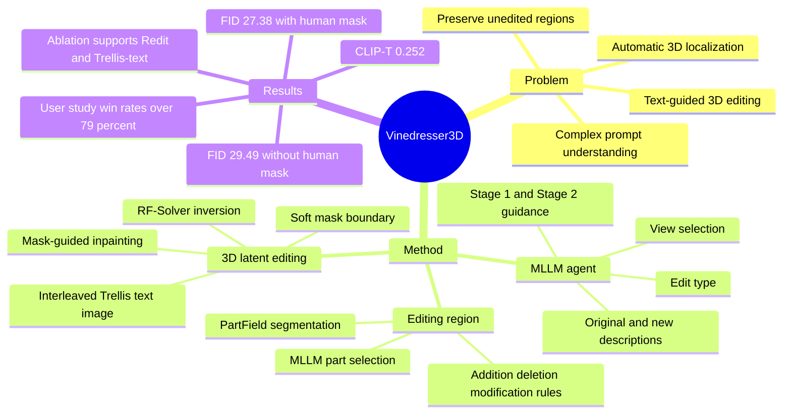

## Summary
Vinedresser3D 提出一个 text-guided 3D editing agent：用 MLLM 理解编辑指令、生成多模态 guidance、自动定位 3D 编辑区域，再在 Trellis 的 native 3D latent space 中做 inversion-based inpainting。核心贡献不是训练一个端到端编辑模型，而是把 Gemini-2.5-Flash、Nano Banana、PartField 和 Trellis 组织成可执行的 3D editing pipeline，并显式保护未编辑区域。

## Problem & Motivation
Text-guided 3D editing 的实际需求是：用户只给自然语言，系统应理解复杂编辑意图、自动找到 3D 中要改的区域，并在改变目标部件的同时保持其余几何和外观不被破坏。

已有方法有三类主要瓶颈。SDS-based 方法依赖 2D diffusion guidance 做 per-scene optimization，计算昂贵且需要调参来避免 global unintended changes；“2D editing + 3D reconstruction”方法会受 multi-view inconsistency、遮挡和渲染畸变影响，未观测区域质量和未编辑几何保存都不稳定；VoxHammer 虽然在 native 3D space 中编辑，但仍需要 human-provided 3D masks，且作者认为它难以处理复杂编辑请求。

这篇论文的动机是把 3D editing 从单模型优化推进到 agentic pipeline：由 MLLM 负责理解和决策，由 3D segmentation、image editing、3D generative model 分别承担局部工具能力。

## Method
Vinedresser3D 的输入只有原始 3D asset 和 editing prompt。它先渲染多视角图像交给 Gemini-2.5-Flash，让 MLLM 输出 original complete description、editing part names、edit type（addition / modification / deletion）、new complete description，以及为 Trellis 两阶段生成拆分的 structure-level 和 appearance-level text guidance。实现细节中，作者渲染 8 个原始视角和 segmentation 视角给 MLLM 生成文本 guidance，并额外渲染 24 个视角供 MLLM 选择最能显示编辑部件和整体结构的 view。

图像 guidance 由 selected view 经过 Nano Banana 生成。输入不只是原始 editing prompt，还包括 MLLM 生成的新目标部件描述，用来约束 image editing model 产生更贴近目标编辑的 reference image。

编辑区域检测是 mask-free claim 的关键。Vinedresser3D 用 PartField 将 3D asset 分成多个 semantic parts，并对 S ∈ [3, 8] 的不同粒度分割结果都让 MLLM 选择目标编辑部件。对于 addition，编辑区域是原 asset 外的 voxel grid；对于 deletion，编辑区域就是 P_edit；对于 modification，方法先标记 P_edit 和 P_pres，再用 preserved parts 的 bounding boxes 和 KNN voxel proportion rule 判断 bbox 内空 voxel 是否属于可编辑区域，以避免简单把所有非 preserved voxel 都开放给 Trellis 而误伤保留几何。

3D editing 模块建立在 Trellis 的 SLAT latent representation 上。作者用 RF-Solver 做 rectified flow inversion，并通过 grid search 发现 inversion 时 CFG strength 设为 0 可以稳定 inversion trajectory、降低 reconstruction error。编辑阶段采用 mask-guided inpainting：每个 denoising timestep 中，edit mask 外的 latent features 被替换为原 inversion trajectory 中对应 features，从而保留未编辑区域。

单独 Trellis-text 或 Trellis-image 都不够。Trellis-text 的 fine detail 质量受 3D text-aligned 数据稀缺限制；Trellis-image 只看单视角，遮挡区域信息不足。因此作者提出 Interleaved Trellis Editing Module，在每个 timestep 交替使用 Trellis-text 和 Trellis-image 的 vector fields，结合 text branch 的 prompt adherence 和 image branch 的 detail fidelity。Stage 2 使用 soft mask 缓解边界 floating artifacts；deletion 请求则跳过 Stage 1 inversion/editing，直接移除 Redit voxels 并用 Stage 2 平滑边界。

## Key Results
作者在一个自建 text-guided 3D editing benchmark / evaluation set 上测试：24 个 assets 来自 Trellis generation results，33 个来自 GSO 和 PartObjaverse-Tiny，每个 asset 设计一个符合 common sense 的 editing prompt。

### Quantitative Comparison

| Method | Human Mask | CLIP-T ↑ | CD ↓ | PSNR ↑ | SSIM ↑ | LPIPS ↓ | FID ↓ |
|--------|------------|----------|------|--------|--------|---------|-------|
| Instant3dit | yes | 0.227 | 0.027 | 20.86 | 0.851 | 0.153 | 80.35 |
| VoxHammer | yes | 0.235 | 0.027 | 24.36 | 0.890 | 0.087 | 34.95 |
| Trellis | yes | 0.247 | 0.010 | 37.35 | 0.984 | 0.017 | 31.10 |
| Vinedresser3D | no | 0.252 | 0.016 | 29.45 | 0.953 | 0.045 | 29.49 |
| Vinedresser3D w/ HM | yes | 0.252 | 0.008 | 37.69 | 0.984 | 0.015 | 27.38 |

已知结果：without human mask 的 Vinedresser3D 在 CLIP-T=0.252 和 FID=29.49 上优于 Instant3dit、VoxHammer 和 Trellis，但 preservation 指标不如 Trellis 的 CD=0.010、PSNR=37.35、SSIM=0.984、LPIPS=0.017。with human mask 时，Vinedresser3D w/ HM 在所有表格指标上最好：CD=0.008、PSNR=37.69、SSIM=0.984、LPIPS=0.015、FID=27.38，CLIP-T 与无 mask 版本同为 0.252。

### User Study

| Comparison | Text Align. win rate | Unedited Preservation win rate | 3D Quality win rate |
|------------|----------------------|--------------------------------|---------------------|
| vs. Trellis | 92.5% | 82.0% | 90.8% |
| vs. VoxHammer | 89.8% | 79.3% | 90.2% |

User study 显示，人类偏好在 text alignment、unedited region preservation、overall 3D quality 三个维度都更偏向 Vinedresser3D。

### Ablation

| Variant | PSNR ↑ | SSIM ↑ | LPIPS ↓ | FID ↓ |
|---------|--------|--------|---------|-------|
| Vinedresser3D | 29.45 | 0.953 | 0.045 | 29.49 |
| w/o Trellis-text | 28.06 | 0.943 | 0.054 | 30.59 |
| w/o Redit | 25.65 | 0.921 | 0.068 | 33.95 |

Ablation 支持两个关键设计：去掉 Trellis-text 后 FID 从 29.49 变差到 30.59，说明 interleaved text/image editing 对整体质量有帮助；去掉 detected editing region 后 PSNR/SSIM/LPIPS/FID 全部下降，说明 Redit 不只是保护未编辑部分，也能 regularize denoising，避免 distorted outputs。

## Strengths & Weaknesses
已知的 strengths：
- Agentic decomposition 清晰：MLLM 负责 intent parsing、part reasoning、view selection 和 guidance generation，外部模型负责 segmentation、image editing、native 3D generation。
- 解决了一个实用约束：不要求用户提供 3D mask，而是从 text prompt 自动推断编辑区域。
- Direct 3D latent editing 避免完全依赖 2D edit + reconstruction 的 multi-view inconsistency，并通过 inversion trajectory feature replacement 显式保护未编辑区域。
- Ablation 覆盖了两个核心模块：Interleaved Trellis 和 Redit mask，且定量指标都支持它们的必要性。

已知的 weaknesses / limitations：
- MLLM 并不接收 native 3D input，只能通过 rendered multi-view images 做间接 3D reasoning；作者明确认为直接 3D input 和 3D reasoning 可能进一步提升效果。
- 外部工具会成为上限，例如作者指出 PartField 可能产生不合理 part segmentation。
- Automatic mask 版本在 unedited preservation 上明显弱于 Trellis 或 Vinedresser3D w/ HM，说明 mask-free 带来的代价仍然存在。
- 实验集是作者自建的 57-asset editing set，而不是一个社区标准大规模 benchmark；我的评价是，这会限制结果的外部可比性。

推测：
- 对 GUI agent / embodied agent 的启发在于 pipeline pattern：先由 MLLM 把用户意图拆成局部可执行目标，再做 grounding，再调用专用工具并保护未触碰区域。但 3D asset editing 与 GUI interaction 的 action space 不同，不能直接把结果外推到 GUI task success。

不知道：
- 论文正文未给出该方法的 wall-clock runtime、token/API cost、失败率统计或 code release 信息。
- 正文未出现该论文自身的 arXiv id 或 DOI。

## Mind Map

## Notes
- 这篇论文的核心价值在 agent orchestration，而不是提出新的 3D foundation model。它证明了一个 primarily 2D image-text trained MLLM 可以作为 3D editing pipeline 的 planner / router / prompt generator，但其 3D grounding 仍依赖 rendered views 和 PartField。
- 与 VoxHammer 的关键区别是：VoxHammer 仍需要 human-provided 3D masks，而 Vinedresser3D 试图自动从 text prompt 和 segmentation 中推断 Redit。
- 值得追问：如果把 PartField 换成更强的 3D segmentation / open-vocabulary part grounding model，自动 mask 与 human mask 之间的 preservation gap 会缩小多少？
