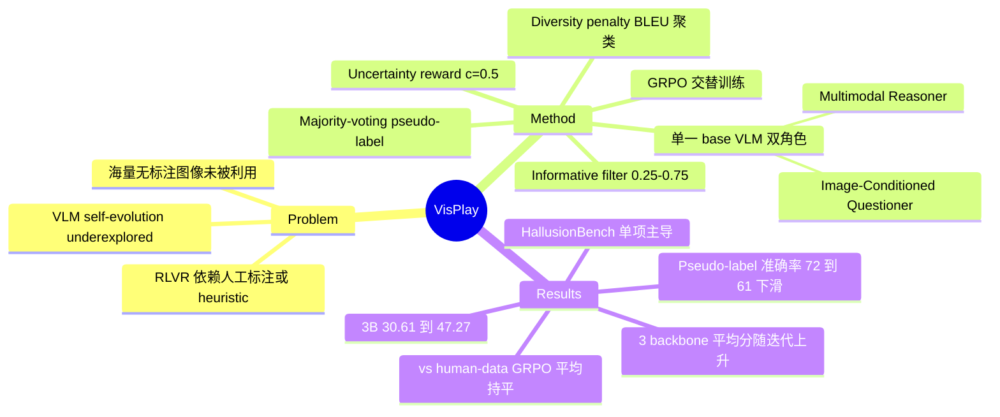

## Summary

VisPlay 是一个不用任何人工标注的 self-evolving RL 框架：单一 base VLM 演化出 Image-Conditioned Questioner 与 Multimodal Reasoner 两个角色，在 47K 无标注 web 图像上交替用 GRPO 训练——Questioner 以 frozen Reasoner 的答案不确定性（confidence 趋近 0.5）为 reward 生成难度递增的问题，Reasoner 以自身 majority-voting pseudo-label 为 verifiable reward 学习作答。三个 backbone（Qwen2.5-VL-3B/7B-Instruct、MiMo-VL-7B-SFT）在 7 个 benchmark 上平均分随迭代提升（3B: 30.61 → 47.27），与用人工标注数据跑 standard GRPO 的模型平均分相当。

## Problem & Motivation

RLVR 依赖可验证的 reward，而现有 VLM RL 方法的 verifiable reward 要么来自人工标注（贵、难 scale），要么来自任务特定 heuristic（窄）。LLM 侧的 self-evolution（R-Zero、Absolute Zero、SPICE 等）已证明模型可以自己生成任务和监督信号，但该范式在 VLM 上仍 underexplored——视觉模态引入额外困难：不能像代码/数学那样纯符号自验证。作者的出发点是：网上有海量免费无标注图像，若能只靠图像自举出训练信号，就绕开了 annotation bottleneck。

## Method

**闭环双角色 self-play**。从同一个 pretrained backbone 初始化两个 agent，交替训练、互为环境：

1. **Image-Conditioned Questioner 训练**（Reasoner frozen）：给定图像 I，Questioner 采样一组 G 个问题，reward 由三部分合成 r = 1_valid(x) · ReLU(r_unc − r_div)：
   - **Uncertainty reward**：frozen Reasoner 对每个问题采样 m 个回答，majority voting 得 pseudo-label，其经验频率为 confidence c；r_unc = 1 − |2c − 1| 在 c = 0.5 处取最大值 1——奖励"恰好探到 Reasoner 能力边界"的问题，太容易（c→1）和太混乱（c→0）都拿低分。
   - **Diversity regularization**：组内问题按 BLEU 相似度聚类，r_div = λ|C_k|/G 惩罚重复问题，防止 Questioner collapse 到单一模板。
   - **Format 硬过滤**：问题必须包在 `<question>` 标签内，否则 reward 直接为 0；ReLU 防止负 reward 扭曲 GRPO 的组内归一化。
2. **Multimodal Reasoner 训练**（Questioner frozen）：Questioner 为每张图生成 N 个候选问题，用当前 Reasoner 的 majority-voting pseudo-label ỹ 和 confidence c 做 **informative filter**——只保留 0.25 ≤ c ≤ 0.75 的 (question, pseudo-label) 对（丢弃已会的 trivial 样本和噪声样本），然后以二值 reward r_j = 1(y_j = ỹ) 跑 GRPO。
3. **无外部 verifier**：整个循环没有人工标注、没有外部裁判模型、没有工具调用；监督信号完全来自 Reasoner 自身的 self-consistency（majority voting）。防 reward hacking 的机制就是上述四件套：uncertainty targeting + diversity penalty + format filter + informative filter。

**设置**：数据用 Vision-47K 的 47K web 图像（charts、medical images、exams、textbooks、driving simulations 等），只用图不用原 QA 标注；3 个 backbone，主表报告 3 轮 self-play 迭代。

## Key Results

- **主结果（Table 1，7 个 benchmark：MMMU / MM-Vet / RealWorldQA / VisNumBench / MathVerse / MATH-Vision / HallusionBench，LLM-as-a-judge 评测）**：Qwen2.5-VL-3B 平均分 30.61 → Iter1 44.16 → Iter2 44.87 → Iter3 47.27；Qwen2.5-VL-7B 40.41 → 48.61；MiMo-VL-7B 43.56 → 45.69。均超过 frozen-challenger 消融基线（Questioner 不训练）。
- **增益非单调**：7B 平均分 Iter2 回落（44.53 → 40.97）后 Iter3 反弹至 48.61；MiMo-VL Iter1（43.16）低于其 base（43.56）。逐迭代稳定性并不理想。
- **Hallucination 是最大单项来源**：3B 的 HallusionBench 从 32.81 升至 Iter2 的 94.95（Iter3 回落到 90.54）。
- **vs 人工标注数据（Table 3）**：与 Vision-47K 真实标注 + standard GRPO 训一个 epoch 相比，3B 平均 47.3 vs 47.1，7B 48.6 vs 50.7——平均"competitive"，但拆开看：VisPlay 的优势几乎全在 HallusionBench（90.5 vs 67.4；92.3 vs 66.6），MMMU/MM-Vet 反而低于 human-data GRPO（如 3B MM-Vet 38.1 vs 49.5）。
- **数据质量随迭代衰减（Table 2）**：对同一批 200 张图，各代 Questioner 出题的 pseudo-label 估计准确率（ChatGLM-Flash 判定）从 Iter1 的 72.0 降到 Iter2 65.0、Iter3 61.0；同期 Reasoner 在 Iter1 题集上的准确率从 base 39.0 升到 49.0。作者解读为"题变难了"，但这同样意味着监督信号噪声在增大。
- **共同演化动力学（Figure 3 / Table 4）**：第一轮迭代内三个模型的 question difficulty（由 confidence 导出）与 Reasoner accuracy 同步上升；案例显示问题从 Iter1 的计数/识别演进到 Iter3 的多步推理与精确定位。

## Evidence Ledger

| Claim ID | Claim | Type | Source locator | Evidence excerpt | Status |
|:--|:--|:--|:--|:--|:--|
| C1 | 单一 base VLM 演化 Questioner + Reasoner 双角色，GRPO 联合优化，无人工标注、无外部 verifier | causal-mechanism | Abstract; Sec 2.2-2.3 | "assigns the model into two interacting roles... jointly trained using GRPO... without requiring external supervision" | source-verified |
| C2 | Questioner reward r = 1_valid · ReLU(r_unc − r_div)，r_unc = 1 − \|2c − 1\| 在 c=0.5 最大；r_div 为 BLEU 聚类重复惩罚；格式不合法 reward 为 0；reward 来自 frozen Reasoner | causal-mechanism | Eq 5-8, Sec 2.3; Fig 2 caption | "maximal reward of 1 when c = 0.5"; "reward stems from the uncertainty of the frozen Multimodal Reasoner" | source-verified |
| C3 | Reasoner 监督 = 自身 m 个采样的 majority-voting pseudo-label，二值 reward；informative filter 只留 c ∈ [0.25, 0.75] | causal-mechanism | Eq 4, 9, 10; Sec 2.4 | "τ_low and τ_high are thresholds set to 0.25 and 0.75" | source-verified |
| C4 | 训练数据 Vision-47K 的 47K web 图像，只用图不用原 QA | benchmark-setting | Sec 3.1 + footnote 2 (p.4) | "We only use the images without the questions and answers" | source-verified |
| C5 | 平均分：3B 30.61→44.16→44.87→47.27；7B 40.41→48.61；MiMo 43.56→45.69 | number | Table 1 (p.7); Sec 3.2 | Table 1 Avg 列逐项一致 | source-verified |
| C6 | 3B HallusionBench 32.81 → Iter2 94.95（Iter1 91.80，Iter3 90.54） | number | Table 1 (p.7); Sec 3.2 | "rises from 32.81 to 94.95 by the second iteration" | source-verified |
| C7 | vs human-data standard GRPO（一个 epoch）：3B 47.3 vs 47.1；7B 48.6 vs 50.7；HallusionBench 大幅占优但 MMMU/MM-Vet 更低 | comparison | Table 3 (p.7); Sec 3.3 | "standard GRPO for one epoch"; Hallusion 90.5/67.4, 92.3/66.6 | source-verified |
| C8 | 同批 200 图逐代出题：pseudo-label 准确率 72.0→65.0→61.0；Reasoner 在 Iter1 题集准确率 39.0→49.0 | number | Table 2 (p.7); Sec 3.4 | "questions for the same 200 images"; Pseudo-Label Acc 72.0/65.0/61.0 | source-verified |
| C9 | 第一轮迭代内 difficulty 与 accuracy 曲线同步上升；案例从计数/识别演进到多步推理与精确定位 | causal-mechanism | Fig 3, Sec 3.4-3.5, Table 4 | "difficulty curves exhibit a general upward trend... accuracy curves... complementary upward trajectory" | source-verified |
| C10 | 增益非单调：7B Iter1 44.53 → Iter2 40.97 → Iter3 48.61；MiMo Iter1 43.16 < base 43.56 | number | Table 1 (p.7) | Qwen-7B Avg: 44.53/40.97/48.61; MiMo Iter1 43.16 vs Base 43.56 | source-verified |
| C11 | 代码开源于 github.com/bruno686/VisPlay | license-code | Abstract (p.1) | "Our code is available at https://github.com/bruno686/VisPlay" | source-verified |
| C12 | 论文内部不一致：Abstract 说 "eight benchmarks"，Table 1 只有 7 个 benchmark，Fig 1 caption 说 "seven datasets" | benchmark-setting | Abstract vs Table 1 vs Fig 1 caption | Abstract: "across eight benchmarks"; Fig 1: "averaged over seven datasets" | source-verified |
| C13 | 评测用 LLM-as-a-judge；Table 2 pseudo-label 准确率由 ChatGLM-Flash 判定 | benchmark-setting | Sec 3.2 (p.4); Table 2 caption | "We use LLM-as-a-judge to assess the correctness"; "as determined using ChatGLM-Flash" | source-verified |
| C14 | 作者自认局限：只测 Qwen2.5-VL/MiMo-VL 家族（≥10B 未验证）；缺 definitive verification，防 error accumulation 是 future work | causal-mechanism | Sec 5 Limitation (p.8) | "lacks a definitive verification method... prevent error accumulation" | source-verified |

## Strengths & Weaknesses

**亮点（已知，源自原文）**
- 配方简单且完全自含：GRPO + majority voting + uncertainty targeting (c=0.5) + 两道过滤，没有外部 verifier、reward model 或工具依赖，是 R-Zero 式 LLM self-evolution 向视觉模态的干净迁移。uncertainty reward 把"课程难度"定义为可计算量（confidence 距 0.5 的距离），使 Questioner 自动追踪 Reasoner 的能力边界——这是全文最核心的机制设计。
- 跨 3 个 backbone、3 类任务域一致超 base，且用 frozen-challenger 消融隔离了"Questioner 训练本身"的贡献。
- 诚实度较高：Table 2 主动量化了自身最大软肋（pseudo-label 准确率逐代 72→61 下滑），Limitation 节明确承认缺 definitive verification、有 error accumulation 风险。

**局限（已知）**
- **监督信号自噬**：majority-voting pseudo-label 继承模型自身系统性偏差，无法纠正"自信且一致地错"的情形；Table 2 的 72→61 说明越到后期训练信号越脏。这是整个范式（而非实现）的根本约束，作者也承认没有解法。
- 迭代增益非单调（7B Iter2 平均分回落 3.6 点、MiMo Iter1 低于 base），只报 3 轮迭代，长期是否发散/收敛未知；Figure 1 展示了 3B 的 Evo 1-5 曲线，但正文表格只报告到 Iter 3，两处 iteration 口径未对齐。
- 与 human-data GRPO 的"competitive average"高度依赖 HallusionBench 单项：通用理解类（MMMU、MM-Vet）明显更低（3B MM-Vet 38.1 vs 49.5），自生成课程未覆盖的能力维度并没有追平人工数据。
- Abstract "eight benchmarks" 与 Table 1 的 7 个 benchmark / Fig 1 的 "seven datasets" 自相矛盾，属写作瑕疵但影响对 evaluation scope 的判断。
- 评测依赖 LLM-as-a-judge，未报告 judge 与人工的一致性。

**推测（论文未分析，我的判断）**
- HallusionBench 的巨幅提升（32.81 → 94.95，yes/no 格式）可能相当部分来自回答格式/风格 compliance 而非纯粹 factual grounding 增强：base 的 32.81 远低于 yes/no 随机水平，提示 base 在该格式上存在系统性输出问题，任何 RL 后训练都可能先修复这一点。论文未做该分解。
- informative filter 的 [0.25, 0.75] 窗口与 uncertainty reward 的 c=0.5 目标共同构成一个隐性均衡：Questioner 被奖励去生成 Reasoner"半会不会"的题，而这恰是 majority voting 最不可靠的区间——机制上难度激励与标签质量存在内生冲突，Table 2 的下滑可能正是这一冲突的表现。

## Mind Map

## Notes

- **与 vault 的直接对话**：[[2604-SpatialEvo]] 在 motivation 中点名批评 VisPlay 的 majority-voting 伪标签"继承模型自身预测误差，强化而非纠正错误"——本文 Table 2 的 72→61 下滑正是该批评的第一方实证。SpatialEvo 的解法（空间任务的 ground truth 可从 3D geometry 精确计算）只适用于可程序化验证的域；VisPlay 覆盖的开放视觉问答没有这条退路。"如何给自生成视觉监督找到不依赖模型共识的 verifier"是这条线的核心 open problem（作者在 Limitation 亦承认）。
- **谱系**：ref [13] R-Zero（文本域 self-evolving LLM）与本文作者高度重叠（Chengsong Huang、Zongxia Li 等），VisPlay 可视为同组把 Challenger-Solver 范式迁到视觉模态；同期竞品有 Vision-Zero（gamified self-play）、Game-RL（游戏数据合成）、Socratic-Zero、MM-Zero 等，本文与它们的差异在于完全不依赖外部模型/工具/游戏引擎。
- arXiv 版本（2511.15661，2025-11）标题为 "VisPlay: Self-Evolving Vision-Language Models from Images"，CVF 正式版去掉了 "from Images"。
