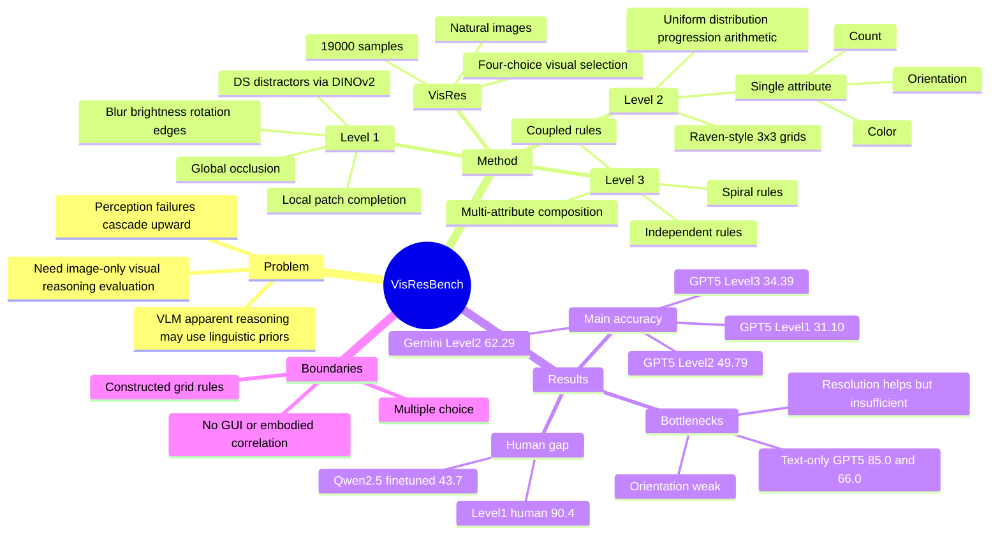

## Summary
VisRes Bench 提出一个基于自然图像的四选一 visual reasoning benchmark，用 Level 1/2/3 分别诊断 perceptual completion、single-attribute rule inference 和 multi-attribute compositional reasoning。论文的核心发现是：当前 VLMs 在去掉语言上下文捷径后，尤其在细粒度感知、orientation、multi-attribute integration 上接近随机或显著低于人类；text-only 条件下的更高成绩说明主要瓶颈在 visual-to-symbolic translation，而不只是逻辑推理能力。

## Problem & Motivation
作者要解决的问题是：VLM 在 VQA、captioning 等任务上表现强，不等于具备真正的 visual reasoning；很多 benchmark 允许模型借助语言先验、题面提示或合成图形规律，而没有隔离视觉感知和视觉关系推理本身。

论文从 perceptual grounding 到 relational / compositional reasoning 的层级出发，认为低层视觉表征失败会向上传导：如果模型不能可靠完成 occlusion completion、局部 patch matching、attribute extraction，就很难稳定做规则抽象或多属性组合推理。这个问题对 GUI agent / embodied agent 也重要，因为 agent 的屏幕或场景推理经常需要从视觉输入中抽取位置、方向、数量、结构连续性和状态变化，而不是只回答带强语言提示的 VQA。

已有工作如 CLEVR、PGM、RAVEN、MARVEL、Bongard-OpenWorld、VisuLogic、VERIFY、VISFACTOR 覆盖了部分 visual reasoning，但作者认为它们要么偏 synthetic / diagram-based，要么没有把 perceptual、single-attribute、multi-attribute 复杂度分层组织。VisRes 的动机就是用自然图像和 image-only multiple-choice 格式，减少 linguistic priors，系统定位 VLM 在视觉处理链路中的失效位置。

## Method
**Benchmark structure.** VisRes 包含 19,000 个 evaluation samples，统一为 real-world images + four-choice visual selection。Level 1 测 perceptual grounding，包括 local patch completion 和 global scene reconstruction；Level 2 有 5,956 个样本、12 个 subtasks，用 3×3 Raven-style grid 测单一属性的 rule inference；Level 3 有 2,522 个样本、6 个 subtasks，要求同时整合 color、count、orientation、object identity 等多个视觉属性。

**Level 1: perceptual completion.** Local patch completion 在主图中遮挡 80×80 px tile，让模型从 A-D 选择能恢复局部连续性的 patch。Distractor 有 Random Sampling (RS) 和 DINOv2 Similarity (DS) 两类；主文主要报告更难的 DS，因为其候选 patch 在 DINOv2 embedding 中与正确 patch 更相似。任务还加入 blur、brightness、rotation、edges、orientation 等 perturbations；global occlusion 则用方块遮挡 50% 或 80% 图像，让模型从四张完整候选图中选出原图。

**Level 2: single-attribute rule tasks.** Level 2 使用 3×3 grid，缺失位置固定在右下角，行内规则只作用于一个 target attribute：color、count 或 orientation。规则类型包括 Uniform patterns、3-different / 2-similar-1-different distribution patterns、count progression、count arithmetic、count min-max 等。其他属性自由变化，用来避免模型只靠非目标属性或模板记忆。

**Level 3: multi-attribute rule tasks.** Level 3 把缺失位置扩展到任意 grid cell，并要求同时处理多属性规则。子任务包括 Coupled Color-Orientation、Coupled Color-Count、Independent Color-Object-Orientation、Independent Count-Object-Color、Spiral Color-Orientation、Spiral Color-Count-Object。这里的难点不是单个属性识别，而是要判断属性之间是 coupled、independent 还是沿 spiral path 变化。

**Evaluation setup.** 论文评估 GPT-5、GPT-4o、Gemini-2.5、Qwen2.5-VL / Qwen3-VL、InternVL3.5、GLM-4.5V、Kimi-VL、MiMo-VL 等 VLM。所有任务都是四选一 accuracy，随机基线为 25%。主表报告 guided prompting + thinking mode；补充材料还比较 generic vs guided prompting、few-shot、thinking effort、DS vs RS difficulty，并提供多种 failure examples。

## Key Results
**VisRes main benchmark.** 在 guided prompting + thinking mode 下，Level 1 平均分整体接近随机：GPT-5 为 **31.10**，GPT-4o 为 **23.86**，Gemini-2.5 为 **33.28**，Qwen3-VL-30B 为 **31.20**，MiMo-VL-7B 为 **29.22**。Level 2 更依赖属性类型，Gemini-2.5 / GPT-5 分别达到 **62.29 / 49.79**，但 GPT-4o 只有 **24.12**；Level 3 多属性推理再次下滑，GPT-5 为 **34.39**，Gemini-2.5 为 **33.73**，Qwen3-VL-30B 为 **31.36**，GLM-4.5V 为 **22.67**。

**Attribute differences on VisRes Level 2.** Color 是最容易的属性：Uniform Color 上 GPT-5 为 **96.00**，Gemini-2.5 为 **97.00**，Qwen3-VL-30B 为 **88.00**。Orientation 明显困难：Uniform Orientation 上各模型大多在 **19-30** 区间，GPT-5 为 **22.22**，Gemini-2.5 为 **26.53**，Qwen3-VL-30B 为 **23.00**。Count 处于中间：Count Progression 上 Gemini-2.5 为 **77.00**、GPT-5 为 **50.00**，Count Arithmetic 上 Gemini-2.5 为 **75.76**、GPT-5 为 **52.00**。

**Human baseline and finetuning.** 在 Level 1 子集上，人类平均 **90.4**，其中 Location **94.1**、Global@50% **96.1**、Global@80% **98.0**；同表中 Qwen2.5-VL-3B 原始平均 **24.5**，SFT 后平均 **43.7**。这说明任务对人类是可解的，监督微调能带来 +19.2 points，但仍远低于人类。

**Text-only vs visual reasoning gap.** 将 grid 完全 verbalize 成文本后，GPT-5 在 Level 2 / Level 3 分别达到 **85.0 / 66.0**；论文对比其 visual setting 中约 **50.0 / 37.0** 的表现，认为差距主要来自视觉特征抽取和 visual-to-symbolic translation，而不是纯逻辑推理缺失。单属性识别实验也支持这个判断：GPT-5 对 color / count / orientation 的识别分别是 **97.6 / 94.2 / 49.6**，orientation 仍显著更弱。

**Resolution, thinking, prompt, and few-shot effects.** GPT-5 分辨率从 512×512 提到 2048×2048 后，Level 1 / 2 / 3 从 **45.17 / 42.83 / 31.63** 变为 **56.51 / 48.99 / 40.07**，说明 image tokens 有帮助但不能解决瓶颈。Thinking mode 对开源模型提升更明显，例如 Qwen3-VL-30B Level 2 从 **28.25** 到 **46.75**，MiMo-VL Level 2 从 **26.68** 到 **39.15**；但 Level 1 的低层感知提升有限。Guided prompting 和 few-shot 主要帮助 Level 2/3 的规则推理，不能替代细粒度视觉 grounding。

**Failure examples and MAE probe.** 补充材料展示 GPT-5 在 Location DS、Rotation DS、Global Occlusion 80%、Orientation Uniform、Count Arithmetic、Coupled Color-Count、Independent Count-Object-Color、Spiral tasks 中的失败：模型常能说出部分可见线索，却把线索放错位置、误读 orientation、用 row-sum / color warmth 等 shortcut 代替真实规则，甚至正确答案也可能来自错误 reasoning。MAE retrieval probe 在 Level 1 上仍高于随机：tile size 16 时 Location / Blur / Rotation 为 **62.6 / 59.4 / 47.8**，tile size 48 时降到 **39.4 / 37.6 / 40.1**，说明视觉 encoder 可保留部分空间信息，但大遮挡区域重建更难。

## Strengths & Weaknesses
**已知 Strengths.** 论文的 benchmark design 比较清楚：把 visual reasoning 拆成 perceptual completion、single-attribute rules、multi-attribute composition 三层，并用自然图像和 four-choice format 尽量压低语言捷径。这个层级结构让 failure localization 更具体，不只是报告“某模型 visual reasoning 分数低”，而是能指出低层感知、orientation、count arithmetic、多属性耦合、spiral tracking 等不同失败源。

**已知 Strengths.** 实验诊断维度足够丰富。主表覆盖 closed-source 和 open-source VLM；finetuning、人类 baseline、text-only verbalization、single-attribute recognition、resolution ablation、thinking mode、guided/generic prompt、few-shot、DS/RS distractor 都提供了互相校验的证据。尤其 text-only 与 visual setting 的差距，把“模型不会推理”和“模型不能从视觉中抽取可推理符号”区分开了。

**已知 Weakness / boundary.** VisRes 是 multiple-choice benchmark，不是 open-ended generation 或 closed-loop agent task；四选一设置可能低估或高估真实使用中的能力，且错误有时来自没有输出 definitive answer 或 reasoning loop 超过 context limit。Level 2/3 的 Raven-style grid 虽然使用自然图片作为 cell，但任务结构仍是人工构造的规则推理，不等价于真实 GUI/web/robot 环境中的动态状态理解。

**已知 Weakness / boundary.** 数据构造依赖 keyword metadata、Molmo count verification、GPT-5 color verification、manual orientation annotation，以及 DINOv2-selected distractors。论文报告了部分人工验证和标注，但主文没有给出完整 dataset bias、annotation disagreement、错误标签率或不同物体类别分布对模型表现的敏感性分析。

**已知 failure cases.** 最稳定的 failure 是 orientation 和空间连续性：Uniform Orientation 近随机，global occlusion 中模型会依赖粗语义相似而误判 viewpoint，local patch DS 中模型常匹配颜色/纹理却忽略精确边界和位置。Level 3 中模型经常用 shortcut 替代真实 compositional rule，例如把 Coupled Color-Count 当成 row-sum count，或在 Spiral Color-Count-Object 中绕过 spiral traversal。

**推测.** 对 GUI agent 的启发是：如果 VLM 连自然图像 patch continuity、orientation、multi-attribute rule 都不稳，那么 screen grounding 中的 icon orientation、局部遮挡、scroll position、layout continuity、multi-widget state composition 也可能存在类似 visual-to-symbolic bottleneck。但这只是从能力结构上类比，论文没有直接测试 GUI screenshot、browser task 或 OS control。

**不知道.** 论文没有报告 VisRes 分数与 GUI-agent、web-agent、robot navigation 或 embodied manipulation success 的相关性，也没有给出代码或数据发布 URL。也不知道如果模型允许使用 crop/zoom/OCR/segmentation/depth tools，VisRes 上的 failure 会有多大比例被工具补上；主实验主要评估原生 VLM perception + reasoning。

## Mind Map

## Notes
这篇最值得保留的 mental model 是：visual reasoning benchmark 应该把 perception、attribute extraction、rule abstraction、composition 分开测，否则模型失败时很难知道是“看不见”“看见但不能符号化”，还是“符号推理本身失败”。

和 GUI-agent 方向的连接点在 evaluation design，而不是直接方法迁移。可以考虑把 VisRes 的三层结构改写成 GUI benchmark：Level 1 测 screen patch continuity / occlusion / visual state matching，Level 2 测单一 UI attribute rule（selected、disabled、count、position），Level 3 测多控件状态组合和跨区域 layout rule。

引用这篇时要避免 overclaim：论文证明的是当前 VLM 在 VisRes 的 image-only naturalistic visual reasoning 上存在明显缺口；它没有证明所有 VLM agent 失败都由同一缺口导致，也没有验证 tool-augmented 或 interactive perception 能否解决这些题。
