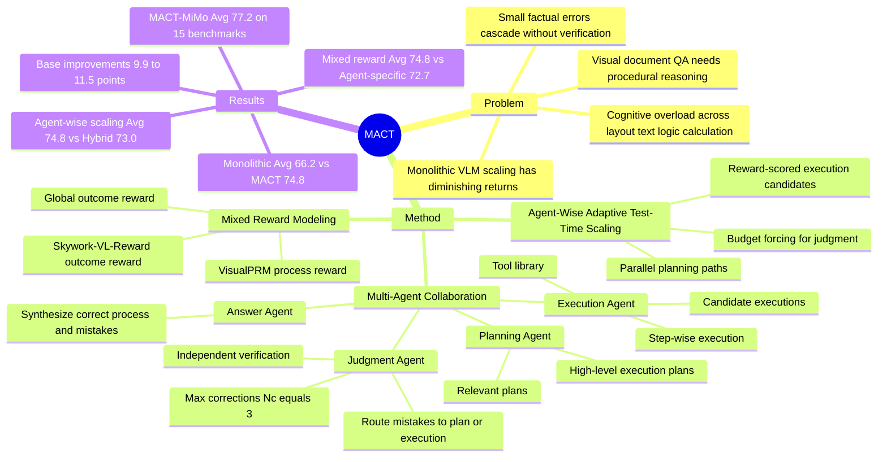

## Summary
MACT 针对 visual document understanding and reasoning 中单体 VLM 扩参收益递减的问题，把文档问答流程拆成 Planning、Execution、Judgment、Answer 四类 agents，并为不同 agent 设计 adaptive test-time scaling。论文报告三个 MACT variants 在 15 个 document / non-document benchmarks 上平均分排名前三，其中 MACT-MiMo-VL-Series-28B 达到 77.2 Avg，高于 InternVL3-78B 的 71.6 和 Gemini-2.0-Pro 的 71.3。

## Problem & Motivation
论文关注的问题是：复杂视觉文档不是一次前向推理就能稳健解决的单体感知任务，而是包含 question decomposition、strategy formation、information localization、verification 和 answer synthesis 的多步程序。作者认为现有 VLM 的 monolithic scaling 在 document VQA 上出现 diminishing returns：参数变大带来有限增益，却没有直接解决文档任务中的 procedural reasoning、cognitive overload 和 factual error propagation。

文档场景的脆弱性来自细节：段落截断、表格行错配或 chart / webpage 中的局部信息抽取错误，都可能让最终答案完全失效。单体模型缺少内部 verification / self-correction loop，早期 extraction error 会沿推理链级联。MACT 的动机就是把“扩模型参数”改成“扩过程”：按功能实体分工，并在测试时按 agent 的计算需求分配推理预算。

## Method
MACT 是一个四 agent 的 procedural framework。

**Planning Agent** 接收 question 和 visual document inputs，先生成 `Np` 个相关示例及其 plans，再基于这些 analogical plans 生成多个 high-level execution plans。它只输出步骤目标和要求，不直接执行细节，也不提前绑定具体工具，目的是避免 planning 阶段干扰 Execution Agent 的动态工具选择。

**Execution Agent** 将每个 execution plan 拆成 step-wise execution units，每个 unit 包含 definition、expected target / output、已有输入或上一步结果。它从 tool library 中选择工具执行每一步，并把全部 step outputs 和 execution processes 拼接成完整过程，交给后续 agent。

**Judgment Agent** 只负责判断，不直接修正。它检查 execution plan 和 execution process 是否有错误，输出 plan / execution mistake flags 与 mistake description，并把错误路由回 Planning Agent 或 Execution Agent。最大 correction 次数 `Nc` 设为 3，以避免无限循环；论文还指出过多 correction 会让 agent 混淆并掩盖正确答案。

**Answer Agent** 基于正确 execution process 和先前 incorrect segments 生成最终回答。作者的理由是：mistake-correction pair 本身形成了完整闭环，能帮助 answer generation 聚焦修正后的差异，减少遗漏 error-prone details。

Agent-wise adaptive test-time scaling 按 agent 功能定制预算：Planning Agent 用 `Np` 条 parallel plans 提高命中正确 reasoning path 的概率；Execution Agent 对每个 step 生成 `Ne` 个 candidate executions，并用 reward model 选择 top candidate 作为后续节点；Judgment Agent 用 budget forcing 强制最低 thinking tokens，以提高错误检测能力；Answer Agent 的 test-time scaling 被作者认为只有 marginal improvements。

训练上，MACT 使用 two-stage SFT and RL pipeline。Planning / Execution 采用 VLM，Judgment / Answer 采用 LLM；三个 variants 分别基于 Qwen2.5-VL series、MiMo-VL series、InternVL3 series。RL 阶段使用 GRPO，并做 mixed reward modeling：Planning / Execution 用 VisualPRM 产生 step-wise process rewards，Judgment / Answer 用 Skywork-VL-Reward 产生 outcome rewards，同时加入 global outcome reward 约束四个 agents 的最终路径，缓解各 agent 只优化局部目标的问题。

## Key Results
- **主结果，15 benchmarks Avg**：MACT-MiMo-VL-Series-28B 达到 **77.2**，MACT-InternVL3-Series-28B 为 **75.3**，MACT-Qwen2.5-VL-Series-24B 为 **74.8**，三者占据平均分前三。对比项中，InternVL3-78B-Instruct 为 **71.6**，Qwen2.5-VL-72B-Instruct 为 **70.5**，Gemini-2.0-Pro 为 **71.3**，Claude-3.7-Sonnet 为 **69.1**，GPT-4o-latest 为 **67.2**。
- **相对 base model 增益**：MACT-Qwen2.5-VL-Series-24B 相比 Qwen2.5-VL-7B-Instruct 的 15-benchmark Avg 从 **64.5** 提到 **74.8**，提升 **+10.3**；MACT-MiMo-VL-Series-28B 相比 MiMo-VL-7B-SFT 从 **67.3** 到 **77.2**，提升 **+9.9**；MACT-InternVL3-Series-28B 相比 InternVL3-8B-Instruct 从 **63.8** 到 **75.3**，提升 **+11.5**。
- **document benchmarks 上的代表性数字**：MACT-MiMo 在 MMLongBench-Doc / VisualMRC / InfographicVQA / ChartQA / CharXiv / TableBench 上分别为 **47.4 / 93.8 / 88.6 / 91.4 / 87.2 / 62.7**；同表中 Gemini-2.0-Pro 分别为 **32.2 / 91.4 / 81.6 / 88.8 / 83.1 / 59.9**。
- **non-document 能力未明显牺牲**：MACT-MiMo 在 ScienceQA / RealWorldQA / MathVista / MathVision / MathVerse 上为 **79.2 / 76.1 / 85.4 / 60.1 / 65.3**；对应 Gemini-2.0-Pro 为 **80.9 / 70.5 / 74.8 / 54.2 / 56.6**。
- **multi-agent collaboration ablation**：在 MACT-Qwen setting 中，完整 MACT 的 Avg 为 **74.8**；Monolithic 为 **66.2**；把四个 agent prompts 合并到单 agent workflow 的 w/o Multi-Agent Collaboration 为 **58.6**。在 MMLong / TableBench / MathVision 上，完整 MACT 为 **43.7 / 57.2 / 41.8**，Monolithic 为 **32.5 / 50.8 / 32.4**。
- **agent 组合 ablation**：仅 Aplan + Aexe 的 Avg 为 **68.4**；加入 Ajudg 后为 **73.9**；Aplan + Aexe + Aans 为 **68.8**；四 agents 完整组合为 **74.8**。这说明 Judgment Agent 是该流程中最大的边际贡献来源，Answer Agent 带来较小但正向的补充。
- **test-time scaling ablation**：No Scaling / Parallel Scaling / Sequential Scaling / Hybrid Scaling / Internal Scaling / Agent-Wise Adaptive 的 Avg 分别为 **71.1 / 72.0 / 72.4 / 73.0 / 72.3 / 74.8**。论文据此认为按 agent 功能分配 scaling strategy 优于把通用 scaling 机制直接套到整个系统。
- **reward modeling ablation**：No Reward / Agent-Specific Reward / Global Reward / Mixed Reward 的 Avg 分别为 **71.4 / 72.7 / 70.2 / 74.8**。单独 global reward 低于 no reward，而 mixed reward 最好，支持“局部 agent reward + 全局 outcome reward”需要配合使用。

## Strengths & Weaknesses
**已知：**
- 论文的核心贡献不是提出新的 document VLM backbone，而是把 document reasoning 明确建模为 procedural scaling：先分工，再按 agent 功能做 test-time scaling 和 reward modeling。
- 实验覆盖 10 个 document benchmarks 与 5 个 non-document benchmarks，包含 text、webpage、chart、table、general、mathematical 六类任务。主表同时比较 closed-source models、open-source generalists、document specialists 和三个 base-model families。
- Ablation 信息比较完整：分别拆了 multi-agent collaboration、agent-wise adaptive scaling、mixed reward modeling、agent 组合、scaling strategy、reward strategy 和 correction 次数。
- Judgment Agent 的独立化设计有清晰动机：生成者自己纠错容易有 cognitive blind spots；让另一个 agent 同时 judgment + correction 又会让 reward objective 变成“通过检查”，可能产生含糊或省略细节的 superficially correct corrections。

**推测：**
- 对 GUI / web agent 的启发在于：复杂视觉任务中的错误常常来自流程中间步骤，而不只是最终 answer model 不够强。MACT 的 independent judge + route-back correction 可能可迁移到 GUI trajectory review，例如把错误定位到 plan-level 或 execution-level action，但论文没有在 GUI 或 computer-use benchmark 上验证。
- MACT 的强结果可能部分来自更高 test-time compute 和多模型协作带来的 search expansion，而不仅是 agent role decomposition 本身。论文比较了不同 scaling strategies，但没有给出 token、latency、cost-normalized leaderboard，因此无法判断同等预算下 MACT 相对大型单体模型的效率优势有多大。
- Evaluation 依赖 GPT-4o judge 覆盖多数 benchmark，训练 Judgement Agent 时也使用 GPT-4o labels 和 rule-based verification。这个设置可能引入 judge-model bias；论文没有报告 human evaluation 或替换 judge 后的鲁棒性。

**不知道 / 未报告：**
- 论文首页和正文未给出 arXiv id、DOI、code link。
- 正文多次把 tool library、prompt、dataset、evaluation metric 细节指向 Appendix 7 / 8；仅从正文无法完整复现工具集合、prompt 模板和数据配比。
- 论文没有系统列出 MACT 的失败案例类型，例如 Judgment Agent 误判、过度 correction、reward model 误打分、不同 agents 输出冲突时的具体错误分布。
- 论文没有报告推理成本、平均 correction 次数的完整分布、不同 `Np` / `Ne` 设置下的绝对计算开销，也没有报告在真实多页 PDF、企业报表或网页操作环境中的 end-to-end latency。

## Mind Map

## Notes
这篇论文把 document understanding 的问题 formulation 讲得比较清楚：不是“文档太长所以需要更大模型”，而是“文档问答的关键路径天然是多步流程，错误需要在中间被发现并路由回去”。这个 formulation 比单纯强调更高分辨率、更长 context 或更大 OCR-free VLM 更接近 GUI-agent 里的真实 failure mode：一次错误点击、错读 UI label、或把相邻元素配错，都会让后续动作链失效。

一个需要谨慎对待的点是，MACT 的实验说服力主要来自 benchmark accuracy 和 ablations，但还没有把 test-time compute 作为一等指标。若把它作为 GUI / web agent 设计参考，下一步应该优先问：独立 verifier 是在真正检查 visual grounding，还是在做 language-level plausibility 判断；route-back correction 是减少错误，还是只是增加更多尝试后由 reward / judge 选中正确路径。
