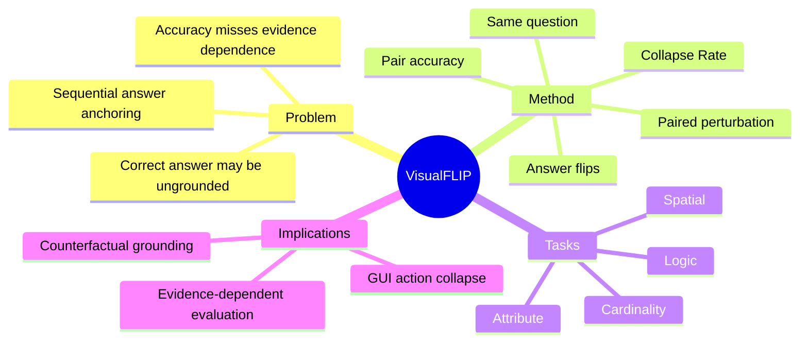

## Summary

> [未获取全文，仅基于 arXiv abstract 与项目页]

VisualFLIP 追问一个比 accuracy 更尖锐的问题：当 MLLM 答对视觉推理题时，它的答案是否真的依赖 task-critical visual evidence？它构造 1,374 组 same-question perturbation pairs，保持问题不变、最小改变关键视觉证据，使正确答案 deterministically flips，并用 pair accuracy 与 Collapse Rate 测模型是否随证据改变而更新答案。

## Problem & Motivation

> [未获取全文，仅基于 arXiv abstract 与项目页]

多模态评测常用 single-image accuracy，但正确答案并不保证模型真的看到了关键证据。模型可能靠语言先验、数据偏差或局部猜测答对；一旦图像证据被最小修改，模型仍可能复读之前的答案。

VisualFLIP 的 motivation 是把“答对了吗”改成“答案是否受关键证据控制”。这对 GUI grounding 也很重要：agent 可能点击正确位置，但不一定真的理解目标元素，遇到相似 distractor 或 UI 改版就崩。

## Method

> [未获取全文，仅基于 arXiv abstract 与项目页]

VisualFLIP 构造 paired benchmark：

- 同一问题配两张图；
- 两张图只在 task-critical visual evidence 上做最小 perturbation；
- gold answer 必须 deterministic flip；
- 覆盖 cardinality、attribute、spatial、logic tasks。

评估指标有两个：

- **Pair accuracy**：两侧都答对才算正确，避免单侧猜中。
- **Collapse Rate (CR)**：当模型至少答对一侧时，是否在两张图上重复同一个非空答案。

作者还关注 sequential setting：如果 edited image 出现在 earlier answer 之后，某些模型 collapse 更严重，说明模型会被自己前序回答锚定。

## Key Results

> [未获取全文，仅基于 arXiv abstract 与项目页]

- 数据集包含 1,374 images arranged as same-question perturbation pairs。
- 评估 24 个 MLLMs。
- Pair accuracy 与 evidence dependence 相关但不同：capable models 仍会在关键视觉变化后不更新答案。
- Sequential setting 下，edited image follow earlier answer 时，部分模型 collapse 更严重。

abstract 未提供各模型具体排名和数值，因此这里不补造 leaderboards。

## Strengths & Weaknesses

**Strengths**:

- **评估 formulation 很好**：paired flip 比单点 accuracy 更能检测 grounding dependence。
- **指标可迁移**：Collapse Rate 可迁移到 GUI grounding、document QA、spatial reasoning 等场景。
- **揭示 sequential bias**：多轮 agent 场景中，前一轮答案会影响后一轮视觉判断，这是 GUI agent 真实 failure mode。

**Weaknesses**:

- **构造成本较高**：需要保证 perturbation minimal 且 gold answer deterministic flip。
- **不直接测 action**：对 GUI agent 来说，还需要从 answer collapse 扩展到 click/action collapse。
- **领域覆盖未知**：abstract 中任务类型偏视觉推理，不确定是否包含文本密集 GUI 或真实 screen。

**Impact**:

VisualFLIP 支持一个研究判断：GUI/VLM evaluation 应从 “static correctness” 转向 “counterfactual evidence dependence”。这对 grounding robustness 比单纯提高 ScreenSpot accuracy 更有 insight。

## Mind Map

## Notes

- 对 [[Ideas/ScaleInvariant-Grounding-GUI]] 的补充：除了跨分辨率一致性，还应测 counterfactual UI evidence dependence，例如同一 instruction 下交换 icon、text、position 后模型是否更新 click。
- 可作为新 idea 的核心 metric：Action Collapse Rate。
