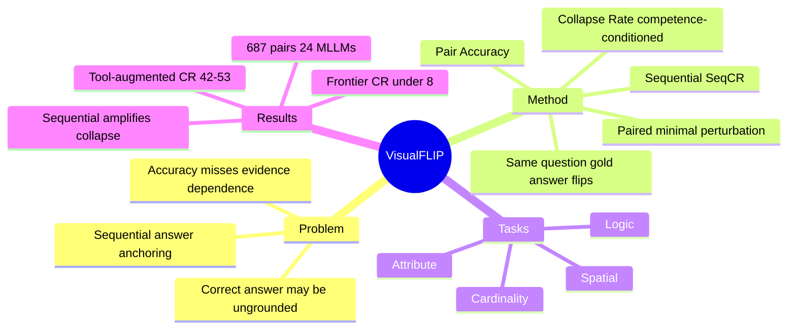

## Summary

VisualFLIP 追问比 accuracy 更尖锐的问题：MLLM 答对视觉推理题时，预测是否真的依赖 task-critical visual evidence？它构造 687 组 same-question perturbation pairs（共 1,374 张图），保持问题不变、最小修改关键视觉证据使 gold answer 确定性翻转，用 Pair Accuracy 和 Collapse Rate 测模型是否随证据更新答案，并发现即使 frontier 模型也会在关键视觉变化后复读旧答案。

## Problem & Motivation

主流多模态评测用 single-image accuracy，但"答对"并不保证模型真的看到了关键证据——模型可能靠 language priors、数据偏差或 memorization 答对。作者明确指出："a correct answer, even with an apparently detailed reasoning process, does not tell us whether the prediction is supported by the task-critical visual evidence." 即便有看似详细的 reasoning trace，也无法证明结论由视觉证据驱动。

VisualFLIP 把评测目标从"答对了吗"改成"答案是否受关键证据控制"：如果视觉证据确定性地改变了正确答案，模型的预测是否也随之改变？这是一个 behavioral / counterfactual 视角，对 GUI grounding 同样重要——agent 可能点对位置但并不真正理解目标元素，遇到 distractor 或 UI 改版就崩。

## Method

**Paired perturbation 构造（四类）**：每对图只在 task-critical evidence 上做 minimal pixel-space 编辑，使 gold answer 确定性翻转（yo ≠ ye）：
- **Cardinality Shift**：改变物体计数，保留推理模板。
- **Attribute Mutation**：改变可见属性（颜色、数值、标签），保持周围 context 不变。
- **Spatial Transformation**：移动或重定向承载答案的物体。
- **Logic Re-mapping**：改变可见规则/对应关系（如镜像轴）。

**数据构造四步**：(1) Identify Evidence——合成对用 13 个程序化模板的 symbolic state，真实图对用 KL-based masking 筛选视觉必要性并标注相关物体；(2) Plan Edit——选一类 perturbation，只改一个 load-bearing premise，question 固定；(3) Realize Image Pair——合成对从 symbolic state 渲染，真实图对做局部编辑；(4) Verify——人工确认 question 固定、answer 确定翻转、无其他承载变化，剔除 artifact 与 ceiling 样本。

**两个核心指标**：
- **Pair Accuracy (Acc_p)**：两侧都答对才算正确，避免单侧猜中。
- **Collapse Rate (CR)**：在模型至少答对一侧（competent）的条件下，是否对两张图重复同一个非空答案。CR 对称（交换图标签不变），条件于 competence 而非原图正确性。

**Sequential setting (SeqCR)**：模型先答原图，再在同一对话中收到 perturbed image（同一问题），测原答案是否在 gold answer 翻转后仍然 persist——揭示模型被自己前序回答锚定。

## Key Results

- **数据集**：687 image pairs（1,374 张图）= 515 合成对（13 个 task templates）+ 172 真实图对（来自 MathVision），覆盖四类 perturbation、九种 task type。评估 **24 个 MLLM**（7 开源 + 5 tool-augmented 开源 + 12 闭源）。
- **顶部模型（Pair Acc | CR）**：Gemini 3.5 Flash 81.2% | 7.3%；Qwen3.6-Plus 80.2% | 6.8%；GPT-5.5 78.6% | 5.8%。frontier 模型可把 collapse 压到 <8%。
- **Tool-augmented 7B 模型反而最差**：~7–10% pair accuracy，42–53% CR——显式 pixel-level 操作并不自动转化为答案更新。
- **高 accuracy 不等于 evidence dependence**：GPT-5-mini 45.3% accuracy 但 27.6% CR，Grok 4.3 52.5% | 18.4%；Pair Accuracy 与 competence-conditioned CR 在模型间独立变化。
- **Sequential 放大 collapse**：Qwen3.6-Plus SeqCR 从 6.8%（independent）升到 39.2%（sequential）；Gemini 3.1 Pro 几乎不变（+1.3）。
- **Locality control（Table 3）**：task-critical perturbation 引起答案改变约 76–96%，而 answer-irrelevant 编辑仅 2–40%，证明 CR 确实针对决定性证据。
- **Salience 效应**：perturbed evidence 越显著，collapse 越低；pathfinding/connectivity 任务 CR 比 arithmetic 高 30+ 点。
- 探索性 mitigation：Grounded Masking RL (GMRL)，用 masked/unmasked 分布的 KL 作为 reward 鼓励视觉必要性敏感（附录，初步结果）。

## Strengths & Weaknesses

**Strengths**：
- **评估 formulation 很好**：paired flip + competence-conditioned CR 比单点 accuracy 更能 isolate grounding dependence，且 locality control 实验（76–96% vs 2–40%）有力证明指标针对的是决定性证据。
- **指标可迁移**：Collapse Rate 可迁移到 GUI grounding、document QA、spatial reasoning。
- **揭示 sequential bias**：多轮 agent 场景中前序答案锚定后续视觉判断（SeqCR 6.8→39.2），这是 GUI agent 真实 failure mode。
- **反直觉发现有价值**：tool-augmented 模型 CR 反而更高，挑战"加 pixel 操作就更 grounded"的假设。

**Weaknesses**：
- **构造成本高**：保证 minimal perturbation 且 gold answer deterministic flip 依赖大量人工 verify，难规模化。
- **诊断而非机理**：作者自承这是 behavioral diagnostic，无法 isolate language priors vs perception vs memorization。
- **不直接测 action**：对 GUI agent 还需从 answer collapse 扩展到 click/action collapse。
- **真实图覆盖有限**：172 真实图对来自 MathVision，部分 task type 的 denominator 偏小；SeqCR 用了不同分母。

**Impact**：支持一个研究判断——GUI/VLM evaluation 应从 static correctness 转向 counterfactual evidence dependence。这对 grounding robustness 比单纯提高 ScreenSpot accuracy 更有 insight。

## Mind Map

## Notes

- 对 [[Ideas/ScaleInvariant-Grounding-GUI]] 的补充：除跨分辨率一致性外，还应测 counterfactual UI evidence dependence——同一 instruction 下交换 icon/text/position 后模型是否更新 click。
- 可作为新 idea 的核心 metric：**Action Collapse Rate**——agent 在 UI 关键变化后是否仍重复旧 action，直接对应 VisualFLIP 的 sequential collapse。
- tool-augmented 模型 CR 反而最高，是对 Think-with-Images / pixel-operation 范式的一个警示数据点，可与 [[Papers/Archive/2604-AdaptiveGrounding]] 的 over-trust 现象对照。
