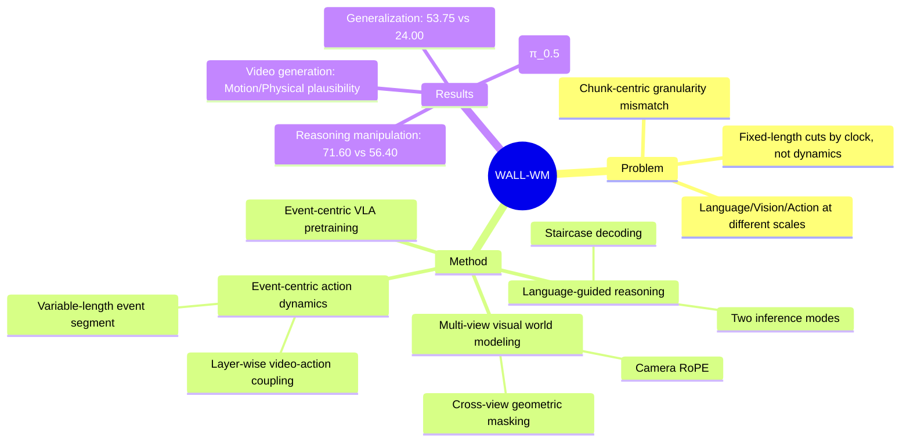

## Summary

WALL-WM 提出"Event-centric"作为 World Action Model 的原子学习单元，解决现有 VLA 方法中固定长度 chunk 与语言/视觉/动作三者粒度不匹配的根本问题。通过 event-grounded pretraining 和 Staircase Decoding，支持 variable-length 和 fixed-length 两种推理模式，在真实机器人多场景 manipulation 任务上超越 π_0.5、DreamZero 等基线。

## Problem & Motivation

现有 VLA/WAM 方法普遍从多模态或视频基础模型初始化，然后用固定长度 action chunk 进行优化。这种"chunk-centric" formulation 存在根本粒度不匹配问题：
- **语言**描述语义目标和事件（宏观尺度）
- **视觉**通过连续场景动态演化（中观尺度）
- **动作**在控制级时标上运行（微观尺度）

把三者强行塞进同一个固定长度预测窗口，让 VLA training 变成短视的相关性拟合。论文核心论点：**Fixed chunks cut by clock; semantic events cut by embodied dynamics.**

视频是语言和动作之间的天然桥梁：既有足够的语义结构（可与语言在 event boundary 对齐），又有足够的时序密度（暴露 timing、transition、state change）。但简单接一个 action decoder 并不解决"在哪里让 prior 变成 executable"的问题。

## Method

### 3.1 Architecture Overview

**Dual-Tower Design**：
- Video Tower：继承 Wan 视频生成模型，在 pixel-space 做 flow-matching
- Action Tower：layer-wise coupling，共享 latent space 但独立 action token sequence

### 3.2 Multi-View Visual World Events Modeling

- **Camera RoPE**：扩展 RoPE 到 multi-view token，编码相机相对位置
- **Cross-View Geometric Masking**：根据几何可见性约束 attention mask，避免 attention 跨越"物理上不可见"的像素
- **Video Flow-Matching Objective**：用 flow-matching 训练 video denoiser，保持 Wan 的生成能力

### 3.3 Event-Centric Action Dynamics Modeling

- **Action Transformer**：独立 transformer tower，layer-wise coupling 与 video tower
- **Video-Action Temporal Alignment**：关键设计——action timestep 不直接对应 video frame，而是映射到 event segment。每个 event 包含 variable-length action sequence
- **Action Objective**：action denoising 以 video latent 和 event description 为条件

### 3.4 Language-Guided Reasoning (Staircase Decoding)

- **Staircase Latent Reasoning**：跨 staggered layer depths relay intermediate hidden states，产生 parallel continuous CoT latents
- **Two Inference Modes**：
  - Event Mode：VLM/人/agent 提出下一个 event description，WALL-WM 执行对应 variable-length video-action segment
  - Unified Mode：用 VLM + Staircase Decoding，一次 parallel pass emit K_c 个 latent CoT states，支持固定长度 chunk 推理

### Training Pipeline

1. Video Pretraining（frozen T5 features）
2. Action Pretraining（video frozen，action tower 训练）
3. VLM Text-Conditioner Pretraining
4. Staircase Distillation
5. Optional Next-Chunk Adaptation

### Data Ecosystem

- **Data-Source Map**：General internet video（1.2M OpenVID），egocentric video（Ego4D、EPIC-KITCHENS），non-embodiment UMI，robot teleoperation（DROID、AgiBot World、self-collected）
- **Hierarchical Captioning**：Task / Subtask / Action / Segment 四级标注
- **Cluster-Balanced Sampling**：joint V-L clustering + action clustering，平衡数据分布
- **Recovery Augmentation**：contact-rich 区域的 failure recovery 数据

## Key Results

### Video Generation Evaluation（Table 2）

在 Motion Quality、Semantic Consistency、Physical Plausibility 等 embodied-relevant 指标上超越 Wan2.1/Wan2.2，表明 embodied training 把视频 prior 转化成更强的物理 prior。

### Real-Robot Evaluation

**Diverse Manipulation**：
- Event-mode WALL-WM：75.86 Task Progress
- WALL-WM-U-Scratch：63.00
- π_0.5：55.64
- DreamZero：39.97
- LingBot-VA：29.71

**Reasoning Manipulation**：
- Event-mode WALL-WM：71.60
- WALL-WM-U-Scratch：59.50
- π_0.5：56.40
- DreamZero：32.70

**Generalization**（多对象场景、随机指令）：
- Event-mode WALL-WM：53.75
- DreamZero：28.50
- π_0.5：24.00
- WALL-WM-U-Scratch：18.50

**Ablation**（Table 4）：
- 去掉 VI-SA + Event-conditioned execution 后，Reasoning Manipulation 从 84→55（Sort Headphone），Generalization 从 70→30（Place Plates）

## Strengths & Weaknesses

### Strengths

1. **问题定位精准**："granularity mismatch" 是现有 VLA 方法的一个根本性 design flaw，论文从 first principles 分析而非简单堆模块
2. **Event-centric 概念简洁有力**：用 semantic event 作为 atomic unit，避免了 chunk 长度的 arbitrary choice
3. **Dual inference modes 设计巧妙**：同一 backbone 支持 variable-length 和 fixed-length，兼顾灵活性和实用性
4. **实验扎实**：四个真实机器人平台（QUANTA X1/X1 Pro/X2 + desktop bimanual），任务覆盖 diverse/reasoning/dexterous/generalization

### Weaknesses

1. **31 人作者列表可疑**：这种"team paper"通常意味着公司内部工程成果而非深度研究，论文更像 technical report 而非学术 paper
2. **Event definition 依赖外部 VLM**：Event mode 需要一个 fine-tuned Qwen3.5-VL-9B 来生成 next-event description，这引入了额外系统复杂度和潜在 error cascade
3. **数据细节模糊**：论文声称"large-scale"但具体 video-action pair 数量、标注成本、self-collected data 规模均未明确披露
4. **Unified mode 的必要性存疑**：如果 event mode 是"正确"的设计，为何还需要 unified mode 来兼容 fixed-chunk？是否是为了对接现有 benchmark 格式而妥协？
5. **Baseline 选择有限**：主要对比 π_0.5、DreamZero、LingBot-VA，但缺少 OpenVLA、RT-X 等更成熟的 VLA baseline

## Mind Map

## Notes

- 论文来自 X Square Robot Team，似乎是国内机器人公司（QUANTA 系列平台）
- Event-centric idea 与"Planning as inference"有相通之处：把 execution granularity 交给 semantic structure 决定
- Staircase decoding 的"parallel CoT latent"设计值得深挖：是否真的在做 reasoning，还是只是一个 conditioned noise path？
- 与 Pi-0、DreamZero 等 diffusion-based VLA 相比，WALL-WM 的核心差异在于"在哪里切分"，而非"用什么生成方法"
- 有意思的问题：如果不用 VLM generate event description，能否从视觉/动作信号直接 detect event boundary？