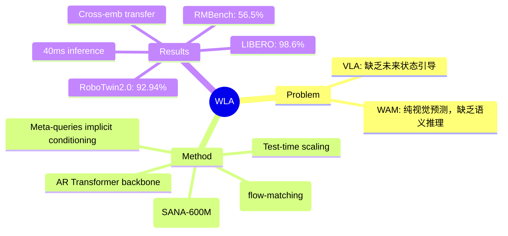

## Summary
WLA 提出了一种新的 embodied foundation model 范式，用 AR Transformer 统一 world modeling、language reasoning 和 action synthesis，将 WAM 的世界建模能力与 VLA 的语言推理能力结合，实现了高效的长程任务控制。

## Problem & Motivation
现有 WAM（World-Action Model）用 bidirectional DiT 预测纯视觉状态，被低级细节拖累，缺乏语义推理和泛化能力；而 VLA 缺乏对未来状态的预测引导。作者的核心 insight：next state 应包含高层 textual intention + 低层 physical dynamics，前者提供 compact、generalizable 的抽象表示，后者连接 intention 与 motion control。

## Method
WLA 采用三个组件：
1. **AR Transformer backbone**：基于 RynnBrain-2B（VLM），预测 textual subtask + physical dynamics（latent action），与 WAM 的 bidirectional DiT 形成鲜明对比
2. **World Expert**：轻量级 diffusion Transformer（SANA-600M），以 physical dynamics 为条件预测未来视觉帧，world modeling loss 监督 backbone 学到有效的 latent action
3. **Action Expert**：flow-matching head（390M），以 meta-queries 的输出为条件生成 action chunk

关键设计：
- **Meta-queries**（64个）：使 world prediction 通过 implicit parameter update 影响 action generation，推理时可禁用 World Expert 实现实时控制
- **Textual intention learning**：从 instruction 分解的 subtask 序列，配合 memory buffer 支持长程任务
- **Test-time scaling**：激活 World Expert，采样多个 action candidates，选择预测 value 最高的执行

## Key Results
**Simulation Benchmarks:**
- RoboTwin 2.0 Clean: **92.94%** success rate（bimanual manipulation，50 tasks）
- LIBERO: **98.6%** average success（四套 suite），test-time scaling 后达 **98.9%**
- RMBench: **56.5%** success rate，接近翻倍最佳 baseline（Mem-0 28.5%，pi_0.5 17.3%）

**Real-World:**
- Stack Cup 任务完成时间比 baseline WAM 减半
- 在动态 OOD 设置下表现稳健，Dispose Trash 任务成功率最高

**Cross-Embodiment Transfer:**
- 从 human egocentric videos 学习 unseen tasks，无需 action annotation，成功率接近 same-embodiment video

**Efficiency:**
- 2B active parameters（总 3.4B），RTX 5090 上 40ms inference latency
- 无 embodied pretraining，30k steps 即达到强性能

## Strengths & Weaknesses
**Strengths:**
- 方法简洁优雅：用 AR Transformer 统一文本和物理动态预测，避免了 WAM 的 bidirectional DiT 复杂性
- 实验全面：覆盖 simulation（RoboTwin/LIBERO/RMBench）+ real-world + cross-embodiment transfer
- RMBench 结果亮眼：56.5% vs 28.5%，证明 language-level subtask tracking 的价值
- 推理高效：World Expert 可禁用，40ms latency 支持实时控制
- 无需 embodied pretraining，训练效率高（30k steps）

**Weaknesses:**
- World Expert 用静态帧而非视频片段，可能丢失时序动态信息（作者自称简化，但可能是 tradeoff）
- ablation 显示去掉 subtask loss 从 56.5% 掉到 17.25%，说明依赖 subtask supervision——如果 task decomposition 不准确怎么办？
- 2B 参数虽小，但 comparison 中 pi_0.5（3B）有 embodied pretraining，公平性存疑
- cross-embodiment 结果虽 promising，但样本量有限（100 videos per task），泛化能力待更严格验证

## Mind Map

## Notes
- 与 Ye et al. 的 WAM（World Action Models are Zero-shot Policies）直接对比，但 WLA 用 AR 而非 bidirectional DiT——这是核心 architectural difference
- subtask decomposition 的自动化程度如何？是否依赖 LLM 或人工标注？
- meta-queries 机制类似 Perceiver IO / DINOv2 的 register tokens，但用于 cross-modal conditioning
- RMBench 的 memory-dependent setting 很有意思，考验 agent 的 trial-and-error recovery 和 long-term memory 能力