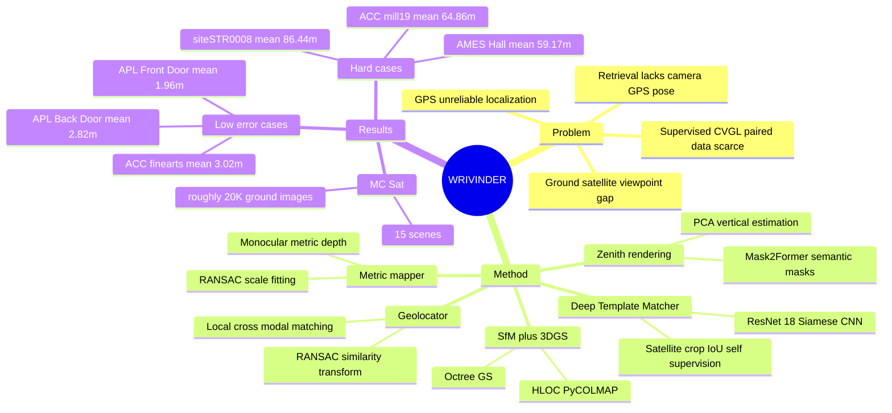

## Summary
WRIVINDER 解决 ground-level images 与 geo-registered satellite maps 在大视角差、尺度差和 GPS 不可靠场景下难以对齐的问题：它把多张地面图像先重建为 3D scene，再生成 zenith-view 3DGS rendering 去和 satellite tile 做几何对齐。论文同时提出 MC-Sat dataset，把 multi-view ground imagery、SfM/3DGS reconstructions 和 satellite imagery 组织成可度量的 zero-shot ground-to-satellite localization benchmark。实验显示该路线在若干 compact 或 dense scenes 上能达到低米级误差，但在 large reconstructed areas 和重建缺口明显的场景上误差会升到 50m 以上。

## Problem & Motivation
Cross-view geo-localization 的核心困难是 ground view 与 satellite view 之间存在极大的 altitude、orientation、occlusion 和 appearance gap；同一地点从地面和 overhead view 看起来可能几乎不是同一个视觉域。现有 CVGL 方法大多把问题做成 supervised retrieval：给 ground image，在 CVUSA、CVACT 这类 road-centric benchmark 上检索最相似的 satellite crop；这种范式需要大量 paired geo-aligned data，且输出通常是 nearest-neighbor tile，而不是 physically meaningful camera pose 或 GPS coordinate。

WRIVINDER 的问题设定更接近 embodied / navigation 场景：输入是 unordered ground images 和对应 geo-registered satellite view，目标是在 fully zero-shot setting 下恢复所有 ground cameras 的 GPS locations。作者的关键判断是，ground-to-satellite alignment 不应只依赖 2D learned similarity，而应利用多视角 ground images 中可恢复的 3D geometry、semantic ground-plane cues 和 metric scale，把地面观测变成可与 satellite context 直接比较的 top-down representation。

## Method
WRIVINDER 是一个 geometry-driven、training-free 的 pipeline，主线是从 ground images 构建可度量的 zenith-view template，再把 template 对齐到 satellite image。

第一步是 3D reconstruction。论文使用 HLOC + PyCOLMAP 作为 SfM backend，并用 NetVLAD 与 EigenPlaces 初始化 scene graph 后做 geometric verification；SfM 输出 camera intrinsics/extrinsics 和 sparse point cloud。随后用 Octree-GS 构建 3D Gaussian Splatting representation，使 sparse SfM geometry 变成 dense、photorealistic、可从 zenith viewpoint rendering 的场景表示。

第二步是 zenith rendering。作者用 Mask2Former + BEiTv2 Adapter backbone，对输入图像做 semantic segmentation，并把 pixel-level labels 传播到 triangulated SfM points。ground-relevant classes 包括 road、sidewalk、grass、dirt、gravel、pavement、ground-other、sand、playingfield，以及若干 floor-like materials。基于语义 ground points 和 camera centers，系统估计 ground plane / vertical axis；再用 PCA 中最大方差方向作为 in-plane axis，构造 top-down virtual camera，生成和 SfM/3DGS 共享坐标系的 zenith render。

第三步是 metric mapper。SfM 本身只有相对尺度，WRIVINDER 使用 DepthPro 或 PatchFusion 这类 monocular metric depth model，将 SfM depths 与 predicted metric depths 做 least-squares scale fitting，并用 RANSAC 抑制 outliers。得到全局 scale 后，系统把 3D points 投影到 zenith coordinate frame，估计 reconstructed footprint 的 physical width / height，再用 satellite ground sampling distance 转换成 expected pixel dimensions，从而约束后续 satellite search window。

第四步是 Deep Template Matcher (DTM)。论文说明 RoMA 和 MatchAnything-LoFTR/RoMA 这类 off-the-shelf cross-view / cross-modal matchers 在该设定下没有产生 reliable correspondences，因此作者采用 test-time self-supervised DTM：一个 ResNet-18 Siamese CNN，从 satellite image 内采样与 zenith footprint 同尺寸的 crop pairs，用真实 IoU 监督网络预测 crop pair 的 overlap。为了模拟 3DGS render 的外观，训练对其中一个 crop 加 Gaussian blur 和 localized intensity perturbations。推理时，3DGS zenith crop 与 satellite search window 内候选 crop 逐一打分，similarity heatmap 的峰值即为 zenith-satellite alignment。

最后是 geolocation。系统在 DTM 定位出的局部 satellite patch 内，用 MatchAnything-RoMA 等 cross-modal point matcher 匹配 satellite patch 和 3DGS zenith render；这些 correspondences 给 3DGS render pixels 赋予 latitude/longitude，再通过 3DGS points 和 SfM points 的共享坐标系传播到 SfM reconstruction。最终用 RANSAC-based similarity transform 把 SfM reconstruction 对齐到 world coordinates，输出所有 ground cameras 的 GPS estimates。

MC-Sat 是论文的另一个贡献。它整合 ULTRAA、VisymScenes、ACC-NVS 和 JHU-Ames 的 multi-view ground / airborne imagery，并配对 NAIP 或 ESRI World Imagery satellite tiles。论文称 released MC-Sat subset 包含 15 个 multi-view scenes、约 20K ground images，分为 Image Density scenes 和 Reconstructed Area scenes，用于评估 dense local layouts 与 larger spatial extents 下的 zero-shot localization。

## Key Results
MC-Sat dataset composition：原始来源包括 ULTRAA 3 scenes / 1,028 images、VisymScenes 149 sites / 258K images、ACC-NVS1 6 scenes / 148K images、JHU-Ames 1 scene / 1,717 images；最终 MC-Sat released subset 是 15 scenes、roughly 20K ground images，并配对 NAIP 或 ESRI satellite imagery。NAIP imagery 的分辨率为 0.6-1.0 m/pixel。

MC-Sat quantitative results：Table 2 覆盖 15 个 scenes，报告 image count、run time、World2Model RMSE、67th percentile Geolocation RMSE、mean Geolocation RMSE 和 centroid error。低误差场景包括 APL Front Door（ULTRAA / NAIP / Image Density，100 images，run time 228 min，World2Model RMSE 0.96，67th percentile geolocation RMSE 1.86m，mean geolocation RMSE 1.96m，centroid error 0.86m）、APL Back Door（2.56m / 2.82m / 0.76m）和 siteACC0003-finearts Top Right（ACC-NVS / ESRI / Image Density，277 images，run time 425 min，World2Model RMSE 4.66，2.86m / 3.02m / 2.16m）。

Reconstructed Area scenes 中也有 sub-20m examples：MUTC A09 为 18.33m 67th percentile / 18.86m mean / 17.34m centroid，MUTC A10 为 17.59m / 17.82m / 16.96m，siteSTR0003 为 15.22m / 17.67m / 11.56m，siteSTR0098 为 16.55m / 18.32m / 6.24m，siteSTR0058 为 11.23m / 11.88m / 10.55m。与此同时，Table 2 明确显示不是所有场景都 sub-30m：siteSTR0001 mean geolocation RMSE 57.22m，siteSTR0008 86.44m，AMES Hall 59.17m，siteACC0004-mill19 Right Side 64.86m，siteACC0153-rec-center Front Door 59.15m，siteSTR0059 32.13m，siteSTR0007 33.12m。

Runtime and reconstruction stability：run time 从 APL Front Door 的 228 min 到 siteSTR0003 的 2170 min，论文指出 run time roughly linearly scales with number of input images，且 SfM stage dominates computational cost。World2Model RMSE 在 APL Front Door / Back Door / siteSTR0059 / siteACC0004 / siteACC0153 等场景低于约 1.3，但 siteSTR0001、siteSTR0003、siteSTR0008、siteSTR0098 的 World2Model RMSE 为 NaN；论文定义中，如果少于 67% images register into dominant SfM cluster，则该指标记为 NaN。

Failure-case evidence：论文的 Fig. 5 和讨论指出，large Reconstructed Area scenes 中很多 rooftops 和 elevated structures 从 ground view 完全不可见，导致 zenith render 有 gaps、blurring 和 missing structures，template matching 更难、geolocation error 更高。作者还明确说多个组件，尤其 SfM，使用 RANSAC-based procedures，因此输出存在 variability。

## Strengths & Weaknesses
**已知强点**：WRIVINDER 把 CVGL 从 supervised retrieval 推向 geometry-centered camera geo-localization，输出是 metrically meaningful GPS estimates，而不是只返回相似 satellite crop。这个 formulation 对 autonomous navigation、GPS-denied localization、mapping 和 situational awareness 更贴近实际问题，也和 embodied spatial intelligence 的需求一致。

**已知强点**：方法设计的角色分工清楚：SfM/3DGS 负责多视角 3D aggregation，semantic segmentation 负责 ground-plane / vertical estimation，monocular metric depth 负责尺度恢复，DTM 负责 test-time self-supervised cross-view localization。这个 pipeline 没有依赖 ground-satellite paired training data，因此它的价值不在 SOTA retrieval 分数，而在建立一个可解释、可度量的 zero-shot baseline。

**已知弱项 / limitations**：Table 2 的结果高度不均匀，低米级定位只出现在部分 compact / dense scenes；多个场景 mean geolocation RMSE 超过 50m，最高 siteSTR0008 为 86.44m。论文自己的解释是 unobserved rooftops/elevated structures 会造成 zenith render gaps，从而降低 alignment reliability；这说明方法依赖 ground images 对 overhead-visible structures 的覆盖，也依赖 SfM reconstruction stability。

**已知评估边界**：论文没有给出系统性的 quantitative ablation table，也没有在 MC-Sat 上报告与 supervised CVGL retrieval baselines、classical sparse point-cloud alignment 或 off-the-shelf matcher variants 的完整数值对比。正文只说明 RoMA 和 MatchAnything-LoFTR/RoMA 在该设定下不可靠，但没有给出对应失败率或误差表。因此，不能把 WRIVINDER 的结果解读为已经严格战胜所有替代方法；更准确的说法是它建立了 MC-Sat 上第一个 geometry-driven zero-shot baseline。

**推测**：DTM 的 self-supervised satellite crop IoU training 可能是整条 pipeline 中最 pragmatic 的折中：它避免 ground-satellite paired supervision，但仍从当前 satellite image 中学习局部相似性函数。不过论文没有单独 ablate DTM、metric scale estimation、semantic ground-plane fitting 或 3DGS vs sparse SfM，因此各组件的因果贡献尚不清楚。

**不知道**：论文没有提供 code URL，只说 MC-Sat dataset and Wrivinder codebase will be publicly released；也没有说明不同 satellite resolutions、monocular depth model choice、semantic segmentation errors、camera count / coverage density 对误差的敏感性。对于真实 online navigation，论文也未评估 incremental updates、dynamic objects、active viewpoint selection 或闭环定位控制。

## Mind Map

## Notes
这篇值得放进 spatial intelligence / embodied navigation 的阅读线，而不是传统 VLM benchmark 线。它的 insight 是：当 view gap 大到 2D feature matching 不稳定时，最自然的 bridge 可能不是更强的 image encoder，而是先把 ground observations 聚合成可解释的 3D + top-down representation，再和 map 对齐。

对 GUI-agent 的间接启发是，screen / web / mobile 场景中也存在 "egocentric viewport" 到 "global layout/map" 的对齐问题；WRIVINDER 的可迁移部分不是 satellite domain 本身，而是 multi-observation aggregation -> canonical view rendering -> metric/template alignment 这个 decomposition。这里仍只是类比，论文没有评估 GUI、web 或 mobile agent。

后续要追的问题：第一，能否给 DTM、metric mapper、semantic ground-plane fitting、3DGS rendering 各自做 ablation，确认误差主要来自哪里；第二，能否用 semantic Gaussians 或 object-level landmarks 减少 rooftops / unseen structures 带来的 zenith render gap；第三，能否把 active perception 加进来，让 agent 主动拍摄能改善 overhead alignment 的视角。
