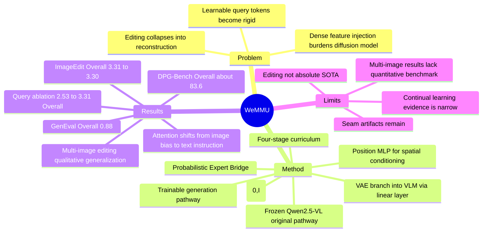

## Summary
WeMMU 研究的是如何高效连接预训练 VLM 和 Diffusion Model，同时避免 fixed learnable query tokens 在新任务上出现 task generalization collapse。作者把桥接 token 从确定性可学习向量改成每步从标准正态分布采样的 Noisy Query Tokens，并用 VAE branch 向 VLM 注入细节特征，使 Qwen2.5-VL-3B 与 Sana 1.6B 能覆盖 text-to-image、single-image editing 和 multi-image editing。

## Problem & Motivation
论文指出，桥接式 unified MLLM 的吸引力在于训练成本低：相比 Bagel、Mogao 这类从头训练生成能力的方法，MetaQueries 类方法通过 learnable query tokens 对齐预训练 VLM 与 Diffusion Model，可以更高效地复用现成 backbone。

核心问题是 learnable query tokens 在任务扩展时会变“rigid”。作者观察到：模型先在 text-to-image generation 与 image reconstruction 上预训练后，再加入 image editing，query tokens 倾向忽略文本指令并机械重建输入图像；若只 fine-tune 或重新初始化 query tokens，新任务训练也会快速 collapse。作者把这个现象命名为 task generalization collapse，并将其归因于 learnable query tokens 收敛到任务特定的“mean point”，表达能力不足以支撑持续学习。

这件事对 VLM 方向的价值在于：它不是单纯追求更强 image generation，而是在问一个更一般的问题：VLM 与生成模型之间的中间表示应该是固定点、dense feature dump，还是可泛化的分布式条件表示。

## Method
**Overall framework.** WeMMU 使用 frozen Qwen2.5-VL-3B 作为理解模块，使用可调 Sana 1.6B 作为 Diffusion Model。原始 VLM pathway 保持冻结以保留理解能力，另加一个从 VLM 权重初始化的 trainable generation pathway；Noisy Query Tokens 在该 pathway 中以 bidirectional attention 聚合图像与文本信息，再经过 Position MLP 投影成 diffusion conditioner。作者把这个桥接结构称为 Probabilistic Expert Bridge。

**Noisy Query Tokens.** 与固定 learnable query 不同，WeMMU 在每个训练 step 从 `N(0, I)` 采样一组 query tokens。token 数量动态匹配 VLM vision encoder 输出的 image patches，并使用 image-form positional embeddings（如 Qwen2.5-VL 的 M-RoPE）放入 VLM attention。作者的解释是：随机 query 迫使模型学习从输入条件到生成条件的分布映射，而不是依赖某组 query 的任务捷径。

**VAE branch.** 作者认为 VLM 的语义处理会丢失 fine-grained visual details。一个直接方案是把 VAE/dense features 注入 Diffusion Model，但作者认为这会让 diffusion backbone 同时承担 multimodal context aggregation。WeMMU 选择把 Sana 的 frozen VAE encoder 特征经一个 linear layer 注入 VLM，让 VLM 统一融合文本、高层语义和低层细节，再由 Diffusion Model 专注 denoising/generation。这是论文反复强调的 division of labor。

**Position MLP.** VLM 输出先叠加 learnable 2D absolute positional embedding；为支持动态分辨率，位置矩阵从中心裁剪到当前 feature map 尺寸。随后 gated MLP 将 `2048` 维特征投影到 Sana conditioner 需要的 `2304` 维。

**Training curriculum.** 训练分四阶段：Stage 1 在 `512^2`、batch `2336`、`34k` steps、约 `80M` samples 上 warm up bridge components，仅训练 VAE linear layer、VLM generation pathway 与 Position MLP，并使用 Contrastive Flow Matching；Stage 2 提升到 `1024^2`、batch `584`、`44k` steps、约 `25.6M` samples，并 unfreeze Sana diffusion model，改用 Conditional Flow Matching；Stage 3 用 HQ Mix 与 Uniworld-V1 single-image subset 学 single-image editing，约 `20M` samples；Stage 4 加入 Uniworld-V1 multi-reference subset 学 multi-image editing，约 `4.3M` samples。

## Key Results
- **Text-to-image generation.** 在 GenEval 上，WeMMU Stage 3 / Stage 4 的 Overall 都是 `0.88`，Position 分别为 `0.86 / 0.85`，Color Attr. 为 `0.77 / 0.78`；这与 Bagel、Query-Kontext 的 Overall `0.88` 持平，高于 MetaQuery-XL `0.80` 与 Bifrost-1 `0.81`。在 DPG-Bench 上，WeMMU Stage 3 / Stage 4 Overall 为 `83.69 / 83.60`，接近 OmniGen2 `83.57`，但低于 Bagel `85.07`、QWen-Image `88.32` 和 EMU3.5 `88.26`。
- **Image editing.** 在 ImageEdit-Bench 上，WeMMU Stage 3 / Stage 4 Overall 为 `3.31 / 3.30`，高于 Bagel `3.20` 与 UniWorld-V1 `3.26`，低于 OmniGen2 `3.44`，也明显低于 gen-only 模型 EMU3.5 `4.41`、Gemini 2.5 Flash Image `4.28`、QWen-Image `4.27`。在 GEdit-Bench-EN 上，Stage 4 的 `G SC / G PQ / G O` 为 `5.85 / 6.79 / 5.77`；相对 UniWorld-V1 的 `4.93 / 7.43 / 4.85`，WeMMU 在 `G SC` 和 `G O` 更高，但 `G PQ` 更低，且整体不及 Query-Kontext 的 `8.36 / 7.37 / 7.66`。
- **Ablation on query design.** ImageEdit-Bench 上，Learnable Fixed Query 为 `Hybrid 1.87 / Action 2.21 / Overall 2.53`；Learnable Dynamic Query 提升到 `2.02 / 2.60 / 2.88`；Noisy Query 为 `2.36 / 2.75 / 2.98`；Noisy Query + VAE Branch 达到 `2.82 / 3.15 / 3.31`。这支持两个结论：随机 query 本身解决了大部分 collapse，VAE branch 进一步补细节。
- **Attention analysis.** 作者计算 query tokens 对 image tokens 与 text tokens 的平均注意力差，四种设置分别为 `1.80`、`1.01`、`-0.99`、`-0.68`。正值表示更偏图像，负值表示更偏文本；Noisy Query 把注意力从图像重建偏置转向文本指令，VAE branch 则让两种模态更平衡。
- **Generalization to multi-image editing.** Stage 4 的多图编辑主要是定性验证：Fig. 5 中 learnable fixed/dynamic query baselines 生成 incoherent fused images，而 Noisy Query 能执行 multi-image replacement，full model 改善纹理细节。作者还用 Table 1/2 表明 Stage 4 后旧任务没有明显遗忘：GenEval Overall 仍为 `0.88`，ImageEdit Overall 从 Stage 3 的 `3.31` 变为 Stage 4 的 `3.30`。

## Strengths & Weaknesses
**已知。**

1. 论文抓住了一个具体且可复现实验现象：learnable query tokens 在从 reconstruction/T2I 扩展到 editing 时会偏向重建输入，导致 instruction-following 失败。这个问题比“再堆数据做 unified generation”更有方法论价值。
2. Noisy Query Tokens 的设计很简洁：直接从 `N(0, I)` 采样，而不是加复杂 adapter。作者还报告 channel-wise learnable scaling 在约 `80M` samples 训练后仍稳定在 mean `1.0`、std `0.0074`，移除后无性能下降，说明标准正态采样已经足够。
3. Ablation 比较清楚：fixed learnable query、dynamic learnable query、noisy query、noisy query + VAE branch 四组在同一 Stage 3 条件下比较，结果支持主要 claim。
4. VAE branch 的设计不是只靠直觉。作者尝试过 unfreezing Qwen2.5-VL ViT，发现 editing fine-tuning 会 catastrophic collapse；也比较了 linear layer、2-layer/6-layer ViT、带 generation pathway 的 ViT、distilled ViT 等连接方式，最终 linear layer 收敛最快且最稳定。

**Weaknesses / limitations.**

1. “stable continual learning” 的证据仍偏窄。论文展示的是从 Stage 3 到 Stage 4 加 multi-image editing 后，GenEval 和 ImageEdit 指标基本保持；这不足以证明开放任务序列下的长期 continual learning。
2. 多图编辑的泛化主要是定性图例，没有独立 quantitative benchmark。论文说 baselines 失败、full model seam 更好，但没有给 multi-image editing 的系统指标。
3. Editing 结果不是绝对 SOTA。WeMMU 在 ImageEdit-Bench 可与 Bagel、UniWorld-V1 竞争，但低于 OmniGen2 和多个 gen-only 系统；GEdit-Bench-EN 与 Query-Kontext 差距也很明显。
4. 训练仍然不轻：四阶段总样本量约 `129.9M`，并且 Stage 2 起 unfreeze Sana diffusion model。相比从头训练 unified model 更高效，但不是小数据/低算力方案。
5. 作者自己承认 multi-image editing 输出可能在 composite seams 处有 minor visual artifacts，且细节有时损失；他们把原因归到 multi-image conditioning data 的稀缺与质量不稳定，并建议未来用更高质量数据或 RL fine-tuning。

**推测。** Noisy Query 的真正价值可能不只是“噪声正则化”，而是把 bridge representation 从固定 slot 变成输入条件下的 stochastic codebook，因此更难陷入 reconstruction shortcut。这个解释与 attention shift 和 ablation 一致，但论文没有给更形式化的表示分析。

**不知道。** 论文没有给代码链接、没有报告真实训练算力/时长，也没有说明 Noisy Query 在更大 VLM、更强 diffusion backbone、更多任务类型或 agent/embodied 场景下是否仍然稳定。它对 GUI agent 的直接价值也未知，主要可借鉴点是“中间表示如何避免任务捷径”。

## Mind Map

## Notes
- **我的判断**：rating=3。它和 GUI-agent / embodied-action 不是直接同题，但对 VLM 的 unified understanding-generation bridge 很有参考价值，尤其是“中间表示不能过早收敛成任务均值点”这个 insight。
- **可迁移到 agent 研究的问题**：GUI agent 里的 screenshot/action/history 表示也可能形成 shortcut，例如只复现视觉状态而不跟随 task instruction。WeMMU 提醒我们在 bridge 或 memory token 设计中检查 attention bias、任务扩展后的 collapse、以及新任务加入后的遗忘。
- **我不完全买账的地方**：论文把 Noisy Query 解释成分布学习，但实验证据主要来自性能、attention visualization 和 qualitative multi-image editing；还缺少对 query representation geometry、variance、任务条件分离度的直接测量。
- **后续可追踪**：如果作者 release code，应重点看 Stage 4 multi-image curriculum、Noisy Query sampling 与 positional embedding 细节、以及是否能复现 Qwen2.5-VL ViT fine-tuning collapse。
