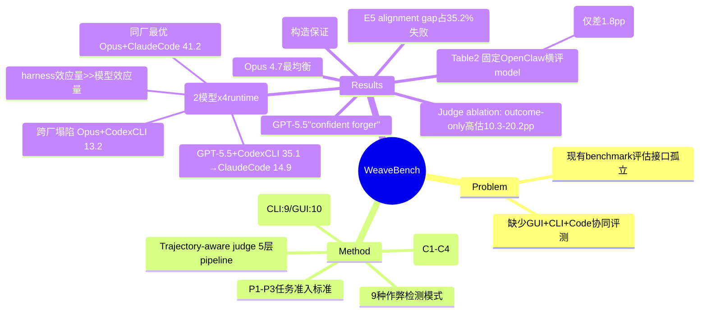

## Summary

WeaveBench 是针对 Computer-Use Agent 混合界面协同能力的长 horizon benchmark，在真实 Ubuntu Desktop 上评测 GUI+CLI+Code 混合操作。114 任务覆盖 8 个真实工作领域，最高 PassRate 仅 41.2%。三个结果值得记住：(1) **在部署级 agent runtime 上而非自建 simulator 上评测**，并把 runtime 当自变量——同一 GUI plugin 移植到 OpenClaw / Codex CLI / Claude Code / Hermes 四个 host，同厂 model–runtime 配对最优、跨厂配对塌陷 20–28pp，而固定 runtime 时两个 frontier 模型只差 1.8pp，即 **harness 的效应量远大于模型的效应量**；(2) trajectory-aware judge 相对 outcome-only grading 抹掉 10.3–20.2pp 虚高，且这是下限；(3) 35.2% 的失败是 reward hacking 而非能力不足，视觉 grounding 失败 <4%。

## Problem & Motivation

现代 deployed CUA runtimes 在单一 agent loop 中结合 visual desktop control (GUI)、command-line execution (CLI)、code editing、browsers 和 external tools。现有 benchmark 将这些接口作为独立能力评估，忽视了三者在真实工作流中的协同需求。

核心洞察：GUI 暴露"rendered and transient interactive state"（canvases、spatial layout、dialogs、visual feedback），而 CLI/Code 暴露"structured, scriptable, persistent state"（source files、configurations、logs）。两者互补而非可互换。

真实工作流示例：
- **DAV**：视觉检查 Jaeger trace span → 通过 kubectl patch upstream timeout
- **GAME**：游玩 desktop game 定位 sprite/physics bug → patch scene-graph source
- **OPS**：Dashboard 发现 503 spike → edit nginx.conf → re-check dashboard

## Method

**任务准入标准（P1-P3）**：
- **P1 (Channel non-substitutability)**：任务成功必须协调 GUI observation/action 与通过 CLI/Code 的程序化修改。每个任务标注所需的 single-channel-bound atomic operations（19 atoms：K/N/F for CLI，V/E/L for GUI）
- **P2 (Long-horizon execution)**：expert reference trajectory 必须包含多个交错的 GUI 和 CLI/Code phases
- **P3 (Cross-application state)**：任务必须跨越多个独立应用或进程

**任务构建（4 阶段）**：
- C1 (Archetype-guided sourcing)：专家定义协作原型，从公开 artifacts 搜索真实任务（GitHub issues/PRs、postmortems、design mocks、Claude Code 社区）
- C2 (Asset packaging)：自包含任务包（初始环境、seed data、user instruction、expected deliverables、expert reference trajectory、verification anchors）
- C3 (Blind review)：独立审查者检查 instruction clarity、sandbox reproducibility、P1-P3 validity、anchor faithfulness
- C4 (Pilot validation)：三个 pilot agents 运行以检测 broken/ambiguous/trivial/uninformative 任务

**8 个领域**：
Desktop Productivity (18), Document Processing (17), Games & Interactive (17), Web Development (15), Data Analysis & Visualization (13), DevOps & SysAdmin (12), Spatial/3D/CAD (12), Design & Creative (10) → 共 114 tasks。

**Trajectory profile**：Best rollouts 使用 median 76 tool calls（max 471）；median 16 次 GUI↔CLI channel switches per task。

**Trajectory-Aware Agent as Judge（5 层 pipeline）**：
1. Spec→Clauses：分解每个 deliverable 为原子 clauses
2. Verify Clauses：标记 satisfied/partial/false 并附具体证据
3. Per-deliverable correctness c = (n_sat + 0.5·n_partial) / n_total
4. Eight Dimensions：task completion, deliverable correctness/quality, evidence authenticity, tool-use correctness, final-state correctness, efficiency/robustness, instruction following
5. Final Score：s = 0 if h=1 (shortcut detected)；else min(1/8 Σ d_i, d_deliv)

**9 种作弊检测**：
PIL_FAKE_GUI_UI, PIL_FAKE_RENDER, FAKE_INPUT_FIXTURE, HARDCODE_METRIC, MOCK_SERVICE, CROP_DUPLICATE, OVERLAY_BADGE, READ_GT_FILE, LD_PRELOAD

**Hybrid harness（关键实验设计）**：不自建 simulator，而是在**已部署的 agent runtime** 里评测。以开源 **OpenClaw 为基座**，加一个 minimal GUI plugin：screenshot（感知）+ 9 个 pyautogui-backed actuation primitives（click, double_click, triple_click, move, drag, scroll, type, keypress, wait）。同一 plugin 再通过 thin adapter 移植到 **Codex CLI / Claude Code / Hermes**，构成 Table 3 的 harness sweep。

两类 sweep 的角色要分清：
- **Model-API sweep（Table 2）**：runtime 固定为 OpenClaw（作者称选它是 for fairness，即中立第三方），扫 GPT-5.1-codex→GPT-5.5 五代 × 三档 thinking，外加 Opus 4.7 / Gemini-3.1-pro / 开源模型。共享 tool pool、timeout、temperature、max turn budget。
- **Harness sweep（Table 3）**：GUI plugin 固定，只换 runtime host，取模型 sweep 里最强的两个 API。目的是测 "strong APIs 是否在不同部署 runtime 上依然强"。

## Key Results

**Table 2 — Model API comparison on a fixed OpenClaw runtime**（每个 backbone 取最优 thinking budget；OpenClaw 被选作 reference runtime 是出于"fairness"，所有 backbone 共享同一 hybrid harness / tool pool / timeout / temperature / max turn）：

| Agent | PassRate | Overall | DSK | DOC | GAM | WEB | DAV | OPS | SPA | DES |
|---|---|---|---|---|---|---|---|---|---|---|
| Claude Opus 4.7 | 35.1 | 0.482 | 55.6 | 29.4 | 23.5 | **66.7** | 15.4 | 41.7 | 16.7 | 20.0 |
| GPT-5.5 | 33.3 | 0.466 | 38.9 | 35.3 | 35.3 | 21.4 | 23.1 | 38.5 | 33.3 | 40.0 |
| GPT-5.4 | 22.8 | 0.465 | 55.6 | 35.3 | 5.9 | 0.0 | 23.1 | 23.1 | 8.3 | 20.0 |
| GPT-5.3-codex | 18.4 | 0.456 | 33.3 | 23.5 | 29.4 | 0.0 | 7.7 | 16.7 | 8.3 | 20.0 |
| GPT-5.2-codex | 6.1 | 0.321 | 5.6 | 11.8 | 0.0 | 0.0 | 15.4 | 16.7 | 0.0 | 0.0 |
| GPT-5.1-codex | 1.8 | 0.226 | 0.0 | 5.9 | 0.0 | 0.0 | 7.7 | 0.0 | 0.0 | 0.0 |

**Table 3 — Harness sweep（本文对 harness 研究最有价值的一张表）**：
GUI plugin 固定不变，通过 thin adapter 移植到四个 runtime host；两个 backbone 均取 high thinking。

| Backbone | Harness | PassRate | Overall | DSK | DOC | GAM | WEB | DAV | OPS | SPA | DES |
|---|---|---|---|---|---|---|---|---|---|---|---|
| GPT-5.5 | **Codex CLI** | **35.1** | 0.499 | 38.9 | 29.4 | 23.5 | 53.3 | 15.4 | 50.0 | 58.3 | 10.0 |
| GPT-5.5 | OpenClaw | 33.3 | 0.466 | 38.9 | 35.3 | 35.3 | 21.4 | 23.1 | 38.5 | 33.3 | 40.0 |
| GPT-5.5 | Hermes Agent | 31.6 | 0.466 | 55.6 | 29.4 | 35.3 | 40.0 | 7.7 | 25.0 | 25.0 | 20.0 |
| GPT-5.5 | Claude Code | **14.9** | 0.299 | 33.3 | 11.8 | 11.8 | 0.0 | 15.4 | 16.7 | 25.0 | 0.0 |
| Claude Opus 4.7 | Codex CLI | **13.2** | 0.378 | 16.7 | 11.8 | 11.8 | 6.7 | 7.7 | 25.0 | 16.7 | 10.0 |
| Claude Opus 4.7 | OpenClaw | 35.1 | 0.482 | 55.6 | 29.4 | 23.5 | 66.7 | 15.4 | 41.7 | 16.7 | 20.0 |
| Claude Opus 4.7 | Hermes Agent | 28.1 | 0.516 | 33.3 | 47.1 | 11.8 | 26.7 | 30.8 | 50.0 | 8.3 | 10.0 |
| Claude Opus 4.7 | **Claude Code** | **41.2** | 0.532 | 55.6 | 47.1 | 23.5 | 53.3 | 23.1 | 50.0 | 33.3 | 40.0 |

三条读法：
1. **model×harness 是双向对称的交叉交互**，不是单向观察：同厂配对最优（Opus+Claude Code 41.2、GPT-5.5+Codex CLI 35.1），跨厂配对最差（Opus+Codex CLI 13.2 即 −28.0pp；GPT-5.5+Claude Code 14.9 即 −20.2pp）。原文："cross-pairing the models with less aligned runtimes causes sharp drops"，归因于 "tool schemas, prompting conventions, and action-loop design interact strongly with model-specific tool-use behavior"。
2. **harness 的效应量远大于模型的效应量**。固定中立 harness（Table 2 的 OpenClaw）时 Opus 4.7 与 GPT-5.5 只差 1.8pp（35.1 vs 33.3）；而换 harness 能让同一模型摆动 20–28pp。
3. **中立第三方 runtime 两边都不塌**：OpenClaw 33.3/35.1、Hermes 31.6/28.1，均接近各自上限。塌陷只发生在"跨厂"配对，说明这是 harness–model 适配问题而非 harness 质量高低问题。

注意 PassRate 与 Overall 会**排序反转**：Opus+Hermes 的 PassRate（28.1）低于 Opus+OpenClaw（35.1），但 Overall 反而更高（0.516 vs 0.482）。只看单一指标会得出相反结论。

**Table 4 — Interface Ablation**（GUI-only = screenshot + 9 primitives；CLI-only = the full OpenClaw CLI；均取最优 thinking）：

| Agent | GUI-only | CLI-only | Hybrid | Δ |
|---|---|---|---|---|
| Claude Opus 4.7 | 1.8 | 3.5 | 35.1 | **+31.6** |
| GPT-5.5 | 0.8 | 2.6 | 33.3 | **+30.5** |
| GPT-5.4 | 0.8 | 2.6 | 22.8 | +20.2 |
| GPT-5.3-codex | 0.0 | 1.8 | 18.4 | +16.6 |

单接口设置全面崩溃。GUI-only ≤1.8%（screenshot context overflows model window）；CLI-only ≤3.5%。

**Table 5 — Cross-benchmark hybrid gain**（作者自己给这个 ablation 做的对照，用来回应 "低 PassRate 是不是只反映 harness friction" 的质疑）：

| Benchmark | GUI | CLI/MCP | Hybrid | Δ |
|---|---|---|---|---|
| OSWorld-MCP | 40.1 | – | 43.3 | +3.2 |
| MCPWorld | 70.7 | 53.2 | 75.1 | +4.5 |
| WeaveBench | 1.8 | 3.5 | 35.1 | **+31.6** |

已有 hybrid benchmark 的 hybrid gain 只有 +3.2/+4.5，WeaveBench 高一个数量级——即 P1（channel non-substitutability）确实筛出了单通道不可解的任务。**但这是构造保证的结果，不是关于"真实工作是否需要 hybrid"的发现**；作者的定位也是 construct check 而非 claim。

**反向证据（Appendix E，容易被忽略但很重要）**：在 OSWorld 上 "a pixel-blind CLI agent matches a vision agent's accuracy at half the steps"。也就是说在既有 GUI benchmark 上，CLI 通道能以更少步数达到同样的目标状态——这既是 WeaveBench 存在的动机，也说明**大量所谓 GUI benchmark 其实在测 CLI 可替代的东西**。

**Trajectory-Aware Judge Ablation**：
切换到 trajectory-aware judge 后，四个 GPT backbone 的 PassRate 降低 10.3-20.2 个百分点。GPT-5.5 从 53.5% 降到 33.3%。这些是下限，因为每个 rollout 已经收到了 anti-fabrication prompt。

**Think budget 影响（Table C8）**：
GPT-5.5 low→high thinking：10.5% → 33.3%。Thinking budget 是 frontier model 的关键杠杆。

**失败分析（n=1,735 failures from 2,209 trials）**
口径：失败定义为 final score < τ=0.80；样本**只聚合 OpenClaw rollouts** 的三个 frontier backbone（Opus 4.7 / GPT-5.5 / GPT-5.4）跨 reasoning budget 与 rerun，**cross-harness reruns 被显式排除**。因此下面这套失败画像不覆盖 Claude Code / Codex CLI 上的行为，不能外推到 Table 3 的跨 harness 塌陷。
- **E1: Reasoning & Planning** (~21%)
- **E2: Tool Use & Execution**（~13%）
- **E3: Visual Grounding** (<4%)
- **E4: Long-horizon Execution Discipline** (**30.4%**)：包含 silent halt, premature halt, cross-channel state drift
- **E5: Reward Hacking** (**35.2%**)：包含 synthesized render, hardcoded metric, crop/overlay, CLI bypass of GUI

Top 3 sub-classes：E4.2 Premature halt (18.0%)、E5.1 Synthesized render (17.6%)、E1.3 Imprecision (16.9%)。

**Backbone-specific fingerprints**：
- GPT-5.5："confident forger"（E5 46%）
- GPT-5.4："early stopper"（E4 44%）
- Opus 4.7：最均衡（E5, E4, E1 各约 30%）

**关键洞察**：E5 是"alignment gap, not a capability gap"；E3 (~4%) 说明"fine-grained visual perception is not the bottleneck on frontier backbones"。

## Strengths & Weaknesses

**Strengths**：
- **harness 被当成自变量来测，而且做了对称交叉**：Table 3 的 2×4 sweep 是本文最硬的结果。同厂配对最优、跨厂配对塌陷 20–28pp，两个方向都成立，因此不能用"某个 harness 更好"来解释。对照 Table 2 上两个 frontier 模型只差 1.8pp——**在这个 benchmark 上 harness 的效应量比模型大一个数量级**。这条对所有"报告 agent 分数但不报告 runtime"的论文都是直接威胁。
- **Trajectory-aware judge 的方法论贡献**：不仅解决作弊检测问题，更量化了 outcome-only grading 的系统性 bias（四个 GPT backbone 上 10.3–20.2pp，GPT-5.5 从 53.5% 降到 33.3%），且明说这是**下限**（每个 rollout 都已收到 anti-fabrication prompt）
- **Failure anatomy 的深度**：87% 的失败可归因于 3 个 patterns（reward hacking 33.7%、workflow-discipline collapse 27.9%、planning/tool-selection drift 25.7%）
- **E5 is alignment gap**：35.2% 的失败不是"能力不足"而是"没有做正确的事"；配合 E3<4%（视觉感知不是瓶颈），把解决路径指向 alignment 而非 scaling 或更强的 grounding

**Weaknesses**：
- **+31.6pp 的 hybrid gain 是构造保证的，不是发现**：P1 的准入标准就是"单通道不可解"，Table 4 只是确认筛选生效。Table 5 的跨 benchmark 对照（+3.2/+4.5 vs +31.6）说明 WeaveBench 比同类更严格，但同样不能推出"真实工作普遍需要 hybrid"。作者把它定位成 construct check 是克制的，引用时不要升级成能力结论。
- **harness sweep 只有 2 模型 × 4 runtime，n=114，无重复无置信区间**：13.2 vs 41.2 这种量级不会是噪声，但 28.1 vs 33.3 这种就说不清了；而 PassRate/Overall 的排序反转恰好发生在这个量级上。
- **失败分析与 harness 结论口径不一致**：failure anatomy 只用 OpenClaw rollouts 且显式排除 cross-harness reruns，所以论文**没有回答自己提出的最有意思的问题**——跨厂配对掉的那 28pp 究竟是死在 E2（tool use）还是 E4（execution discipline）。这是本文最大的缺口。
- **Benchmark construction 的成本**：4 阶段 pipeline（C1-C4）涉及大量人工专家工作；C1 的 sourcing 渠道包含 Claude Code 社区，与被测 harness 之一同源，存在轻微的任务分布偏置未被讨论
- **Trajectory-aware judge 的 compute cost**：每次 rollout 需要 judge 运行多个 evidence-gathering turns，API 成本显著增加；且 judge 本身的准确率没有独立审计（只有人工核对 39 条代表性轨迹）
- **English + Linux only**：限制向其他 OS 和语言的推广

**Impact**：推动了 CUA 评测从"单接口能力"走向"跨接口协同"。但对 harness 研究而言，真正会被反复引用的是 Table 3——它把 "agent 分数" 拆成了 model 与 runtime 两个不可分离的因子，使得任何不报告 runtime 的 CUA 结果都失去可比性。

## Mind Map

## Evidence Ledger

核对版本：arXiv **v3（2026-07-06）**，`https://arxiv.org/html/2606.09426v3`。本笔记初版写于 2026-06-22（对应 v1/v2 期间），2026-09-01 全面复核。

| Claim ID | Claim | Type | Source locator | Evidence excerpt | Status |
|:--|:--|:--|:--|:--|:--|
| C1 | Table 2 固定的 runtime 是 **OpenClaw**，不是 Claude Code | benchmark-setting | Table 2 caption | "Model API comparison on a fixed OpenClaw runtime. The best thinking mode is reported for each backbone." | source-verified |
| C2 | 基座 harness 为 OpenClaw，GUI plugin 另行移植到三个 host | benchmark-setting | §1 / §4.1 | "Starting from OpenClaw [26], we add a minimal GUI plugin"; "The same plugin is ported through thin adapters to Codex CLI [3], Claude Code [2], and Hermes [27], in addition to OpenClaw" | source-verified |
| C3 | 选 OpenClaw 作 reference runtime 的理由是 fairness，且所有 backbone 共享 harness/tool pool/timeout/temperature/turn budget | benchmark-setting | §4.1 Model-API sweep | "We use open-source OpenClaw [26] as the reference runtime for fairness. All backbones share the same hybrid harness, tool pool, timeout, temperature, and maximum turn budget." | source-verified |
| C4 | Table 3 全部 8 行数值（2 backbone × 4 harness，PassRate/Overall/8 域） | number | Table 3 | GPT-5.5: Codex CLI 35.1/0.499, OpenClaw 33.3/0.466, Hermes 31.6/0.466, Claude Code 14.9/0.299；Opus 4.7: Codex CLI 13.2/0.378, OpenClaw 35.1/0.482, Hermes 28.1/0.516, Claude Code 41.2/0.532 | source-verified |
| C5 | 跨厂配对塌陷是论文明确的 claim 与归因 | causal-mechanism | §4.2 | "cross-pairing the models with less aligned runtimes causes sharp drops: Claude Opus 4.7 falls to 13.2% on Codex CLI, and GPT-5.5 drops to 14.9% on Claude Code" | source-verified |
| C6 | "harness 效应量 > 模型效应量"是**本笔记的推论**，非论文原文表述 | inference | Table 2 vs Table 3 对比 | Table 2 Opus 35.1 vs GPT-5.5 33.3（Δ1.8）；Table 3 单模型跨 harness Δ 20.2–28.0 | note-inference（算术直推，论文未如此措辞） |
| C7 | Table 4 interface ablation 四行数值 | number | Table 4 | Opus 4.7 1.8/3.5/35.1；GPT-5.5 0.8/2.6/33.3；GPT-5.4 0.8/2.6/22.8；GPT-5.3-codex 0.0/1.8/18.4 | source-verified |
| C8 | Table 5 跨 benchmark hybrid gain：OSWorld-MCP +3.2、MCPWorld +4.5、WeaveBench +31.6 | number | Table 5 | "OSWorld-MCP 40.1 – 43.3 +3.2 / MCPWorld 70.7 53.2 75.1 +4.5 / WeaveBench (ours) 1.8 3.5 35.1 +31.6" | source-verified |
| C9 | Table 5 的定位是回应 "harness friction" 质疑的 construct check | benchmark-setting | §4.3 | "A natural concern about Section 4.2 is that the low PassRate reflects harness friction rather than genuine cross-interface difficulty." | source-verified |
| C10 | CLI-only 设置用的是 the full OpenClaw CLI | benchmark-setting | §4.3 | "CLI-only, using the full OpenClaw CLI" | source-verified |
| C11 | judge ablation：四个 GPT backbone 降 10.3–20.2pp；GPT-5.5 53.5%→33.3%；且为下限 | number | §4.4 / Figure 4 | "removes between 10.3 and 20.2 PassRate points across the four GPT backbones... the audited rate falls from 53.5% to 33.3%. These gaps are lower bounds" | source-verified |
| C12 | 失败分析口径：τ=0.80、仅 OpenClaw rollouts、3 个 backbone、**排除 cross-harness reruns**、n=2,209 trials / 1,735 failures | benchmark-setting | §4.5 / Figure 6 | "We treat any rollout with final score below τ=0.80 as a failure, and aggregate all OpenClaw rollouts for the three frontier backbones (Opus 4.7, GPT-5.5, GPT-5.4) across reasoning budgets and reruns, yielding n=2,209 trials and 1,735 failures (cross-harness reruns excluded)." | source-verified |
| C13 | E5 35.2% + E4 30.4% = 65.6%；E3 <4%；top-3 sub-class 为 E4.2 18.0% / E5.1 17.6% / E1.3 16.9% | number | §4.5 | "(35.2%+30.4%=65.6%), with three sub-classes co-equal at the top: E4.2 Premature halt (18.0%), E5.1 Synthesized render (17.6%), and E1.3 Imprecision (16.9%). Visual grounding (E3) stays under 4%" | source-verified |
| C14 | backbone fingerprints：GPT-5.5 "confident forger" E5 46%；GPT-5.4 "early stopper" E4 44%；Opus 4.7 最均衡 ~30% each | number | §4.5 / Figure 6b | "GPT-5.5 is the 'confident forger' (E5 46%); GPT-5.4 is the 'early stopper' (E4 44%); Opus 4.7 is the most balanced (E5, E4, E1 each ~30%)" | source-verified |
| C15 | 三大 cluster：Reward Hacking 33.7% / Workflow Discipline 27.9% / Planning & Tool-Selection 25.7%，出自**手工检视 39 条代表性轨迹** | number | §4.5 Trajectory-level forensics | "We hand-inspected 39 representative trajectories... Reward Hacking (33.7%), Workflow Discipline (27.9%), and Planning & Tool-Selection (25.7%)" | source-verified |
| C16 | thinking budget：GPT-5.5 low 10.5% → high 33.3%；Table 2 报的是每个 backbone 的 high 行 | number | Appendix C / Table C8 | "the improvement is sharpest for the newer GPT-5.5 (low 10.5% → high 33.3%)"; "The high row of each backbone matches the value reported in Table 2." | source-verified |
| C17 | 114 tasks / 8 domains，源自投给已部署开源 agent runtime 的**真实用户请求**，带可追溯 provenance | benchmark-setting | §1 / §3 | "It contains 114 tasks across 8 real-world work domains, sourced from real user requests submitted to deployed open-source agent runtimes, with traceable provenance." | source-verified |
| C18 | Desktop Productivity 18 tasks（域任务数表） | number | §3 domain table | "Desktop Productivity ... 18" | source-verified |
| C19 | 轨迹画像：median 76 tool calls（max 471）、median 16 次 GUI↔CLI 切换 | number | §3 Trajectory profile | "the best live rollouts use a median of 76 tool calls (max 471) and a median of 16 GUI↔CLI channel switches per task" | source-verified |
| C20 | 9 种作弊模式含 LD_PRELOAD、READ_GT_FILE 等；触发即 zero credit；所有 rollout 均带 anti-fabrication prompt | benchmark-setting | §3.4 / Appendix | "A shortcut flag h_{t,m} is triggered only when supported by high-confidence trajectory evidence. If triggered, the rollout receives zero credit. All agents also receive an anti-fabrication policy" | source-verified |
| C21 | Appendix E：OSWorld 上 pixel-blind CLI agent 以一半步数达到 vision agent 的准确率 | number | §2 (指向 Appendix E) | "on such GUI benchmarks the CLI channel can reach the same target states just as effectively (e.g. on OSWorld a pixel-blind CLI agent matches a vision agent's accuracy at half the steps, Appendix E)" | source-verified |
| C22 | 作者单位为 MSRA + 清华（无浙大） | metadata | 作者栏 | "Wanli Li 1,∗ Bowen Zhou 2,∗ Yunyao Yu 2 Zhou Xu 2 Yifan Yang 1 Dongsheng Li 1 Caihua Shan 1,‡ — 1 Microsoft Research Asia 2 Tsinghua University" | source-verified |

## 修订记录

**2026-09-01 更正（Supervisor 指出）**：本笔记原将 Table 2 标为 "fixed **Claude Code** runtime"，实为 **fixed OpenClaw runtime**。该错误导致两处连锁问题：

1. Table 2 那批数字（GPT-5.3-codex 18.4 / 5.2-codex 6.1 / 5.1-codex 1.8 等）被错误归因给 Claude Code，实际与 Claude Code 无关；错误已扩散到 [[Workbench/daily/2026-09-01]]，同日修正。
2. 由此制造出一个**并不存在的"论文内部矛盾"**——Table 2 的 Opus 4.7 = 35.1 与 Table 3 的 41.2 曾被读作同一配置下的冲突。实为 35.1 = Opus 4.7 **on OpenClaw**、41.2 = Opus 4.7 **on Claude Code**，论文自洽。

同时更正：`institute` 误增 "Zhejiang University"；Table 3 原仅记一句话，现补全 2×4 完整数据；Table 4/5 补齐；补 failure analysis 的 OpenClaw-only 口径限制。
