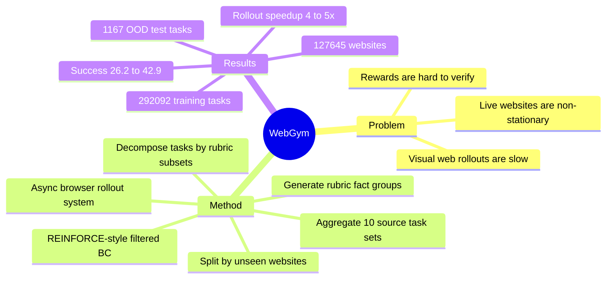

## Summary
WebGym 把 visual web agent training 的主要瓶颈拆成三件事：近 300k realistic live-website tasks、rubric-based binary evaluation、async rollout system，并用简单的 REINFORCE-style online RL 训练 Qwen3-VL-8B-Instruct。已知结果是：在网站完全 OOD 的 WebGym test split 上，成功率从 26.2% 提到 42.9%，rollout collection 相比 synchronous 实现有 4-5x 加速；但任务构造与评估高度依赖 GPT-4o rubrics/judge，外部复现边界仍需要进一步验证。

## Problem & Motivation
Web agent 的 evaluation benchmark 已经很多，但可用于大规模训练的 realistic visual web environment 仍然稀缺：真实网站 non-stationary、页面渲染细节复杂、browser rollout 慢，且很多任务没有可直接 string-match 的 ground-truth answer。作者明确聚焦 visual web agents，即 agent 看 screenshot 并输出 browser actions，而不是只依赖 accessibility tree；这使问题更贴近人类看到的 rendered interface，但也让 reward verification 和 trajectory collection 更难。

核心动机是：如果想把 online RL 在 math / software engineering agent 中的 scaling 经验迁移到 web agent，需要同时满足三件事：足够大且多样的 task set、能转成学习信号的可靠 evaluator、高吞吐 rollout system。WebGym 的问题设定因此不是提出复杂新算法，而是把 training environment 本身 scale 到能支撑 long-horizon visual web RL。

## Method
**Task construction.** WebGym 从 10 个 source task sets 聚合 seed tasks：InSTA-v3、PAE-WebVoyager、AgentSynth-Web、BrowseComp、TravelPlanner、Mind2Web-Live、Online Mind2Web、DeepShop、Mind2Web-2、GAIA-Web。对缺少具体网站的任务，作者用 GPT-4o 推断 website/domain；再用 GPT-4o 为每个 task 生成 fact-group rubric，difficulty 定义为所有 evaluation facts 的总数。

**Task decomposition.** 如果一个原始任务至少有 2 个 fact groups，且至少一个 group 有 3 个及以上 facts，WebGym 会选择 proper subsets 生成更容易的 decomposed tasks。这个设计的目的不是任意合成任务，而是从原始 rubric 的结构中生成更 dense 的 reward curriculum：新任务必须包含足够大的 fact group，且应该严格比原任务更简单。

**Train-test split.** WebGym 构建 1,167 个 OOD test tasks，每个 task 来自不同网站，并从 training set 中移除所有同网站任务，保证 test websites 在训练中未见。split 后 training set 有 292,092 tasks，覆盖 127,645 websites；作者还用 Mind2Web-2 taxonomy 的 6 domains / 24 subdomains 检查 domain coverage。

**Evaluator and reward.** 每个 task 的 rubric 由 fact groups 组成，trajectory 只有在所有 criteria 都满足时才得到 binary reward；若有 reference answer，则作为 override。实际评估中，GPT-4o 先做 keypoint screenshot selection，再基于 task-specific criteria 判断每条 criterion 是否满足。作者用 80 条 human-annotated trajectories 做 sanity check，发现 rubric-guided evaluation 相比 task-only judging 提高了 GPT-4o、Qwen3-VL-8B-Instruct、Gemma3-27B-it 的 accuracy 和 precision，但强 evaluator 上 recall 有轻微 regression，原因是部分 rubrics 过严。

**Async rollout system.** WebGym 把 CPU-side browser simulation 和 GPU-side policy inference 拆成 server/client architecture：CPU server 用 master/worker paradigm 管理 stateful browser sessions，GPU client 异步接收 observations 并做 inference。关键点是去掉 step-level / episode-level synchronization barrier，让快的 browser session 不必等待慢 session，从而缓解 web rollout 中 step latency 和 horizon 差异很大的问题。

**RL recipe.** Agent action space 包含 click、type、scroll、back、navigate；实验直接用 coordinate-based screenshot-only mode 训练 Qwen3-VL-8B。Policy update 是带 binary terminal rewards 的 REINFORCE，无 baseline、无 negative gradient；作者指出这等价于 online filtered behavior cloning / thresholded reward-weighted regression，即只保留 successful trajectories 做 log-likelihood 最大化。关键训练设计包括 memory prompt、repeated-action penalty、episode horizon cap，以及不同 difficulty sampling strategies。

## Key Results
- **WebGym task scale / Table 1.** WebGym training set 有 292,092 tasks、127,645 websites；对比 seed sources，InSTA-v3 有 146,441 tasks / 146,348 websites，PAE-WebVoyager 有 128,499 tasks / 13 websites。WebGym 的特点是同时扩大 task count 与 website breadth，而不是只在少数网站上堆任务。
- **WebGym OOD test split.** Qwen3-VL-8B-Instruct 经 WebGym RL 后，success rate 从 26.2% 提升到 42.9%。同一 OOD test set 上，GPT-4o-SoM 为 27.1%；GPT-5-SoM (Think) 在 300-task subset 上为 29.8%，同 subset 上 GPT-4o 为 25.6%。作者还报告 final agent 超过 GPT-5-Thinking 13.1%。
- **Rollout benchmark / Figure 7.** 在收集 1,800 trajectories、平均 13.2 steps、总 23,760 steps 的 benchmark 中，64 CPUs 条件下 WebGym async 用 48.6 minutes，sync baseline 用 264 minutes；128 CPUs 条件下为 24.8 vs. 125.0 minutes；256 CPUs 为 23.2 vs. 99.4 minutes；768 CPUs 为 21.8 vs. 92.4 minutes。整体是约 4-5x speedup。
- **Task difficulty validation / Figure 4.** Easy / medium / hard tasks 的平均 trajectory length 分别为 7.8 / 9.9 / 11.9 steps，KDE mode 分别为 3.7 / 4.9 / 5.5 steps，说明 rubric facts 定义的 difficulty 与实际多步交互复杂度有正相关。
- **Ablations / Figure 8-9.** Memory prompt 比无 memory prompt 更利于 RL；repetition penalty 提高 sample efficiency，并针对 base model 在相同 screenshot 上重复无效 action 的 failure mode。Thinking variant 初始性能更高，但 response 更长，RL 前平均 2,139 chars/response，而 Instruct 是 1,088；训练后 Instruct 追上并超过 Thinking。移除一半 subdomains 后只剩 53% 原始 tasks，且所有 evaluation slices 上改善变慢、final success 更低；difficulty mixing 中 uniform sampling overall 最好；把 horizon 从 (15, 30, 45) 缩到 (10, 20, 30) 后，peak success 从 38.2% 提升到 42.9%。

## Strengths & Weaknesses
**已知的强点。** 这篇工作的价值主要在 environment scaling，而不是算法复杂度：task breadth、difficulty depth、rollout throughput、rubric reward 四个部件都直接服务于 visual web RL。OOD split 以 website 为隔离单位，比随机 task split 更接近真实泛化；同时，作者没有只报最终数值，也分析了 domain breadth、difficulty mix、horizon cap、memory prompt、repetition penalty 等 ablations。

**已知的局限。** 任务生成、rubric 生成、keypoint selection、criterion evaluation 都强依赖 GPT-4o；human validation 只有 80 trajectories，能证明 rubric 比 task-only judge 更合理，但不足以完全校准 292k tasks 上的 evaluator noise。作者自己也观察到 rubric-guided evaluation 在强 evaluator 上有 recall regression，说明过严 rubric 会牺牲 sample efficiency。真实网站会变化、阻断访问，训练中还需要 dynamic blocklist，这会影响长期可复现性。

**推测。** WebGym 的一个重要隐含结论是：web agent 的泛化瓶颈可能更像 coverage problem，而不只是 harder-task problem。证据是 only-easy training 比 only-medium 更稳定，uniform sampling 最好，且 aggressive upweight hard tasks 会在约 36k-42k trajectories 后出现 plateau / mild regression；这暗示大规模 easy tasks 对 unseen website generalization 很关键。

**不知道 / 未证实。** 正文声称 open-source environment，但未给出具体 code URL；也未在正文 header 中看到 arXiv id 或 DOI。Tables 2-4 被引用但具体表格数值没有出现在正文页中，因此除文中显式写出的 42.9%、27.1%、29.8%、13.1% 外，不应补写其他 benchmark 数字。最终结论主要建立在 WebGym OOD test split 上，对 Online Mind2Web、VisualWebArena 等外部 benchmark 的完整迁移效果需要看表格或代码 release 才能判断。

## Mind Map

## Notes
这篇论文值得优先读的原因不是 WebGym agent 形成了某个复杂策略，而是它把 visual web agent training 的工程瓶颈变成可研究的 scaling axes：breadth、depth、size、horizon、rollout throughput。后续如果要做 GUI / web agent RL，最应该复用的问题意识是：先问 task distribution 是否足够广、reward 是否足够精确、rollout 是否足够快，再讨论算法是否需要更复杂。

一个需要继续追问的点是 evaluator bias：如果 task decomposition、rubric、reward 都由 GPT-4o 产生和判定，RL policy 可能学到的是 GPT-4o judge 偏好的 trajectory pattern，而不完全是 human-valid web task success。另一个开放问题是 hard tasks 的作用边界：论文显示 hard-task upweighting 可能过拟合，但也承认更高 difficulty 对 medium/hard subsets 有价值；更好的 curriculum 或 off-policy reuse 可能比 fixed sampling ratio 更关键。
