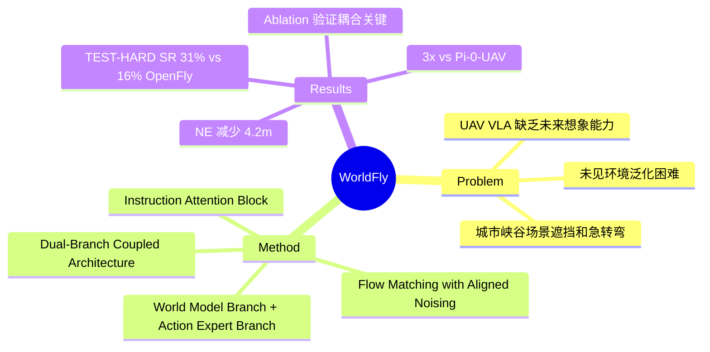

## Summary
首个将 world model 引入 UAV VLA 导航的框架，通过双分支耦合架构联合优化未来视频生成和动作预测，在未见环境中显著超越 baseline（SR 提升 15%）。

## Problem & Motivation
现有 UAV VLA 方法（如 OpenFly、Pi-0-UAV）依赖历史观测直接预测动作，在密集城市环境中遇到严重遮挡和急转弯时表现不佳。这些方法缺乏对未来场景状态的显式估计（"想象"能力），导致在未见环境中的长距离动作预测能力不足。此外，大动作时视觉观测跨时间步语义变化大，难以与语言指令时间对齐。World Model 在自动驾驶和视频生成领域已展示出强大的视觉动态建模能力，这启发作者将其引入 UAV 导航。

## Method
WorldFly 采用 **Dual-Branch Coupled Architecture**，包含以下关键组件：

1. **双分支结构**：世界模型分支（生成未来视频）+ 动作专家分支（预测导航动作），通过周期性耦合实现双向交互
2. **Flow Matching with Aligned Noising**：使用 aligned noising 的 flow matching 机制，确保视频和动作在相同噪声水平下联合生成
3. **Instruction Attention Block**：语言指令通过注意力机制与视觉特征交互，增强文本-视觉对齐
4. **Dual-Branch Coupling Block**：周期性地让两分支交互，世界模型分支的动作条件特征传递给动作专家分支
5. **Asymmetric Hidden Dimensions**：视频分支使用更高维度（2048），动作分支较低维度（512），平衡计算成本

输入：FPV 视频序列 + 语言指令；输出：未来视频预测 + 导航动作序列

## Key Results
在自建的 **Urban Canyon Traversal Benchmark** 上评估，包含 TEST-EASY（已见路口）和 TEST-HARD（未见路口）两个 split：

| Method | TEST-EASY SR | TEST-EASY NE | TEST-EASY SPL | TEST-HARD SR | TEST-HARD NE | TEST-HARD SPL |
|:-------|:-------------|:-------------|:--------------|:-------------|:-------------|:--------------|
| OpenFly | 72% | 14.69m | - | 16% | 35.32m | - |
| Pi-0-UAV | - | - | - | 10% | - | - |
| WorldFly | 87% | 7.92m | 73.25% | 31% | 31.08m | 27.86% |

- TEST-HARD 上 SR 相比最强 baseline OpenFly 提升 15%（31% vs 16%），近乎 2x 提升
- TEST-HARD 上 NE 减少 4.2m（31.08m vs 35.32m）
- TEST-HARD 上 SR 相比 Pi-0-UAV 提升 3x（31% vs 10%）
- Ablation：移除 Dual-Branch Coupling 后，TEST-HARD SR 从 31% 降至 21%，验证耦合机制的关键作用

## Strengths & Weaknesses
**亮点**：
- 首个将 world model 正式引入 UAV VLA 导航的工作，思路清晰：用"想象"未来场景来指导动作决策
- 双分支耦合设计避免了 serial world-model-then-policy 的分离训练，joint optimization 更高效
- 自建 benchmark 有针对性：专门设计城市峡谷场景（急转弯、遮挡、大视角变化）来 stress-test

**局限**：
- 计算成本高：未来帧预测不可避免地增加推理延迟，作者承认这是主要瓶颈，需探索 pruning/distillation
- 仅在仿真环境测试，未见 real-world deployment 验证
- benchmark 数据基于 OpenFly 工具链生成，可能存在 sim-to-real gap
- 绝对成功率仍有较大提升空间（TEST-HARD 仅 31%）

## Mind Map

## Notes
- 与机器人操作的 World Model VLA（如 Genie-Envisioner、VideoVLA、UVA）相比，UAV 导航的独特挑战在于：大尺度城市拓扑、剧烈视角变化、更严格的实时性要求
- Dual-Branch Coupling 的设计思想值得借鉴：避免 serial pipeline，让 imagination 和 policy 相互增强
- 潜在改进方向：real-world 验证、计算优化、更细粒度的 action primitive 设计