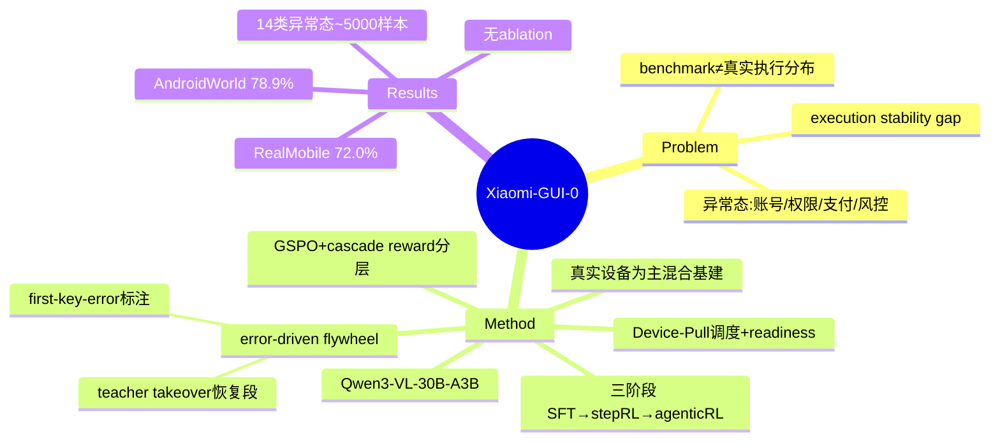

## Summary

Xiaomi-GUI-0 是一个在**真实设备闭环**中训练与评测的原生多模态 mobile GUI agent：以物理设备为主、sandbox 为辅的混合基础设施让数据采集/训练/rollout/评测共享接近真实部署的执行分布，配合 error-driven data flywheel 与 SFT→step-RL→agentic-RL 三阶段训练，在自建 RealMobile 上达 72.0%、AndroidWorld 78.9%，重点提升异常态识别与执行稳定性。

## Problem & Motivation

现有 GUI agent 主要在 offline trajectories、simulated environment、standardized benchmark 上训练与评测，而这些与真实应用在**界面布局、交互逻辑、异常态分布**上差异巨大。真实使用中，账号状态、权限弹窗、支付验证、风控会持续重塑 state distribution，导致 benchmark 分数与真实可用性之间存在**持续 gap**。作者的核心 framing 是：要刻画真实执行稳定性（execution stability），训练与评测必须发生在与真实部署同分布的执行环境里，而非静态轨迹或纯 sandbox。这与 vault 中 "真实长程/组合工作流远未饱和" 的 validated insight 一致——benchmark 系统性低估真实难度，异常态处理是被忽视的可靠性瓶颈。

## Method

**Real-Device-Dominant Hybrid Infrastructure（真实设备为主的混合基础设施）**——三层架构：
- **Resource layer**：管理设备池，覆盖 ~10 个品牌、100+ 商业 app；物理设备（手机/平板/车机座舱）经标准化配置（装 app、账号登录/warm-up、ADB 连通）
- **Scheduling layer**：Device-Pull scheduling，按设备 readiness profile（account availability、risk-control level）匹配任务；设备失去登录态、触发风控或进入冷却期时不派任务
- **Execution layer**：observe-decide-act 循环，维护轨迹归档（task description、screenshot、action、exception type）

**Error-Driven Data Flywheel（把失败变监督）**——两条互补路径：
1. *Interactive annotation*：标注员回放失败轨迹，定位 **first-key-error step**，补上 corrected action + error reason
2. *Teacher-model scoring & takeover*：teacher model 给 student 每步打分，持续低于阈值时触发**有界接管（bounded takeover）**，产出 "deviation–diagnosis–recovery segment"，随后把控制权交还 student——结果同时包含错误动作、错误判断、恢复动作和恢复后的演化

**结构化输出**：五标签 CoT schema — [Observation]、[Reflection]（可选）、[Plan]/[Plan Update]/[Replan]、[Decision]、[Memory]

**三阶段训练**（backbone: **Qwen3-VL-30B-A3B-Instruct**）：

| 阶段 | 方法 | 焦点 | 数据规模 |
|:---|:---|:---|:---|
| **SFT** | next-token 预测 loss | 建立稳定执行基础 | ~1.2M GUI 样本（~120K 轨迹）+ 4.4M grounding 样本 |
| **Step RL** | GSPO + cascade reward（L1-A ~ L4） | 局部正确性：malformed action、reasoning 结构、参数校验 | ~0.4M GUI 样本（~40K 轨迹） |
| **Agentic RL** | GSPO + trajectory-level return、turn-level training、curriculum sampling | 长程行为：状态跟踪、错误恢复、跨应用一致性 | 数千任务，online 生成轨迹 |

**Cascade reward** 用分层 early-exit 逐级判定：Rule-based parser → Action validator → Structure checker → LLM-as-judge capability → LLM-as-judge consistency——把便宜的规则判定放前面，贵的 LLM judge 放后面。这与 [[Papers/2606-MobileForge]] 的 hint-as-state、[[Papers/2606-GUICrafter]] 的分层 reward 取向同属"reward 使用方式"的工程设计。

**异常态处理（14 类，~5000 样本）**：expired login、captcha、payment auth、permission prompt、network error。策略分化——需人参与的（captcha）学会**停止执行**；可安全跳过的（广告）学会关闭/绕过；支付动作在**最终确认页终止**以避免真实交易；RealMobile 用 veto 机制作废触发未授权金融动作的轨迹。

## Key Results

- **RealMobile**（自建，100 任务 / 14 app，57% 涉及多应用）：整体成功率 **72.0%**；四个域——Foundation、Safety & Reflection、Memory & Knowledge、Complex Reasoning & Planning，用 average progress（完成 sub-goal 的 partial credit）评分
- **AndroidWorld**（simulated）：**78.9%**
- 论文声称相比"仅用 benchmark"显著提升 execution stability 与 abnormal-state recognition

**训练基础设施**：64× H100（8 节点 ×8 卡）；RL 框架 verl + Megatron-Core + SGLang rollout；序列长 8192。SFT lr 1e-5 / bs 256；RL lr 1e-6 / 非对称 clip (3e-4, 4e-4) / bs 128(step)、32(agentic) prompts × 16 responses。

## Strengths & Weaknesses

**Strengths**：
- **问题 framing 扎实**：把"真实执行分布"作为一等训练/评测目标，而非事后 robustness 补丁——异常态（账号/权限/支付/风控）被显式建模为 14 类可训练分布，这是多数 benchmark-driven 工作的盲区，直接呼应 AFE Runtime 方向的 observe/verify affordance 动机
- **Error-driven flywheel 的 teacher takeover** 产出的 "deviation–diagnosis–recovery segment" 是高质量的恢复监督，概念上与 [[Papers/2604-SOLAR-RL]] 的 first-failure-point detection 收敛，但更进一步给出了 recovery demonstration 而非仅定位失败
- Cascade reward 的 early-exit 分层是务实的成本-可靠性折衷（便宜规则在前、贵 judge 在后）

**Weaknesses / 存疑**：
- **无 ablation table**：report 未给出 error flywheel、各训练阶段、cascade reward 分层的消融——"substantially improving stability" 的归因缺乏对照实验支撑，无法区分收益来自真实设备分布、flywheel、还是三阶段 RL 本身
- **RealMobile 是自建、非公开 benchmark**：72.0% 缺乏跨 baseline 的可比性；作为 technical report，与其它 mobile agent（[[Papers/2500-MobileRL- Online Agentic Reinforcement Learning for Mobile GUI Agents]]、[[Papers/2606-MobileForge]]）的直接对比缺失
- **异常态处理偏"停止/跳过"的保守策略**：captcha 停止、支付终止是安全但降低自主性的选择，真实"恢复"能力（如重新登录、绕过风控）的边界未量化
- 真实设备闭环的**可复现性成本极高**（10 品牌 100+ app 设备池），学术界难复现，方法论价值大于可迁移性

**对领域的影响**：为 "agent-facing environment 的执行分布真实性" 提供了工业级实证——异常态作为一等可训练分布、恢复段作为可蒸馏监督，是 AFE Runtime observe/verify affordance 在 mobile 场景的一种落地形态。

## Mind Map

## Notes

- **与 primary direction（AFE Runtime）的连接**：这是把"环境真实执行分布"当一等训练目标的工业实证。它的异常态 14 类分布 = observe affordance 要暴露的 state 类型清单；teacher-takeover 的 recovery segment = wrong-turn recovery 的监督形态。但 Xiaomi 走的是"把恢复能力**烘焙进模型权重**"的路线，与 AFE 假设的"把 affordance **暴露给 frozen agent**"路线正交——可作为对照：如果 AFE 的 agent-facing 暴露真能带来因果收益，应能在**不做 flywheel 重训**的前提下达到相近的异常态恢复率。这是一个潜在的 baseline 对照设计点。
- **reward design 子方向**：cascade reward 的 early-exit 分层与 [[Papers/2606-QVal]]（"simple prompting/ranking 已最优"）的张力值得注意——Xiaomi 用多级 judge，但没有证据表明分层 judge 优于单级 rule+outcome。增量空间可能仍在 signal 使用方式。
- **待验证疑问**：RealMobile 72% 中，异常态相关子任务（Safety & Reflection 域）的单独成功率是多少？report 未拆分，这恰是判断"真实设备训练是否真的提升异常态处理"的关键数字。
- 关联 survey：[[Topics/CUA-Survey]]。
