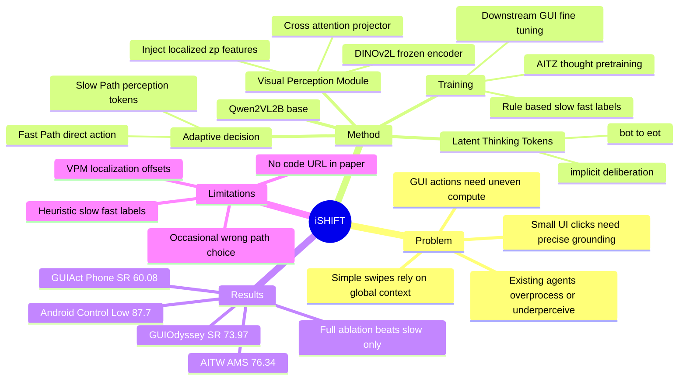

## Summary

iSHIFT 提出一个约 2.5B 参数的 vision-only GUI agent，用 latent thinking tokens 做隐式 deliberation，并在需要精细 grounding 时生成 latent perception tokens 触发 DINO-based Visual Perception Module。核心结果是在 AITW 上达到 76.34 AMS，接近 18B CogAgent 的 76.88，同时在 Android Control Low、GUIOdyssey、GUIAct Phone 等 benchmark 上给出很强的 performance-to-size trade-off。

## Problem & Motivation

GUI agent 需要同时处理两类动作：滑动、返回等可以靠全局上下文完成的 fast actions，以及点击小图标、定位细小 UI 元素等需要精细视觉 grounding 的 slow actions。现有 pixel-based GUI agents 往往统一处理所有动作：要么持续启用高分辨率 perception stack，带来不必要的计算成本；要么对所有任务都使用同样的全局视觉表示，在小目标或密集界面上容易失准。

论文要解决的问题是：能否让一个轻量 MLLM 自己判断何时需要更深 reasoning 和更精细 perception，而不是依赖外部 controller、OCR/segmentation pipeline 或显式文本 CoT。这个问题对 GUI agent 很关键，因为 deployed agent 的瓶颈不只是准确率，也包括每一步交互的 latency、参数规模、以及是否能在简单动作上避免过度处理。

## Method

iSHIFT 的全名是 **Implicit Slow-fast Hybrid Inference with Flexible Tokens**。它以 Qwen2-VL-2B 为 base，在统一 MLLM 内实现 adaptive slow-fast control，而不是把 fast/slow path 拆成外部路由系统。

**Fast Path by default.** 输入是 UI screenshot、用户 instruction 和至多两个最近动作。模型先生成 `<bot> ... <eot>` 之间的 latent thinking tokens，在连续 latent space 中做内部 deliberation，不输出自然语言思考链。如果任务信息足够，模型直接生成 action。

**Slow Path on demand.** 如果模型判断需要更精细视觉信息，它会生成 `<bop>`, `<ctrl>`, `<eop>` 这一组 latent perception tokens。`<bop>` 触发 Visual Perception Module：用 frozen DINOv2-L encoder 提取局部视觉特征，再通过 cross-attention projector 让 image features 与 `<ctrl>` 的 hidden state 交互，得到增强 embedding `zp` 并注入回 MLLM 序列，最后生成 grounded action。

**训练策略.** 作者用规则把训练样本按 perception requirement 改写：需要精确坐标的动作（例如 click）标为 Slow Action，prompt 中加入 latent perception tokens；可以靠全局上下文完成的动作（例如 swipe）标为 Fast Action。latent thinking 的训练分阶段进行：先在带有显式 thought annotations 的 Android in the Zoo 上让模型学习思考位置和模式，再把显式 thought 替换为 latent tokens，并在下游 GUI 数据上 fine-tune adaptive slow-fast strategy。

**实现细节.** 训练在 NVIDIA A100 80GB 上用 AdamW 和 DeepSpeed ZeRO Stage 2；流程包括 cross-attention projector alignment、thought training、downstream fine-tuning 三阶段。作者将 latent thinking token 数设为 8；action history 截断为最近两个动作；DINOv2-L encoder 冻结。

## Key Results

**AITW / Android In The Wild（Action Matching Score, AMS）.** iSHIFT 在 <5B 模型中平均 AMS 最高，为 **76.34**，高于 AutoGUI 4.5B 的 74.27、Qwen2-VL 2B 的 67.24、ShowUI 2B 的 70.04，并接近 >5B 组的 CogAgent 18B（76.88）。分项上，iSHIFT 在 General / Install / Google Apps / Single / WebShop 分别为 **70.6 / 80.82 / 71.64 / 86.03 / 72.60**；其中 General 和 Install 是全表最高，Single 与 WebShop 是 <5B 组最高。

**Android Control 与 GUIOdyssey.** 在 Android Control High / Low 上，iSHIFT 为 **65.6 / 87.7**；High 低于 OS-Atlas 4B 的 67.54，但 Low 是表中最高。GUIOdyssey success rate 为 **73.97**，高于 Aguvis 7B 的 63.8、OS-Atlas 4B 的 56.39、Qwen2.5-VL 3B 的 27.31。

**GUIAct.** 在 Web Single 上，iSHIFT Type accuracy / Success Rate 为 **93.83 / 66.38**，Type accuracy 高于 GUICourse 3.1B 的 91.8 和 GUICourse 9.6B 的 90.9，但 Success Rate 略低于 GUICourse 9.6B 的 66.7。在 Phone subset 上，iSHIFT 为 **79.41 / 60.08**，高于 GUICourse 9.6B 的 73.0 / 58.1。

**Ablation on AITW.** Qwen2-VL-2B baseline 为 67.24 AMS；只加 Latent Thinking Tokens 到 72.54（+5.30）；只用 VPM Slow Path 到 72.71（+5.47）；VPM adaptive 但无 LTT 为 75.48；完整 iSHIFT 为 **76.34**。去掉 VPM cross-attention 后降到 73.40，说明 localized visual features 需要通过 cross-attention 有效接入。强制 slow-only 的 VPM+LTT 版本为 74.58，低于 adaptive iSHIFT，支持“不是越慢越好”。

**Latency / accuracy trade-off.** 在 AITW General 上，Fast 为 2093 ms / 66.64 AMS，Slow 为 2331 ms / 68.2，Adaptive iSHIFT 为 **2229 ms / 70.6**；在 AITW Single 上，Fast 为 2046 ms / 82.55，Slow 为 2323 ms / 85.33，Adaptive 为 **2263 ms / 86.03**。也就是说 adaptive path 比 slow-only 更快且更准，但仍比 fast-only 慢。

**Latent token 与 encoder 选择.** latent token 数为 8 时最好：0 / 4 / 8 / 16 / 20 tokens 对应 AMS **75.48 / 75.72 / 76.34 / 74.09 / 74.04**。VPM encoder ablation 中，DINO 以 **304.4M** encoder 参数达到 **76.34** AMS，高于 Qwen2-VL Image Encoder 的 73.52、CLIP 的 75.29、Siglip-2 的 75.75，且参数少于 Siglip-2 的 881.5M。

## Strengths & Weaknesses

**已知 Strengths.** 论文抓住了 GUI interaction 的真实结构：不是所有动作都需要同等视觉精度。把 slow-fast decision 做成模型内部 token generation，而不是外部 controller，有利于降低系统复杂度；ablation 也显示 adaptive switching 比 always slow 更好。结果覆盖 AITW、Android Control、GUIOdyssey、GUIAct，且主表不仅和同规模模型比，也和 7B-18B GUI agents 比较，performance-to-size 论点有数字支撑。

**已知 failure cases / limitations.** Supplementary 明确报告三类偏差：模型有时会在需要 deeper perception 的任务上选 fast path，有时会在简单任务上选 slow path，Visual Perception Module 也会出现轻微 localization 偏移。作者给出的例子包括 Calendar icon attention slightly offset，以及 YouTube 场景中选择了两个 YouTube icons 中另一个与标注不同但仍可能有效的目标。

**已知 caveats.** 训练数据的 slow/fast 标注来自 rule-based classifier：需要精确坐标的动作被标为 slow，其余标为 fast。这让监督信号简单可扩展，但也把“动作类型”和“感知需求”强绑定；如果某些 swipe、complete、back 等动作其实依赖细粒度状态判断，或者某些 click 在全局上下文中已足够明确，这个 heuristic 可能产生噪声。论文还说 code、config 和 data-processing scripts 会在接收后公开，但正文没有给出具体 repository URL。

**推测.** iSHIFT 的关键 insight 可能不只是 DINO 或 latent tokens，而是把视觉 attention allocation 变成 action sequence 内部的一部分：先 latent assess，再决定是否请求 localized features。这和 [[2605-AutoFocus]] 的 active visual search、[[2606-ReFAct]] 的 visual focusing 有共性：agent 不应默认把整屏一次性编码完，而应学会何时额外看、看哪里、看多细。

**不知道.** 论文没有回答 adaptive path decision 在真实在线设备上的 long-horizon compounding error 会怎样，也没有报告用户可感知 latency、能耗或跨屏幕分辨率的系统开销。GUIAct 和 GUIOdyssey 提供了跨平台信号，但仍不能直接证明它在真实 app 动态状态、权限弹窗、网络延迟或多轮恢复场景中稳定。

## Mind Map

## Notes

- 最值得记住的是 Table 5：adaptive iSHIFT 不是在 Fast 和 Slow 之间折中，而是在两个 AITW split 上同时比 slow-only 更准、更快。这支持一个 first-principles 判断：额外视觉细节在不需要时可能是干扰，而不只是成本。
- 和 explicit CoT GUI agents 的区别也重要。Supplementary 中在 AITZ 训练、AITW 测试的对比显示，Implicit Thinking 在 General / Install / G.Apps / WebShop / Single 上分别为 56.54 / 71.73 / 60.28 / 58.75 / 77.22，而 Chain of Thought 为 46.03 / 64.97 / 49.81 / 49.78 / 66.57；同时 implicit 只用 8 个 tokens，CoT 平均 62 个 tokens。
- 对后续研究的启发：可以把 slow-fast routing 从 action type heuristic 推进到 uncertainty-或 value-of-information-based decision，让模型基于当前屏幕和目标估计“额外 perception 是否会改变 action”。这篇论文证明了方向有效，但还没有证明最优 routing 机制。
