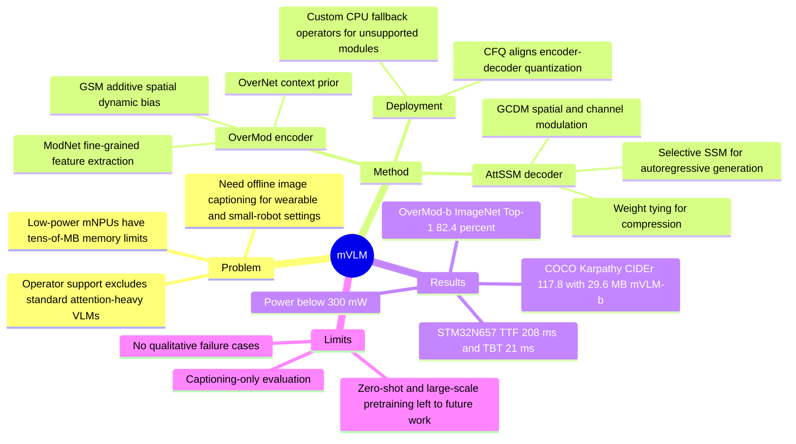

## Summary
µVLM 针对低功耗 µNPU 的几十 MB 内存限制和有限算子支持，设计了一个可部署的 image captioning VLM。核心做法是用 OverMod encoder、AttSSM decoder、Coordinated Full-Parameter Quantization 和自定义 CPU fallback operators，在 STM32N657 µNPU 上实现低内存、毫秒级 captioning，同时在 COCO Karpathy test split 上达到 CIDEr 117.8。

## Problem & Motivation
作者关注的不是通用大 VLM，而是 wearable electronics、小型机器人等 µNPU 设备上的离线 generative AI。论文把 µNPU 定义为 mW 功耗、GOPS 级算力、内存通常只有几十 MB 的低功耗智能处理器；这类平台的瓶颈不只是模型大小，还包括 softmax、multi-head attention、SSM/RNN 等算子的原生支持不足。

现有 image captioning / VLM 方法大多依赖更大的 CNN、object detector、Transformer 或 LLM fusion，模型和峰值 RAM 超出 µNPU 可承受范围；即便是 lightweight VLM，论文表中 SmallCap、ClipCap、I-Tuning 等仍在数百 MB 到约 1GB 量级，并且缺少 µNPU operator support。作者的问题定义很窄：在 µNPU 的内存和算子约束下，能否做一个真实可部署、性能仍接近主流 captioning baseline 的 VLM。

## Method
µVLM 采用 CNN-decoder paradigm，由 OverMod encoder 和 AttSSM decoder 组成。输入图像先经过 OverMod，输出高维 semantic feature map 与 mid-level spatial information map，融合后送入 decoder；decoder 在每个 autoregressive step 用 SSM hidden state 作为 query，对 encoder feature 做轻量动态调制，再和 word embedding 拼接后进入 SSM layer。decoder 还使用 weight tying，把 input word embedding matrix 与 pre-softmax output projection matrix 绑定，用于压缩和 regularization。

**OverMod encoder.** OverMod 的设计来自 “Overview-first, Look-Closely-next”：OverNet 先用 Efficient Static Blocks 快速得到全局 context prior，ModNet 再用 Efficient Dynamic Blocks 在 context prior 指导下做细粒度特征提取。关键模块是 Global Spatial Modulation (GSM)：它不生成完整 dynamic convolution kernel，而是从 context prior 生成 spatial dynamic bias，并以 additive modulation 作用到中间 feature map。论文给出的数值例子中，若 C=192、N=256、kernel=7、目标 feature map 为 7x7，传统 dynamic convolution 需生成约 2.4M parameters，而 GSM 只需约 9.4K parameters，减少超过 250x。

**AttSSM decoder.** decoder 用 Selective SSM 替代 LSTM 作为 sequence modeling core，理由是单 token generation 时 SSM 计算复杂度在 typical setting 下小于 LSTM。为补足视觉条件建模，作者提出 Global Context Dynamic Modulation (GCDM)：一方面用 SSM hidden state 生成 spatial dynamic bias，加性调制 encoder feature；另一方面用 SE-style channel modulation 做 channel-wise recalibration。作者强调 GCDM 的算子由 convolution、element-wise op 和 pooling 等 µNPU 友好操作构成，避免 standard cross-attention 在每个 decoding step 对 encoder tokens 做重投影的开销。

**Hardware-aware deployment.** 由于 encoder 和 decoder 需要分段部署，独立量化会造成接口处的 feature distribution mismatch。Coordinated Full-Parameter Quantization (CFQ) 先用 calibration dataset 量化 encoder，再用量化 encoder 输出生成 intermediate calibration set 来量化 decoder，使 decoder 的量化参数对齐真实部署时接收的输入分布。对 µNPU 不支持的模块，作者在 STM32Cube.AI custom layer stubs 上实现了 GRN、LayerNorm、Embedding、SSM Core、Discretization、SSM Scan 等 CPU fallback operators，并使用 LUT、CMSIS-DSP/NN、inline Assembly 和 fixed-point math 做优化。

## Key Results
- **MS COCO Karpathy test split**：µVLM-b 大小 29.6 MB，支持 µNPU operators 且 hardware-aware，达到 BLEU-1 78.3、BLEU-4 36.1、METEOR 26.9、SPICE 20.8、CIDEr 117.8。µVLM-s 为 21.2 MB、CIDEr 109.1；µVLM-t 为 13.8 MB、CIDEr 96.4。
- **与 captioning baselines 对比**：RFNet 约 500 MB、CIDEr 121.9；Up-Down 约 400 MB、CIDEr 120.1；SmallCap 872 MB、CIDEr 121.8；Distill VLM 162 MB、CIDEr 120.8；NIC 约 80 MB、CIDEr 92.0。µVLM-b 的 CIDEr 低于 RFNet / Up-Down / SmallCap，但模型大小压到 32 MB 以内，并且是表中唯一同时标为 operator-supported 与 hardware-aware 的模型。
- **ImageNet-1K encoder evaluation, 224x224**：OverMod-t 为 5.2M parameters、1.1G FLOPs、Top-1 Acc. 79.2；OverMod-s 为 12.2M、1.4G、81.3；OverMod-b 为 18.1M、2.1G、82.4。作为参考，EFormer-L1 为 12.3M、1.3G、79.2，LSNet-S 为 16.1M、0.5G、79.0，MambaOut-Femto 为 7M、1.2G、78.9。
- **Ablations**：OverMod ablation 从 75.8% Top-1 Acc. 提升到 79.2%，支持 ED Block、Dilated RepConv、GRN、Layer Scale 等组件的贡献；作者还报告 SE module 加入 OverNet 或 ModNet 会使性能下降到 79.0，解释为 channel attention 与 OverMod dynamic modulation 冗余或冲突。µVLM ablation 的 CIDEr 从 95.5 提升到 117.8，中间结果包括 101.4、107.1、115.2，表明 dynamic convolution、multi-scale feature fusion、spatial modulation、channel modulation 均有正贡献。
- **STM32N657 µNPU deployment**：量化后 OverMod-b encoder 为 21.4 MB、latency 187 ms；AttSSM decoder 为 8.2 MB、latency 21 ms；LSTM with Bahdanau attention baseline decoder 为 9.3 MB、latency 32 ms。作者报告 greedy decoding 下 Time to First Token 为 208 ms、Time Between Tokens 为 21 ms，推理功耗低于 300 mW。

## Strengths & Weaknesses
**已知。** 这篇论文的主要贡献是把 VLM 设计问题具体落到 µNPU 的内存、算子和量化接口约束上，而不是只做一个小模型。OverMod/GSM 的价值在于把 dynamic attention 的目标从完整 kernel 改成 spatial bias，降低生成参数量；AttSSM/GCDM 的价值在于用 SSM 和轻量 modulation 避免 Transformer-style attention 的算子和内存成本。实验也不只报告 COCO 指标，还给出 STM32N657 上的模型大小、latency 和功耗，这使部署 claim 比纯压缩论文更可检查。

**已知的局限。** 任务范围是 image captioning，评估主要集中在 MS COCO Karpathy split 和 ImageNet-1K encoder pretraining；论文没有展示 VQA、OCR、GUI grounding、multimodal reasoning、interactive agent 或 embodied control 任务。作者明确把 large-scale pre-training 和 zero-shot / training-free capabilities 留给 future work，因此不能把 µVLM 的结果外推为通用小型 VLM 能力。µVLM-b 的 CIDEr 117.8 接近但没有超过 RFNet 121.9、SmallCap 121.8、Distill VLM 120.8、Up-Down 120.1；它的优势主要是内存与硬件可部署性，而不是绝对 captioning SOTA。

**不知道。** 论文没有报告 qualitative failure cases，也没有给出真实 wearable / robot 应用中的 end-to-end user study。自定义 CPU fallback operators 的工程细节足以说明方向，但缺少跨 µNPU 平台的可移植性评估；STM32N657 以外的平台是否能复现同样 latency / power tradeoff，论文没有证明。CFQ 的收益也主要通过整体部署结果与方法描述支撑，缺少更细的独立量化 ablation 来量化它相对 naive independent quantization 的增益。

**我的判断。** 对 GUI-agent 方向的直接价值有限，因为它不处理 screen grounding、UI action 或 long-horizon interaction；但对 VLM / embodied-on-device 方向有参考价值，尤其是“模型结构必须和硬件 operator set 共设计”这一点。rating=3：它是一个清晰的 hardware-aware VLM case study，但任务窄，未覆盖更高层的 multimodal reasoning 或 agentic capabilities。

## Mind Map

## Notes
- 这篇论文可作为 “hardware-aware VLM architecture” 的案例，而不是 GUI agent 模型论文。后续如果考虑 on-device agent，需要特别关注：µNPU 支持的 operator set 会直接限制可用 attention / memory / retrieval / planner 结构。
- 一个值得追问的问题是：如果目标从 COCO captioning 换成 GUI screen understanding，OverMod 的 context-prior + spatial-bias 机制是否足以保留小文字、icon、layout relation 等细粒度 UI 信息。本文没有给出证据，因此只能作为待验证假设。
- 另一个潜在启发是 CFQ：对于多模块 agent 或 VLM pipeline，模块边界处的 quantization distribution mismatch 可能比单模块量化更重要。本文提出的 sequential calibration 思路简单，但需要更细 ablation 才能判断贡献大小。
