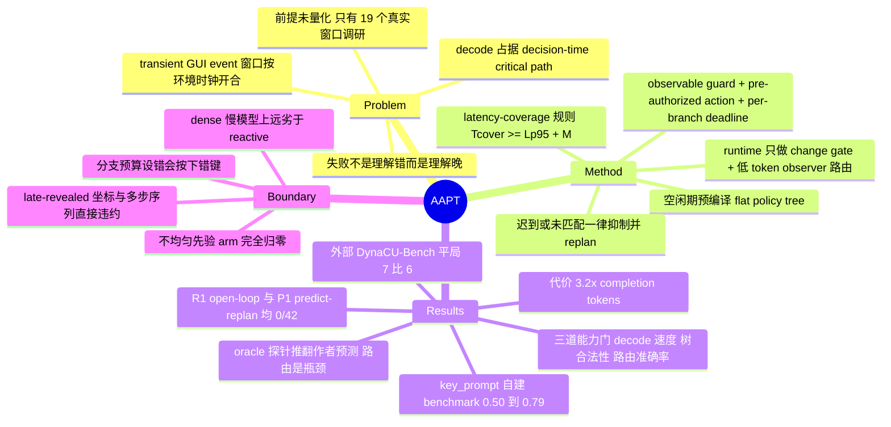

## Summary

论文把 computer-use agent 在 transient GUI event 上的失败重新归因为**调度失败而非推理失败**——autoregressive decoding 占据了 decision-time critical path，动作算对了但窗口已关；提出 Adaptive Anticipatory Policy Trees (AAPT)：在空闲期用同一个 frozen 多模态模型预编译带 observable guard、pre-authorized action 与 per-branch deadline 的扁平 policy tree，事件发生时只用一次低 token 的 observer 调用做分支路由，critical path 上零生成。在作者自建的 `key_prompt` 计时 benchmark 上，650 ms 竞争窗口的成功率从 0.50 提升到 0.79（exact McNemar p=1.8e-3）；但在外部 DynaCU-Bench 上与 reactive baseline 打平。

## Problem & Motivation

主流 computer-use agent 是「截图 → 调多模态模型 → 执行一个动作 → 再观察」的反应式循环。当界面不等人时——boot prompt、自动消失的 dialog、短时效认证请求、transient toast、反应类游戏状态——动作窗口按环境的时钟开合，而不是按模型的时钟。作者的观察是：典型失败不是理解错了，而是**理解晚了**。

对这个现象有两种解释：(1) agent 没能预判事件；(2) agent 预判对了，但败在计算发生的位置——大模型生成一次回复的时间长于窗口开启时间，而按帧率调用大模型不可行。论文的实验设计就是固定模型、任务、信息，只操纵一个变量：**生成是否发生在 decision-time critical path 上**。

值得注意的是，论文**没有给出「transient event 导致的失败占现有 agent 失败多大比例」这类量化前提**。它的问题合法性论证走的是另一条路：Appendix 15 调研了 19 个有官方文档的真实响应窗口（BIOS fast-boot F2 约 0–200 ms、SF3 parry 83–167 ms、Android double-tap 300 ms、Windows double-click 500 ms、Android Toast 2–3.5 s、GRUB 5 s、TOTP 30 s 等），把它们与实测 reactive p50（567–730 ms）对齐，论证亚秒级窗口在部署系统中确实存在（反应式循环结构性出局），而几秒以上的窗口根本不需要 anticipation。这是一个诚实的边界论证，但它证明的是「存在这样的窗口」，不是「这类失败在当前 GUI agent 的失败构成中占多大份额」。

## Method

**成功判据**：`success = 正确动作 ∧ 动作在 deadline 之前`。

**Latency-coverage 规则（Eq. 1）**：设 $L_{p95}$ 为 planner 端到端延迟的 95 分位、$M$ 为安全裕度（全部实验固定 500 ms）、$T_{cover}$ 为已编译树保持有效的墙钟区间，则要求 $T_{cover} \geq L_{p95} + M$。论文强调这不是调参启发式，而是假设的定量内容：它从独立测量量里直接预测「准备预算低于此值优势不可能存在、高于此值优势出现」的临界点（实测 crossover 落在 $L_{p95}+M \approx 2.4$ s 附近）。树的声明覆盖时长若低于实测预算（此处 3500 ms）在 validation 阶段直接拒收。

**树表示**：节点是七元组 $(z_v, C_v, A_v, D_v, Q_v, R_v, F_v)$——预测状态描述、observable guard、pre-authorized 原子动作、动作 deadline、校准置信度、风险等级、fallback。树是**扁平（flat）而非递归**的：每个节点的 guard 独立对当前观测求值，路由退化为对同层 guard 的一次分类，而不是多步遍历。这个设计选择是 load-bearing 的——弱 schema-follower 在同样时间预算下无法可靠产出正确的递归结构。

**自适应分支（Eq. 2-3）**：置信度高且低风险时单继承；结果不确定时开 $m_v$ 条并行分支，$m_v$ 取覆盖概率质量 $\rho$ 的最小分支数，上限 $K_{max}$；两个条件都不满足时不生成子节点，交给 runtime abstain path。**关键是两套不同的强制机制**：结构预算（$K_{max}$、最大深度、节点总数、`cover_ms`、风险相关的 open-loop horizon）由 post-hoc validator 数值强制；而决策阈值 $\tau_c, \tau_r, \rho$ 与分支数 $m_v$ **不做 runtime 强制**，只是写进 planner prompt 的设计规则，是否满足取决于 planner 对 prompt 的服从。

**Runtime**：30 FPS 截屏 + 像素差 change gate（≥0.5% 像素灰度差 ≥20 判为变化，每 500 ms 强制透传一个 probe 帧防止静止画面永久静音 observer），gate 最多引入一帧间隔（≤33 ms）。变化帧连同当前 eligible 的 branch guard 送进低 token observer，返回固定 schema 的 `{branch_id, confidence, reason}`，`NONE` 为 abstain 值。三道抑制检查：branch 当前 eligible、planner 存储的该分支置信度过阈 $\tau_m$（=0.45）、决策 age 不超过分支 deadline。动作还必须在 pre-authorized allowlist 上。任何 no-match / 歧义 / 超时 / 校验失败都回落到 replanning，**迟到的决策是被抑制而非执行**。

**服务不变量**：两个角色都在 vLLM `guided_json`（xgrammar 后端）下解码，planner temperature 0.2、scalar-only action schema，validation 失败触发一次有界重采样。全流程无任何 fine-tuning，planner 与 observer 在每个 AAPT run 内是同一个 frozen checkpoint。

## Key Results

**评测台是作者自建的**。论文明说 OSWorld / WebArena / Mind2Web / AndroidWorld 都不提供隔离 deadline-sensitive 动作选择所需的毫秒级控制，因此自建 `key_prompt`：可调 250–2000 ms 事件窗口、无 judge model 的服务端确定性判分、对事件前信息的严格控制。事件是固定 750 ms 延迟后出现的 transient prompt，请求三个按键之一，按键由隐藏的 seed 派生调度决定。全部比较采用 per-seed 配对设计 + exact two-sided McNemar，seed 从预注册的不相交区间取且永不复用，端点全部预注册。

| 结论 | 数字 |
|:--|:--|
| Declared-primary（650 ms，Holo-3.1-35B-A3B，42 pairs） | T2 33/42 (0.79) vs R0 21/42 (0.50)，p=1.8e-3 |
| Critical path 延迟 | R0 完整往返 567 ms p50（部分 block 730 ms）；AAPT event-time 路径 273–325 ms p50 |
| Planner 编译（off critical path） | ~1.81 s p50，283.5 completion tokens |
| Open-loop (R1) / predict-and-replan (P1) | **两者在竞争窗口均为 0/42** |
| 总算力代价 | T2 完成 token 为 R0 的 **3.2×**（342.8 vs 105.8），单 trial 墙钟 3.32 s vs 1.65 s |
| 未调优通才模型复现 | Qwen3.6-35B-A3B，pooled 126 pairs：0.778 vs 0.341，p=4.9e-13 |
| 外部 benchmark（DynaCU-Bench, 39 tasks） | **平局**：reactive 7/39 vs AAPT 6/39，p=1.0 |

**机制隔离**。R1 和 P1 之所以归零有可测量的 critical-path 原因：反应式家族的每个条件都需要两次模型调用（先 `WAIT` 再决策动作），而 anticipatory prompting 反而拉长了第二次输出——实测 per-decision path 是 T2 observer 273 ms/30 tokens，R0 411 ms/48，R1 459 ms/60，P1 484 ms/66。**提早行动本身不解决问题；anticipation 只有在把推理挪出 critical path 时才转化为延迟收益**。

**三道能力门与路由的因果性**。六个 checkpoint 的门矩阵显示，AAPT 收益只出现在同时通过 (a) observer decode <1 s、(b) flat-tree schema validity、(c) branch accuracy ≥0.85 的模型上。UI-Venus-1.5-30B-A3B 快且 schema 合法但路由错（branch acc 0.39），配对块打平；一个**预注册的 oracle 探针推翻了作者自己的预测**——ground-truth 路由把平局翻成 22/42 vs 12/42（p=0.021）。作者据此把结论收窄为条件式的：当树覆盖率跨过 reactive baseline 时，路由质量单独就能分开平局与胜局，且 gate (c) 与 planner outcome-recall 共同约束。

**sizing 规则的定量验证**。$k \times n$ sweep 显示 knee 出现在分支预算恰好等于结果集大小时：三结果家族 (k=3,n=1) 42/42 全胜（19/0 discordant, p=3.8e-6），k<3 全部因 planner validity 跌破 0.85 门而失败；五结果家族复现出 knee 右移到 k=5。prep-budget sweep 也符合 Eq. 1 的预测：prep 0.5–1 s 时 T2 0/42（事件在编译中途触发，无树可用），prep 2 s 时与 reactive 打平（36/42 vs 37/42），prep 4 s 时 42/42。

**几个诚实报告的负面结果**（论文自己的 limitation register 与 appendix 明列）：
- 慢速 dense 模型上 AAPT 远劣于 reactive：EvoCUA-32B T2 0/43 vs R0 22/43；UI-Ins-32B T2 0/50（R0≈0.5）。论文归因为未通过 capability gate（decode >1 s、validity <0.85），而非把它当作 AAPT 的危害。
- 不均匀先验分支的 arm **完全归零**：T2 0/42 vs R0 39/42。原因是 planner 把 outcome prior 直接抄进分支 `confidence` 字段，与 runtime 的置信度下限 $\tau_m=0.45$ 相撞，把每一次路由都判成 `low_confidence` 抑制掉——回放显示其中 40/42 本可按对键。作者选择原样报告而非打补丁重跑。
- **「零错误动作」是预算设置的属性而非通用安全保证**：分支预算设错时确实按下错误按键，k=1 时 13/42、k=2 时 12/42、k=7 时 15/42，而匹配预算 k=5 时 0/42。欠预算的 planner 写出泛化 guard（"Prompt visible" 而非 "Prompt requests F12"），超预算的 planner 用带默认动作的 catch-all 分支填满剩余槽位。
- 复现性陷阱：仅仅改变 vLLM `torch.compile` 的 cache key（加 `--revision` 和一个 offline flag），在权重、prompt、sampler、像素完全相同的情况下把 tree validity 从 88.1% 打到 18.3%。作者因此把 compile-cache key 纳入实验条件并逐次核验。

## Evidence Ledger

| Claim ID | Claim | Type | Source locator | Evidence excerpt | Status |
|:--|:--|:--|:--|:--|:--|
| C1 | 主证据链跑在作者自建的 `key_prompt` 计时 benchmark 上，理由是现有 GUI benchmark 缺毫秒级控制 | benchmark-setting | §4.1 | "do not provide the millisecond-scale control required to isolate deadline-sensitive action selection. We therefore built key_prompt" | source-verified |
| C2 | 650 ms declared-primary：T2 33/42 (0.79) vs R0 21/42 (0.50)，p=1.8e-3 | number | §5.1 Declared-primary confirmation | "T2 33/42 (0.79) against R0 21/42 (0.50), p=1.8×10−3. This is the headline result" | source-verified |
| C3 | R0 完整往返 567 ms p50；AAPT event-time 路径 273–325 ms p50；planner 编译 ~1.8 s off critical path | number | Fig.1；§5.2；App.17.1 Table 7 | "screenshot + decide + act (567ms p50)"; "compiles + validates policy tree (~1.8s p50)"; "325 ms p50" | source-verified |
| C4 | Open-loop (R1) 与 predict-and-replan (P1) 在两个竞争窗口均 0/42 | comparison | Fig.4；§5.2 | "R1 and P1 also act before a full round trip yet score zero" | source-verified |
| C5 | AAPT 总 completion token 为 reactive 的 3.2×（342.8 vs 105.8），墙钟 3.32 s vs 1.65 s | number | Table 12（App.18.3） | "Total completion tok 105.8 342.8; Wall time per trial (s) 1.65 3.32" | source-verified |
| C6 | 外部 DynaCU-Bench 上是平局：reactive 7/39 vs AAPT 6/39，p=1.0；AAPT 的胜局全在可预枚举的 dashboard 类 | benchmark-setting | §5.5；Table 13（App.18.5） | "reactive 7/39 versus AAPT 6/39, with 5/4 discordants (p=1.0)" | source-verified |
| C7 | 预注册 oracle 探针推翻作者自己的预测，把 UI-Venus 平局翻成 22/42 vs 12/42（p=0.021），指认 routing 为因果瓶颈 | causal-mechanism | §5.4；App.14 | "The prediction failed: O1 succeeded on 22/42 vs. R0 12/42 (discordant 13/3, exact McNemar p=0.021)" | source-verified |
| C8 | 未调优通才 Qwen3.6-35B-A3B 复现：pooled 126 pairs，0.778 vs 0.341，p=4.9e-13 | number | §5.3；Fig.6（App.18.4） | "pooled 126 pairs give T2 0.778 vs. R0 0.341 (discordant 60/5, p=4.9×10−13)" | source-verified |
| C9 | 「零错误动作」依赖分支预算设置：k=1 时 13/42、k=2 时 12/42、k=7 时 15/42 按下错键，k=5 时 0/42 | number | App.12 EXP-A | "wrong keys were actually pressed in 13/42 trials at k=1, 12/42 at k=2, and 15/42 at k=7" | source-verified |
| C10 | 论文**未**给出「transient event 失败在现有 agent 中占比多少」的任何量化数字；问题合法性由 19 个真实响应窗口的调研支撑 | benchmark-setting | Fig.3；App.15 Table 5（全文检索确认为缺失） | "we surveyed documented response windows... against the paper's contested band and the measured reactive p50" | source-verified |
| C11 | 慢速 dense 模型上 AAPT 显著劣于 reactive：EvoCUA-32B T2 0/43 vs R0 22/43；UI-Ins-32B T2 0/50（R0≈0.5） | number | Table 2 | "EvoCUA-32B ... T2 0/43 vs. R0 22/43"; "UI-Ins-32B ... T2 0/50 (R0≈0.5)" | source-verified |
| C12 | 不均匀先验 arm 完全归零：T2 0/42 vs R0 39/42，因 planner 把 prior 写进 confidence 字段撞上 $\tau_m$=0.45 下限 | number | App.12 Uneven outcome probabilities | "The paired endpoint, reported verbatim, was zero: T2 0/42 against R0 39/42" | source-verified |
| C13 | prep-budget sweep 的 crossover 落在 $L_{p95}+M \approx 2.4$ s：0.5–1 s 时 0/42、2 s 打平、4 s 时 42/42，且失败全为 miss | number | App.13 EXP-B；Table 10 | "confirmed: 0/42 at 0.5–1s, tie at 2s, 42/42 at 4s; all failures misses" | source-verified |
| C14 | 全文未给出任何代码、数据或 benchmark 的开源链接与释出承诺 | license-code | 全文检索（无 locator，属缺失） | 全文无 GitHub / HuggingFace dataset 链接，也无 "code will be released" 表述 | source-verified |
| C15 | $K_{max}$ 是需手工匹配结果集大小的正确性参数；$\tau_c, \tau_r, \rho, m_v$ 不做 runtime 强制，只写在 planner prompt 里；每模型至多一轮 prompt adaptation | causal-mechanism | §3.3；App.16.1；§4.3 Prompt-adaptation policy | "τc, τr, ρ, and the branch count mv are not runtime-enforced; they are design rules realized as planner-prompt instructions" | source-verified |
| C16 | planner 与 observer 在每个 run 内是同一个 frozen checkpoint，全流程无 fine-tuning | causal-mechanism | §4.1；§4.3；App.19 | "the same checkpoint serving as planner and observer within each AAPT run"; "No fine-tuning was performed anywhere" | source-verified |

## Strengths & Weaknesses

**方法论纪律远超同类工作**。预注册端点、per-seed 配对 exact McNemar、seed 区间烧毁不复用、把两个失败的预测（700 ms primary 打成 n.s.、oracle 探针推翻自己的假设）原样留在 prediction ledger 里、把归零的 arm 逐字报告而不打补丁重跑——这在 GUI agent 领域是罕见的。把 `torch.compile` cache key 认定为实验条件，并给出 88.1% → 18.3% 的 validity 崩塌证据，本身就是一条对整个 thresholded agent 评测领域有用的警示。

**问题重构比方法更值钱**。论文最有价值的贡献不是 AAPT 这套机制（作者自己在 §2 就承认"AAPT 的任何单个组件都不新颖"——contingency planning、behavior tree、speculative execution 都是老东西），而是把 "correct but late" 从工程杂音提升为一个可被隔离、可被证伪的失败模式，并给出 $T_{cover} \geq L_{p95}+M$ 这个从独立测量量预测收益出现位置的定量规则。R1/P1 归零是本文最强的一击：它排除了"只要提早行动就行"这个自然的替代解释。

**但外部效度是真的薄**。主证据链跑在一个自建的三键 transient prompt 微 benchmark 上，作者也承认"这个场景是为隔离机制设计的，不代表广义 computer use"。唯一的外部 benchmark（DynaCU-Bench）是平局，且分类学 dissociation 只建在 4 vs 5 个 discordant 任务上、AAPT 的胜局全部集中在一个类别。换言之：**机制被证明了，实用性没有**。

**问题前提本身没有量化。** 论文从头到尾没有回答「现有 CUA 的失败里有多大比例是 timing 失败」。它用 19 个真实响应窗口的调研做替代论证，这在方向上是对的（亚秒窗口在部署系统中确实存在），但它无法排除"这类窗口在实际 agent 任务分布里极其稀有"的可能。DynaCU 上的平局某种程度上正是这个隐忧的实证：在一个专门为动态 GUI 设计的外部 benchmark 上，可预枚举的 deadline 任务也只占 9/39。

**算力是被搬走而不是被消除的，且总量更大**。论文对此完全坦诚：3.2× completion tokens、2× 墙钟时间。它明确把 AAPT 定位为 latency-compute trade 而非普适加速——只在 reactive 延迟分布与任务 deadline 重叠、且可用静默时间超过 Eq. 1 时才经济。这是正确的表述，但也意味着 AAPT 的适用带其实很窄：窗口低于该带 reactive 结构性出局（AAPT 有用），高于该带 reactive 就够了（AAPT 是纯浪费）。

**分支预算是一个手工设的正确性参数，这是最实质的工程隐患**。$K_{max}$ 必须等于可枚举结果集的大小，设小了 planner 写泛化 guard 导致误触发，设大了 planner 用带默认动作的 catch-all 填槽也导致误触发——两侧都把 miss 转成 wrong action。而在真实 GUI 里，"这一步有几个可能结果"恰恰是事先不知道的量。$\tau_c, \tau_r, \rho$ 只靠 prompt 约束不做 runtime 强制，进一步说明这套 contract 的边界是软的。不均匀先验 arm 的完全归零（planner 把 prior 抄进 confidence 撞上 $\tau_m$ 下限）正是这种软 contract 的典型故障：两个语义不同的量共用一个字段，没有任何机制阻止它。

**成立条件很硬**：必须有充足静默期（≥ $L_{p95}+M$，实测 ~2.4 s）、必须是 MoE 快解码模型（dense 32B 模型的 ~2.5 s decode 直接出局，且此时 AAPT 比 reactive 差得多）、guard 与动作必须在事件前可绑定（late-revealed 坐标与多步序列直接违约，`click_target` 场景因此根本没跑成配对比较）。

**对领域的影响**：最可复用的不是 AAPT 本身，而是三件事——(1) 把 deadline 作为 GUI agent 评测的一等公民，现有 OSWorld/AndroidWorld 系 benchmark 完全没有这个维度；(2) `{valid tree} ∩ {outcome covered} ∩ {correct route} ∩ {route before deadline}` 这个 anticipation 的组件化分解，把"模型能不能预判"换成了可分别测量的 pipeline 门；(3) compile-cache key / 服务栈延迟分位作为 agent 结果复现的必要 provenance。论文自己指向的下一步——判断"下一次状态转移是否可预枚举"的 hybrid controller——才是真正有意思的问题，而它在本文里还是空的。

## Mind Map

## Notes

**与 vault 已有工作的关系**：

- [[Papers/2604-DynamicGUI]]（DynamicGUIBench）与本文引用的 living-screen benchmark 属于同一条"GUI 不再静止等待 agent"的线索。本文的定位是在观测层之上加一层条件执行层——DynamicGUIBench 改进的是 agent 看到什么，AAPT 改进的是看到之后多快能动。两者正交，值得在 CUA-Survey 里并列。
- [[Papers/2411-WebDreamer]] 与 [[Papers/2600-MobiledreamerGenerativeSketchWorld]] 是 GUI world model 路线：预测未来 UI 状态来给候选动作打分。本文的区分点很清楚——那些工作里"想象的未来"是在决策时被消费一次的 deliberative context，没有 observer 把实时帧路由进预备好的树，horizon 也不由 planner 自己的 decode 延迟决定。
- [[Papers/2602-ActionEngine]] 与 [[Papers/2409-AgentWorkflowMemory]] 属于 verified-replay / procedural memory 家族，要求轨迹已被经历过；AAPT 合成的是针对**未见过**未来的短命 contingency policy。作者明确把"把反复验证过的 AAPT 子树晋升为长期 policy memory"列为互补的未来工作——这是一个 vault 里可以顺着往下想的接口点。
- 本文用 [[Papers/2607-EvoCUA15]] 的 EvoCUA-32B 作为 gate (a) 边界模型（decode ~2.5 s，T2 0/43 vs R0 22/43）。这提示一个之前没注意到的维度：**GUI 专用微调对解码速度没有帮助，而解码速度在 deadline 敏感场景里是硬门槛**；MoE 相对 dense 32B 大约 7× 的解码优势在这里直接决定成败。

**遗留疑问**：

1. 论文的核心 gap 是它自己指出但没做的那个 hybrid controller：如何在决策前判断"下一次转移是否可预枚举"。这个判定本身如果需要一次模型调用，就又回到 critical path 上了——这里可能藏着一个真问题。
2. `confidence` 字段的双重身份（校准的动作置信度 vs outcome prior）造成整条 arm 归零。作者给出的修复方向（分离 branch prior 与 confidence，或改用 observer-match confidence 门控）没有实验验证。这类"两个语义不同的量共用一个 schema 字段"的故障在 structured-output agent 里应该相当普遍。
3. observer headroom 约 0.14–0.17（O1−T2），说明编译出的树里含有的价值大于实时路由能提取的。作者建议蒸馏 guard matcher 或对简单分支走 OCR/template 路由——后者其实指向一个更朴素的问题：为什么这类分支路由需要多模态大模型？
4. 论文的 copyright 行是 "Copyright © 2027, AAAI"，说明这是按 AAAI 模板准备的投稿；arXiv 版本尚无 venue。
