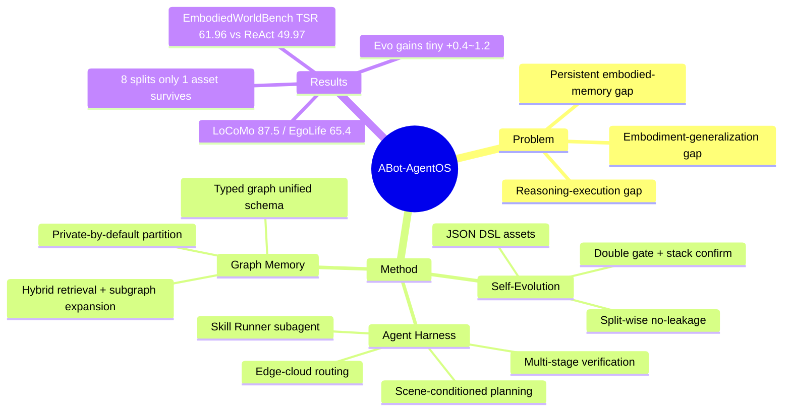

## Summary

高德 AMAP CV Lab 的机器人 Agent OS 工业技术报告：在 foundation model 与机器人硬件之间插入一层通用 agent 层（verification-aware harness + edge-cloud dual-LLM），配统一 typed graph 的 lifelong multi-modal memory，并用 split-wise gated 的 failure-driven self-evolution loop 持续修补 memory pipeline；在自建 EmbodiedWorldBench 上 TSR 61.96%（ReAct baseline 49.97%），在 LoCoMo/EgoLife 等 5 个 memory benchmark 上达到或接近 memory-based SOTA。

## Problem & Motivation

作者指出现有 foundation-model 机器人系统的三个 gap：

1. **Reasoning-execution gap**：模型输出直接映射到动作或依赖 monolithic pipeline，缺少做 task decomposition / tool invocation / verification / recovery 的中间 agent 层；
2. **Embodiment-generalization gap**：系统与特定硬件、控制 API、环境假设紧耦合，跨本体迁移成本高；
3. **Persistent embodied-memory gap**：short-term buffer、text-only cache、任务专用 memory 模块无法跨长期交互保存 multi-modal、relational、source-grounded 的经验。

理论动机是 Dual-System Theory：快速 perception-action policy + 慢速 deliberative reasoning 的分层组合。

## Method

**1. Agent Harness（verification-aware ReAct loop）**

- **Scene-conditioned task planning**：主 LLM 做 semantic planner，基于当前场景/地图/机器人状态/历史/可用 skill 解释指令，同一指令在不同 context 下产生不同执行策略；
- **Skill Runner**：context-isolated subagent 承接持续性局部执行（subgoal、近期观测、skill 状态、失败尝试、恢复策略都在隔离 local context 中），主 LLM 只收压缩摘要——维持全局任务状态一致的同时下放 procedural detail；
- **Multi-stage verification**：runtime（检测 stagnation/碰撞循环）、skill-level（检查子任务是否满足语义目标而非仅 tool 正常返回）、finish-time（终止前对照原始指令核验完成度）三级；
- **Edge-cloud routing**：edge 端 Tiny LLM 处理常规轮次，复杂推理按学习到的 routing policy 升级到云端 Large LLM。

**2. Universal Multi-modal Graph Memory**

- Typed graph 𝒢=(𝒱,ℰ)：node 为 entity/evidence unit（含 source container、place、session、semantic event 等类型），edge 编码 temporal / containment / observation / participation / location / identity / spatial / interaction / provenance 关系；每个 node 带 schema version、time reference、evidence summary、confidence、provenance；
- **统一 schema 写入**：video/egocentric stream、dialogue、multi-modal session 全部归一化到同一 source-grounded graph schema；selective writing 优先记录 identity、object location、state change、social commitment、temporal fact 等对未来任务有用的信息；
- **Hybrid retrieval**：seed 打分 s(q,v)=λ_sem·s_sem+λ_lex·s_lex+λ_meta·s_meta+λ_type·s_type（embedding 相似度 + 词面重叠 + 时间/来源/模态元数据 + node 类型偏好），再沿 typed edge 在深度/token 预算内扩展成 local evidence subgraph 供作答；
- **Edge-cloud memory partition**：private-by-default，仅显式分类为 shareable 的公共低敏感项（地图、路障、静态地标）上云；隐私 gating 声称 >99% 分类准确率。

**3. Failure-Driven Lifelong Self-Evolution**

- Split-wise 协议：在 disjoint splits 𝒟₁…𝒟_T 上，每个 split 跑完后 Diagnose(traces)→Propose→Compile→Gate 产生候选 evo-asset；**asset 只能用于后续 split（no-leakage）**，把 self-evolution 变成累积性 lifelong 过程而非一次性 post-hoc repair；
- Asset 是受约束的 **JSON DSL 记录**（非任意代码），声明 target layer、触发条件、允许动作、安全约束、provenance、validation 结果、version id；可作用于 memory writing / evidence selection / frame selection / temporal grounding / entity matching / answer composition 六个层；
- 双重 gate：Accept(a)=𝕀[ΔS_target≥τ_gain ∧ ΔS_reg≥−τ_reg]，要求目标类提升同时受保护类别回退不超容忍度；candidate gate 通过后还需整个 stack 通过确认，否则已接受 asset 被 deprecate。

**4. 其他**

- **EmbodiedWorldBench**：基于 UE5/UnrealZoo 的 photo-realistic 仿真 benchmark，16 scenes（室内/室外/混合）、4 难度级、200+ tasks（导航、object search、NPC 对话、动态事件），指标 TSR/GCR，几何条件用确定性检查、语义条件用 LLM judge；
- **训练 pipeline（只描述不释出结果）**：text-based 环境构建 → teacher 轨迹蒸馏 + LLM-as-a-Judge 过滤 → SFT → GiGPO RL；self-evolving reward engine 经 Meta-Judge 精化后 human alignment 从 ~60% 提至 90%+。

## Key Results

**Agent 评测（EmbodiedWorldBench subset，Table 1）**：

| Agent | Model | TSR | GCR |
|:------|:------|:----|:----|
| ReAct | Qwen3.6-Plus | 49.97% | 57.95% |
| ABot-AgentOS | Qwen3.6-Plus | **61.96%** | **68.79%** |
| ABot-AgentOS | DeepSeek-V4-Pro | **68.18%** | **74.62%** |

同 backbone 下分层架构带来 +11.99% TSR。

**Memory 评测（5 个 benchmark，Static = 未开 self-evolution）**：

| Benchmark | ABot Static | 最强 memory baseline | 非 memory 参照 |
|:----------|:-----------|:--------------------|:--------------|
| LoCoMo | **87.5**（+evo 88.7） | Mem0 85.6 | GPT-5.4 full-context 84.4；Human 87.9 |
| OpenEQA EM-EQA | 59.9 @24f（+evo 60.4） | GaussExplorer 57.8 | GPT-5.4 Direct VQA @24f **74.1** |
| Mem-Gallery | 88.6（+evo 89.0） | MemGPT 87.6 | full-context 92.6 |
| NExT-QA Acc@All | 76.5 | GraphVideoAgent 73.3 | Qwen3.6-Plus direct QA **81.9** |
| EgoLifeQA | **65.4**（1FPS→1 frame） | EGAgent-Gemini2.5Pro 57.5（50 frames） | — |

**Self-evolution trace（OpenEQA 8-split，Table 9）**：全程提出约 16+ 个候选 asset，最终只有 split_00 的 1 个 retriever asset（room-anchor/last-seen ranking，target delta +0.800、global delta +0.044）存活；split_03/05/07 三个通过 candidate gate 的 asset 均因 stack 确认失败被 deprecate，其余全部被拒。

## Strengths & Weaknesses

**Strengths**

- **Self-evolution 协议是全文最有价值的部分**：split-wise no-leakage + 双重 gate（target gain ∧ regression tolerance）+ 受约束 JSON DSL（禁任意代码生成），是对 [[2509-Misevolution]] 所警示风险的一次认真的工程化回应——用保守 gating 换演化安全性，且 Table 8/9 诚实展示了绝大多数候选被拒和已接受 asset 被回滚的完整 trace；
- **EgoLifeQA 65.4 是真正亮眼的数字**：只用 1 frame 击败用 50 frames 的 EGAgent-Gemini2.5Pro（57.5）近 8 个点，说明 graph memory 对长时程 egocentric 经验的结构化压缩确实有效；
- 报告诚实：把 full-context / direct VQA 上界摆在表里，明确承认 OpenEQA 上 memory pipeline 不敌 direct VQA，limitation 一节具体（VLM 观测混淆人和物、室内外连通区域自定位错误等）。

**Weaknesses**

- **叫 "Robotic Agent OS" 却零真机实验**：agent 能力只在自建 UE5 仿真 benchmark 上评，且唯一 baseline 是 naive ReAct——自建考卷自己考，没有任何第三方 agent framework 对比，embodiment-generalization gap 的解决完全未被验证（推测：真机部署仍有很大距离）；
- **Self-evolution 产出极低**：三个 benchmark 增益 +1.2/+0.5/+0.4，8-split trace 只存活 1 个 asset。保守 gate 保住了安全，但也说明该 loop 现阶段"几乎不长肉"——这是"安全 vs 演化效率" trade-off 的一个诚实数据点，也侧面印证 misevolution 防御的代价；
- **Memory 的价值主张边界未量化**：凡是 full context 放得下的场景（Mem-Gallery 92.6 vs 88.6、NExT-QA 81.9 vs 76.5），memory pipeline 全面落后。memory 只在 context 溢出（EgoLife 级时长）时才占优，但论文没有系统刻画这个 crossover point；
- 训练 pipeline（SFT+GiGPO+reward engine 60%→90% alignment）只描述不释出数据与结果，无法验证；隐私 gating ">99% accuracy" 无评测细节；
- 27 人工业技术报告，单点组件（ReAct、subagent 隔离、graph RAG、model routing）均为已有技术，novelty 在系统集成与 self-evolution 协议而非方法本身。

## Mind Map

## Notes

- **与 self-evolving agent 线索的关联**：本文是 [[Topics/SelfEvolvingAgents-Survey]] 中 memory/workflow 演化路线的工业级实例。其 gated evolution 协议（no-leakage + regression gate + DSL 约束）可视为对 [[2509-Misevolution]] 四条演化路径中 memory/workflow misevolution 的预防性设计——但 Table 9 显示的极低 asset 存活率提示：**当前的安全 gate 会把演化收益压到接近零**，"Endure > Excel > Evolve" 三定律（[[2508-SelfEvolvingAIAgentsSurvey]]）在实践中的张力比 survey 描述的更尖锐。
- 与 [[2607-LaMemVLA]] 互补：LaMemVLA 是 VLA 内部 latent memory（policy 层），本文是 agent 系统层的 explicit graph memory，两者处于 memory 谱系的两端（implicit in-weight vs explicit symbolic）。
- 待验证问题：memory vs full-context 的 crossover point（context 多长时 memory 开始占优）值得作为独立评测维度。
