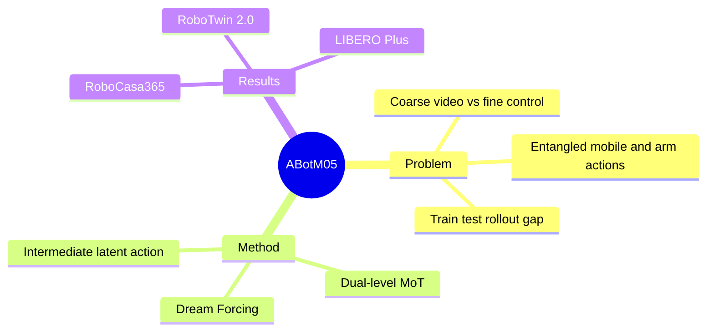

## Summary
ABot-M0.5 把 video world modeling、frame-level latent action 与 executable action 组织为三级生成链，并用 Dual-level Mixture-of-Transformers 和 Dream Forcing 同时处理移动操作中的时间粒度、异构 action space 与 train-test mismatch。

## Problem & Motivation
Mobile manipulation 同时要求长程导航与接触密集的精细操作，但 reactive VLA 缺少显式 future world modeling，既有 World Action Model（WAM）又常把多个控制步压进粗粒度 video chunk。这样一来，抓取闭合、接触开始、局部对齐等瞬时变化容易被平滑掉；base movement 与 arm manipulation 的频率和动力学差异也会在共享 action space 中造成优化干扰。更关键的是，inverse dynamics 在训练时通常看 ground-truth future，在部署时却只能看模型自己的 predicted video，长 horizon 下 exposure bias 会不断累积。论文据此把问题重述为三类 alignment，而非简单扩大模型或数据。

## Method
模型以 Wan2.2 video diffusion backbone 为基础，用 3D VAE 编码多视角视频、UMT5 编码语言，并在 future video latent 与 robot action 之间插入 frame-level latent action。该中间变量只依赖局部视觉状态转移，可从 action-free video 提取，从而把宏观 world evolution 细化为更接近控制频率、相对 embodiment-agnostic 的 motion intent；video、latent action 和 executable action 三个阶段统一采用 Conditional Flow Matching。

架构上的 Dual-level Mixture-of-Transformers 先为三种 modality 使用独立 projection、timestep embedding 和 output head，再把 executable action 拆为 mobility 与 manipulation 两个 FFN/预测分支；joint self-attention 仍允许两类 action 协调。训练分为 world model / latent-action pretraining、联合 SFT，以及 Dream Forcing：后者让 inverse dynamics 逐步基于模型 self-dreamed video 而非理想 future 学习，直接缩小 rollout condition gap。模型还采用 structured attention、offset-based latent augmentation，并以 Condensed Memory 作为额外增强版本报告结果。

## Key Results
在 RoboCasa365 pretraining 设置，ABot-M0.5 平均成功率为 40.4%，高于 Qwen-RobotManip 的 35.9%；加 Condensed Memory 后为 46.6%，但 Composite-Unseen 仍只有 7.9%。在 Target 100% 设置平均成功率为 54.2%，对比 Lingbot-VA 的 45.1%；仅用 10% target data 时也达到 30.1%，高于 GR00T-N1.5 的 21.0%。

纯 manipulation 侧，RoboTwin 2.0 的 Clean/Randomized/平均成功率为 94.0/94.2/94.1；LIBERO 平均 99.4，LIBERO-Plus zero-shot 的跨 camera、robot、language、lighting 等扰动也优于文中对比的 WAM。消融显示，RoboTwin 2.0 上直接 video-to-action 为 87.60%，三级独立 latent-action stream 提升到 94.00%；RoboCasa365 Atomic-Seen 中 Dream Forcing 达到 70.56%，超过继续普通 SFT 的结果。相同下游数据下，pretrained model 为 49.0%，从 Wan2.2 直接 SFT 只有 17.8%。论文还在每任务仅 50 条 demonstrations 的 Agilex Piper 实机设置上测试精细与长程任务。

## Strengths & Weaknesses
**Strengths.** 三个模块分别对应三个事先定义的结构错配，方法叙事与消融有较好的因果对应关系；latent action 不只提升 mobile benchmark，在 RoboTwin/LIBERO 也有效，说明它可能是比特定 embodiment 更通用的 motion abstraction。Dream Forcing 直接优化 deployment condition，也比仅延长 teacher-forced SFT 更有解释力。

**Weaknesses.** Composite-Unseen 的 2.7%（原模型）与 7.9%（Condensed Memory）表明长程组合泛化仍远未解决；而最高纪录依赖一个正文承诺未来再详述的 Condensed Memory，当前证据不足以独立判断该增益。实机范围是单臂 Agilex Piper、每任务 50 demonstrations，尚不能证明对真正移动底盘、多 embodiment 或长时间闭环的普适性。另一个风险是 model-predicted video 的 hallucination 可能被 inverse dynamics 当作条件放大，论文主要展示平均成功率，尚未系统量化 uncertainty calibration 与安全失败。

## Mind Map

## Notes
与 reactive VLA 相比，这篇工作最值得跟踪的不是更强 video backbone，而是把“world model 输出什么时间粒度的状态”当成 control interface 设计问题。后续应重点验证 Condensed Memory 的实现，以及 self-dreamed future 出错时 action head 是否能检测并回退。
