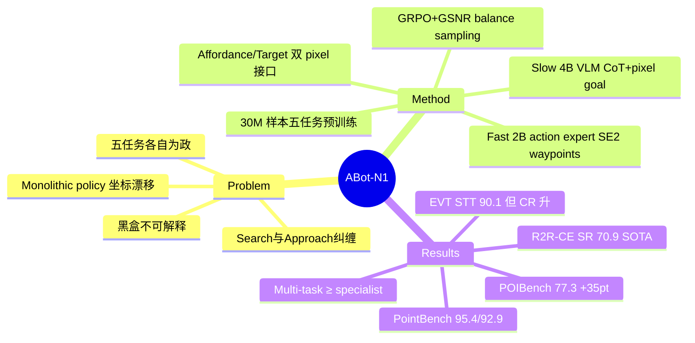

## Summary

高德 AMAP CV Lab 的 VLN foundation model 技术报告：用 slow-fast 双系统（Qwen-3.5-4B reasoner 输出 CoT + pixel goal，Qwen-3.5-2B action expert 输出连续 waypoint）把 point-goal / instruction-following / object-goal / POI-goal / person-following 五个导航任务统一到 "affordance pixel + target pixel" 这一图像空间接口上，30M 样本预训练 + GRPO post-training，单一 multi-task checkpoint 在五个 benchmark 上全面超过前代 ABot-N0，其中自建 ABotN-POIBench 上 SR 77.3%（+35.0pt vs POINav）、PointBench 室内/室外 SR 95.4%/92.9%。

## Problem & Motivation

作者认为现有导航模型是 monolithic policy（观测直接映射动作），存在三个部署层面的病灶：

1. **To-point 导航坐标漂移**：ego-centric 坐标目标对定位/建图误差敏感，目标点可能落在机动车道、花坛等不可通行区域，需要显式 traversability reasoning；
2. **To-target 导航语义退化**：端到端在 object-search 轨迹上微调会侵蚀预训练语义先验，且把 "search" 和 "approach" 两个阶段混在一起，收敛脆弱；
3. **黑盒不可解释**：没有 human-readable 的决策 trace，安全攸关场景无法做失败归因。

更根本的 formulation 问题：语义推理的慢动态和运动控制的快动态之间存在 "spectral mismatch"，单一网络在单一频率上无法同时伺候两者。此外五个导航任务历来各自为政、各用专属 policy，缺一个统一接口。

## Method

**Slow-fast 双系统，pixel goal 作为通用接口**：

- **Slow system（Qwen-3.5-4B）**：低频运行。输入 reference memory frames + 前左右 tri-view 观测 + 任务描述 + 上一轮决策，输出显式 CoT rationale + 两类 pixel goal——*affordance pixel*（下一个安全可通行 waypoint 在图像上的投影，室内约 3m / 室外约 5m）和 *target pixel*（可见时的最终目标：物体 / POI 入口 / 被跟踪的人）。
- **Fast system（Qwen-3.5-2B backbone）**：高频运行。输入当前观测 + slow 的 CoT 与 pixel goal + 任务描述，经 learnable action queries + QFormer cross-attention + MLP decoder 输出 5 个连续 SE(2) waypoints（x, y, sinθ, cosθ, completion flag）。
- **异步耦合**：slow 稀疏更新，fast 在两次 slow 更新之间靠闭环 pixel tracking 桥接时间差。

**Pretraining（监督模仿，共 30M 样本：13.3M slow + 16.4M fast）**，五任务各有数据管线：

| 任务 | 规模 | 来源与要点 |
|:-----|:-----|:-----------|
| Point-Goal | ~8.56M | 室内 3-20m / 室外 5-50m，occupancy map 区分可通行与禁行；slow 加 10m 法向/2m 切向坐标扰动，fast 用 sub-optimal + OOD-correction 轨迹 |
| Instruction-Following | ~9.78M | VLN-CE R2R/RxR ~4.35M + InteriorGS 辅助 ~5.43M；CoT 标注用两阶段 Qwen-27B（指令分解 + 帧对齐）；补门厅/电梯厅等 R2R 缺失域 |
| Object-Goal | ~2.21M | OVON 145-scene Habitat 子集 + 自有场景；slow 侧 CoT 用 data flywheel（高容量 VLM 种子 20K → 蒸馏 Qwen-2.5-VL 标注器自举）|
| POI-Goal | ~3.0M（仅 slow）| 31M street-view pairs → 蒸馏 Qwen-3.5-4B 过滤出 8M 有效路径，MoGe-V2 单目深度补 occupancy；含 0.5M POI 缺席负样本训练拒识 |
| Person-Following | ~6.1M | Habitat avatar 轨迹（1.2/1.5/2.0m 跟随距离），STT/DT/AT 三场景 |

**Post-training（GRPO，仅 slow system、仅 point-goal 0.5M episodes）**：composite reward = format（JSON 可解析性，gate 住下游 reward）+ target alignment（L2 距离指数衰减）+ safety clearance（安全区平坦、危险边界内陡峭的非对称指数惩罚）。用 GSNR（gradient signal-to-noise ratio）分析推导出 safe/critical/danger 三区 50/30/20 的 balance sampling 配比。明确处理了两种 reward hacking 均衡：target withholding（躲目标以规避 safety 惩罚）和 permanent inaction（原地不动），靠 reward 幅度配平 + missing-prediction 重罚打破。

**新 benchmark（自建 3DGS 重建栈）**：ABotN-PointBench（31 个真实场景：16 室内 / 15 室外，465 条参考轨迹；室内 SR 零碰撞、室外 SR<3col）和 ABotN-POIBench（11 个商业街区、163 个 POI、~126,398 m²，SR<2m 判定到店）。

## Key Results

ABot-N1 = 五任务联合 checkpoint；ABot-N1† = 单任务微调变体。

- **VLN-CE R2R-CE Val-Unseen**：NE 3.32 / SR 70.9 / SPL 67.5，全面 SOTA（仅 OSR 低于 NavForesee 的 78.4），且只用前左右 tri-view RGB，无 depth/odometry。**RxR-CE**：NE 3.13 最佳，SR 73.9 / SPL 63.9 次于 Qwen-RobotNav-4B（75.2/65.0，后者用了更大的 in-domain RxR 数据）。
- **Short-Horizon OVON**（作者自己重新裁定起点的 OVON 变体，隔离 recognition-and-approach 阶段）：SR 84.9 / SPL 51.8 / DTG 0.82m，vs ABot-N0 73.2/35.4/1.44m，vs Uni-NaVid 68.7/34.5。
- **ABotN-PointBench**：室外 SR 92.9 / SPL 91.4（ABot-N0 76.9，最难档 88.0 vs 65.3）；室内零碰撞 SR 95.4（ABot-N0 89.6）。对比的 GNM/ViNT/NoMaD/CityWalker 均为 metric-only policy（室内 SR 20-28%）。
- **ABotN-POIBench**：SR<2m 77.3 / SPL 72.6，vs POINav 42.3/40.3、OmniNav(BridgeNav) 34.4/31.5。
- **EVT-Bench person-following**：STT 90.1 SR / 89.8 TR，DT 67.4/84.4，AT 70.0/87.8，SR 全面领先 TrackVLA++ 与 ABot-N0；**但 DT/AT 的 Collision Rate 升到 17.9%**（ABot-N0 为 11.6/7.05），作者承认是更激进的 approach policy 的代价。
- **Multi-task vs specialist**：联合模型在 point-goal / IF / POI 上追平或超过单任务变体（R2R SR +2.6，RxR SR +3.0），仅 object-goal SR 略输 0.6，佐证 pixel-goal 接口下正向跨任务迁移而非灾难性干扰。
- **真机部署**：AMap TuTu 四足（LiDAR + RTK-GNSS + 270° tri-camera），Jetson AGX Orin 64GB 上 10Hz 全在板运行；但部署版模型缩水为 slow Qwen-3.5-2B + fast 306M DiT（DINOv2-Base 编码），与仿真评测的 4B+2B 不是同一套；部署结果全部为定性 episode 展示，无量化 SR。

## Strengths & Weaknesses

**Strengths**：

- **Pixel goal 作为统一动作接口是全文最干净的设计**：affordance/target 双 pixel 把五个任务的 slow-fast 通信压缩到图像空间锚点，天然回避了 ego-centric 坐标漂移，也让 "search 与 approach 解耦"（object pixel 管识别、affordance pixel 管走路）落到实处。OVON 上 DTG 从 1.44m 压到 0.82m、PointBench 最难档 +22.7pt 是这个设计最有说服力的证据。
- Multi-task ≥ specialist 的系统性对比（每张表都带 ABot-N1†）比多数 generalist 报告诚实，正迁移的 claim 有数据支撑。
- GRPO 部分对 reward hacking 两种均衡（target withholding / inaction）和 GSNR 采样配比的分析是少见的工程细节披露，可复用价值高。
- 数据工程规模惊人（30M 样本、31M street-view pairs、自建 3DGS benchmark 栈），是工业实验室才做得动的 infrastructure。

**Weaknesses**：

- **全文没有任何组件 ablation**：CoT 去掉会怎样？pixel goal 换成坐标/language goal 会怎样？GRPO 前后 point-goal 涨了多少？slow-fast 换成单系统同数据训练差多少？一概没有。所有 "attribute the gain to X" 都是叙事归因而非实验归因，这是本报告最大的证据缺口。
- **两个主秀 benchmark 是自建的，且从未声明训练/评测场景隔离**：point-goal 训练数据和 PointBench 用的是同一套 occupancy/3DGS 管线，31 个评测场景是否 held-out 只字未提；而对比的 GNM/ViNT/NoMaD 全是 zero-shot 泛化。POIBench 上 +35pt 的 "massive gain" 有多少来自 in-domain 数据优势无法判断。
- GRPO 只在 point-goal 上实例化，"扩展到其余任务只是 metric design 问题" 是未验证的 claim。
- POI-goal 的 fast system 从未见过 POI 数据（无模拟器做 closed-loop），完全继承 point-goal 能力——这个补丁在论文里被轻描淡写。
- 真机部署模型与 benchmark 模型不是同一套（4B+2B → 2B+306M DiT），且无任何量化真机指标，"real-world deployment confirms generalization" 的 claim 实际只有 cherry-picked 定性 episode 支撑。
- Person-following 的 CR 翻倍-加倍问题说明 safety 并未真正进入 fast system 的优化目标。

**影响**：与同日发布的姊妹篇 [[2607-ABotAgentOS]]（agent OS 层）拼出高德的完整具身导航栈。pixel goal 接口 + 双系统异步耦合大概率会被后续 VLN 工作跟进；但其 benchmark 若不公开 train/test 隔离协议，POIBench/PointBench 的数字横向可比性存疑。

## Mind Map

## Notes

- 前代 ABot-N0 是同团队 VLA 技术报告（本文所有表格的主对照），vault 中尚无笔记；姊妹篇 [[2607-ABotAgentOS]]（2607.10350，7-11 同日挂出）做的是 memory/agent OS 层，两者合起来是高德 "ABot" 具身系列的 brain（N1）+ OS（AgentOS）。
- 相关已读笔记：[[2402-NaVid]]、[[2412-NaVILA]]、[[2507-StreamVLN]]、[[2509-NavFoM]]（本文 R2R 表格里的直接 baseline）；survey 见 [[Topics/VLN-Survey]]。
- 疑问：slow system 的 GRPO 只优化 pixel 输出的 format/target/safety，CoT 文本本身没有 reward——CoT 的 "可解释性" 是否只是装饰？没有 CoT 忠实性检验。
- 值得跟进：ABotN-PointBench / ABotN-POIBench 是否真的开源、许可如何；若开源且协议干净，可作为 outdoor VLN 评测基建。
