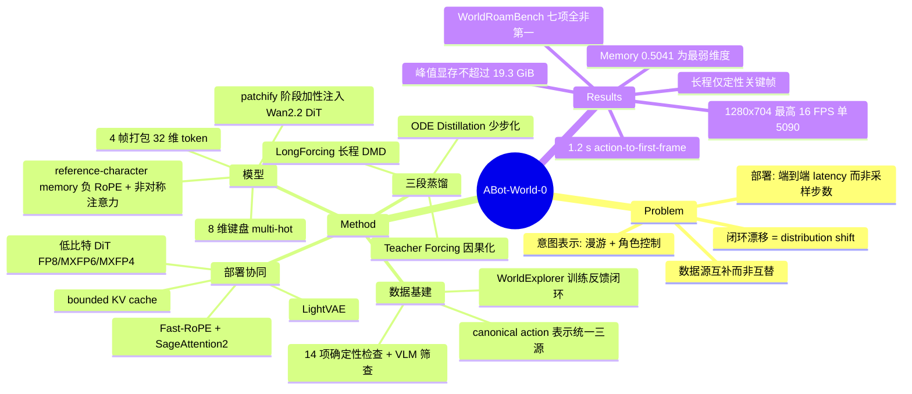

## Summary

ABot-World-0 是一份 action-conditioned video world model 的工业技术报告：以 Wan2.2 为底座、8 键键盘输入为唯一控制接口，经 teacher forcing → ODE distillation → LongForcing 三段式把双向 teacher 蒸馏成因果 few-step student，再与 LightVAE、低比特 DiT、Fast-RoPE、bounded KV cache 做全栈协同设计，在单张 RTX 5090 上以 1280×704 分辨率、最高 16 FPS、1.2 s action-to-first-frame 延迟、≤19.3 GiB 显存跑流式长程 rollout。代价是能力侧没有拿到任何一项第一：WorldRoamBench 七个子维度中 ABot-World-0（5B）全部位列第二或第三，其中 memory 维度 0.5041 明显落后 Genie 3（0.6073）与 HappyOyster（0.6309）。

## Problem & Motivation

作者的问题陈述不是"把视频生成质量再推高一档"，而是"为什么把视频模型做大并不能自动得到一个可进入、可持续演化的世界"。他们把交互式世界建模拆成四个互相耦合、可以单独强而整体不可用的瓶颈：

1. **数据**：互联网视频有视觉多样性但几乎没有同步控制信号；游戏录像有精确输入但风格窄；仿真有几何与可控性但需要人工设计轨迹。三者互补而非可替换。
2. **意图表示**：用户意图同时覆盖相机漫游（observer）与角色控制（actor），而现有做法要么用标定的 6-DoF 全局相机轨迹（长 rollout 后位姿累积会跑出训练分布），要么用 latent action（推理时用户拿不到这个接口）。
3. **闭环漂移**：自己生成的历史会成为下一步输入，短程训练状态与长程推理状态之间的 mismatch 持续放大。
4. **部署**：从收到按键到解码出第一帧的完整路径必须在消费级硬件上跑到交互速度，而不是只报采样步数。

论述里最有价值的一句判断是把长程漂移重述为 distribution shift 问题而非架构问题：sink-based context stabilization 和固定参考帧能推迟漂移，但"过度锚定"会把模型钉死在初始观测附近，反过来抑制场景演化。这个 trade-off 是后面 LongForcing 设计的直接动机。

## Method

### 数据基建：WorldExplorer 与闭环再采集

三个数据源分工明确：AAA 游戏（runtime API 直取控制信号，标签无噪声，是"最高质量监督"，也是语料主体）、仿真引擎（Unreal Engine 渲染 + ABot-3DGS 从自有航拍/街景扫描重建的场景，动作标签由轨迹位移投影到相机基向量再二值化）、互联网视频（pose estimation 出 6-DoF 伪标签，同样投影二值化）。三者最终折进同一套 canonical action 表示。

WorldExplorer 是 agent 驱动的采集系统，四个组件：navigation agent（多阶段目标选择，从未探索区域逐级放宽到前向 fallback）、并行采集流水线（视频/相机参数/控制输入/环境状态毫秒级时间戳同步，30 FPS 下跨模态对齐误差 <33 ms）、task template 系统（按地理/天气/时段/车流密度/视角模式/载具类型参数化场景）、以及训练反馈闭环——按类别性能指标诊断薄弱的 scene-action 组合，动态调整采集配比并保留最低覆盖下限防遗忘。

质量过滤是 6 个维度 14 项确定性检查（文件完整性、视觉有效性、几何一致性、游戏状态正确性、动作标签对齐、元数据质量）加 VLM 语义筛查，三阶段递进，前置轻量检查先淘汰再跑重计算。第三阶段的元数据（action-pose 一致性分、色偏 flag）不做硬拒绝，只作训练期采样加权的软信号。

标注侧除动作标签外还有 VLM 生成的结构化场景描述——刻意**不写相机运动**，以免文本条件与动作条件混淆；游戏 caption 前缀加 game identifier token 学风格；第三人称片段额外抽取四个朝向的人物缩略图并合成正脸 portrait 作 identity reference。

### 模型：键盘动作 + reference-character memory

动作接口是每帧 8 维 multi-hot 向量（W/A/S/D 控制角色或相机移动，I/J/K/L 控制相机旋转）。为对齐 VAE 时间压缩率 4，每 4 帧动作沿通道拼成 32 维 token，经 Action Control Adapter（PixelUnshuffle + kernel/stride 等于 DiT spatial patch size 的卷积 + 残差卷积块）后与 patch embedding **相加**注入 Wan2.2 DiT。作者在 Discussion 里给了这个朴素设计的理由：键盘信号离散、时间对齐、直接反映用户意图，属于"显式动作"，加性注入既够用又不破坏预训练视觉先验；只有 latent action、连续相机轨迹、语义指令这类歧义信号才需要更复杂的 conditioning。

身份保持用 reference-character memory：多张 canonical 参考图经同一 VAE 编码成 memory token 前置到视频 token 序列，被赋予**负的** temporal RoPE index（视频 token 为非负），并采用非对称注意力——视频 token 能看 memory，memory 看不到视频。

### 训练：双向 teacher → 因果 student 三段蒸馏

- **Bidirectional teacher**：在预训练视频模型上全参数微调，学 $p^{bi}(\mathbf{v}_{1:T} \mid v_0, \mathbf{a}_{1:T}, \mathbf{c})$，全时程信息交换保证视觉一致性与动作对齐质量。
- **Stage 1 Teacher Forcing**：从 teacher 初始化，加因果 attention mask，历史给 clean ground-truth latent、目标 chunk 加噪，把信息结构改造成推理期形态。
- **Stage 2 ODE Distillation**：冻结 Stage 1 作参考模型，在**同一因果条件** $\mathcal{C}_t=(\mathbf{v}_{0:t-1},\mathbf{a}_{t:t+L-1},\mathbf{c})$ 下让 few-step 模型直接预测 probability-flow ODE 的 clean endpoint。作者强调蒸馏目标只依赖部署时可得的因果上下文，不需要未来帧。
- **Stage 3 LongForcing**：在学生自身长 rollout 上做 DMD，监督信号来自一个**延长时程**的双向 teacher。与 ODE distillation 的区别是对齐层级——前者匹配固定条件下的 clean endpoint 映射，后者匹配长程条件视频分布。

### 部署：全栈协同

chunk-wise 流式生成，每个推理 chunk 含 3 个 latent frame、解码出 12 帧。LightVAE（受 TAEHV 启发的剪枝解码器）降首帧延迟与显存；memory-aware scheduling（借鉴 FramePack 的模块换入换出）按执行顺序调度模块驻留；Fast-RoPE 在局部注意力窗口内重锚定 temporal RoPE 并用 Triton kernel 加速；SageAttention2 作注意力后端；DiT 线性层低比特量化而 VAE/text encoder 保持高精度；bounded local-context KV cache 加 rolling eviction 使 cache 占用与 rollout 时长无关，并探索 KV cache 量化进一步压带宽。

## Key Results

**部署包络（Table 1，单张 RTX 5090，batch size 1）**：1280×704，最高 16 FPS，action-to-first-frame latency 1.2 s，峰值显存 ≤19.3 GiB。作者明确把 latency 定义为"从按键到该 chunk 解码完成、首帧可用"的完整墙钟时间，而非孤立的采样速度。

**系统消融（Table 2，ms/chunk）**：

| 配置 | DiT | VAE | FPS | VRAM (GiB) |
|:--|--:|--:|--:|--:|
| Base | – | – | OOM | OOM |
| +SageAttention2 | – | – | OOM | OOM |
| +SageAttention2 +LightVAE | 1191.1 | 78.3 | 9.117 | 20.491 |
| +FP8 | 845.2 | 76.0 | 12.405 | 15.925 |
| +FP8 +Fast-RoPE | 786.9 | 71.7 | 13.269 | 19.281 |
| +MXFP6 +Fast-RoPE | 718.3 | 86.0 | 14.098 | 18.287 |
| +MXFP4 +Fast-RoPE | 638.8 | 73.0 | 15.831 | 17.148 |

这张表是全文信息量最大的部分，也自证了作者的系统论点：只换注意力 kernel 仍然 OOM，第一个可跑配置来自 LightVAE。需要注意 FP8 是作者声明的默认"质量优先"工作点（12.4–13.3 FPS），16 FPS 实际来自最激进的 MXFP4。另外 Fast-RoPE 把吞吐从 12.405 提到 13.269 的同时峰值显存从 15.925 涨到 19.281 GiB。

**WorldRoamBench（Table 3）**：

| Model | Size | Strict Acc. | Partial Acc. | Traj. | Aesthetic | Imaging | Mechanics | Memory |
|:--|:--|--:|--:|--:|--:|--:|--:|--:|
| Genie 3 | – | 0.4700 | 0.6608 | 0.6719 | 0.4711 | **0.4757** | **0.5454** | 0.6073 |
| HappyOyster | – | **0.5317** | **0.7631** | **0.7737** | **0.5235** | 0.4377 | 0.5395 | **0.6309** |
| LingBot-World | 14B | 0.3235 | 0.4198 | 0.4094 | 0.2898 | 0.2875 | 0.2777 | 0.3006 |
| HY-World 1.5 | 8.3B | 0.1640 | 0.2088 | 0.2015 | 0.1400 | 0.1236 | 0.1115 | 0.1562 |
| ABot-World-0 | 5B | 0.5266 | 0.7290 | 0.6752 | 0.5039 | 0.4651 | 0.5223 | 0.5041 |

ABot-World-0 在七项里五项第二（Strict/Partial Acc.、Traj.、Aesthetic、Imaging）、两项第三（Mechanics、Memory），**没有任何一项第一**。考虑到它只有 5B、并且要在 5090 上实时跑，与 Genie 3 打平的动作可控性算是有说服力的效率结论；但 memory 一项掉到 0.5041，与它自己主打的"长程状态持久"叙事直接冲突。

**LongForcing 消融（Figure 10）**：60 秒 rollout 上与改编自 Causal Forcing 的 baseline 对比 HPSv3、高饱和像素比、感知模糊分、patch 重复率，差距主要出现在 rollout 后半段——baseline 的 HPSv3 递减且三项 artifact 指标上升，LongForcing 保持更高 HPSv3 与更低 artifact。只有曲线，无数值表。

**长程与物理定性结果**：小时级（5 段独立 rollout）与天级 rollout 均以带时间戳的关键帧条呈现，无量化指标；OOD 泛化展示训练分布外的场景 + 角色组合；物理交互给出推纸箱、水面涟漪、雪地脚印持久留痕、被墙阻挡、撞栏杆不穿模等案例。

## Evidence Ledger

| Claim ID | Claim | Type | Source locator | Evidence excerpt | Status |
|:--|:--|:--|:--|:--|:--|
| C1 | 单张 RTX 5090 上 1280×704、最高 16 FPS、1.2 s action-to-first-frame、峰值显存 ≤19.3 GiB | number | §4.4.1 Table 1 + Abstract | "Resolution 1280×704 ... Throughput Up to 16 FPS ... latency 1.2 s Peak VRAM ≤19.3 GiB" | source-verified |
| C2 | WorldRoamBench 七个子维度上 ABot-World-0 均非最佳；HappyOyster 领先五项，Genie 3 领先 Imaging 与 Mechanics | comparison | §5.1.1 Table 3 | "HappyOyster – 0.5317 0.7631 0.7737 0.5235 0.4377 0.5395 0.6309 ... ABot-World-0 5B 0.5266 0.7290 0.6752 ..." | source-verified |
| C3 | ABot-World-0 的 Memory 子分 0.5041，低于 Genie 3（0.6073）与 HappyOyster（0.6309） | number | §5.1.1 Table 3, Memory 列 | "Genie 3 ... 0.6073 / HappyOyster ... 0.6309 / ABot-World-0 5B ... 0.5041" | source-verified |
| C4 | Base 与仅加 SageAttention2 的配置均 OOM；加入 LightVAE 才得到首个可行配置（9.117 FPS / 20.491 GiB） | number | §4.4.4 Table 2 及正文 | "Introducing LightVAE yields the first feasible configuration, achieving 9.117 FPS with 20.491 GiB of peak VRAM." | source-verified |
| C5 | 16 FPS 来自最激进的 MXFP4 配置（15.831 FPS）；作者声明的默认质量优先配置为 FP8 | number | §4.4.4 Table 2 及正文 | "We use FP8 as the default quality-oriented configuration, while more aggressive low-bit formats extend the upper-throughput operating envelope." | source-verified（补正：FP8 行 12.405 FPS，FP8+Fast-RoPE 行 13.269 FPS） |
| C6 | 动作接口为 8 维 multi-hot 键盘向量（W/A/S/D 移动、I/J/K/L 旋转），每 4 帧打包成 32 维 token，在 Wan2.2 DiT 的 patchify 阶段加性注入 | causal-mechanism | §4.2, §4.2.1 Eq.(4)-(7) | "8-dimensional multi-hot vector corresponding to 8 discrete keys: W/A/S/D for character or camera movement and I/J/K/L" | source-verified |
| C7 | LongForcing 消融仅以 60 秒 rollout 的逐帧曲线呈现（HPSv3 / 高饱和比 / 模糊分 / patch 重复率），无数值表 | benchmark-setting | §5.2 + Figure 10（全文仅 Table 1-3） | "We evaluate both variants over 60-second rollouts using the HPSv3 score, high-saturation pixel ratio, perceptual blur score, and patch repeat ratio." | source-verified |
| C8 | 小时级与天级 rollout 仅以定性关键帧条呈现，该时程无任何量化指标 | benchmark-setting | §5.1.2, Figures 5-7 | "Each rollout is shown as a timestamped keyframe strip, demonstrating sustained controllability and scene coherence over one-hour interactive rollouts." | source-verified |
| C9 | WorldRoamBench 是引用他文的既有 benchmark，非本文提出 | benchmark-setting | §5.1 + Reference [72] | "we use WorldRoamBench [72], an open-world benchmark for controllable video world models" | source-verified（补正：该 benchmark 论文作者与本文 Benchmark Team 高度重叠，"外部"仅指另一篇论文，非独立第三方） |
| C10 | 论文未披露训练语料总规模（无总时长、片段数或样本数） | benchmark-setting | §3.2-§3.4 全节 | "Game data constitutes the primary and largest source of our training corpus." | source-verified（全文仅有定性描述与 1920×1080 采集分辨率） |
| C11 | 代码/项目链接为 https://github.com/amap-cvlab/ABot-World | license-code | 摘要后标题区 | "https://github.com/amap-cvlab/ABot-World" | source-verified |
| C12 | Table 3 中 ABot-World-0 为 5B，LingBot-World 14B、HY-World 1.5 8.3B，后两者所有子维度分数远低于 Genie 3 与 HappyOyster | number | §5.1.1 Table 3 | "LingBot-World 14B 0.3235 ... HY-World 1.5 8.3B 0.1640 0.2088 0.2015 0.1400 0.1236 0.1115 0.1562" | source-verified |
| C13 | LongForcing 与其 Causal-Forcing baseline 都在学生自 rollout 上训练且末阶段都用 DMD，唯一差别是 teacher 监督时程更长 | causal-mechanism | §5.2 | "Both variants train on histories produced by the student's own autoregressive rollout and apply DMD in the final post-training stage." | source-verified |
| C14 | 机构署名为 AMAP, Alibaba | — | 标题区、§8 Contributors、arXiv v1 | "Infinite Interactive World Rollout on a Single Desktop GPU ABot-World Team July 2026" | unsupported——正文与 arXiv 页面均无 affiliation 字段，署名仅 "ABot-World Team"；AMAP/Alibaba 系据代码库 org `amap-cvlab` 与自引 "[2] AMAP, Alibaba (2023)" 推断，已在 frontmatter 就地标注为推断 |

## Strengths & Weaknesses

**值得记的三点。**

第一，这是目前少见的把"实时"讲清楚口径的 world model 报告。Table 2 逐配置给出 DiT/VAE 分项耗时、FPS 与峰值显存，硬件、分辨率、batch size、chunk 结构（3 latent frame → 12 解码帧）全部明确，latency 也按"按键到首帧可用"的端到端定义报。对比 vault 里的 [[Papers/2607-Wonder]]——同样宣称 16 FPS 但无硬件口径、无 component ablation——本文的可信度和可复算性高出一档。Base 与 SageAttention2-only 双双 OOM 这一行尤其有信息量：它把"few-step 蒸馏 ≠ 实时系统"从口号变成了可检验的事实。

第二，动作接口的选择是对的，且作者给了原则性而非事后的理由。用原始键盘码而不是标定相机轨迹或 latent action，同时解决了三个问题：训练标签可从游戏 API 无噪声直取、长 rollout 不会因全局位姿累积而跑出分布、推理时用户手上就有这个接口。第一人称漫游与第三人称角色控制共用同一动作空间、单模型覆盖，也避免了按视角切模型。OOD 案例（训练分布外的场景 + 角色）说明这层动作条件确实学成了相对当前状态的增量语义，而不是记住了特定场景的按键-像素映射。

第三，把长程漂移归因为 distribution shift、并指出"锚定过强会抑制场景演化"这一 trade-off，是全文最接近 insight 的判断。LongForcing 的做法（在学生自 rollout 上用延长时程 teacher 做 DMD）逻辑自洽：既然问题是训练分布覆盖不到长程自 rollout 状态，那就把监督分布往那个区域推，而不是靠 sink/参考帧硬拽回初始观测。

**但要打的折扣不小。**

**能力侧没有赢面，且弱在它自己主打的维度。** ABot-World-0 七个子维度全部第二或第三。作为 5B 模型对 Genie 3 打成这样确实有效率含义，但 memory 0.5041 落后 Genie 3 与 HappyOyster 各约 0.10–0.13，是七项里相对差距最大的一项——而"持久世界、状态可持续演化"正是全文的核心叙事。这也直接印证了 [[DomainMaps/WorldModel]] 里的 Pattern 3（video world model 的 memory 有问题）：reference-character memory 只解决了可控角色的外观一致性，对场景级状态持久（离开再回来的物体、已发生的环境改变）没有对应机制，bounded KV cache 加 rolling eviction 在设计上就把超出窗口的历史丢掉了。论文对这个矛盾没有讨论。

**评测的独立性存疑。** WorldRoamBench 虽被引为他文，但据核查其作者列表与本文 Benchmark Team 高度重叠。这不是造假，但"在自家 benchmark 上与 Genie 3 打平"与"在第三方 benchmark 上打平"的证据强度不同，应按前者读。另外 LingBot-World（14B）与 HY-World 1.5（8.3B）的分数只有 0.11–0.32，比 5B 的 ABot-World-0 低一半以上——一个 14B 模型在所有维度上被 5B 模型翻倍碾压，更可能指向 baseline 配置或协议适配问题，而不是真实能力差距。论文对这两行异常低分未作任何解释。

**Table 2 与 Table 3 没有对接。** 全文未说明 WorldRoamBench 评测跑在哪个量化配置、多少去噪步上。Table 3 无配置列，§5.1.1 也只说"following the benchmark protocol"。这留下一个关键空白：MXFP4 下的 15.831 FPS 是否还保持 Table 3 的质量分？低比特量化对视频生成质量的影响正是本文最该量化的 trade-off，而全文只在结尾说"quantization-aware training 可能进一步改善速度-显存-质量权衡，留作 future work"。换言之，读者拿不到"速度换质量"这条曲线，只能拿到速度轴和质量轴的两个孤立点。

**长程结论几乎全靠定性图。** 小时级、天级 rollout 全部是关键帧条，唯一的定量长程证据是 60 秒的 LongForcing 曲线图，且没有数值表。"day-scale 不崩"这个最吸引人的宣称，其证据仅是"抽样时刻点上仍有可辨识结构与运动"——按论文自己的措辞是 "without observable collapse at the evaluated timestamps"，这个限定很诚实，但也意味着它无法排除采样点之间的退化，更无法支持"世界状态在小时尺度上保持自洽"的强读法。

**方法组件无消融。** action adapter 的加性注入 vs 其他注入方式、reference-character memory 的负 RoPE index 与非对称注意力、Fast-RoPE 的重锚定策略——这些设计选择都没有单独的对照实验。三段蒸馏里也只消融了第三段（LongForcing vs Causal Forcing），teacher forcing 与 ODE distillation 的必要性未验证。作为技术报告可以理解，但这意味着"哪个组件真正贡献了什么"无法从本文推断。

**训练数据规模完全不透明**，且核心资产（AAA 游戏、自有航拍/街景扫描重建的 3DGS 场景）明确标注为 proprietary、non-public。代码库开放不等于结果可复现——数据侧的护城河决定了外部无法重跑这条 pipeline。

**对领域的意义。** 我的判断是：这篇的价值在系统侧而非算法侧。它给出了一份可被别人对照的"消费级 GPU 实时世界模型"部署清单（哪些优化必需、各自换来多少 FPS 与显存），这类可复算的工程口径在当前一堆只报 FPS 不报硬件的报告里是稀缺的。算法侧 LongForcing 是 Self-Forcing / Causal Forcing 这条线上的增量——把 teacher 的监督时程拉长——想法合理但证据只有一张曲线图，且与同期 Context Forcing（长上下文 teacher + Slow-Fast Memory）等工作的边界未做比较。若要引用，建议引用其部署数据与系统论点，谨慎引用其能力比较结论。

## Mind Map

## Connections

- **领域地图**：[[DomainMaps/WorldModel]] 的路线 1（Video World Model）。本文是该路线上"实时化 + 消费级部署"分支的最新数据点，同时为 Pattern 3（video WM 的 memory 有问题）提供了一个来自作者自身评测的反证据——memory 是其七项子维度里相对最弱的一项。
- **综述**：[[Topics/WorldModel-Survey]] 第 1 节（Pixel-space Video Diffusion WM）。建议归并时与 Wonder 并列，作为"实时 video WM 转向 control–memory–distillation co-design"这一 07-29 观察的第二个样本，并补上"本文给了硬件口径与逐配置系统分解"这一区分点。
- [[Papers/2607-AlayaWorld]]——最直接的同期对照：同为可实时游玩的交互式视频世界（LTX-2.3 底座，720p/24fps，约 1 秒 chunk），问题拆解也是 control/consistency/stability/runtime 四项。两篇合看可以对比"开源 + 开放动作空间"与"闭源数据 + 键盘动作空间 + 详细系统口径"两条路径的取舍。
- [[Papers/2607-Wonder]]——同样宣称 16 FPS 但无硬件口径、无组件消融。本文在部署透明度上明显更好，但两者共有的短板一致：都缺定量的 long-term memory 指标。
- [[Papers/2608-WorldExam]]——提供了本文最缺的评测视角。WorldExam 的 World Reactivity 层级专门考察"控制未写明的后果"，而本文的物理交互证据（推箱、雪地脚印、撞栏杆）全是定性案例；若用 WorldExam 复测，其 Terrain / Subject Control 分裂结论可以检验本文"从大规模交互视频经验中涌现物理合理性"这一说法的边界。
- [[Papers/2608-WorldProxy]]——position 文章主张 world model 应按"让查询它的 agent 变好多少"评价。本文完全站在生成保真度 + 部署效率的旧口径上，没有任何 agent-in-the-loop 的下游验证，可作为该主张的对照样本。
- [[Papers/2607-GigaWorld1]]——把 world model 定位为 policy evaluator 并强调 long-horizon action fidelity 优先于短期观感。本文的 Traj. Score（0.6752）与 Mechanics（0.5223）恰是其相对弱项，若按 GigaWorld-1 的评价框架，本文离"可用作 policy evaluator"仍有距离。

## Notes

- **待查**：WorldRoamBench 原始论文（arXiv 2606.31672）值得单独 digest——它的作者与本文 Benchmark Team 重叠，需要看清其评测协议如何定义 Strict/Partial Acc. 与 Memory，以及 LingBot-World / HY-World 1.5 的极低分是协议适配问题还是真实差距。这直接决定本文能力比较结论的可引用性。
- **repo 候选**：`amap-cvlab/ABot-World` 属于系统/基建类工作（流式推理栈、数据采集系统 WorldExplorer），贡献主要落在实现里，值得另起一轮 repo-digest 核实：LightVAE 剪枝方案、Fast-RoPE 重锚定实现、bounded KV cache 的驱逐策略是否真的开源，以及 Table 2 的配置是否可复现。
- **可迁移的方法点**：negative temporal RoPE index + 非对称 memory-video 注意力，是一种把"静态条件"与"时序生成"在同一序列里解耦的轻量做法，不限于角色身份——原则上可用于任何需要长程持久但不参与时序演化的条件（场景锚点、任务目标、地图信息）。可以留意是否有工作把它用于 embodied 场景的持久空间记忆。
- **开放疑问**：bounded KV cache 与"无限 rollout"的宣称在原理上是紧张的——窗口外的历史被 rolling eviction 丢弃后，模型靠什么保持场景级状态？论文用 reference-character memory 解决了角色外观，但场景侧没有对应机制。天级 rollout"不崩"很可能意味着"局部自洽但全局已漂移"，即模型持续生成合理内容而非维持同一个世界。这一点在论文中未被区分，是我认为最需要后续实验澄清的地方。
