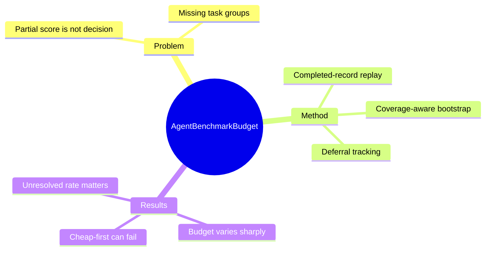

## Summary
论文以 completed benchmark record 的 replay 说明“跑了多少 task”不是充分的 agent 比较依据，partial evaluation 必须同时满足 pairwise decision error、task-group coverage 与 unresolved-comparison 三类目标。

## Problem & Motivation
Agent benchmark 成本高，团队自然希望只运行部分 task，但接近 full score 不代表 partial run 支持相同的 pairwise decision。一个 subset 可能漏掉会反转结论的 repository/domain，也可能通过对困难 comparison 全部 defer 而表现出低 error，或优先运行便宜 task 却失去必要 coverage。论文把目标从 score estimation 改成 decision preservation：在明确 improvement threshold、selection policy、coverage rule 和允许 unresolved rate 后，最小多少预算才能复现 completed benchmark 的结论？

## Method
作者固定 SWE-bench Lite/Verified、AppWorld 与 tau-bench 的公开 task-level outcome，针对 ordered system pair 重放不同 task reveal order。Policy 在每个 budget 返回 positive、negative 或 unresolved；coverage 以 SWE-bench repository、AppWorld difficulty split、tau-bench domain 为 group，要求每组按预算比例出现。评价记录 conditional false accept、conditional false reject、coverage failure 与 unresolved-comparison rate。

主要 policy 是 coverage-aware bootstrap tail rule：只有当多数 bootstrap resample 位于 threshold 同一侧且 coverage 已满足时才作决定，否则 defer。实验要求 conditional decision error 与 coverage failure 均不超过 5%，unresolved comparison 不超过 25%；预算以 5%–95% 的 5-percentage-point grid 搜索，并比较 uniform/stratified/cost-aware forced、Neyman allocation、Serfling 与 classical paired tests。SWE-bench/AppWorld 每个 ordered pair 使用 500 个 reveal order 和 200 个 bootstrap sample，tau-bench 使用 2,000/500。

## Key Results
- 在严格 0 pp threshold 下，AppWorld 最早在 15% task budget 满足全部目标，tau-bench 为 25%，SWE-bench Verified 为 90%；SWE-bench Lite 到 95% 仍因 unresolved rate 超标而不充分。
- SWE-bench Verified 在 25% budget 已控制 error 与 coverage failure，但 93.64% comparison unresolved；直到 90% budget 时 unresolved 才降到 24.22%。
- AppWorld 在 0/5/10 pp threshold 下都可于 15% budget 充分，但 uniform forced evaluation 在 25% budget 的 coverage failure 达 99.96%，说明同一 task fraction 会因 ordering policy 得出完全不同的可靠性。
- tau-bench 的 cheap-first forced policy 在 25% task budget 只消耗平均 11.51% tested-system cost，却有 100% coverage failure，并在三个 threshold 下都产生错误 pairwise conclusion。

## Strengths & Weaknesses
论文把 partial evaluation 的三种失败——错判、漏组、拒绝判断过多——统一进一个可复现实验框架，且对 threshold、bootstrap cutoff、grouping、orientation 与 comparator 做了充分 sensitivity check。最重要的实践结论简单而有力度：task fraction 本身不是 decision rule；无法满足预先声明的目标时，正确输出是继续评估或不给结论。

边界同样明确：replay 只对固定 completed record 的 permutation 作经验性陈述，不能推断 future task draw 或 population risk。最小预算高度依赖 threshold、coverage floor、group definition 与 policy；所用 group 只是公开 metadata，而非 learned failure cluster。实验仅覆盖有可解析 multi-system task record 的三个 benchmark family，adaptive task selection、pilot variance 与 OSWorld/WebArena 等 GUI benchmark 仍未验证。

## Mind Map

## Notes
这套 replay protocol 很适合用于昂贵 GUI agent benchmark 的 early-stop 设计，但前提是保存 task-level outcome、cost、group metadata 与 system-pair orientation。若 future benchmark 允许 adaptive selection，应把 selection policy 本身视作需要预注册和回放验证的 evaluator component。
