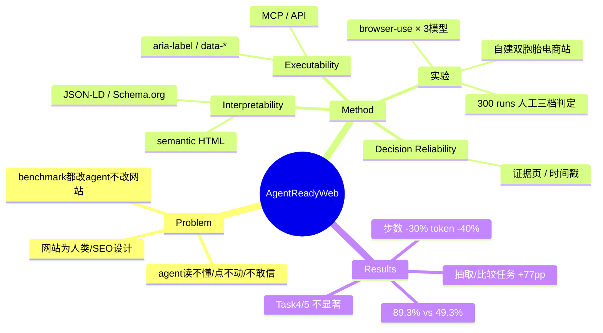

## Summary
提出 "agent-ready website" 设计框架（Interpretability / Executability / Decision Reliability 三维度），并用作者自建的一对合成电商网站（baseline vs agent-ready）做对照实验：3 个模型 × 5 个任务 × 300 runs，agent-ready 版严格成功率 89.3% vs baseline 49.3%。

## Problem & Motivation
- 传统网页设计面向人类用户和 SEO，不面向 AI agent 的机器可读性。随着购物等任务越来越多由 agent 代理执行（搜索、比价、约束筛选、下单），网站需要同时支持人类和 agent 两类访问者。
- 作者指出的 gap：一个网站可以满足所有传统设计准则（可用性、无障碍、SEO），却仍然无法为 AI agent 提供充分、透明的交互环境。
- 视角翻转：现有 web agent 研究（Mind2Web、WebArena、WebVoyager、WebShop 等 benchmark）都在固定网站上改进 agent；本文反过来固定 agent、改进网站，问"网站侧能做什么"。

## Method
框架为纯概念性的三维度 taxonomy：

1. **Agent Interpretability**（agent 能否解析内容与结构）
   - *Machine Readability*：JSON-LD、Schema.org 结构化标记、semantic HTML、metadata
   - *Semantic Clarity*：清晰的 heading、描述、显式的页面用途声明
2. **Agent Executability**（理解之后能否可靠完成操作）
   - *Agent Actionability*：透明的操作路径、可识别的按钮/表单、显式元素关系（aria-label、data-* 属性、product ID）
   - *API / Data Services*：通过 MCP 等标准化协议暴露实时数据
3. **Agent Decision Reliability**（支持可信决策的质量信号）
   - 证据页、用户评论、认证、组织信息、时间有效性字段（timestamp）

**实验设计**：
- 作者自建两个结构、商品、价格、库存、结账流程完全相同的合成电商网站。差异（Table 1）：baseline 的商品数据嵌在 JavaScript 中；agent-ready 版额外暴露 JSON 文件 + JSON-LD、补 aria-label / data-* 语义标注、加显式商品 ID / 库存 / availability 字段、加证据页和时间字段。
- Agent 框架统一用开源的 **browser-use**；模型为 GPT-4.1、Gemini 2.5 Flash、Grok-4 Fast（temperature=0, top_p=1，单 session 上限 30 步、容错 3 次）。
- 5 个任务（商品信息提取、数据抽取、多商品比较、多约束选择、店铺政策检索，Task 5 为低复杂度对照）× 3 模型 × 2 网站 × 每格 10 次 = 300 runs。**正文未给出任务的完整指令文本**。
- 评判方式：两名人工标注者审 terminal log + 模型 JSON 输出，分 PASS / PARTIAL / FAIL 三档。

## Key Results
- **总体（Table 2）**：agent-ready 134/150 PASS（89.3%）vs baseline 74/150（49.3%），+40 pp；PARTIAL 从 43 降到 3。χ²(2, N=300)=60.79, p<0.001，Cramer's V=0.45。
- **分模型**：GPT-4.1 32%→86%（受益最大），Gemini 2.5 Flash 52%→88%，Grok-4 Fast 64%→94%。
- **分任务（Table 3）**：Task 2（数据抽取）23.3%→100%、Task 3（比较）16.7%→93.3% 提升最大（各约 +77 pp，Fisher exact p<0.05）；Task 4（多约束选择）60%→76.7%、Task 5（政策检索）73.3%→80% 提升小且**不显著**。
- **效率（Table 4）**：平均步数 9.31→6.49（-30.4%）；prompt token 消耗降 18.7%–40.5%（如 GPT-4.1 从 283 万降到 177 万）。
- Baseline 失败模式：不完整的数据抽取、部分比较、选错商品、约束未满足、政策解读不完整——常见 pattern 是"找对了页面/商品，但抽不全信息或结论缺支撑"。

## Strengths & Weaknesses
**Strengths**
- 问题视角有价值：把"agent 失败"归因到网站侧而非 agent 侧，与 llms.txt / NLWeb / MCP 等业界 agentic web 趋势一致，为"给 agent 的网页可访问性规范"提供了一个初步实证数据点。
- 实验虽小但设计规范：3 模型交叉验证、temperature=0、明确的三档判定、χ²/Fisher 检验、诚实报告 Task 4/5 不显著。
- token/步数效率的量化（-30% 步数、最高 -40% token）是比成功率更有说服力的部分——结构化数据减少了截图/DOM 解析的浪费。
- Limitations 一节相当诚实：自称 "controlled proof of concept rather than a full validation"，承认无 ablation、不可泛化。

**Weaknesses**
- **Baseline 由作者自建，存在 strawman 风险**：baseline 把商品数据全部埋进 JavaScript，这是刻意制造的"最难读"配置；论文未论证它代表真实网站的典型水平。真实电商站（Amazon/Shopify 系）普遍已有部分 schema.org 标注，真实 gap 可能远小于 40 pp。
- **无 ablation**：JSON-LD、aria-label、JSON 文件、证据页等多项改动打包比较，无法回答"哪个 feature 贡献了多少"——而这恰是框架三维度划分的立身之本。框架的三分类因此只是叙事结构，没有实证支撑各维度的独立作用。
- **统计独立性存疑**：temperature=0 下同 cell 内 10 次重复 run 高度相关（仅剩 browser-use 时序/页面状态噪声），把 300 runs 当独立样本做 χ² 会高估显著性。
- 任务定义未完整公开、网站规模（商品数/页面数）未报告、无代码/网站开源——难以复现。
- 单一 e-commerce 合成场景 + browser-use 单一 scaffold，结论对 API-based agent（如直接调 MCP/API 的 agent）或真实网站的外推性未知。
- 框架本身无新技术成分：三维度是对 schema.org / ARIA / MCP 等既有标准的重新打包分类。

**影响推测**：作为"网站侧优化对 agent 成功率影响"的早期量化证据有引用价值，但方法论上更接近一份 white paper + demo，距离可复用的评测协议或设计标准还很远。

## Mind Map

## Notes
- 与其对照阅读：llms.txt 提案、Microsoft NLWeb、"Beyond Browsing: API-based Web Agents"——本文都未引用，说明作者对 agentic web 基础设施这条线的文献覆盖不全。
- 可挖的问题：如果网站侧结构化能带来 -40% token，那"agent-readiness score"能否做成自动审计工具（类似 Lighthouse for agents）？这可能比框架本身更有落地价值。
