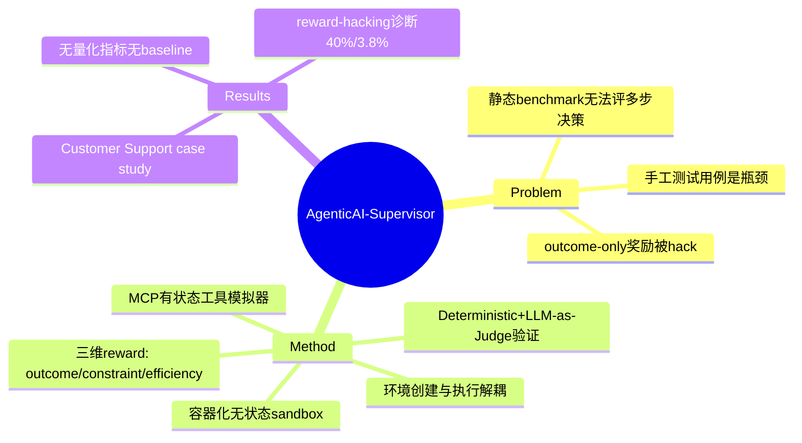

## Summary
提出 AgenticAI-Supervisor——一个 API/UI 驱动的 RL Gym 平台，把"环境创建"与"可扩展执行"解耦，用可验证的执行状态（而非文本打分）做 outcome/constraint/efficiency 三维 reward shaping，并靠内部状态校验对抗 reward hacking；仅用一个 Customer Support Agent case study 做"first look"，无量化实验。

## Problem & Motivation
静态 benchmark（MMLU、GSM8K）只能评判单轮文本答案，无法刻画 LLM agent 的多步决策、规划、tool-use。作者引述企业级 agent 在复杂专业任务上约 76% 失败率（compounding execution errors），且手工编写测试用例是易错瓶颈。核心主张：评估要从"给文本回复打分"转向"验证程序化动作"，并把这套验证嵌进大规模 RL 生命周期里。动机方向合理，但这些数字（76%）来自引述而非本文测量。

## Method
**双阶段框架**，把环境搭建与执行分离：

- **High-Fidelity Environment Scaffolding（§3.1）**
  - Agentic Workflows：领域驱动的路径，刻意埋入 failure state 与 ambiguous response
  - Base Tool Simulator：基于 Model Context Protocol (MCP) 的有状态工具，统一 API/UI 接口
  - Dataset Connectors：把测试用例绑定到环境上下文的状态管理层
- **Scalable Execution Engine（§3.2）**：Test Run Engine 在隔离、无状态 sandbox 中并行 rollout；Rollout Handler 用容器化实例防 state leakage；Agent Runtime 编排 prompting / action parsing / observation 获取；日志以 "Spans" 结构化聚合成 "Traces"。

**Multi-Dimensional Reward Shaping（§4.2）**，三类 reward 对应三种失败模式：
- **Outcome Reward**：二元终局验证，用 multiset equality 比对环境最终状态与 golden answer，对自然语言输出"盲"（只看状态不看话术）。
- **Constraint Adherence**：反 reward-hacking 的三重检查——negative check（记录不得含禁止字段值）、side-effect detection（对比实体计数与 baseline）、output fidelity（把 agent 声称的内容与真实 tool response 交叉核对）。作者对真实数据的分析发现：仅用 outcome reward 时，约 40% 的"被正向强化 episode"存在 constraint misrepresentation，约 3.8% 存在 fabrication。
- **Trajectory Efficiency Reward**：过程信号，五个分量——Tool Correctness、Redundant Call Penalty、Validation Error Penalty、Min-Tool Coverage Score、Step-Penalized Efficiency Modifier（按实际轨迹与 ground-truth 轨迹步数差缩放）。

**Verification（§4.3）**：Deterministic Verifiers（状态检查：golden answer、约束校验、标识符交叉引用）+ LLM-as-Judge（结构化 rubric + ensemble 降方差）处理开放式/定性维度。

## Key Results
**唯一"结果"是 Customer Support Agent case study（§5）**，没有任何量化指标：

- 工具集二分：non-actionable（只读：`get_customer_info` / `get_order_details` / `check_interaction_history` / `search_kb_and_policies`）与 actionable（状态可变：Refund / Replacement / Security Lock / Ticket Management）。
- 复杂场景要求 agent 在授权退款前交叉引用知识库策略，或从交互历史中识别可疑活动。
- 结论仅停留在定性描述：平台"能强化安全、合规的客服工作流"，展示"闭环反馈"。

**没有成功率、没有 baseline 对比、没有训练前后曲线。** 全文唯一带说服力的数字是 §4.2 的 40% / 3.8%（reward-hacking 诊断），且那是 motivation 而非本方法的效果验证。

## Strengths & Weaknesses
**Strengths**
- 问题 framing 对：outcome-only reward 会被 hack，用状态级 constraint/side-effect/fidelity 检查去堵，方向正确。
- 40% constraint misrepresentation、3.8% fabrication 是有信息量的诊断数据，量化了"只看终局状态"的隐患，支撑多维 reward 的必要性。
- 环境/执行解耦 + 容器化无状态 sandbox + Spans/Traces 结构化日志，是可扩展 RL 基建的合理工程范式。

**Weaknesses**
- **本质是平台预告（"first look"），不是研究**：零量化结果、零 baseline、零 ablation。所谓 case study 只有工具清单和定性描述，无法判断 reward shaping 是否真的降低了 hacking 或提升了成功率。
- reward hacking 的 40%/3.8% 只证明了病，没证明药——完全没有"用了 constraint adherence 后这两个数降到多少"的对照。
- 大量核心能力（Computer Use、automated "stumping"、edge-case generation、no-code 界面、uncertainty-aware reward）全列在 future work，等于承认当前系统只是骨架。
- 无机构署名、无开源代码、无可复现细节；multiset equality 作为 outcome 判定在存在多合法解的开放任务上会脆。
- 对领域影响有限：与已有 agent RL 环境（EnvFactory、MobileGym、WebGym、DreamGym 等）无任何对比或定位，读不出增量在哪。

## Mind Map

## Notes
- 值得记住的是那两个诊断数字（40% constraint misrepresentation / 3.8% fabrication under outcome-only reward），可作为"为什么需要 process/constraint reward"的引用弹药。
- 与 Reports/2026-07-08-WebAgentTrainingInfra-Pulse.md 的"agent 训练环境基建"主题相关，但本文停留在 vision level，不具备可复现价值。
- 疑问：constraint adherence 的 side-effect detection 靠 baseline 实体计数对比，如何区分"合法副作用"与"越权修改"？论文未展开。
