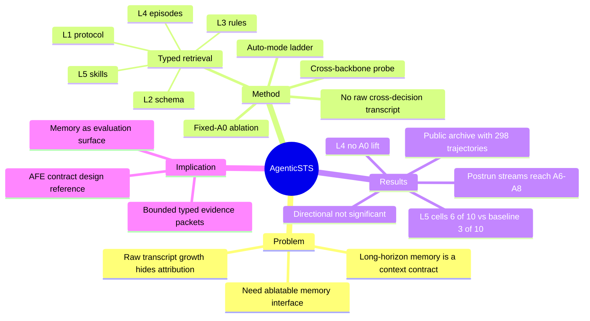

## Summary
AgenticSTS 把 long-horizon LLM agent 的 memory interface 定义为“每一步允许模型看到什么”的 bounded contract，而不是简单追加完整历史 transcript。论文在 Slay the Spire 2 上释放 298 条轨迹、冻结 memory/skill snapshots、prompt records 和分析脚本；核心贡献是可复现实验表面，而不是宣称某个 memory layer 已被统计显著证明。

## Problem & Motivation
长程 LLM agent 的常见做法是把过去 observation、tool call、reflection 不断追加到 prompt。这个做法看起来简单，但有两个问题：第一，context 会随 horizon 增长，成本和注意力噪声都上升；第二，成功或失败时很难归因，因为历史、规则、episode summary、skill guide 都混在一个 transcript 里。

AgenticSTS 的问题设定是：memory 不应该被看作一个“存文本的地方”，而应该是一个可实验的 interface contract。每一步决策时，系统要明确模型能看到哪些类型的信息、哪些信息可写、哪些可 ablate。这个 framing 对 agent research 很有价值，因为许多所谓 self-improving / memory / skill library 方法的真正变量不是“有没有记忆”，而是“什么证据在什么时刻进入决策”。

作者选择 Slay the Spire 2 作为 testbed，因为它是 closed-rule、text-readable、随机、多步、长程且未饱和的环境。任务不是 GUI/VLA 本身，但它提供了一个干净的 long-horizon decision laboratory：数百个战斗、路线、卡牌和商店决策，规则可结构化读取，成功需要跨 episode 的策略积累。

## Method
AgenticSTS 的核心是 per-decision typed retrieval。每次决策都从五层 typed substrate 重新组合 user message，而不是追加 raw cross-decision transcript：

1. **L1 protocol instructions**：固定角色、输出格式、决策协议。
2. **L2 state-specific schemas**：combat、deckbuilding、map、event、intermission 等状态的 schema 和 legal action format。
3. **L3 game rules**：卡牌、遗物、敌人、事件、意图等 enumerable rule data。
4. **L4 episodic memory**：postrun summaries，按 character / ascension / act / enemy class 等维度检索。
5. **L5 triggered strategic skills**：从日志中蒸馏出的策略 guide，带 trigger condition 和 prose policy。

关键约束是：raw transcript 不跨决策追加；如果信息要跨决策保留，必须先被写入 bounded store。L1/L2 固定，L3 可过滤，L4/L5 可关闭、冻结或在 run 后写入。这使得 prompt 大小与 run length 解耦，也让 memory layer 成为可单独 ablate 的对象。

实验分三类：

- **Fixed-A0 ablation**：在最低难度 A0 固定条件下比较 no scaffold、prompt only、hand skills、template skills、skills+episodes 五个 cell，每个 10 局。
- **Cross-backbone probe**：把 Gemini 轨迹训练出的 frozen L4+L5 stack 转移到 Qwen、DeepSeek、Gemini，看同一个 stack 是否跨 backbone 有效。
- **Auto-mode ladder**：允许 postrun memory update 后逐级挑战 A0-A10，看最高到达 ascension endpoint。

论文还加入了 open-source accumulating-context agents 的 operational comparison，但作者反复强调这不是 same-codebase causal ablation，因为不同系统在 harness、routing、prompt cadence、game version 等方面都有差异。

## Key Results
- 固定 A0 下，无 scaffold baseline 胜率 3/10，prompt-only 4/10；三个 L5 skill cells 都是 6/10。作者把这解读为 L5 triggered skills 是最大 observed difference，但 Fisher exact p 约 0.37，不能宣称统计显著。
- L4 episodic memory 在 A0 上没有额外提升：mode-a（无 L4）和 full-frozen（有 L4）都是 6/10；L4 的价值更多体现在后续 ladder stream，而不是低难度固定对照。
- Auto-mode ladder 中，postrun-active streams 最高尝试到 A6-A8，而 no-postrun streams 停在 A2-A4。这是 endpoint evidence，不是固定难度 win-rate。
- Cross-backbone 结果显示 frozen skills 很依赖 backbone：同一 Gemini-trained stack 提升 Qwen score 但不带来胜利，对 DeepSeek 反而降低 score，对 Gemini 自身有效。
- 与两个 public accumulating-context agents 的 operational comparison 中，STS2MCP 和 CharTyr 在 A0 上都是 0/5，而 AgenticSTS full-frozen 是 6/10、baseline-strict 是 3/10；同时 accumulating agents 的 prompt 从约 9k 增到 500k tokens/call，bounded contract 的 strategic user message 中位数约 5k。
- 公开 artifact 包含 298 completed trajectories、condition tags、frozen L4/L5 snapshots、prompt records、Wilson/bootstrap scripts，可用于后续重算和加新对照。

## Strengths & Weaknesses
**亮点**：论文最好的地方是诚实。它没有把 3/10 到 6/10 包装成大胜，而是清楚写出样本量小、置信区间重叠、p 值不显著。对科研 notebook 来说，这种 reporting style 比很多“long-horizon agent 提升一倍”的宣传更可信。

**亮点**：bounded memory contract 是一个很可复用的问题 formulation。它把 memory、skill、rules、episode summary 分离成 typed slots，直接解决“更多 context 是否有用”这个问题的归因困难。这个思想可以迁移到 GUI/CUA：每一步给 agent 的 observation 不应是无限历史，而应是 typed evidence packet，例如 visible UI state、recent failed actions、task constraints、retrieved manuals、verified progress notes。

**亮点**：release 不是只给代码，而是给 trajectory archive、condition tags、prompt records 和 analysis scripts。对 long-horizon agent 研究，这种 artifact 比单个模型 checkpoint 更有价值，因为后续可以在同一 testbed 上加 accumulating-context row 或新 memory contract。

**局限**：任务域是单一游戏，且主要是 text-readable closed-rule decision，不覆盖 visual grounding、GUI actuation、real web state、multi-user constraints 等 computer-use 关键难点。它验证的是 memory interface 的可实验性，不是 GUI agent 能力。

**局限**：L5 skill 内容仍然依赖 hand-authored seed 或 stub-template filling，严格说不是 fully autonomous skill invention。Mode B 证明模板 skill 在 interface 内可竞争，但并不证明 agent 自动发现了高质量策略。

**局限**：与 accumulating-context agents 的比较是 operational，不是 causal。竞争系统的失败可能来自 prompt cadence、invalid action handling、routing、游戏版本或实现质量。论文也承认最干净的比较应当是在同一 codebase 里增加 accumulating-context condition。

**对本 notebook 的影响**：AgenticSTS 强化了一个研究原则：agent-facing runtime 的价值不只是“给更多信息”，而是定义一个 bounded、typed、可 ablate 的 evidence contract。AFE-MiniSuite 如果只比较 screenshot vs DOM/UIA，很容易变成接口工程；更有研究价值的是比较不同 observation/memory contract 对 long-horizon error attribution、token scaling 和 recovery 的影响。

## Mind Map

## Notes
- 代码/数据：论文明确给出 project/code `https://github.com/AlayaLab/AgenticSTS` 和 trajectory data `https://huggingface.co/datasets/ShandaAI/AgenticSTS-trajectories`；本轮只验证到论文文本声明，未运行仓库。
- 和 [[Papers/2606-OpenRath]] 的关系：OpenRath 把 runtime state 做成 Session 一等值，AgenticSTS 把每步 prompt context 做成 typed layers；两者都在反对不可审计的散乱 transcript。
- 和 [[Papers/2606-AgenticAbstention]] 的关系：AgenticSTS 的 bounded contract 可以承载 “stop evidence” 或 “do not continue” skill，而不是让失败历史无限堆在 prompt 里。
- 和 [[Papers/2606-LUMOS]] 的关系：LUMOS 是 UI semantic state layer，AgenticSTS 是 memory/context layer；AFE 的最小原型可以把 semantic blueprint 放入 L2/L3，把 recent UI failures 放入 L4，把 reusable recovery/stop rules 放入 L5。
