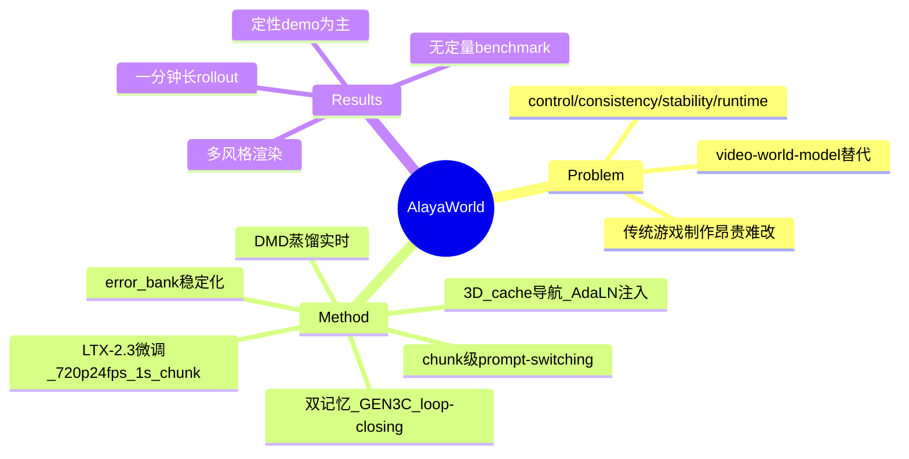

## Summary
AlayaWorld 是一个开源的交互式生成世界框架，从 LTX-2.3 微调而来，在 720p/24fps 下以约 1 秒的 chunk 自回归生成可实时游玩的视频世界，支持自由导航与 combat/施法/召唤等开放动作，重点解决控制、一致性、稳定性、实时性四个难题。

## Problem & Motivation
传统游戏世界依赖昂贵、劳动密集的制作流水线——需要显式创作物体、动画和交互规则，导致世界开发成本高、难以定制、部署后修改代价大。作者主张用 video world model 作为替代范式：生成模型以世界状态和用户交互为条件自回归合成未来观测，从而能从 gameplay 录像和真实视频等多样数据中在线生成可游玩世界。核心挑战被归纳为四点：control（开放式导航与动作）、consistency（revisit 时的时空一致）、stability（长时程生成不漂移）、runtime（低延迟实时）。

## Method
基座：从 **LTX-2.3** 微调，720p 24fps，以约 1 秒的小 chunk、4 步去噪生成。围绕四个挑战给出对应模块：

- **Navigation（相机控制）**：显式 3D cache 渲染 + 轻量架构注入结合。从 depth-unproject 的历史帧维护 3D cache，沿目标轨迹渲染，再用 AdaLN 式 modulation 做相机条件注入，开销极小。
- **Prompt-driven Actions（开放动作）**：chunk 粒度的 prompt-switching 机制，可在不重生成已有内容的前提下替换 text condition，实现动作/风格的中途切换。
- **Consistency（一致性）**：双记忆系统——空间索引的 3D cache（几何持久性，follow GEN3C）+ 时间压缩的帧历史（动态持久性，Frame Preservation 压缩），并实现 loop-closing 支持"离开-返回"轨迹。
- **Stability（稳定性）**：训练时鲁棒化，让模型暴露于"漂移过的历史"；维护 error bank 存储 rollout 中的残差 artifact，作为结构化扰动重新注入到记忆条件与目标片段中。
- **Runtime（实时）**：基于 **DMD** 的 few-step 蒸馏压缩去噪步数；小时间 chunk 带来低延迟与高频条件更新，chunk 边界处的 prompt switching 支撑交互控制。

框架为模块化设计，覆盖从数据准备、模型架构、训练、推理优化到部署的完整开发流程。

## Key Results
> [论文以定性演示为主，几乎无定量 benchmark 数字。技术细节、实验结果与完整代码称"mid-July 发布"]

以视觉 demo 展示能力：相机控制忠实跟随视点且保持场景 identity；文本 prompt 中途切换时动作/风格平滑过渡；leave-and-return 轨迹保持几何、布局、纹理一致；一分钟长 rollout 维持画质与物体 identity；同一导航可渲染为 realistic / Minecraft / 水墨 / 油画 / cyberpunk / pixel art / Zelda 风格。与代表性交互世界模型的定性对比中，作者称 AlayaWorld 在相机控制精度与一致性上更优（baseline 出现画质退化 / revisit 不一致）。

## Strengths & Weaknesses
**Strengths**：工程完整度高——把 navigation / action / consistency / stability / runtime 五条线各配一个模块并整合成端到端可部署系统；双记忆（几何 cache + 压缩历史 + loop-closing）针对 revisit 一致性是合理设计；error bank 的"训练时注入漂移"思路对长时程稳定性是务实的做法；DMD 蒸馏 + 小 chunk 换实时交互是可落地的取舍。

**Weaknesses**：作为技术报告，**零定量评估**——无 benchmark、无消融、无与 baseline 的量化对比，所有优越性 claim 均基于自选 demo，证据力弱；depth/geometry 估计质量直接决定 3D cache 渲染，静态空间 cache 对动态物体的表示是已知短板；chunk 边界不连续性在流式方案中普遍存在、文中仅隐含承认。整体处于"预览 / teaser"阶段，评估与代码尚未到位。

## Mind Map

## Notes
- 通讯邮箱为 kaipeng.zhang@shanda.com，Alaya Lab 应隶属盛大（Shanda）；institute 字段暂按项目页/邮箱标注为 Alaya Lab。
- 与 vault 内 world-model 谱系可对照：2604-HYWorld2、2604-GenWorldRenderer、2600-MobiledreamerGenerativeSketchWorld。AlayaWorld 卖点在"可实时游玩 + 开放动作 + 长时程一致性"三者合一，但缺乏量化对比使其相对定位难以判断。
- 待 mid-July 完整版发布后应回填：数据规模、模型参数量、定量指标与消融。
