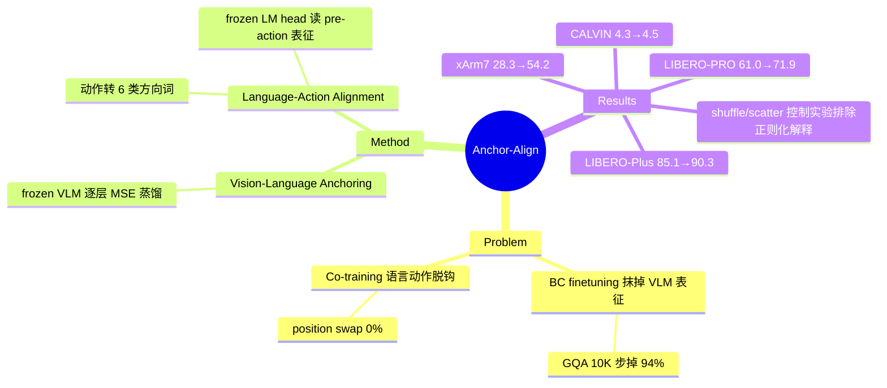

## Summary

VLA 的 behavior cloning finetuning 会逐步抹掉预训练 VLM 的视觉-语义表征（GQA 准确率 10K 步内掉 94%），而常用补救手段 co-training 又造成 language-action misalignment。本文提出 Anchor-Align：用 frozen VLM 逐层蒸馏锚定表征（Vision-Language Anchoring）+ 把连续动作程序化转成离散运动方向词、让 frozen language head 也能读出动作意图（Language-Action Alignment），在 LIBERO-PRO/LIBERO-Plus/CALVIN ABC→D 及 xArm7 实机上均显著超过 VLA-Adapter / StarVLA baseline。

## Problem & Motivation

VLA 的标准做法是拿预训练 VLM 做 BC finetuning，只优化 action loss。作者给出两个失效证据：

1. **Catastrophic forgetting**：标准 BC 在 10K 步内让 backbone 的 GQA 视觉推理准确率从 100%（相对 frozen VLM）跌到 6%——支撑视觉/语义泛化的表征被 action 梯度覆写。实机表现为：训练时抓 green mug，测试时指令换成 pink mug，模型 90% 仍去抓 green mug（颜色 grounding 被抹掉，policy 退化为布局记忆）。
2. **Co-training 的 language-action misalignment**：co-training 把 language loss 和 action loss 施加在**不同 observation** 上，语言头和动作头各说各话。实证：co-trained 模型（Co-training+KI，即 π-0.5 式 knowledge insulation 路线）在 LIBERO-PRO position-swap 上 0%——语言能力保住了，但和动作完全脱钩。

核心命题：有效的 VLA finetuning 必须**在同一 observation 上**同时保住语义先验并把它 ground 到动作。

## Method

总损失：`L_total = L_action + λ_anchor·L_anchor + λ_align·L_align`（λ_anchor=1.0；λ_align=0.1 LIBERO / 0.05 CALVIN）。两个组件都 architecture-agnostic，在 VLA-Adapter（Prismatic-Qwen2.5-0.5B + L1 回归头）和 StarVLA（Qwen2.5-VL 3B + GR00T FM-DiT flow-matching 头）两套 setup 上验证。

**组件 1：Vision-Language Anchoring（表征锚定）**
- 保留一份 frozen 的预训练 VLM 作 anchor，训练时对**每一层 decoder** 的 vision + text token 位置做 hidden state 的 MSE 蒸馏：`L_anchor = ||H^S[m] − H^A[m]||_F²`，对所有层取平均。
- 与 co-training 的本质区别：直接在**同一条 robot observation** 上约束 backbone 表征不漂移，而不是靠外部 web 数据在别的 observation 上"补课"。

**组件 2：Language-Action Alignment（语言-动作对齐）**
- 程序化地把 action chunk 的平移分量均值 v̄ 转成 6 类离散运动方向词 {up, down, left, right, forward, backward}：滤掉近静止样本（||v̄||₂ < τ=0.15）→ 取主导轴 argmax|v̄_j| → 按符号定方向词。
- 用最后一层 instruction token 的 hidden state，经一个新学的投影 W_proj（唯一新增参数，803K，约 1.5MB bf16）过 **frozen 的预训练 language head** 做 6 类 CE 分类。
- 直觉：强迫 pre-action 表征保持"能被原 language head 读懂"，即语言空间和动作意图在同一表征上对齐。零额外数据，标签全部由动作自动生成。

**训练细节**：LoRA r=64，AdamW lr=2e-4，bf16，4×GH200；LIBERO 30K 步 bs=64，CALVIN 10K 步 bs=32。frozen teacher 推理开销小，总训练时间与标准 BC 相当。

## Key Results

**LIBERO-PRO（语义鲁棒性）**：mean 61.0%（VLA-Adapter）→ **71.9%**；分项 language rephrase 91.1→97.0、object swap 89.6→96.2、position swap 2.3→**22.6**。Co-training+KI 只有 43.8%（position swap 0%）。

**LIBERO-Plus（感知鲁棒性，7 个扰动轴）**：mean 85.1 → **90.3**（+5.2）；background texture +8.9（90.7→99.6）、lighting +7.4、object layout +5.8。

**CALVIN ABC→D**：avg rollout length 4.3 → **4.5**（OpenVLA-OFT 4.1）；5/5 链完成率 73.1→77.9。

**xArm7 实机（4 类泛化测试）**：VLA-Adapter setup 28.3→**54.2%**（相对 +91%），StarVLA setup 36.7→**60.0%**。semantic perturbation（pink vs green mug）从 90% 抓错训练物体 → 100% 抓对。

**Ablation（关键）**：
- 两组件互补：alignment-only 65.9 / anchoring-only 68.1 / 合并 71.9（LIBERO-PRO）。
- **标签语义控制实验**：把方向词换成固定 shuffle（61.4）或无意义词 scatter（63.3）后增益基本归零 → 收益来自真实的 language-action 语义对齐，不是"随便加个辅助任务的正则化效应"。
- **对齐-成功率相关性**：per-rollout 的语言预测-实际动作对齐率从 16.8%（VLA-Adapter）升到 78.4%，且与 task success 的 Pearson r 从 ≈0 变为 +0.51。
- 表征保持：Anchor-Align 训练后仍保留 frozen VLM 约 70% 的 GQA 相对准确率（标准 BC 仅 6%）。

**失效分析（实机）**：incorrect object 10→1、semantic error 7→0、memorization 15→9、grasp failure 15→8；但 grasp-and-drop 12→13（不降反微升），position swap 仍只有 22.6%。

## Strengths & Weaknesses

**Strengths**
- 问题诊断精准且有量化证据：GQA 94% 遗忘曲线 + co-training position-swap 0% 这两个 motivating 实验，比多数 "VLA 泛化差" 的泛泛之谈扎实得多。
- 方法极简且零额外数据：anchoring 是层级蒸馏，alignment 是 6 类分类头，新增参数仅 803K；对比 co-training 需要维护 web 数据管道，工程上干净得多。
- Ablation 设计有品味：shuffle/scatter 标签控制实验直接排除了"辅助任务正则化"这一最显然的替代解释；alignment-success 相关性分析（16.8%→78.4%，r=+0.51）把机制 claim 落到了可测量的证据上。
- 双 setup（回归头 + flow-matching 头）+ 实机验证，architecture-agnostic 的 claim 有支撑。

**Weaknesses**
- Position swap 22.6% 虽是 2.3% 的 10 倍，但绝对值仍然很低——空间重排下的泛化没有真正解决，方法主要修复的是**语义** grounding 而非**空间** grounding（作者的失效分析也承认 memorization error 只降了 40%）。
- Language-Action Alignment 只用 6 个平移方向词，粒度极粗：旋转、gripper 开合、速度都没有对齐信号；grasp-and-drop 错误不降反升，暗示细粒度操作能力可能被锚定约束轻微牺牲（推测，作者未深挖）。
- 全层 MSE 蒸馏意味着训练时要跑一份 frozen teacher 的 forward，0.5B/3B 尚可，scale 到更大 backbone 的开销与 λ_anchor 敏感性未讨论。
- Baseline 覆盖：与 co-training+KI 比了，但没有与其他表征保持路线（如 EWC/L2-SP 类参数正则、或 π-0.5 完整配方）做系统对比；LoRA r=64 本身就是较强的隐式正则，anchoring 增益在 full finetuning 下是否放大/消失未知。

**对领域的意义**：把 "VLA finetuning 遗忘" 从轶事变成可测量、可修复的问题，且给出的修复配方便宜到没有理由不加。与 [[2504-Pi05]] 的 knowledge insulation、[[2606-MergeVLA]] 的模型合并路线构成同一问题的三种答案：隔离梯度、事后合并、在线锚定——本文证据显示在线锚定在 language-action 一致性上占优。

## Mind Map

## Notes

- 与 [[2502-OpenVLA-OFT]] 一脉的 "finetuning 配方" 研究，但关注点从效率转向表征保持。
- 后续可关注：alignment 词表扩展到旋转/gripper；anchoring 在 full finetuning 与更大 backbone 上的表现。
