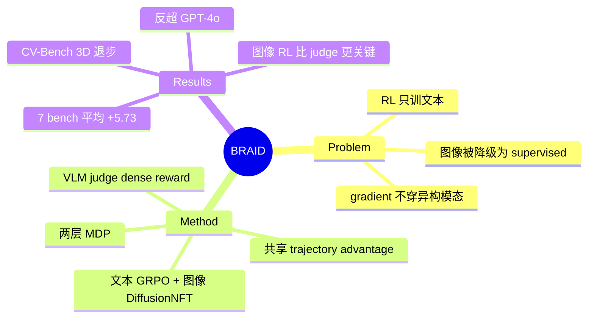

## Summary
针对 unified multi-modal models（UMM）的交错「文-图-文」推理，BRAID 把整条多轮轨迹建模成一个统一 MDP，用单一 trajectory-level advantage 同时驱动文本 token（GRPO）和图像去噪路径（DiffusionNFT）的 policy gradient，让 RL 第一次真正贯穿异构模态；并用 VLM judge 给中间图像打分做 dense turn-level reward。

## Problem & Motivation
UMM（如 BAGEL）已经能做交错的文本-图像推理（生成中间图像辅助思考），但如何用 RL 优化这种多轮多模态生成仍是开放问题。现有做法的关键局限：**RL 只作用于文本步骤，图像生成被降级为 supervised surrogate**，policy gradient 无法穿过完整的交错轨迹传播到图像分支。结果是 UMM 的 RL 潜力基本没被释放——图像生成这一步不参与「因为最终答案对了/错了而学习」的信用分配。作者的立论：只有把文本和图像放进同一个 MDP、用同一个 RL objective 联合优化，交错多模态推理才能真正 work。

## Method
**两层 MDP 形式化**：外层把每个 text chunk 或每张 image 视为交错轨迹中的一个 macro-action；内层把 macro-action 展开成 micro-action——文本是 token 序列，图像是 flow matching 的去噪路径。这样整条 text-image-text 轨迹被统一成一个决策过程。

**共享 advantage、模态原生的梯度**：算一个 trajectory-level advantage Â，然后按模态各自传播——
- 文本：走 GRPO-style 的 clipped objective，作用在 per-token 概率上。
- 图像：把 Â 转成 soft reward label r_k = σ(Â/υ)，喂进 DiffusionNFT loss，训练加权的正/负 velocity fields。

**Vision-Thinking Process Reward**：为解决 long-horizon 信用分配，引入一个 VLM judge（论文用 GPT-5.2）对每张中间图像从四个维度打分（visual correctness / visual fidelity / reasoning utility / trustworthiness，各 [1,10]），独立归一化后经 decoupled advantage estimation 组合，提供 dense 的 turn-level 反馈，聚焦「关键视觉分支」的学习。

**训练配置**：base 为 BAGEL-7B（hybrid AR-diffusion 架构）；rollout batch 64、update batch 32、每 prompt 8 个 rollout，共 120 training steps。

## Key Results
Base 对比 BAGEL-7B，7 个 benchmark 平均 +5.73：

**Spatial Reasoning**
- MMSI-Bench: 31.80（+5.20）
- SAT: 58.67（+14.00，最大涨幅）
- MMVP: 81.33（+5.66）
- CV-Bench 3D: 82.17（**−1.24**，唯一下降）

**Visual Perception**
- BLINK: 57.76（+3.00）
- V*Bench: 68.35（+10.76）
- CV-Bench 2D: 76.26（+2.73）

7B 模型平均 65.19，**反超 GPT-4o（62.46）**。baseline 覆盖 proprietary VLM（GPT-5.2、GPT-4o、Qwen2.5-VL）与 unified model（Janus-Pro、Chameleon、BAGEL-7B）。

**Ablation**（都掉，图像分支更关键）：
- 去掉 DiffusionNFT（图像 RL）：65.19 → 62.10，V*Bench −6.00、CV-Bench 2D −4.32 掉得最狠。
- 去掉 vision-thinking reward：65.19 → 62.68，V*Bench −4.48、SAT −2.67。

## Strengths & Weaknesses
**Strengths**
- 问题 formulation 干净：把「RL 只训文本、图像当 supervised surrogate」这个割裂点找准了，两层 MDP 让 advantage 一致地流进图像去噪路径，是 conceptually 正确的补法。
- Ablation 讲了真话：图像分支 RL（DiffusionNFT）贡献大于 VLM judge reward，说明主要收益来自「让图像生成也吃 policy gradient」而非花哨的 process reward——支撑了核心 claim。
- V*Bench +10.76、SAT +14.00 这类需要「主动生成/放大视觉线索」的任务涨幅最大，与「优化图像分支」的机制方向自洽。

**Weaknesses**
- **Reward 依赖 GPT-5.2 做 judge**，process reward 的上限被一个更强的闭源模型锚死；「7B 反超 GPT-4o」的说法要打折——训练信号本身来自比 GPT-4o 更强的模型蒸馏。
- CV-Bench 3D **−1.24**，是真实 3D 空间任务上唯一退步；结合 CV-Bench 2D 只 +2.73，说明收益偏向「找细节/放大 ROI」而非几何空间推理。
- 只在 BAGEL-7B 单一 backbone、120 steps、单一 base 上验证，泛化性、scaling、interleaving pattern 固定（作者自己列为 limitation）都没答。
- baseline 里缺「文本-only RL 的 UMM」这个最该打的直接对手——去掉图像 RL 的 ablation 部分替代了它，但不是一个独立训练强度对齐的 baseline。

对领域的影响：为 UMM 的 RL 打开了「图像分支也可微分优化」的正确通道，方向对；但当前更像一个 well-executed 的 proof-of-concept，而非可直接照搬的成熟配方。

## Mind Map

## Notes
- 值得追问：DiffusionNFT 的 soft reward r_k = σ(Â/υ) 里 υ 的敏感性没给——这是把 trajectory advantage 塞进 diffusion 的关键旋钮。
- 「VLM judge 打分 → turn-level reward」本质是 process reward model 的多模态版，和文本域 PRM 的老问题（reward hacking、judge 偏置）在图像上会不会更严重？未讨论。
- 与 [[Papers/2600-UnifyAgentUnifiedMultimodal]] 可对读：同为 unified multimodal，但那篇偏统一表示/agent，本篇聚焦 RL 的信用分配贯通。
