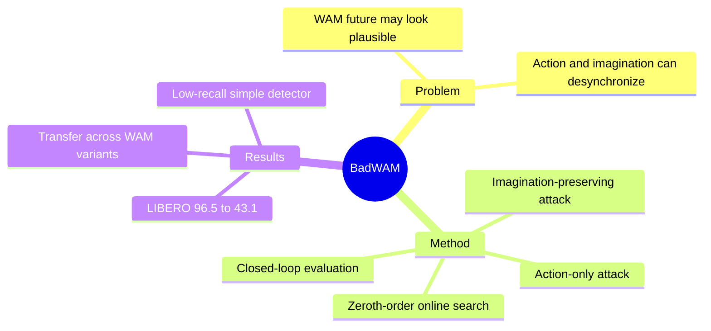

## Summary
BadWAM 揭示 World-Action Model 的新攻击面：微小视觉扰动可以让 action 与 imagined future 解耦，使模型“梦得合理”却执行失败。其 black-box、query-based 攻击在 LIBERO 上把一个 WAM 的成功率从 96.5% 降至 43.1%，说明仅检查未来视频是否合理不足以构成安全保障。

## Problem & Motivation
World-Action Model（WAM）把未来世界预测与 action generation 耦合，通常被认为比纯 reactive policy 更可解释、更稳健：部署者似乎可以在执行前检查 imagined future 是否安全。但这套直觉隐含了一个未经验证的假设——模型输出的 action 必然仍与其预测未来同步。作者研究 inference-time 威胁：攻击者只能对视觉 observation 加有界扰动，不能修改 instruction、robot state、环境动力学、参数或训练数据，却可能让 action pathway 与 imagination pathway 异步失效。

## Method
BadWAM 把目标定义为 **World-Action Drift Attack**，并沿攻击强度与隐蔽性构造两种实例：

1. **Action-only attack**：仅观察 WAM 的 action chunk，以 clean/attacked action deviation 为 zeroth-order 优化目标，寻找导致执行偏移的有界视觉扰动。
2. **Imagination-preserving attack**：在 action deviation 上增加 future-distance 正则，使 attacked future 尽量接近 clean imagination，同时仍诱导有害 action shift。正则系数控制 attack strength 与 stealthiness 的权衡。
3. **Query-based online optimization**：每次 replan 采样 Rademacher direction，用成对 finite-difference query 估计更新方向，再投影回扰动预算；默认 8 次成对更新，加 clean reference 共需 17 次 WAM forward query。
4. **Closed-loop protocol**：每个 replanning step 都重新攻击并执行 action chunk，分别记录 task success、action distance、future distance、channel/horizon shift 与 decoupling score，从而捕捉单步误差随闭环累积的失败。

实验覆盖 LIBERO 与 RoboTwin，并比较 action-only、joint prediction、imagine-then-act（IDM）三类 WAM interface。

## Key Results
- 在 LIBERO full sweep 上，action-only WAM 从 96.5% clean success 降到 43.1%，下降 53.4 个百分点；joint WAM 在 action-only / imagination-preserving 攻击下分别为 61.5% / 63.0%，IDM WAM 分别为 66.1% / 约 67%。
- 失败不是随机图像噪声效应：同预算 random perturbation 下 joint 与 IDM 的成功率仍为 71.0% 和 75.2%，而 BadWAM 更强；white-box reference 可进一步降至 49.2% 和 52.8%，说明 black-box 攻击尚未达到最坏情况。
- matched-strength 实验中，imagination-preserving objective 将平均 future distance 从 14.01 降到 13.04，并在 40 个 LIBERO task 中有 39 个更接近 clean future，同时保留相近的攻击强度。
- 攻击可在不同 WAM 变体间迁移。简单 augmentation-consistency detector 在 5% false-positive rate 下仅检出 13.4% 的 joint-WAM attacked replans 和 21.4% 的 IDM-WAM attacked replans。

## Strengths & Weaknesses
**亮点**：论文没有把 WAM safety 简化成“生成未来是否逼真”，而是把 action–imagination synchronization 提升为可测量的安全属性；closed-loop、随机噪声、white-box upper bound、transfer 与 defense baseline 让攻击证据链较完整。两种 objective 也清楚地区分了 overt hijacking 与 stealthy desynchronization。

**局限**：威胁模型依赖攻击者能够在线修改预处理视觉输入并承担每次 replan 17 次 forward 的高开销，真实物理攻击的可实现性尚未验证。多项 ablation、transfer 与 defense 只在 12-task LIBERO subset 上完成，作者也计划补做 full sweep；现有 defense 是 non-adaptive preprocessing，不能代表针对 BadWAM 优化过的强防御。更根本地，future distance 仍是表示层 proxy，“视觉上接近”不等于语义或物理后果真的一致。

## Mind Map

## Notes
对 World-Action Model 的 runtime monitor，合理的检查对象应是“当前 action 是否能够实现 predicted future”，而不是单独给 future video 打 realism 分；这提示可以研究 action-conditioned consistency verifier 或可执行 inverse-dynamics check。
