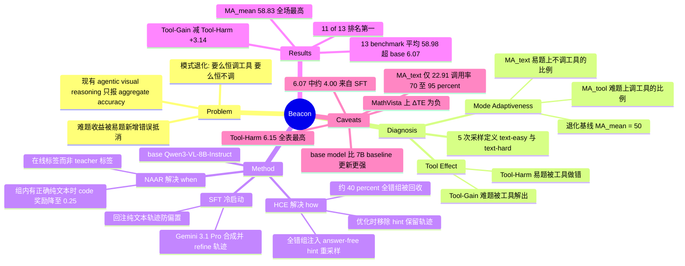

## Summary

Beacon 提出 Mode Adaptiveness 与 Tool Effect 两个诊断维度，指出现有 agentic visual reasoning 模型基本退化为"几乎总调工具"或"几乎不调工具"，且工具在难题上的收益被易题上新引入的错误抵消。方法上以 Qwen3-VL-8B-Instruct 为 base 做 SFT 冷启动加 GRPO，配合 Necessity-Aware Adaptive Reward（组内已有正确纯文本回答时，把正确 code 回答的奖励从 1 降到 0.25）与 Hint-Guided Capability Expansion（对全错 rollout group 注入 Gemini 3.1 Pro 生成的 answer-free hint 重采样）。13 个 benchmark 平均超 base model 6.07 点，Tool-Gain 减 Tool-Harm 从各 baseline 的近零提升到 +3.14%。

## Problem & Motivation

agentic visual reasoning 让 MLLM 调用外部工具产生中间视觉结果来支撑最终答案。作者指出已有工作只报 aggregate accuracy，回避了两个更基本的问题：模型能否根据"这题不用工具能不能做出来"来决定调不调工具（tool-invocation adaptiveness）；工具使用是否真的把能力边界推到纯文本推理之外，而不是在本来做得对的题上新增错误（tool effect）。

这不是作者独创的怀疑。论文自己引了三条同期诊断工作：Yang et al. 2026 认为 interleaved visual result 相对纯文本推理贡献很小、提升主要来自 SFT；Ma et al. 2026 认为 tool-use RL 主要在减少工具引入的错误，而非解决原本解不出的题；Guo et al. 2026 认为 tool-induced gain 和 harm 都只有边际影响。Beacon 对既有诊断的两点改进是可验证的：一是把 tool-free solvability 从"单次推理的二值结果"改成 5 次采样投票（≥4 次正确记 text-easy，≤1 次正确记 text-hard，2-3 次判为 ambiguous 并剔除），降低采样随机性；二是同时刻画 adaptiveness 与 effect，而不是只看其中一面。

在方法侧，论文对三条已有 adaptive tool-use 路线给出了具体反例。CodeDance 用 group-level accuracy 决定 adaptive reward 的方向，但不 condition 于某条 trajectory 是否真的调用了工具，因此可能仅因为该 trajectory 属于高准确率组就惩罚一次成功的 tool-assisted 推理。AdaTooler-V 用 teacher（Qwen2.5-VL-72B）的 tool-induced gain 给样本打"需不需要工具"的标签，存在 policy 与 teacher 的分布错配，且上限被 teacher 自身的工具能力卡住。Metis 简单地整体鼓励更少的 tool call，缺少任务相关的自适应性。

## Method

**推理接口。** Beacon 自主决定是否执行代码。调用时生成 `<tool_call>...</tool_call>` 包裹的 Python 片段，执行结果以 `<observation>...</observation>` 返回，随后可继续推理、再次调用或直接给出 `<answer>`。代码覆盖 crop、draw_line、draw_box、rotation、numeric_calculation 等视觉与数值操作。SFT、RL rollout 与评测共用同一 system prompt（唯一差别是把数据合成时的"必须用代码"改成"你来决定是否用代码"），以避免分布偏移。

**数据构建。** 源数据取自 16 个 benchmark/dataset（正文列出 Geometry3K、OlympiadBench、AgentVista、MuirBench、HRScene、CV-Bench、MMMU、Vero 等），去除与评测集重叠的样本。SFT 三阶段：base model 采样 5 次只保留最多答对 2 次的难例；用 Gemini 3.1 Pro 生成带代码与执行输出的轨迹，只留答案正确的；再用同一模型做一轮 refinement，剔除"代码其实没帮上忙"的轨迹。为避免模型被带偏成无脑调代码，还回注了一批 base model 在准确率 ≥0.6 样本上产生的正确纯文本轨迹。RL 数据取 SFT 模型 5 次中答对不超过 3 次的样本。最终 SFT 212,353 → 15,705，RL 45,886 → 15,709。

**Necessity-Aware Adaptive Reward（NAAR）。** 这是"when"的核心，一个组级软偏好而非硬禁令。对 rollout group G，若 G 中至少有一条正确的纯文本回答（标记为 text 组），则正确的纯文本回答得 1、正确的 code 回答得 0.25；若 G 中没有正确的纯文本回答，则正确的 code 回答得 1；其余为 0。关键设计是把"这题需不需要工具"的标签在线地由当前 policy 的组内表现决定，而不是外部 teacher；同时不给正确 code 回答零奖励，避免自适应目标与准确率目标直接冲突。总 reward 为 `0.1 * R_format + 0.9 * R_adaptive`，format reward 要求每个 code block 后跟一个 observation block 且答案在 `<answer>` 内。

**Hint-Guided Capability Expansion（HCE）。** 这是"how"的核心，针对 RLVR 在全错组上没有 group-relative 信号的结构性缺陷。先用原 prompt 采 N=8 条；若全错，调用 Gemini 3.1 Pro 走两步：先让它生成完整的 code-assisted 轨迹并只保留答对的，再从这条已验证轨迹里抽出关键推理步骤与每步的预期 subgoal，转成不含最终答案的 hint。把 hint 拼到 prompt 后再采一组。策略更新时，把 hint 从模型输入中移除只保留轨迹本身，实现"用 hint 探索、把能力还给 hint-free policy"。importance sampling 比值对两类组不同：normal 组分子分母都用 x；hinted 组分子用 x、分母用 x^h（沿用 Nath et al. 2025 的做法，把 hint 留在 old policy 的 context 里以缓解 off-policy）。

**其他。** GRPO 为底座，clip 0.2，关掉 KL 与 entropy 正则，token-mean 目标，tool response 不计入可训练 token。会过滤掉两类无信号的组：准确率优势为零的（即使 hinted 重采后仍全对或全错）和自适应优势为零的（组内推理模式完全一致）。训练在 64 张 H200 上跑 1 epoch，batch 128 prompt groups，每条 rollout 训练时最多 12 次 tool call。

## Key Results

**评测设定。** 基于 VLMEvalKit，温度 0.1，所有 agentic 模型评测时最多 20 轮 tool call、答案解析失败最多重试 3 次；baseline 的工具推理 pipeline 按各自官方实现复现。规则匹配失败时交给 Gemini 3.1 Pro 或 Gemini 3 Flash 做语义判分。13 个 benchmark 分两表。

**Table 1（高分辨率视觉搜索 + 空间/感知推理，7 项）。**

| Model | V* | HR-Bench 4K | HR-Bench 8K | VisualProbe | RealWorldQA | BLINK | BabyVision | Avg. |
|:--|--:|--:|--:|--:|--:|--:|--:|--:|
| Gemini 3.1 Pro（闭源） | 89.00 | 90.75 | 86.38 | 40.57 | 79.25 | 81.22 | 48.45 | 73.66 |
| Qwen3-VL-8B-Instruct（base） | 84.85 | 78.13 | 75.75 | 37.74 | 72.29 | 62.86 | 12.37 | 60.57 |
| Pixel-Reasoner-7B | 78.01 | 71.25 | 67.75 | 33.96 | 70.20 | 55.97 | 11.86 | 55.57 |
| Thyme-7B | 82.72 | 77.50 | 72.13 | 47.17 | 70.59 | 54.81 | 14.43 | 59.91 |
| DeepEyesV2-7B | 80.63 | 75.62 | 65.88 | 32.08 | 62.35 | 54.29 | 14.18 | 55.00 |
| CodeV-7B | 84.29 | 75.62 | 67.50 | 40.57 | 70.58 | 58.13 | 12.37 | 58.44 |
| Metis-8B | 90.58 | 83.50 | 81.63 | 48.11 | 71.90 | 62.09 | 14.17 | 64.57 |
| **Beacon-8B** | 89.00 | **84.30** | **81.88** | **50.00** | **73.20** | **65.96** | **18.04** | **66.05** |

**Table 2（定量/图表推理 + 组合与 agentic 推理，6 项）。**

| Model | ChartQAPro | MathVista | MathVision | VisualPuzzles | GameQA | TIR-Bench | Avg. |
|:--|--:|--:|--:|--:|--:|--:|--:|
| Gemini 3.1 Pro（闭源） | 75.46 | 90.40 | 89.47 | 73.46 | 81.00 | 47.57 | 76.23 |
| Qwen3-VL-8B-Instruct（base） | 41.66 | 76.40 | 53.81 | 36.22 | 36.70 | 19.01 | 43.97 |
| Pixel-Reasoner-7B | 51.03 | 70.80 | 28.09 | 33.90 | 28.10 | 16.71 | 38.11 |
| Thyme-7B | 38.66 | 68.90 | 25.82 | 24.14 | 26.00 | 19.01 | 33.76 |
| DeepEyesV2-7B | 50.92 | 67.30 | 27.30 | 34.33 | 27.50 | 17.04 | 37.40 |
| CodeV-7B | 46.06 | 69.80 | 26.02 | 34.85 | 28.00 | 17.70 | 37.07 |
| Metis-8B | 52.79 | 77.80 | 53.49 | 40.50 | 38.50 | 21.65 | 47.46 |
| **Beacon-8B** | **58.48** | 77.10 | **54.57** | **42.89** | **47.30** | **24.03** | **50.73** |

作者称 Beacon 在 13 项中 11 项排第一，比 base model 平均高 6.07 点。未夺第一的两项是 V*（Metis-8B 90.58）与 MathVista（Metis-8B 77.80）。与闭源 Gemini 3.1 Pro 的差距仍很大，Table 2 平均差 25.5 点。

**Table 3（Mode Adaptiveness 与 Tool Effect，只在 HRBench4K / BLINK / BabyVision / MathVista / TIRBench 五项上测，取平均行，单位 %）。**

| Method | Tool-Available Acc. | Tool-Free Acc. | ΔAcc | MA_tool | MA_text | MA_mean | Tool-Gain | Tool-Harm | ΔTE | Text-Retain |
|:--|--:|--:|--:|--:|--:|--:|--:|--:|--:|--:|
| Thyme | 47.63 | 46.89 | +0.73 | 4.28 | 92.95 | 48.61 | 0.19 | 0.13 | +0.06 | 81.43 |
| DeepEyesV2 | 45.71 | 44.89 | +0.83 | 99.71 | 0.63 | 50.17 | 7.85 | 6.11 | +1.74 | – |
| CodeV | 47.24 | 46.92 | +0.31 | 14.84 | 77.54 | 46.19 | 1.25 | 1.19 | +0.07 | 71.39 |
| Metis | 52.19 | 52.73 | -0.54 | 32.61 | 72.71 | 52.66 | 1.14 | 1.10 | +0.04 | 82.98 |
| **Beacon** | **53.53** | 51.57 | **+1.96** | 94.75 | 22.91 | **58.83** | **9.29** | 6.15 | **+3.14** | **91.00** |

一个 MA 的关键参照：永远调工具或永远不调工具的退化模型，MA_mean 恰好是 50%。Thyme（MA_text 92.95）与 DeepEyesV2（MA_tool 99.71）就是这两个极端，MA_mean 分别 48.61 与 50.17。作者报告 Beacon 五个数据集上 p_tool 下的实际调用比例为 HRBench4K 70.65%、BLINK 79.79%、BabyVision 95.36%、MathVista 78.52%、TIRBench 92.74%。此外 5.3 节给出 Qwen3-VL-8B-Instruct 在这五个数据集上的平均准确率为 49.75%，用以论证 Beacon 的 tool-free 能力（51.57%）并未被 RL 削弱。

**Table 4（消融，Overall Acc. 为 13 个 benchmark 平均，其余五项平均）。**

| 配置 | Overall Acc. | Tool-Available Acc. | Tool-Free Acc. | MA_mean | ΔTE |
|:--|--:|--:|--:|--:|--:|
| SFT | 56.91 | – | – | – | – |
| SFT + GRPO | 57.10 | 52.25 | 51.40 | 56.30 | +1.40 |
| SFT + GRPO + NAAR | 57.75 | 53.25 | 52.24 | **59.68** | +2.54 |
| SFT + GRPO + HCE | 57.62 | 52.94 | 51.83 | 58.36 | +2.96 |
| **Beacon（全量）** | **58.98** | **53.53** | 51.57 | 58.83 | **+3.14** |

训练动态方面，作者报告 RL 过程中 rollout group 的三类构成（含正确纯文本 / 无正确纯文本但含正确 code / hinted）稳定在约 50% : 35% : 15%，且约 40% 的初始全错组被 hint-guided 重采样转化为具有非零准确率优势的组。纯文本与 code 回答的比例在训练中基本不变，但"推理模式与组内自适应标签相符"的比例持续上升。

Appendix E 记录了一次失败尝试：额外强制采一组纯文本轨迹，只要标准组或强制组中有一条正确纯文本就把标签定为 text。结果 code 使用率崩塌、V* 与 HRBench 明显退化。作者的归因是强制采样人为抬高了"至少一次纯文本成功"的概率，使组级标签反映的是多次尝试中的最好结果，而非单次 rollout 最可能成功的模式。

## Evidence Ledger

| Claim ID | Claim | Type | Source locator | Evidence excerpt | Status |
|:--|:--|:--|:--|:--|:--|
| C1 | Table 1 七项平均：Beacon-8B 66.05，Metis-8B 64.57，base Qwen3-VL-8B-Instruct 60.57 | number | Table 1 | Beacon-8B (Ours) ... 66.05; Metis-8B ... 64.57; Qwen3-VL-8B-Instruct ... 60.57 | source-verified |
| C2 | Table 2 六项平均：Beacon-8B 50.73，Metis-8B 47.46，base 43.97 | number | Table 2 | Beacon-8B (Ours) ... 50.73; Metis-8B ... 47.46; Qwen3-VL-8B-Instruct ... 43.97 | source-verified |
| C3 | 作者称 Beacon 在 13 个 benchmark 中的 11 个排名第一，平均比 base model 高 6.07 点 | comparison | Sec. 5.2 / 5.6 (RQ1) | "ranking first on 11 of the 13 benchmarks and outperforming its base model by an average of 6.07 points" | source-verified |
| C4 | Beacon 未在 V* 与 MathVista 上取得开源最优；Metis-8B 分别为 90.58 与 77.80，高于 Beacon 的 89.00 与 77.10 | comparison | Table 1, Table 2 | Metis-8B 90.58 / 77.80 vs Beacon-8B 89.00 / 77.10 | source-verified |
| C5 | Table 3 平均行：Beacon Tool-Available Acc. 53.53、Tool-Free Acc. 51.57、ΔAcc +1.96，其余四个模型 ΔAcc 均低于 +1% | number | Table 3 (Average), Sec. 5.3 Obs.1 | "shows the largest performance gain ΔAcc (+1.96%), while other models exhibit weaker ΔAcc with tools (below +1%)" | source-verified |
| C6 | Table 3 平均行：Beacon MA_tool 94.75、MA_text 22.91、MA_mean 58.83，为五个模型中最高 MA_mean | number | Table 3 (Average) | Beacon (Ours) ... 94.75 / 22.91 / 58.83 | source-verified |
| C7 | Table 3 平均行：Beacon Tool-Gain 9.29、Tool-Harm 6.15、ΔTE +3.14；Beacon 的 Tool-Harm 是五个模型中最高（DeepEyesV2 6.11 次之） | number | Table 3 (Average) | Beacon 9.29 / 6.15 / +3.14; DeepEyesV2 7.85 / 6.11 / +1.74 | source-verified |
| C8 | Beacon 在 MathVista 上 ΔTE 为 -0.38，即工具使用净有害 | number | Table 3 (MathVista) | Beacon (Ours) ... 5.98 / 6.36 / -0.38 | source-verified |
| C9 | Beacon 在 p_tool 下的工具调用比例为 HRBench4K 70.65%、BLINK 79.79%、BabyVision 95.36%、MathVista 78.52%、TIRBench 92.74% | number | Table 3（括号内数值） | 83.38 (70.65); 65.49 (79.79); 16.70 (95.36); 77.80 (78.52); 24.28 (92.74) | source-verified |
| C10 | 恒调用或恒不调用工具的退化模型 MA_mean 为 50% | causal-mechanism | Sec. 3.2 Observation 2 | "A model that always uses tools or never uses tools achieves an MA_mean of 50%" | source-verified |
| C11 | 消融 Table 4 Overall Acc.：SFT 56.91、SFT+GRPO 57.10、+NAAR 57.75、+HCE 57.62、全量 58.98 | number | Table 4 | 56.91 / 57.10 / 57.75 / 57.62 / 58.98 | source-verified |
| C12 | 由 Table 1/2 可推出 base model 的 13 项平均为 52.91，故 6.07 点提升中约 4.00 来自 SFT、约 2.07 来自整个 RL 阶段 | number | Table 1 + Table 2 + Table 4（推算） | (60.57*7 + 43.97*6)/13 = 52.91; 56.91 - 52.91 = 4.00; 58.98 - 56.91 = 2.07 | source-verified |
| C13 | 消融中 GRPO+NAAR 的 MA_mean 59.68 高于全量 Beacon 的 58.83 | number | Table 4 | "using the necessity-aware adaptive reward alone achieves the best Mode Adaptiveness" | source-verified |
| C14 | NAAR 奖励取值：组内有正确纯文本回答时，正确纯文本得 1、正确 code 得 0.25；组内无正确纯文本时正确 code 得 1；其余为 0 | causal-mechanism | Sec. 4.4.1, Eq. (1) | "NAAR assigns the highest reward to correct text-only responses and a reduced reward to correct code-based responses" | source-verified |
| C15 | HCE 对全错组用 Gemini 3.1 Pro 两阶段生成 answer-free hint；策略更新时从输入移除 hint，但 old policy 的 importance-sampling 分母仍以 hinted prompt 为条件 | causal-mechanism | Sec. 4.4.2, 4.4.3, Eq. (6) | "we retain the hint in the context of the old policy to mitigate off-policy issues and stabilize training" | source-verified |
| C16 | 约 40% 的初始全错 rollout group 被 hint-guided 重采样转化为具有非零准确率优势的组 | number | Sec. 5.5, Figure 7(b) | "Approximately 40% of such groups can be successfully recycled by our HCE mechanism" | source-verified |
| C17 | text-easy / text-hard 定义为 5 次纯文本采样中至少 4 次正确 / 至多 1 次正确；2-3 次正确的样本被判为 ambiguous 并从分析中剔除 | benchmark-setting | Sec. 3.1 (Mode Adaptiveness) | "text-easy if at least four responses are correct and as text-hard if at most one response is correct ... excluded" | source-verified |
| C18 | 评测用 VLMEvalKit，温度 0.1，每模型最多 20 轮 tool call、最多 3 次重试；规则匹配失败时由 Gemini 3.1 Pro 或 Gemini 3 Flash 做语义判分 | benchmark-setting | Appendix A.2 | "at most 20 rounds of tool calls... decoding temperature to 0.1... Gemini 3.1 Pro or Gemini 3 Flash for semantic answer judgment" | source-verified |
| C19 | Beacon 的 base model 为 Qwen3-VL-8B-Instruct，而 Pixel-Reasoner / Thyme / DeepEyesV2 / CodeV / PyVision 五个 baseline 均为 7B 规模 | benchmark-setting | Sec. 5.1 Baselines, Tables 1-2 | "We take Qwen3-VL-8B-Instruct as the base model"; 表中标注 Pixel-Reasoner-7B / Thyme-7B / DeepEyesV2-7B / CodeV-7B / PyVision-7B | source-verified |
| C20 | 训练数据经过滤后为 SFT 212,353 → 15,705、RL 45,886 → 15,709；SFT 轨迹由 Gemini 3.1 Pro 合成并 refine | benchmark-setting | Table 5 (Appendix B.1), Sec. 4.2 | SFT Data 212,353 / 15,705; RL Data 45,886 / 15,709 | source-verified |
| C21 | 代码开源于 github.com/NOVAglow646/Beacon，模型权重开源于 huggingface.co/NOVAglow646/Beacon | license-code | 论文首页 Code / Model 链接 | 页首 "Code" 与 "Model" 按钮分别指向该 GitHub 与 HuggingFace 仓库 | source-verified |
| C22 | 论文断言 CodeDance 用 group-level accuracy 决定 adaptive reward 方向、不 condition 于该 trajectory 是否真的调用工具，因而可能惩罚成功的 tool-assisted trajectory | causal-mechanism | Sec. 2 (Adaptive and Efficient Tool Use) | "it may incorrectly penalize the tool-use behavior of a successful tool-assisted trajectory simply because it belongs to a high-accuracy group" | source-verified |

## Strengths & Weaknesses

**问题 formulation 比方法更有价值。** 这篇的真正贡献不是 NAAR 或 HCE，而是把"agentic visual reasoning 是否真的有用"拆成两个可测量的正交维度，并给出 MA_mean = 50% 这个退化基线。有了这个基线，Table 3 立刻暴露出一件此前被 aggregate accuracy 掩盖的事：Thyme（MA_text 92.95 / MA_tool 4.28）和 DeepEyesV2（MA_text 0.63 / MA_tool 99.71）根本不是在"自适应地"调用工具，而是各自锁死在一种模式上，MA_mean 分别 48.61 与 50.17，与掷硬币无异。这个诊断框架可以直接搬到 GUI agent 与 deep research agent 上——"什么时候该截图放大 / 该发起检索 / 该直接答"是同一个问题的不同外衣。把 tool-free solvability 从单次采样改成 5 次投票并剔除 2-3 次正确的中间带，也是对既有诊断工作的实质改进。

**主力数字的归因存在两处结构性混淆，需要保守解读。**

第一，"开源最佳平均性能"很大程度上是 base model 的功劳而非 agentic 方法的功劳。Beacon 建在 Qwen3-VL-8B-Instruct 上，而 Pixel-Reasoner / Thyme / DeepEyesV2 / CodeV / PyVision 都是 7B 且基本建在更早的 Qwen2.5-VL 上。最直接的证据是 Table 2：未经任何 agentic 训练的 base model 平均 43.97，已经高于全部四个 7B agentic baseline（38.11 / 33.76 / 37.40 / 37.07）。真正同量级的对照只有 Metis-8B，此时优势收窄到 Table 1 的 +1.48 与 Table 2 的 +3.27。

第二，6.07 点的提升里，RL 框架（也就是本文的两个新组件）只占约三分之一。由 Table 1/2 可推出 base model 的 13 项平均为 52.91（(60.57×7 + 43.97×6)/13），而 Table 4 显示 SFT-only 已达 56.91、全量 58.98。也就是说 SFT 贡献约 +4.00，整个 RL 阶段贡献约 +2.07，其中 vanilla GRPO 只贡献 +0.19，NAAR 与 HCE 合计 +1.88。这恰好复现了论文自己在 Related Work 里引用的 Yang et al. 2026 的结论——提升主要来自 SFT。论文没有把这个对照摆到台面上，而是让 6.07 这个数字承担"我们的 RL 框架有效"的叙事。需要说明的是，作者在 Table 4 中确实给出了这条链路上的全部数字，所以这不是隐瞒，而是叙事重心的选择。

**"避免不必要计算开销"这个 motivation 与实际行为不符。** 摘要把 Mode Adaptiveness 描述为"避免不必要的计算开销"，但 Beacon 的 MA_text 只有 22.91，意味着它在能靠纯文本解出的题上有 77% 的时候仍然调用代码；实际调用比例在五个数据集上是 70.65%~95.36%，而被它批评为"缺乏任务相关自适应性"的 Metis 是 15.72%~54.32%。换言之，Beacon 的推理成本显著高于 Metis。它的 MA_mean 优势（58.83 vs 52.66）几乎全部来自 MA_tool 一侧（94.75 vs 32.61）——即"该调的时候几乎必调"，而非"不该调的时候克制"。用一句更直白的话概括：Beacon 是一个"几乎总调工具、偶尔克制"的模型，比"永远调工具"的退化基线只高约 9 个点。这是真实的改进，但和摘要暗示的效率收益不是一回事。Appendix E 的失败实验（强制纯文本采样导致 code 使用率崩塌、V*/HRBench 退化）恰好说明作者知道这个 trade-off 的存在，并主动选择了偏向调用一侧。

**Tool-Harm 没有被真正控制住。** Beacon 的平均 Tool-Harm 6.15 是全表最高（DeepEyesV2 6.11 次之，Metis 仅 1.10）。ΔTE 的优势完全来自 Tool-Gain 一侧（9.29 vs 7.85）。这与 Tool Effect 定义中"避免在已能解出的题上引入额外错误"的一半目标是相悖的。在 MathVista 上 ΔTE 为 -0.38（Tool-Gain 5.98 < Tool-Harm 6.36），即按论文自己的 tool effect 口径工具净有害；注意同一行的 ΔAcc 仍为 +0.62，两个口径在这里分叉——工具让整体准确率略升，但被它做错的易题多于被它救回的难题。这意味着"知道何时该用"这半个问题，Beacon 解决的程度远不如"用了之后更管用"那半个。

**消融的内部张力值得注意。** 加上 HCE 后 MA_mean 从 59.68（GRPO+NAAR）降到 58.83，Tool-Free Acc. 从 52.24 降到 51.57。两个组件在"自适应性"这个目标上是互相拉扯的：HCE 专门在最难的样本上强化 code 使用，天然会把模型推向更频繁调用。作者在正文中承认了 MA 这一项，但没有讨论 Tool-Free Acc. 的回退。

**HCE 是本文更可迁移的技术贡献。** 全错组的信号回收是 RLVR 的普遍痛点，通常的解法是课程学习或直接丢弃。HCE 的做法——用 expert 生成 answer-free hint 扩展探索、在优化时抽掉 hint 把能力还给 hint-free policy、并在 importance ratio 分母保留 hint 以稳定 off-policy——是一个干净的组合，40% 的全错组回收率是可观的。它与视觉无关，可以直接用在任何 tool-use RL 场景。但要注意它引入了对 Gemini 3.1 Pro 的强依赖：SFT 轨迹是它生成并 refine 的，RL 的 hint 是它生成的，连答案判分的兜底也是它。整套流水线的能力上限被这个闭源 teacher 卡住，且论文没有做 teacher 消融（换更弱的 expert 会怎样），因此无法把"HCE 机制有效"与"Gemini 3.1 Pro 的蒸馏有效"分开。

**评测设定上的若干未知。** 判分链路中规则匹配失败后交给 Gemini 判分，而 Gemini 3.1 Pro 同时是 Beacon 的 teacher，存在 judge 与 teacher 同源的潜在偏好，论文未做人工抽检或换 judge 的稳健性检查。Beacon 评测时最多 20 轮 tool call、训练时最多 12 轮，baseline 也统一按 20 轮，这点是公平的；但由于 Beacon 调用频率远高于 baseline，各方法在等价推理预算下的对比并未给出。Table 3 的分析只覆盖 13 个 benchmark 中的 5 个，MA/TE 的结论不能直接外推到全部评测集。此外正文 5.2 节称模型为 "Beacon-RL-8B" 而表中为 "Beacon-8B"，属命名不一致。

**适用边界。** 全部结论建立在"工具 = 沙箱内执行的 Python 代码"这一设定上，工具集是确定性、无副作用、可回滚的。对于工具本身带噪声（检索、真实 GUI 操作、物理执行）的场景，NAAR 依赖的"组内是否存在正确纯文本回答"这个在线标签会被工具噪声污染，text-easy/text-hard 的划分也不再稳定。这是把该框架搬到 GUI agent 或 embodied 场景时最先会断的地方。

## Mind Map

## Notes

- **与 [[Papers/2606-CodeDance]] 的关系是直接对抗性的**：Beacon 在 Related Work 中点名 CodeDance 的 RBAT——它用 rollout group 的平均准确率决定 adaptive reward 的方向，但不 condition 于某条 trajectory 是否真的调用了工具，因此可能仅因为该 trajectory 属于高准确率组就惩罚一次成功的 tool-assisted 推理。NAAR 的两条修正（mode-conditioned labeling、online labeling）就是针对这一点。两篇都用"Python code 作为统一 tool interface"，架构层面是同一条技术路线，分歧只在 reward 设计。值得注意的是 CodeDance 笔记里已记录它并非全列 SOTA，Beacon 这次没有把 CodeDance 放进主表 baseline（只在 Related Work 讨论），无法直接比较。
- **与 [[Papers/2607-MAG]] 是同一机制的跨领域独立出现**：MAG 用"注入 expert 轨迹的 GRPO"把 9B web agent 的成功率从 SFT 的 6.9% 提到 13.2%，与 HCE 的"全错组注入 hint 重采样"是同构的——都在解决 RLVR 在 policy 完全解不出的样本上没有 group-relative 信号的问题。差别在于 MAG 注入的是完整 expert 轨迹（有 off-policy 风险），Beacon 注入的是不含答案的 hint 并在优化时抽掉 hint，理论上更干净。这两篇放在一起可以支撑一个更一般的判断：expert-guided exploration 正在成为 agentic RL 处理"能力边界外样本"的标准手段。
- **与 [[Papers/2607-MHLC]] 是同问题不同解**：MHLC 用 hidden-state 上的 Capability Head / Resolution Head 在 Clarification、Tool Use、Abstention、Direct Answering 之间外挂式路由；Beacon 把同样的"要不要用工具"决策通过 reward 内化进 policy。两条路线的取舍很清楚：MHLC 不需要重训 backbone 但需要 hidden-state 访问权限（用不了闭源 API），Beacon 不需要额外接口但每个模型都要重跑 SFT+RL。Beacon 的 MA_text/MA_tool 恰好可以作为评价 MHLC 这类 router 的指标——目前 MHLC 只报 routing 后的 end task 成功率与成本，没有报"该调不调 / 不该调却调"的分解。
- **与 [[Papers/2606-SenseSearch]]、[[Papers/2606-SpaceTools]] 的关系是被批评对象**：两篇都是 SFT + RL 的 tool-augmented VLM，都只报 aggregate accuracy 而没有隔离"工具带来的增益 vs 工具引入的错误"。按 Beacon 的框架重测这两篇会很有信息量，尤其 SpaceTools 的工具是 depth / segmentation / grasp 等有噪声的真实模块，其 Tool-Harm 很可能远高于确定性 Python sandbox。
- **对 vault 的方法论启示**：MA_text / MA_tool / Tool-Gain / Tool-Harm 这套分解可以直接用于评估 GUI agent 的"何时该截图放大、何时该直接点"，以及 deep research agent 的"何时该检索、何时该直接答"。目前 [[Topics/CUA-Survey]] 与 [[Topics/VLM-Survey]] 里的 tool-use 相关论文基本都只有 aggregate success rate，缺这一层分解。但迁移时必须处理一个前提：Beacon 的 text-easy/text-hard 划分依赖 5 次纯文本采样的稳定性，在工具本身带噪声或环境不可回滚的场景（GUI、embodied）下这个划分会失效。
- **最值得追问的实验**：换掉 Gemini 3.1 Pro 作为 SFT 合成器与 hint 生成器，用一个开源模型（比如 Qwen3-VL-32B）重跑，看 HCE 的 40% 回收率与 +1.88 的 RL 增益还剩多少。这能把"HCE 机制有效"和"闭源 teacher 蒸馏有效"分开，是本文缺失的最关键对照。
- 论文 33 页，cs.CV，未标注会议。代码与权重链接见 frontmatter，独立核查只确认了 arXiv 页首 Code/Model 按钮确实指向这两个地址，仓库与权重是否已填充未做网络核查。
- **核验记录**：22 条高风险 claim 由独立 verifier 逐条定位原文，全部 source-verified，无降级。C12 的分阶段拆分（+4.00 SFT / +2.07 RL / 其中 GRPO +0.19）是本笔记基于 Table 1/2/4 的推算，论文本身未给出 52.91 这个 base 均值或这条拆分，verifier 独立复算确认算术无误。
