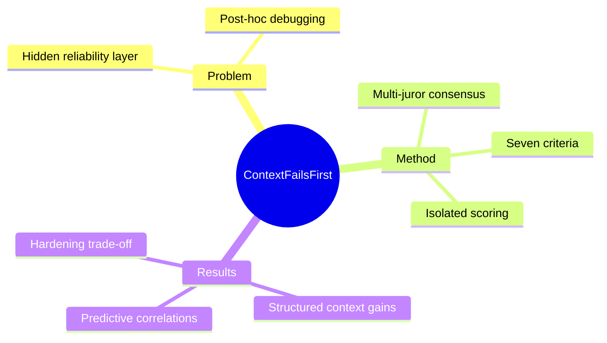

## Summary
论文把 agent context engineering 定义为独立可测的可靠性层，并在 ProofAgent-Harness 中用七项 criterion 与 multi-juror consensus 证明 context quality 能在不复用 behavioral score 的情况下预测下游 failure signal。

## Problem & Motivation
Agent 的行为由 system instruction、tool schema、retrieved knowledge、memory、prior turn、guardrail 与 untrusted input 共同塑造；failure 因此不一定来自 model capability，也可能来自 operating context 的缺失、冲突或污染。现有团队往往手工检查 prompt，或等 behavioral evaluation 失败后再调试，无法隔离 failure 是否首先发生在 context assembly。论文主张 context quality 应成为 behavioral test 之前的 preflight signal，同时又不能被误当成 deployment certification。

## Method
作者定义七个 criterion：role clarity、guardrail coverage、instruction consistency、tool schema quality、grounding sufficiency、injection hardening 与 token efficiency。ProofAgent-Harness 在独立 context-scoring mode 中对每项给分，生成 overall grade、evidence-linked finding 与 token-impact annotation；多个 juror 分别评价，再通过 median、debate-and-revote 或 Delphi-style consensus 聚合。关键设计是 isolation：context score 不进入 behavioral metric、final score 或 release decision，从而避免循环验证。

实验固定 GPT-5.5 或 Claude Opus 4.8 backbone，只改变 customer support、healthcare claims triage、legal contract drafting 三个 domain agent 的 context。C1 Poor 缺少明确 role、tool guidance、grounding 和 hardening；C2 Structured 加入 typed schema、domain corpus grounding 与更清晰组织；C3 Hardened 再加入 refusal、escalation、injection separation 和 risky-action confirmation。每个 domain 100 个 25-turn evaluation，共 300 次 multi-turn evaluation、7,500 个 agent turn，并另做 policy runbook artifact study。

## Key Results
- C1 到 C2 时，final score 从 3.15 升至 5.49，hallucination resistance 从 3.21 升至 5.61，tool use 从 3.46 升至 6.25，critical failure 从每次 4.11 降至 1.33，约减少 68%。
- Context score 按设计从 C1 的 4.4 上升到 C2 的 8.1、C3 的 8.7；但 C3 behavioral final score 反从 5.49 略降到 5.16，显示更多 hardening 会引入 conservative execution trade-off。
- 在 300 次 evaluation 上，grounding sufficiency 与 hallucination resistance 的 Pearson correlation 为 0.63，guardrail coverage 与 manipulation resistance 为 0.60，instruction consistency 与 instruction following 为 0.57，tool schema quality 与 tool use 为 0.47。
- Artifact study 中，C1 到 C2/C3 的 policy runbook final score 从 2.86 升至 10.0，hallucination resistance 从 2.0 升至 10.0；说明信号不局限于 live dialogue。

## Strengths & Weaknesses
论文最重要的优点是预先定义 criterion-to-behavior mapping，并将 context score 与 behavioral scoring 隔离；C3 不再提升 aggregate behavior 的结果也被保留下来，没有把“规则更多”包装成单调更好。七项 criterion 对工程诊断很直接，尤其把 tool schema、grounding 与 injection separation 分开。

但结论建立在三个受监管 domain、两种 frontier model 和作者构造的三档 context 上，外部生态效度仍有限。Context 与 behavior 都由 ProofAgent-Harness 的 LLM-juror 体系评估，即便 scoring channel 隔离，也可能存在共享 rubric 或 judge bias；相关系数支持 predictive association，不等于每个 criterion 的独立 causal effect。论文也没有给出跨团队人工复核的一致性或长期动态 memory/context drift 的验证。

## Mind Map

## Notes
对 agent benchmark 的直接启示是把“context artifact audit”和“trajectory behavior audit”作为两个独立 gate：前者定位可控的设计缺陷，后者验证实际执行。尤其应避免用更短 context 代表更高 token efficiency，真正目标是 reliability value per token。
