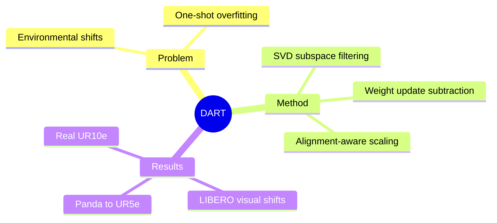

## Summary
DART 只用目标 domain 的一条 demonstration，通过 source/target one-shot update vector 的减法提取 domain direction，再以 SVD subspace alignment 过滤和缩放噪声方向，实现对视觉与 embodiment shift 的 VLA 适配。

## Problem & Motivation
已经学会多任务的 VLA 在 camera viewpoint、lighting、noise 或 robot embodiment 改变后常明显退化。为 target domain 的每个任务重新收集 demonstrations 代价高，而直接 one-shot fine-tuning 容易只记住这一个适配任务，甚至破坏原有多任务能力。作者观察到，同一任务在不同 domain 上得到的 weight update vectors 高度对齐，同时仍含跨任务共享的 domain component；这提示 task 与 domain direction 在局部 weight space 中近似可加，单个 target demonstration 可能足以提供可迁移的环境信息。

## Method
给定 base policy，DART 选择同一个 adaptation task，在 source domain 与 target domain 各用一条 demonstration 做短程 fine-tuning，得到两组 layer-wise update vectors。两者相减会抵消占主导的 task-specific direction，留下 target-domain direction；再把这个 direction 加回 base model，即可把 domain change 迁移到 base policy 已掌握的全部任务，而不是只保留适配任务。

直接减法仍会包含 fine-tuning artifact。DART 因此对每层 update 做 SVD，用 source/target singular subspace 的 overlap 判断哪些 component 具有可靠对齐：subspace filtering 去掉明显 misaligned 的 source component，subspace scaling 再以 alignment score 下调噪声占主导的 domain vector，最后乘一个全局 adaptation coefficient 注入 base weights。方法不改变 inference architecture，并在 flow-matching VLA 与 autoregressive action-token VLA 上测试同一 weight-arithmetic 原理。

## Key Results
在 LIBERO 的 viewpoint shift 上，DART 平均成功率 79.1%，高于 FLA 的 74.3%、RETAIN 的 69.6% 与 direct one-shot FT 的 31.5%；在 View+Noise+Light 组合扰动下为 75.0%，高于 FLA 的 71.5%。另一 VLA architecture 上，DART 在 Small/Medium/Large viewpoint 的平均成功率为 79.4%，仍优于 FLA 的 76.6%。

从 Panda 迁移到 UR5e 的 MimicGen cross-embodiment 实验中，DART 平均 progress/success 为 84.3%/69.4%，zero-shot 为 79.8%/62.0%。真实 UR10e 上只用一条 Stack Cube target-view demonstration 适配后，五个任务平均成功率为 81.7%，显著高于 FLA 的 55.0% 与 one-shot FT 的 51.7%。消融显示，单纯 domain arithmetic 已明显优于 one-shot FT，加入 subspace filtering 与 scaling 后继续提升；严重 viewpoint shift 下所有 one-shot 方法仍会退化。

## Strengths & Weaknesses
**Strengths.** 方法非常简洁：没有引入额外 policy module 或在线 test-time optimization，而是把 multi-task capability 与 target-domain information 组合为 weight-space analogy。实验同时覆盖 camera、noise、lighting、Panda-to-UR5e 和真实 UR10e，并验证不同 action generation architecture，证据面比只做单一 visual shift 更完整。source-domain forgetting 与 component ablation 也支持“提取 domain 而非重学 task”的解释。

**Weaknesses.** 方法依赖 source 与 target 中可匹配的 adaptation task，且仍需要 target expert demonstration；当两个 update vector 对不齐时，线性可分假设会变弱。Large viewpoint 的成功率明显下降，说明 one-shot 信息无法覆盖严重 observation distribution shift。全局 coefficient 需要小规模 rollout search，尚非完全 hyperparameter-free；真实实验只有五个任务、单一 UR10e 平台，跨 embodiment 也主要是 Panda 到 UR5e 的两个 MimicGen tasks，因此“通用 domain arithmetic”仍需更广验证。

## Mind Map

## Notes
这项工作把 adaptation data 的价值从“教会一个新任务”改写为“测量一个 domain direction”。值得进一步检查该线性结构在更大 policy、LoRA-only adaptation、不同 action normalization，以及 target demonstration 与 source task 不完全匹配时是否仍成立。
