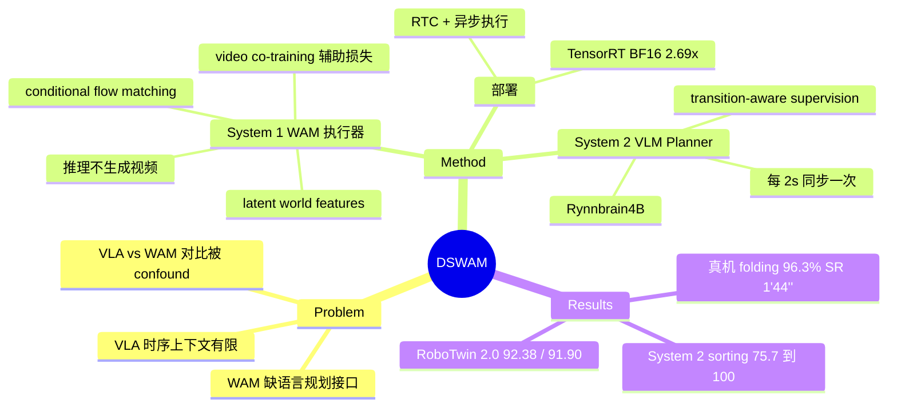

## Summary

DSWAM 把 World Action Model (WAM) 执行器（System 1）与一个可选的 VLM 任务规划器（System 2，基于 Rynnbrain4B）组合成双系统架构，用 flow matching 直接预测 action chunk 并以 video co-training 作辅助损失，在 RoboTwin 2.0 上取得 92.38%（clean）/ 91.90%（randomized）平均成功率，并在与 DeMaVLA 匹配数据/本体/协议的真机叠衣服 benchmark 上达到 96.3% SR、1′44″ 平均完成时间。

## Problem & Motivation

现有 WAM 通过视频世界建模获得物理 grounding，擅长 contact-rich 执行，但缺乏语言层面的任务分解接口；VLA policy 有语义 grounding 但时序上下文有限。此外作者指出一个方法论问题：已有的 VLA vs WAM 真机对比常被数据来源、机器人本体、任务协议的差异所混淆（confounded）。DSWAM 的主张是把语义任务分解（System 2）与 world-aware 物理执行（System 1）解耦，并提供一个 matched-condition 的对比。

## Method

**双系统架构**
- **System 1（WAM 执行器）**：默认控制通路。把多视角 RGB + 语言指令 + 本体感知编码为 latent world features（基于一个预训练 video model），再通过 conditional flow matching 预测 action chunk。训练目标 = action prediction loss + 辅助的 video co-training loss（共享 flow-matching 形式）；**推理时直接出 action chunk，不做显式 future-video 生成**。
- **System 2（VL Planner，可选）**：基于 Rynnbrain4B，观察 5 帧视觉历史（1 Hz 采样），把高层指令分解为可执行 subtask；用 transition-aware supervision 区分 within-subtask / boundary / terminal 三种状态。部署时每 Δt=2s 从 System 1 收 5 帧近期图像，返回的 subtask 作为 System 1 的 conditioning 直到下次更新。

**部署优化**：real-time chunking (RTC) + 异步执行 + TensorRT BF16 加速，把 policy query 与机器人控制解耦。

**训练数据**：大规模真机数据预训练（规模未披露）；post-training 使用与 DeMaVLA 相同的数据以保证对比公平。

**未披露项**（论文原文缺失）：video backbone 具体是哪个模型、参数量、预训练数据规模（hours/episodes）均未给出。

## Key Results

**RoboTwin 2.0（50 个双臂任务）平均成功率**：

| 方法 | Clean | Randomized |
|:---|:---|:---|
| π₀ | 65.92% | 58.40% |
| π₀.₅ | 82.74% | 76.76% |
| DeMaVLA | 88.42% | 86.78% |
| Motus | 88.66% | 87.02% |
| Fast-WAM | 91.88% | 91.78% |
| **DSWAM** | **92.38%** | **91.90%** |

**真机叠衣服（matched DeMaVLA 协议，每类衣物 2 实例 × 10 trials = 20 trials）**：

| 任务 | DSWAM | DeMaVLA | π₀ |
|:---|:---|:---|:---|
| Shirt | 95.0% / 2′14″ | 95.0% / 2′15″ | 90.0% / 1′55″ |
| Skirt | 100.0% / 0′58″ | 100.0% / 1′30″ | 95.0% / 1′03″ |
| Pants | 90.0% / 2′19″ | 75.0% / 3′01″ | 65.0% / 3′01″ |
| Towel | 100.0% / 1′27″ | 100.0% / 2′26″ | 55.0% / 3′44″ |
| **平均** | **96.3% / 1′44″** | 92.5% / 2′18″ | 76.3% / 2′26″ |

**System 2 消融（真机 sorting 任务）**：raw instruction 75.7% SR（3.53 次错误）→ 加 subtask supervision 后 100% SR（0.65 次错误）。注意主 folding benchmark 中 System 2 是**关闭**的。

**效率**：TensorRT BF16 把 policy latency 从 198.2ms（PyTorch）降到 73.8ms（2.69×），输出与参考的 cosine similarity 0.99977。

## Strengths & Weaknesses

**亮点**
- **Matched-condition 的 VLA vs WAM 对比**是真实贡献：与 DeMaVLA 同数据、同本体、同协议，回应了该领域对比被 confound 的普遍问题。
- **完成时间的改善比成功率更有说服力**：folding 平均 -34s（vs DeMaVLA）且四个任务全面更快（towel 1′27″ vs 2′26″），这不是 20-trial 噪声能解释的。
- 部署工程扎实：RTC + 异步 + TensorRT 的组合让 WAM 类模型达到实时控制，73.8ms latency 有实用价值。

**局限 / 疑点**
- **对最强 WAM baseline 的增益在噪声范围内**：RoboTwin clean +0.50 pt（vs Fast-WAM）、randomized +0.12 pt。核心 executor 相比已有 WAM 的本质区别没有被证明。
- **没有任何组件消融**：video co-training loss、world latent 表示对性能的贡献完全没有 isolate——"world model 有用"这个核心 claim 缺乏证据支撑。
- **"Foundation Model" 名不副实**：架构 backbone、参数量、预训练数据规模全部未披露，无法复现也无法评估 scaling 属性。
- **"Dual-System" 只在一个 sorting 任务上演示**：主 benchmark 全程关闭 System 2；且"VLM planner 分解 subtask 有帮助"是 Hi Robot、π₀.₅ 早已确立的结论，transition-aware supervision 是增量。
- folding 的 +3.8 pt 平均增益几乎全部来自 pants 单项（90 vs 75），20 trials 粒度下即 3 次 trial 的差距；DeMaVLA 是同组前作，对比虽 matched 但非第三方。

**判断**：这是一篇工业系统报告（美的 + 同济，场景是家电公司关心的衣物整理），价值在部署工程和 matched 对比协议，而非方法创新。

## Mind Map

## Notes

- 与 vault 中 WAM 家族（[[2605-OAWAM]]、[[2606-AdaWAM]]、[[2606-WALLWM]]、[[2606-WLA]]）对照：DSWAM 没有在表示层面做任何新设计（对比 OA-WAM 的 object-addressable slot），主要是系统集成 + 部署优化。
- "推理时不生成视频、训练时 video co-training"这条路线与 Fast-WAM 一致，DSWAM 相对 Fast-WAM 的差异点论文没有说清楚。
- 待确认：Rynnbrain4B 疑似 Alibaba RynnVLA 系列的 VLM 分支，System 2 是外部模型微调而非自研。
