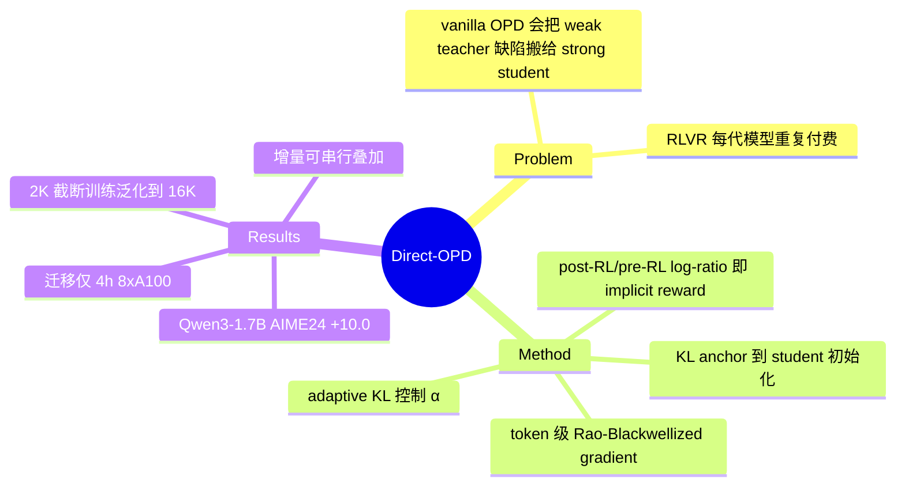

## Summary

提出 Direct-OPD：不让 strong student 模仿 weak teacher 的最终 policy，而是把 teacher **RL 前后两个 checkpoint 的 log-ratio** 当作 implicit reward，在 student 自己的 on-policy rollout 上做 RL，从而只迁移 "RL 带来的增益" 而不迁移 teacher 的能力上限。用 1.5B teacher 的 RL 增量把已经更强的 Qwen3-1.7B 从 AIME24 48.3% 提到 58.3%，迁移成本仅 8×A100 × 4 小时。

## Problem & Motivation

RLVR 是提升 LLM reasoning 的主力手段，但每换一个更强的 base model 就要重跑一遍昂贵的 RL（rollout + verifiable reward + update）。自然的想法是 weak-to-strong：在小模型上跑 RL，把成果迁移给大模型。但标准 on-policy distillation（OPD）直接让 student 拟合 teacher 的最终分布，会把 teacher 的能力缺陷一并搬过去——论文 Figure 1 的 motivating 实验：R1-Distill-7B（AIME24 56.7%）去模仿更弱的 JustRL-1.5B（51.3%），成绩反被拖到约 50%。Burns et al. 一系 weak-to-strong 工作同样受制于 "用 weak model 的 label/分布做监督，student 被 cap 在 supervisor 附近"。

## Method

**核心恒等式**：KL-regularized RL 的最优解满足 policy/reference log-ratio 等于 reward（up to constant），即 DPO 恒等式反向使用——不是从 preference 拟合 policy，而是从 post-RL checkpoint 读出 implicit reward：

- ΔT(y|x) = log π_T(y|x) − log π_T_ref(y|x)，其中 π_T 是 teacher post-RL、π_T_ref 是 pre-RL checkpoint；由恒等式 ΔT = (1/β)·r_T − log Z_T。

**训练目标**：J(θ) = E_x[E_{y~π_θ}[ΔT(y|x)] − α·KL(π_θ ‖ π_S)]。关键设计：KL anchor 是 **student 自己的初始化 π_S** 而非 teacher——student 在自己的分布附近爬 teacher 的 reward 山，而不是被拉向 teacher。

**Token 级实现**：ΔT 分解为逐 token 即时 reward r_t(v) = log π_T(v|s_t) − log π_T_ref(v|s_t)，在 **student 访问的 state** 上计算；用 Rao-Blackwellized policy gradient + 解析 top-k 近似，advantage A_t(v) = sg(p̄_t(v)·r_t(v))，密集信号、低方差。

**Adaptive KL**：implicit reward 的尺度取决于 teacher 训练时不可观测的 KL budget β，固定 α 跨 teacher-student pair 不通用（最优值 0.5–2.5 不等）。按 batch 平均 reward 的符号自适应调 α：α_{m+1} = clip(α_m(1+ε·sgn(r̄_m)))，把 dense reward 拉向零附近保持平衡而非最大化。

**训练配置**：Skywork-OR1-RL-Data 数学子集，DAPO 风格 prompt，300 steps，batch 64，response 只截 2K token，lr 1e-6，VERL 框架。

## Key Results

Teacher pair：R1-Distill-1.5B → JustRL-1.5B；Nemotron-1.5B → QuestA。所有 student 起点都已**高于 post-RL teacher**（51.3%）：

| Student | AIME24 | AIME25 |
|:--|:--|:--|
| Qwen3-1.7B | 48.3 → 58.3 (+10.0) | 36.8 → 43.2 (+6.4) |
| Qwen3-4B | 72.5 → 77.6 (+5.1) | 65.6 → 68.8 (+3.2) |
| R1-Distill-7B | 56.7 → 63.1 (+6.4) | 40.5 → 48.8 (+8.3) |

- **算力账**（RQ2）：1.5B teacher RL ≈160 h（32×A100）+ 迁移 4 h（8×A100），优于同 step 预算下直接对 R1-Distill-7B 跑 RL（≈320 h）；teacher 成本可在多个 student 间摊销。
- **串行组合**（RQ3）：Qwen3-1.7B 先吃 JustRL shift 再吃 QuestA shift，AIME24 58.3 → 63.8、AIME25 43.2 → 46.8，两个独立 RL 增量可叠加。
- **Ablation 亮点**：(1) cross-pattern 迁移时 student 与 teacher 的 top-k overlap 并不升高但 validation 照涨——增益不靠模仿 teacher 输出模式；(2) 只在 2K token 截断 response 上训练，增益能泛化到 16K+ 的完整 rollout；>2K 反而引入 off-distribution prefix 噪声。

## Strengths & Weaknesses

**亮点**：
- 问题选得准：post-training 成本随 base model 迭代反复支付，是真实工业痛点；方法极简（一个 log-ratio + 一个 adaptive KL），符合 simple & scalable。
- "student 已强于 teacher 仍能涨" 是对 weak-to-strong 的实质推进——迁移的是 reward 信号而非分布，绕开了 imitation ceiling。
- 2K 截断训练泛化到 16K rollout、增量可串行叠加，两个发现都超出直觉且有分析支撑。

**局限（已知，论文自认）**：信号是有条件的——teacher 的改进若在 student 访问的 state 上无意义则失效；最优 response length 和 KL 强度依赖具体 teacher-student pair。

**局限（我的批判）**：
- **Related work 有明显缺口**：post-RL/pre-RL log-ratio 作为可迁移信号，proxy-tuning（Liu et al. 2024）、Emulated Fine-Tuning、Weak-to-Strong Search 早就在 decoding-time 用过，论文只提 DPO 恒等式、一概未引未比。"训练时蒸馏 vs decoding-time 加 logit 偏移" 才是本文真正的增量，但缺了 proxy-tuning 这个最该打的 baseline。
- **评测面窄**：只有 AIME 24/25（各 30 题，32 samples），纯数学；无 GPQA/code/通用 reasoning，也没报主表的 vanilla OPD 数字（只在 Fig.1 出现）。
- **（推测）隐含 tokenizer 约束**：token 级 reward 要求 teacher/student 词表对齐，实验全在 Qwen 系内部；跨 tokenizer 家族（如 Qwen→Llama）能否迁移未验证。

## Mind Map

## Notes

- 与 [[2605-PRISM]]（黑盒 OPD 做 multimodal RL 预对齐）和 [[2607-UIMOPD]]（GUI agent 多平台 OPD 持续学习）同属 OPD 谱系：PRISM/UI-MOPD 都在蒸馏 teacher 分布本身，Direct-OPD 蒸馏的是 teacher 分布的 **差分**，方向正交，可组合。
- 对 agent 训练的启示：GUI/web agent 的 RLVR 同样昂贵，若 1.5B agent 上的 RL shift 能迁给 7B/32B agent base，训练经济性会改观——但 agent 任务的 state 分布差异比数学题大得多，"teacher 改进在 student 访问的 state 上是否有意义" 这个失效条件会更尖锐。
- 待跟进：是否开源 code（目前只有 project page）；与 proxy-tuning decoding-time 方案的正面对比是否会在 camera-ready 补上。
