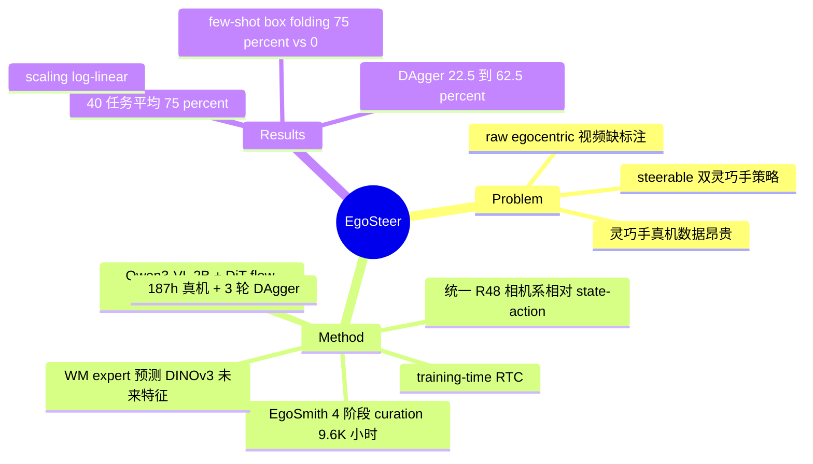

## Summary

针对双臂灵巧手操作的 steerability（自由形式语言指令可控），提出 full-stack 系统：EgoSmith 数据管线把 in-the-wild egocentric 视频清洗成 9.6K 小时预训练数据，配合统一遥操作/干预机器人栈（187h 真机数据）与 world-model 增强的 VLA（Qwen3-VL 2B + DiT flow-matching action expert），经 human 预训练 → 真机 post-training → DAgger 修正，在 40 个任务上取得 75% 平均成功率。

## Problem & Motivation

语言可控（steerable）的通用操作策略需要大规模高质量数据，但灵巧手真机示教采集极其昂贵；人类 egocentric 视频量大且天然包含灵巧手部动作，是最接近双灵巧手 embodiment 的数据源。障碍在于 raw egocentric 视频噪声大、缺乏可靠的语言与动作标注，直接拿来预训练无法有效迁移。已有 human-video-pretraining 工作（如 Being-H 系列）在数据 curation 质量、state-action 表示的预训练/后训练一致性、以及部署工程上均有缺口。本文的立场是：这是一个系统问题，需要数据管线、机器人栈、模型训练三层同时打通。

## Method

**EgoSmith 数据管线**（4 阶段，产出 9.6K 小时 / 12 个 egocentric 数据集 / 2.09M episodes / 1.04B 帧）：
1. **Pre-filtering**：optical flow 启发式丢弃 locomotion 片段，YOLO hand detection 剔除严重遮挡帧；
2. **4D motion estimation**：DPVO（相机跟踪）+ Any4D（深度）重建相机外参、深度与世界系手部轨迹，吞吐较 HaWoR 提升 9×；
3. **Language labeling**：Qwen3.5-VL-Plus 过滤非操作片段并生成 coarse-to-fine 五级层次化语言指令（task 级语义 grounding 到 action 级时空 grounding）；
4. **Post-filtering**：episode/chunk/frame 三级质检，过滤相机平移、腕部位姿、手指坐标的离群值。

**统一机器人栈**：PsiBot SynGlove-Air 手套 + Vive Tracker 遥操作；human 干预时用 relative motion mapping（T'^R = T^R · ΔT^H）把操作员相对运动映射为机器人指令，脚踏板切换接管/交还控制权；共采集 187h / 193 个桌面任务（pick-place、非抓握、reorientation、bimanual、contact-rich）。

**EgoSteer 模型**：
- Qwen3-VL 2B backbone + DiT action expert（flow matching 生成 action chunk）+ world-model expert（预测 action 条件下未来帧的 DINOv3 特征，仅训练期使用，推理时丢弃）；
- **统一 state-action 空间**：双手 s, a ∈ R^48（每手 3D 腕平移 + 6D 旋转 + 15D 指尖关键点），动作用相机系相对量（腕部 SE(3) 变换 + 指尖位移），使 human 预训练与机器人后训练共享同一表示；
- **Training-time RTC**（Real-Time Chunking）：训练时随机延迟 d 的干净 action prefix 作为条件，只训练后续动作，消除部署时 chunk 切换停顿;
- 工程：HSDP 并行，8×A800 上 44.5% MFU、97 samples/s。

**训练流程**：9.6K 小时 human 数据预训练（384×384）→ 187h 真机后训练（640×480）→ 3 轮 DAgger（56 个易失败任务上收集 3.7K 修正轨迹 / 8.3h）。

## Key Results

- **主评测**（RealMan + AgiBot-G1 两个 embodiment，每任务 10 次随机 trial）：40 任务平均 75% 成功率，22 个任务 ≥80%；4 个 compositional generalization 任务 65%，4 个 unseen 任务 62%。
- **DAgger 收益**：56 个 dexterous 易失败任务上，仅 fine-tune 的 EgoSteer-FT 22.5% → DAgger 后 EgoSteer-DG 62.5%（全文最大单项增量）。
- **Scaling**：预训练 0K/3K/6K/9.6K 小时呈 log-linear 提升；10 个较简单任务上与 baseline 对比：π0.5 22%、Being-H0.5 39%、EgoSteer-9.6K 74%（baseline 均在其真机数据上 post-train，但表示/分辨率/部署优化不一致）。
- **Ablation**（10 个 seen 任务，1K 小时预训练）：完整版 44%；去掉 WM objective 31%（-13）；去掉 training-RTC 39%（执行停顿、contact-rich 失败）；不过滤的 noisy 数据 33%（难收敛）。
- **Few-shot 迁移**：RealMan 上 18 步/40 秒的 box folding（120 demos）：EgoSteer 75% vs Diffusion Policy / IMLE / from-scratch 全部 0%；AgiBot-G1 上 9 步/1 分钟 cake unboxing（200 demos）：83% vs 全部 0%。

## Strengths & Weaknesses

**Strengths**：
- 真正的 full-stack 交付：数据管线（9× 吞吐）、遥操作/干预硬件栈、训练工程（44.5% MFU）、部署优化（training-RTC）每一层都有可核查的工程指标，这在 human-video-pretraining 方向少见；
- 统一 R^48 相机系相对 state-action 表示是核心设计——直接回应了 Being-H 系列"预训练/后训练表示不一致"的痛点，且 scaling 曲线（0K→9.6K log-linear）给了 human 数据价值的直接证据；
- noisy-data ablation（33% vs 44%）是对"curation 比堆数据重要"这一 claim 的正面证据。

**Weaknesses / 适用边界**：
- baseline 对比不干净：作者自己承认 π0.5 / Being-H0.5 在表示一致性、分辨率、部署优化上与本文不同，74% vs 22%/39% 混杂了预训练数据价值与工程因素，无法归因；且只在"10 个较简单任务"上比；
- ablation 全部在 1K 小时预训练 + 10 任务的小 setting 下做，WM objective 的 +13 点在 9.6K 全量下是否仍成立未验证；
- few-shot 对比里 Diffusion Policy / IMLE 在 18 步长程任务上拿 0% 属于意料之中的弱 baseline，缺少同级别 VLA（如 π0.5 few-shot）的对照；
- steerability 的评测薄弱：compositional / unseen 各只有 4 个任务，五级语言层次在正文可见部分甚至未逐级列出；"steerable" 更多是 marketing 词；
- 22.5% → 62.5% 的 DAgger 增量说明系统离开 human-in-the-loop 修正后原始成功率并不高，40 任务 75% 的 headline 数字包含了 8.3h 定向修正数据的功劳；
- 评测为自评、每任务 10 trials、全部 in-lab 桌面任务；推理频率/延迟未报告。
- 作者自述局限：机器人 DoF 上限使高灵巧 human 知识无法完全迁移；全链路无触觉，contact-rich 受限。

**影响**：为"egocentric human video → dexterous VLA"路线提供了目前最完整的系统级配方与 scaling 证据，工程细节（统一表示、training-RTC、curation 管线）可复用性强。

## Mind Map

## Notes

- 与 Being-H0.5 的关系值得跟踪：同为 human-video pretraining for dexterous VLA，本文胜在表示一致性与系统工程，但对比实验混杂变量太多，两条路线的真实差距待第三方复现。
- WM expert（预测未来 DINOv3 特征、推理丢弃）与 LaMemVLA 等"辅助目标增强 VLA"是同一 pattern：world modeling 作为 representation regularizer 而非 planner。
- 待查证：五级语言指令的具体定义、推理控制频率——正文可见部分未给出。
