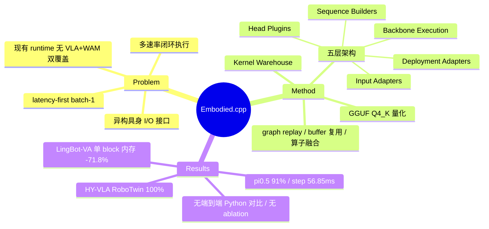

## Summary

面向具身 AI 模型（VLA + World-Action Model）的可移植 C++ 推理 runtime：把执行拆成五层（input adapter / sequence builder / backbone / head plugin / deployment adapter），支持多速率闭环执行与 batch-1 低延迟优化，在两个 VLA 上跑通闭环任务，并在 WAM 单个 transformer block 上用 Q4_K 量化实现 71.8% 内存降低。

## Problem & Motivation

具身模型部署与传统 LLM/VLM serving 的 runtime contract 有三点本质不同：

1. **多速率执行**：perception encoder、transformer backbone、predictive branch、action head 需要在同一个控制回路内以不同频率运行，不能强制同步。
2. **latency-first 闭环控制**：优化目标不是 throughput 而是稳定闭环——低延迟、低 jitter、异构 edge 硬件上的高效 batch-1 执行。
3. **可扩展的具身接口**：不止 token I/O，还要处理自定义算子、多模态传感输入、以及从 action chunk 到 predicted future 的异构输出。

现有方案各缺一角：llama.cpp 轻量但无具身特性；ONNX Runtime 跨平台但不管闭环控制；SGLang/vLLM-Omni 面向 request-response 服务；vla.cpp 只覆盖 VLA、不支持 World-Action Model（WAM）。论文用一张 capability matrix（Table 2）论证没有 runtime 同时覆盖 VLA + WAM 两个家族。

## Method

**五层架构**：

| 层 | 职责 |
|:---|:-----|
| Input Adapters | 通过 typed embodied interface 吸收传感器流（camera / tactile / IMU）与数据集输入 |
| Sequence Builders | 为 backbone 构造输入序列 |
| Backbone Execution | 共享的 transformer 计算路径，VLA 与 WAM 共用 |
| Head Plugins | 可插拔任务输出头：action 生成、world prediction、subgoal |
| Deployment Adapters | 对接 simulator 与真机控制栈 |

**模型家族覆盖**（声称，非全部已验证）：
- VLA：AR-token（OpenVLA/RT-2）、VLM-backboned（pi0/pi0.5/Octo）、hierarchical（RT-H）、asynchronous（GR00T N1）
- WAM：predict-then-act（UniPi）、unified AR（WorldVLA/LingBot-VA）、shared-backbone（DreamZero）、latent-space（LaWAM）

**优化手段**：多速率模块化执行（configurable refresh policy，模块可按不同频率刷新，无需同步路径）；latency-first batch-1 优化（graph replay、buffer 复用、算子融合、backend-specific dispatch）；GGUF Q4_K 量化；单一 backend 抽象覆盖 CPU/GPU/NPU（声称的部署目标包括 Jetson、RK 系平台、x86 edge box，但实验中未给出具体硬件型号）。另附 "Embodied AI Kernel Warehouse" 提供可复用算子与 model-specific kernel，正文无实现细节。

HTML 全文未明确说明是否基于 ggml/llama.cpp 构建（GGUF 格式暗示与 ggml 生态兼容）；multi-rate scheduler 的具体配置机制也未展开。

## Key Results

**VLA 闭环评测（Table 3）**：
- **HY-VLA**（Hunyuan-VL backbone）：RoboTwin place_empty_cup 任务，成功率 100%（CI 83.9–100%），amortized step latency 735.9 ms，inference latency 1340.3 ms，峰值 VRAM 6850 MiB，action chunk 长度 20
- **pi0.5**（PaliGemma backbone）：成功率 91%（CI 86–94%），step latency 56.85 ms，inference latency 266.6 ms，峰值 VRAM 6546 MiB，chunk 长度 50（评测用的 simulator/benchmark 与 trial 数未在正文明确）

**WAM 微基准（Table 4）**：LingBot-VA **单个 transformer block**——Python BF16 baseline：3.236 ms / 312.2 MiB；Embodied.cpp Q4_K：3.171 ms / 88.1 MiB（内存 -71.8%），MAE < 3.3e-2，cosine similarity > 0.9997。完整模型因"在受限 edge 环境上不稳定"未给闭环结果。

与 vla.cpp / ONNX / llama.cpp 的对比只有 capability matrix，**没有任何端到端性能对比**。

## Strengths & Weaknesses

**Strengths**：
- 问题定义准确且有价值：多速率闭环 + batch-1 latency-first + 异构输出接口，确实是 LLM serving 框架覆盖不到的空白，"embodied 界的 llama.cpp" 这个定位本身成立
- 五层分解把 VLA 与 WAM 统一进一个执行抽象，backbone 共享 + head 可插拔的设计符合具身模型架构的演化趋势（推测：对 GR00T 式异步架构的支持是相对 vla.cpp 的关键差异化）
- 代码开源（SEU-PAISys/Embodied.cpp）

**Weaknesses**：
- **evaluation 与 claim 严重不匹配**：声称覆盖 4 类 VLA + 4 类 WAM，实测只有 2 个 VLA 跑通闭环；WAM 只有单 block 微基准，完整模型自己承认跑不稳；"portable across heterogeneous robots" 但实验连硬件型号都没写，也没有真机部署
- 没有与 Python/PyTorch 部署的端到端对比（延迟、内存、成功率），无法判断 C++ runtime 到底带来多少收益——唯一的对比数字是单个 block 的 312.2→88.1 MiB，而这基本是 Q4_K 量化的功劳，不是 runtime 架构的功劳
- 零 ablation：multi-rate 执行、graph replay、buffer 复用、算子融合各自贡献多少完全未知
- HY-VLA 1340 ms 的 inference latency 对"latency-first 闭环控制"的核心卖点是自我打脸；靠 chunk=20 摊薄到 736 ms/step 依然很慢
- 论文自称 "current revision"/"draft"，属于抢占卡位性质的早期发布

**影响判断**：方向真实（edge VLA 部署工具链目前确实碎片化），但当前版本是系统论文的骨架 + 实验的占位符。值得跟踪 repo 演化，不值得作为方法证据引用。

## Mind Map

## Notes

- 与 vla.cpp 的关系值得后续对比：本文差异化主要在 WAM 支持与多速率抽象，但 WAM 部分恰好是没做完的部分。
- pi0.5 的 56.85 ms/step（chunk=50）如果属实，是接近实用的控制频率；但缺 simulator/trial 细节，数字可信度打折。
