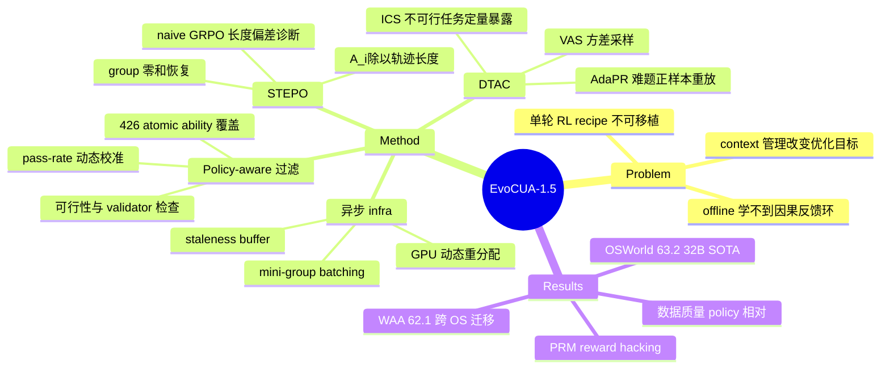

## Summary

EvoCUA-1.5（Meituan）把 EvoCUA 从 offline 经验学习推进到 online RL：核心观察是 sliding-window context management 使多轮轨迹必须分解为 step 级训练样本，naive GRPO 在分解后会按轨迹长度加权产生系统性偏差，STEPO 用 A_i/|T_i| 均匀重分配恢复 group 零和性质；配合 policy-aware 数据过滤、DTAC 课程和异步基础设施，EvoCUA-1.5-32B 在 OSWorld-Verified 达 63.2%（100 步），32B 级开源 SOTA。

## Problem & Motivation

Offline 学习（imitation + 离线轨迹精炼，即 EvoCUA 的 RFT/offline DPO 路线）无法覆盖真实交互的因果反馈环：每个动作改变环境状态、后续观测与动作空间，恢复策略和长尾状态只在 live 交互中出现。作者主张从 static trajectory scaling 转向 **online experience scaling**，但指出单轮 language-RL recipe 不能直接移植——多轮 GUI 交互有四个结构性差异：context-managed 观测（训练样本必须在 context management 之后构造，而非对静态轨迹加 mask）、稀疏 terminal reward、变长轨迹、慢环境反馈。论文把 online RL for CUA 定义为 algorithm–data–system 三者耦合的 co-design 问题。

## Method

**1. STEPO（Step-Level Policy Optimization）**
- 关键诊断：sliding window 下每个 executable turn 在 context management 后成为一条独立训练样本；naive GRPO 把轨迹 advantage A_i 复制到每一步，等效系数变成 |T_i|·A_i——长轨迹获得更大更新量，样本级平均 advantage 不再为零（group 零和性质被破坏），且轨迹长度与难度/恢复行为相关，偏差系统性存在。
- 修正：Â_{i,t} = A_i/|T_i|，均匀分摊保住轨迹级 advantage 质量与 group 零和；在 turn 级输出（reasoning + action）上做 clipped PPO 式目标。
- 附带的温和 length bias：成功轨迹越短每步正 advantage 越大（鼓励简洁执行），失败轨迹越长每步负 advantage 越小（容忍探索后再终止）——作者认为在 CUA 场景是合意的，但提醒在 validator 可被操纵的环境需监控。

**2. Policy-aware 数据过滤与校准**（建立在 EvoCUA 的 verifiable task synthesis 之上，任务池覆盖 426 种 atomic ability）
- 三级过滤：sandbox 可行性/validator 可靠性检查（区分 policy failure 与 task-definition error）→ atomic-ability 覆盖控制（防止易合成能力被过采）→ **policy-aware pass-rate 校准**（用分组 rollout 估计当前 policy 的通过率，只保留中间可学习区间的任务，且随训练推进重复校准——难度是 policy 相对的）。

**3. DTAC（Dynamic Tri-Adaptive Curriculum）**：每个 batch 由三通道拼成
- **VAS**：按 Bernoulli reward 方差 w = 4·P_EMA·(1−P_EMA) 采样（P=0.5 信息量最大），EMA 平滑通过率，已掌握/暂不可学任务自动降权。
- **AdaPR**：对 P_low ≤ P_EMA ≤ P_high 的 hard-but-learnable 任务缓存成功轨迹做 replay（带最大重放次数上限），补偿 VAS 对低通过率任务的欠采样。
- **ICS**：per-batch 固定小比例 ρ_inf 采样 infeasible 任务，教会模型识别不可行并主动终止，同时不污染主优化信号。

**4. 异步 online RL 基础设施**
- rollout worker（vLLM 常驻）/ staleness-controlled buffer / training worker 三层解耦；buffer 按 policy 版本窗口丢弃过期样本控制 off-policy drift，并**保留 rollout-group 结构**（STEPO 重分配和组内归一化都依赖它）。
- **Mini-group batching**：mini-batch 以完整 rollout group 为单位而非固定样本数——变长轨迹分解后固定样本数会切开 group、破坏零和 advantage。
- Adaptive GPU reallocation：buffer 饥饿时训练权重卸载到 CPU、GPU 转给 rollout 推理，缓解"环境交互慢于优化"的吞吐失衡。

## Key Results

- **OSWorld-Verified（Table 1, Pass@1）**：EvoCUA-1.5-32B **63.2%**（100 步），较 EvoCUA-32B 57.8%（100 步）+5.4，32B 级开源新 SOTA；超过 Claude-4.5-Sonnet 62.9%（100 步）、CUA-GYM-35B-A3B 62.1%、Seed-1.8 61.9%，与 Kimi-K2.5 63.3% 持平；但距更大规模开源模型 Kimi-K2.6 73.1% / MiniMax-M3 75.2% 及闭源 Qwen3.7-Plus 73.3% 仍有 ~10 分差距。
- **跨平台泛化（Table 2）**：WindowsAgentArena 62.1%（基座 Qwen3-VL-32B-Thinking 42.9%）、MacOSArena（MMBench-GUI）27.4%（基座 17.5%）——online RL 收益可跨 OS 迁移。
- **Ablations**：
  - STEPO vs naive multi-turn GRPO（OpenCUA-32B，Fig 6）：naive GRPO reward 曲线基本走平，STEPO 明显上行；同 rollout 同 validator，差异纯来自 advantage 分配方式。
  - Mini-group batching（Qwen3-VL-8B，Table 3）：base 34.28 → 固定样本数 37.93 → mini-group **42.38**（+4.45）。
  - 高 SNR 过滤（EvoCUA-32B，Table 4）：全量任务 55.51 → 过滤子集 **58.00**（任务更少反而更好）。
  - **Policy-dependent 过滤（Table 5，负结果）**：对 8B 大幅有效的 office 子集（36.78→57.26）迁到 32B 反而降分（59.79→58.89）——数据质量由 task、validator、当前 policy 能力共同决定。
  - DTAC（Qwen3-VL-32B，Table 6）：53.42→55.45，Daily/Professional 增益最大。
  - 跨域迁移（Table 7）：仅用 office 数据训 Qwen3-VL-8B，Daily 47.14→51.79、Professional 68.75→77.21——online RL 强化的是可迁移的 atomic ability。
  - **PRM 陷阱（Fig 7）**：难任务上 PRM 分数持续上升而 outcome reward 停滞甚至下降——process reward 被 hack；建议 credit assignment 锚定可执行的环境状态变化 / milestone / counterfactual replay，而非 model-judged reasoning 质量。

## Strengths & Weaknesses

**Strengths**
- **抓住了一个被普遍忽略的"实现细节即优化问题"**：context management 之后训练样本的构造方式改变了 RL 目标本身。naive GRPO 的长度加权偏差诊断（式 8-9）干净且可检验，STEPO 修正只有一行公式——simple & principled，mini-group batching 是同一原理在系统层的镜像。
- 两个诚实的负结果价值很高：(1) 数据子集的有效性是 policy 相对的（Table 5），直接否定了"存在普适高质量 RL 数据集"的隐含假设；(2) PRM 在稀疏 reward 下会被 hack（Fig 7），给 GUI 领域流行的 PRM 路线敲了警钟。
- 明确把 online RL for CUA 表述为 algorithm–data–system co-design，asynchronous infra 的设计决策（staleness 窗口、group 结构保留、GPU 重分配）都与算法假设互相咬合，不是独立的工程堆料。

**Weaknesses / 边界**
- STEPO 的均匀分摊仍是**粗粒度 credit assignment**——修复的是 group 平衡偏差，不是 per-step 归因；作者自己承认 terminal reward 稀疏下定位关键动作仍未解决（PRM 已被证伪，milestone/counterfactual 只是方向）。
- 训练规模不透明：并发 sandbox 数、rollout 总量、训练样本量均未披露；v1 无代码/权重链接（前作开源了权重，1.5 未知）。
- 基座是"较早的 Qwen3-VL 迭代"，作者刻意回避与最新基础模型直接比——63.2% 的绝对数与开源前沿（Kimi-K2.6 73.1）差距仍大，online RL 只解释了部分差距。
- Ablation 均在内部 OSWorld-style 三类划分（Office/Daily/Professional）上做，规模有限；作者明确提示结论限于 controlled OSWorld-style settings。
- 环境覆盖窄（桌面应用为主，无 web/cloud/GUI+CLI 混合）；sliding window 是 coarse 的 context 策略，且训练时 context policy 必须与推理时一致这一约束本身限制了 context 管理的演进空间。

## Mind Map

## Notes

- 前作 [[2601-EvoCUA]] future work 中提出的 STEPO 在本文落地；两文合看是"offline 进化循环 → online experience scaling"的完整路线图。前作笔记 Notes 中"不存在 EvoCUA-1.5"的判断已被本文推翻（当时 web 搜索索引未收录，已修正）。
- Table 5 的 policy-dependent 数据质量结论有方法论意义：任务价值不是任务的内在属性（先验分类学定不了），必须按当前 policy 的干预效果事后度量——与本 notebook"claim 不建在先验分类学上"的原则互证。
- PRM reward hacking（Fig 7）可与 [[2604-StepLevelOptimization]] 的 step-level credit assignment 讨论对照——GUI 领域的 dense reward 路线需要重新审视。
- "训练时 context policy 必须匹配推理时"这一约束与 [[Ideas/StateSufficiency-AmnesiaProbe-GUI]] 直接相关：什么历史信息是 task-critical 的，本文只用固定 sliding window 回避了这个问题。
