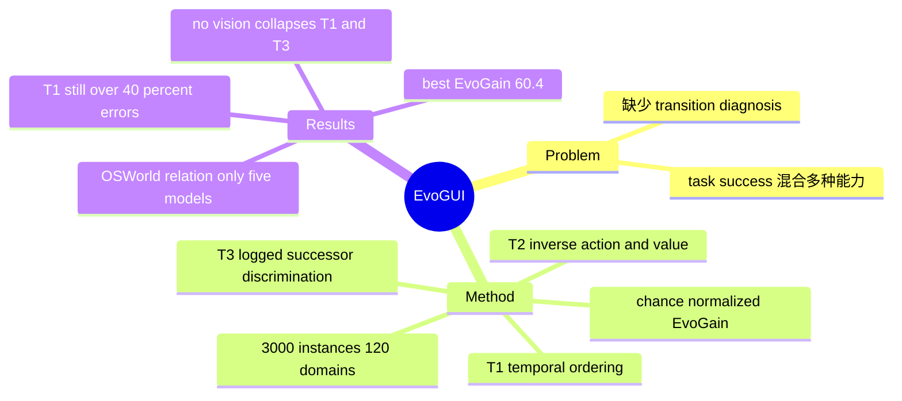

## Summary

EvoGUI 把 Mind2Web 与 WebLINX 的 logged GUI trajectories 转成 temporal ordering、inverse action/value prediction、contrastive one-step successor 三类 VQA probe，用局部状态转换诊断补充 end-to-end success。3,000 个样本、120 个 domain 和 28 个 VLM configuration 上，最强 Gemini-3-Flash-Preview 的 EvoGain 也只有 60.4，但该 benchmark 仍以 browser trajectory 为主，T2 混入 OCR/value binding、T3 只区分 logged successor 与 sampled distractor，不能被解释为纯因果 world model 或真实 counterfactual reachability。

## Problem & Motivation

OSWorld、WebArena 一类 execution benchmark 必须保留，因为它们衡量 agent 最终能否完成真实任务；问题是一个 success rate 同时混合 perception、OCR、grounding、planning、tool use、recovery 与 environment instability。失败后只知道“没完成”，无法判断模型是否理解点击或输入会如何改变界面。EvoGUI 的核心进展是把 **GUI dynamics understanding** 从完整 agent loop 中拆出，利用已有 trajectory 的时间顺序和 logged action 自动构造局部诊断，而不是再收集一套昂贵的人工 task label。

## Method

作者先把轨迹规范化为带时间顺序的 state、action、value 与 metadata，再从同一表示挖掘三个互补任务，每类 1,000 个样本：

1. **T1 Temporal Ordering**：打乱多张连续 screenshot，要求模型恢复正确时间顺序，测试 sequence coherence，而不是单帧识别。
2. **T2 Inverse Action/Value Prediction**：给定 before/after state，预测造成变化的统一 action `{CLICK, TYPE, SELECT}`；同时报告 action-only top-1 与更严格的 action/value joint top-1。后者要求恢复 typed string 或 selected option，因此并非纯粹的因果 action recognition。
3. **T3 Contrastive One-Step Successor**：给当前 state 与两个候选 next state，在 cross-trajectory、same-domain 或 long-skip distractor 中识别 logged adjacent successor。该任务衡量对特定负样本的辨别，不证明被拒状态在所有 hidden state 或 policy 下不可到达。

EvoGUI-Bench 共 **3,000 instances、120 domains**，约 49% 来自 WebLINX，并对 sequence length、distractor type 和 domain 分布做平衡。作者零样本评测 28 个 open/closed VLM configurations，以 T1 exact、T2 joint、T3 pairwise 相对各自 random baseline 的 normalized gain 取 macro average，形成 EvoGain；同时用 1,000 次 instance bootstrap 给出 95% confidence interval。

## Key Results

- 最强 **Gemini-3-Flash-Preview**：T1 **58.3**、T2 action **75.0**、T2 joint **65.4**、T3 **83.6**、EvoGain **60.4**（95% CI **58.16–62.66**）。即使第一名，T1 仍有超过 40% 的 sequence exact error，长程状态顺序远未解决。
- GUI specialization 与 scale 都不是可靠 proxy：UI-TARS-1.5-7B 只有 **25.4 EvoGain**；Qwen family 内多个更大模型反而低于较小变体。模型是否学到 transition-oriented supervision 需要直接测，不能由参数量或 end-to-end branding 推断。
- Qwen3.5-27B 的 no-vision control 提供了有效性证据：正常输入到 black-image/metadata-only 时，T1 exact **28.1→7.4/6.9**，T1 Kendall tau **0.305→0.004/-0.002**，T3 **70.8→49.1/49.6**，接近 random；T2 action 仅从 **57.5→43.1/42.1**，说明该 probe 仍可利用 action-frequency 或 language prior。
- 五个 overlapping models 上 EvoGain 与公开 OSWorld success 的 Spearman rho 为 **0.90**、Kendall tau 为 **0.80**；但样本仅 n=5 且混合 reporting protocols。论文明确把它定位为 indicative association，不是预测关系或因果证据。

## Strengths & Weaknesses

**Strengths**

- 发展上补上了 execution benchmark 与静态 screenshot benchmark 之间的空层：它不试图替代 end-to-end success，而是回答“局部状态变化到底哪里没懂”。
- 三个 probe 分别覆盖 temporal coherence、inverse attribution 与 next-state discrimination，且标签主要从现有 trajectory 机械派生，扩展到新数据源的边际成本较低。
- 报告 random-normalized EvoGain、bootstrap interval、no-vision controls 及清晰的 interpretation boundaries，避免把漂亮的 T3 raw accuracy 直接包装成完整 world-model capability。

**Weaknesses / 证据边界**

- “无需额外 annotation”只在 trajectory normalization 之后成立；benchmark 仍依赖 human/expert logs 的覆盖度与质量，且当前实例化以 browser actions 为主。向 mobile/desktop 的 swipe、drag、long-press、OS command 扩展仍需 action vocabulary、execution validation 和 domain-specific QC。
- T2 joint 同时测 state-change reasoning、OCR、text recovery 和 value binding，低分不能唯一归因于 causal understanding；no-vision 下 T2 降幅较小也说明先验捷径尚未完全排除。
- T3 的 negative 是 sampled distractor，不是环境执行验证过的 counterfactual；选对 logged adjacent screenshot 只证明 contrastive discrimination，不能证明另一状态不可达。
- 与 OSWorld 的联系只有五个模型，且部分 harness 不同；EvoGain 是 diagnostic summary，不是 deployed utility metric，也不能直接比较三个 task 的绝对难度。

## Mind Map

## Notes

- EvoGUI 最适合与 end-to-end benchmark 配对使用：先按任务成败发现 regression，再用 T1/T2/T3 判断问题更接近 temporal representation、action attribution 还是 successor discrimination。单独优化 EvoGain 可能学会 benchmark-specific contrastive cue，却不一定改善 agent loop。
- 下一步真正困难的是 **execution-validated counterfactual transition set**：在可 snapshot/restore 的 GUI environment 中，从同一 state 执行不同 action 并记录可达状态，才能把 T3 从“logged vs sampled”推进到 action-conditioned reachability。
