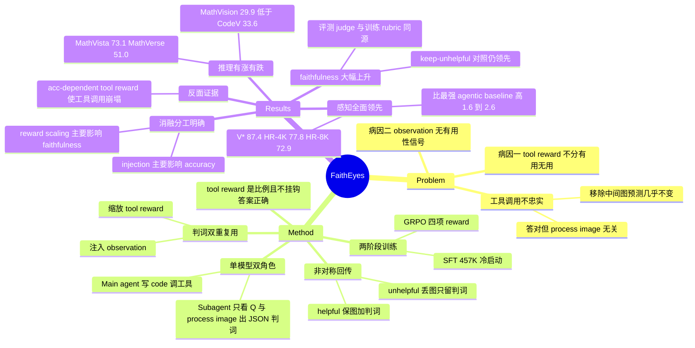

## Summary

FaithEyes 针对 agentic VLM 的 "工具调了但没用上" 问题：让同一个 VLM 兼任 subagent，逐张判定 process image 是否真的呈现了问题所问的证据，并把这个 verdict 同时用作上下文反馈（helpful 保留图+判词，unhelpful 丢图只留判词）和 tool reward 的缩放因子（helpful-tool ratio）。在 Qwen2.5-VL-7B-Instruct 上经 SFT+GRPO 训练后，V\*/HR-Bench 4K/8K 达 87.4/77.8/72.9，比最强 agentic baseline 高 1.6~2.6 分，tool faithfulness ratio 显著上升；但 MathVision 反而低于 CodeV，且 faithfulness 的度量与其训练奖励共用同一套判定 rubric。

## Problem & Motivation

Agentic VLM 把 crop/zoom/code execution 织进推理链，7B 模型在 V\* 上可达 84.8%，远超 GPT-4o 的 64.4%。但多项工作指出这些工具用得不忠实：即使答案正确，也只有约一半的样本里存在真正裁到问题所问区域的调用；把 process image 移除，预测几乎不变。也就是说工具调用退化成了装饰，模型实际走的是原图或先验知识的捷径。

作者把病因归为两条耦合的机制缺陷：

1. **Undifferentiated tool reward**——DeepEyes 这类设计只要"答案对 + 调了工具"就给满额 bonus，有用调用和装饰调用同酬；另一些工作（Thyme、DeepEyesV2）干脆不给 tool reward，工具行为完全无引导。两者都没有编码 `{I_t}` 是否有用。
2. **Usefulness-agnostic feedback**——observation 只回传处理后的图，不含任何"这张图有没有用"的信号，模型没有动机去检查证据相关性。

第一条作者认为由 reward 定义本身蕴含、无需实验；第二条做了两项前置验证（见 Method 末）。

## Method

**多智能体自判框架（单模型双角色）。** 工具接口是可执行 Python code（沿用 Thyme/CodeV 路线），比固定 crop schema 更可组合。

- **Main agent**：条件于 `x=(I,Q)` 和历史 `{a<t, o<t}` 生成动作，交替 `<think>` / `<code>` / `<answer>`；code 由正则抽取后在只读挂载原图的 Python sandbox 中执行。
- **Subagent**：同一权重、换一套 system/user prompt，把 `(Q, I_t)` 映射为结构化判词 `(h_t, e_t) = g_θ(·|Q, I_t)`，`h_t ∈ {True, False}` 为二元 helpfulness 标签，`e_t` 为自由文本理由，输出单行 JSON `{"is_helpful":…, "reasons":…}`。判定 rubric 是"问题所问的对象/属性是否清晰可见"，明确规定小目标导致的低清晰度不算工具错误。

两条设计选择值得点出：subagent **只看 `(Q, I_t)`，不看 main agent 的 CoT 或 code**——作者的理由是"评估证据比诊断内部推理更便宜也更稳定"，且无需 ground-truth box 之类的稠密标注；subagent 由模型自身实例化而非外部 judge，使判词在推理期仍然可得，保证 train-test 一致。

**非对称的 observation 组装。** `h_t=True` 时回传 `I_t` + `(h_t,e_t)`；`h_t=False` 时**丢弃 `I_t`**，只回传 `(h_t,e_t)`。作者主张这既让 main agent 拿到"为什么这一刀切歪了"从而重切或退回原图推理，又省掉无效图的 visual token（process image 是 agentic VLM 推理开销的大头）。

**Reward 设计（GRPO）。** `r(τ) = r_acc + 0.2·r_fmt + 0.2·r_cons + 0.2·r_tool`。

- `r_acc ∈ {0,1}`：先规则匹配，失败时回落到 Qwen2.5-VL-72B 做语义等价判定。
- `r_fmt ∈ {0,−1}`：`<think>/<code>/<answer>` 结构合规性。
- `r_cons ∈ {0,−1}`：把推理尾段+答案喂给 Qwen2.5-VL-72B，判断结论是否被前文蕴含，压制"结论与推理无关"的猜答。
- `r_tool = 1 − (n_fail + n_unhelpful)/n_tool`（`n_tool>0` 时）。`n_fail` 计执行失败或无输出，`n_unhelpful` 计被 subagent 判为无用。**关键设计：不以答案正确为门**。

**训练。** Qwen2.5-VL-7B-Instruct 起步。SFT 457K 条，3 epoch，lr 1e-5，bs 128；数据从 Thyme-SFT 改造——利用其轨迹结构直接派生判定标签：单次调用轨迹的那一次记 True，两次调用轨迹的第一次记 False、第二次记 True，再用 **Qwen3-VL-32B-Instruct 补写对应 rationale**。两条 masking 规则：tool observation（含判词）不计 loss；多轮轨迹只在最后一轮算 loss，避免模仿"故意先错再改"的模式。RL 阶段用 Thyme-55K + DeepEyes-47K 过滤（去掉 SFT 模型 8 次采样全对的题）后得 50K，12 rollouts，lr 1e-6，per-response 20,480 token 上限，每条轨迹至多 5 次工具调用。

**前置验证（§3.1）。** (a) 用 Qwen3-VL-32B-Instruct 合成判词，**不重训**直接注入 DeepEyes / Thyme 的 observation（Table 1）；(b) 用 attention rollout（末四层）测答案 token 对 helpful / unhelpful process image 的注意力，观察注入判词后的变化。

## Key Results

**主表（Table 2，全部 agentic baseline 同为 Qwen2.5-VL-7B-Instruct 起训）**

| Model | Tools | Size | V\* | HR-4K | HR-8K | MathVista | MathVerse | MathVision |
|:--|:--|:--|--:|--:|--:|--:|--:|--:|
| GPT-4o | - | - | 64.4 | 63.1 | 61.3 | 63.7 | 35.3 | 35.9 |
| LLaVA-OV | - | 7B | 75.4 | 63.0 | 59.8 | 58.6 | 19.3 | 18.3 |
| Qwen2.5-VL | - | 7B | 75.0 | 68.6 | 63.6 | 67.9 | 45.5 | 21.4 |
| Qwen2.5-VL | - | 32B | **87.9** | 73.9 | 70.4 | 72.2 | 40.0 | 35.2 |
| DeepEyes | Crop | 7B | 84.3 | 74.2 | 70.4 | 68.7 | 44.3 | 28.3 |
| Pixel-Reasoner | Crop | 7B | 84.3 | 74.0 | 66.9 | 71.2 | 46.9 | 26.3 |
| Thyme | Code | 7B | 82.7 | 74.6 | 69.6 | 69.9 | 44.4 | 28.6 |
| CodeV | Code | 7B | 84.8 | 76.1 | 71.3 | 71.8 | 49.2 | **33.6** |
| **FaithEyes** | Code | 7B | 87.4 | **77.8** | **72.9** | **73.1** | **51.0** | 29.9 |

感知三项全部最优，比最强 agentic baseline 高 1.6~2.6 分；推理侧 MathVista +1.3、MathVerse +1.8，但 **MathVision 29.9 落后 CodeV 3.7 分**。作者解释为 MathVision 的稠密数值/逻辑推理留给视觉工具的空间小。注意 tool-free 的 Qwen2.5-VL-32B 在 V\* 上 87.9 仍高于 FaithEyes，论文的 "best" 加粗只在 agentic VLM 组内。

**训练无关的判词注入（Table 1）**——这是最接近"给 baseline 加等量额外计算"的对照：

| Model | V\* | HR-4K | HR-8K | MathVista | MathVerse | MathVision |
|:--|--:|--:|--:|--:|--:|--:|
| DeepEyes | 84.3 | 74.2 | 70.4 | 68.7 | 44.3 | 28.3 |
| + Judgement | 86.2 (+1.9) | 73.9 (−0.3) | 68.1 (−2.3) | 69.3 (+0.6) | 46.8 (+2.5) | 28.6 (+0.3) |
| Thyme | 82.7 | 74.6 | 69.6 | 69.9 | 44.4 | 28.6 |
| + Judgement | 85.8 (+3.1) | 75.5 (+0.9) | 70.7 (+1.1) | 71.4 (+1.5) | 46.1 (+1.7) | 29.6 (+1.0) |

Thyme 仅靠一个外部 32B judge 在推理时插判词，V\* 就从 82.7 升到 85.8——已超过 CodeV 的 84.8，与 FaithEyes 的 87.4 只差 1.6。DeepEyes 在 HR-Bench 上反而退化，作者归因于外部判词与冻结策略未对齐。

**Tool faithfulness ratio。** 只统计"答对且含 process image"的轨迹，用 **Qwen3-VL-235B-A22B** 配一套与训练不同的 prompt（同时看原图+处理图，只输出 true/false 单 token）判定轨迹中是否存在有用图。Figure 3 显示 FaithEyes 显著高于所有 agentic baseline（具体柱值只在图中，正文未列）。为排除"是靠自动丢图刷出来的"，作者补了 **keep-unhelpful** 协议（保留全部 process image、不丢弃任何自判无用的图），此设定下仍比最强 baseline 高 1.6~41 分。

**模型设计消融（Table 3，faithfulness 均为 keep-unhelpful 协议）**

| Model Design | Acc-Perception | Acc-Reasoning | V\* | HR-4K | HR-8K |
|:--|--:|--:|--:|--:|--:|
| FaithEyes | 79.4 | 51.3 | 86.7 | 76.2 | 53.1 |
| w/o Judgement injection | 77.8 | 49.5 | 78.8 | 57.0 | 15.7 |
| w/o Reward scaling | 78.1 | 50.2 | 75.5 | 40.8 | 9.8 |
| w/o Both | 76.2 | 48.4 | 72.2 | 33.5 | 4.6 |
| w/ Qwen3-VL-235B-A22B judge | 79.7 | 51.2 | 88.3 | 78.6 | 56.2 |

两个机制的作用方向是分离的：去掉 judgement injection 对 **accuracy** 伤害最大，去掉 reward scaling 对 **faithfulness** 伤害最大（HR-8K 从 53.1 塌到 9.8）。作者的解释是"reward 给动机、injection 给脚手架，缺一不可"。把自判 subagent 换成 235B 外部 judge：accuracy 基本不动（79.4→79.7 / 51.3→51.2），faithfulness 明显上升（+1.6~+3.1），说明自判在准确率维度已够用，剩下的 faithfulness 差距是更强 judge 的上界。

**λ_tool 消融（Figure 4）。** λ_tool ∈ {0.1,0.2,0.4,0.8}：faithfulness 随 λ 上升并在 0.2 后饱和，accuracy 在 0.2 达峰后下降（推理侧最明显）。平均工具调用次数全程约为 1——因为 `r_tool` 是比例而非逐次求和，加大权重只能"把每次调用磨准"而不能刷调用数。

**注意力分析（Table 4，top-effective attention ×1e4）。** 以 V\* 为例：注入判词后 helpful image 54.1→58.4、unhelpful image 10.1→7.5，判词文本本身吸走 133.7；per-sample 配对计数 helpful ↑/↓ = 96/34、unhelpful ↑/↓ = 6/15。HR-4K、HR-8K 同向。作者主动加了限定：所有图像区域的注意力都远低于文本区域，attention 只是 reliance 的相关性代理，answer-level reliance gap 仍未解决。

**训练阶段消融（Table 5）。** Qwen2.5-VL-7B-Instruct → FaithEyes-SFT → FaithEyes-RL 为 75.0/68.6/63.6/67.9/45.5/21.4 → 79.1/72.5/66.8/69.8/46.3/29.6 → 87.4/77.8/72.9/73.1/51.0/29.9。感知的主要增益来自 RL（+5.3~8.3），而 **MathVision 在 RL 阶段只 +0.3**。

**为什么 tool reward 不挂钩答案正确（Appendix C）。** 对照实验显示 acc-dependent 变体的代码执行失败率出现两次尖峰、峰值约 18%，且平均工具调用次数一路掉向零且不再恢复——策略退化成完全不调工具。机制解释是：难题上无论工具用得多好都拿不到 bonus，于是没有梯度压力维持代码可执行性。

## Evidence Ledger

| Claim ID | Claim | Type | Source locator | Evidence excerpt | Status |
|:--|:--|:--|:--|:--|:--|
| C1 | FaithEyes-7B 在 V\*/HR-4K/HR-8K/MathVista/MathVerse/MathVision 为 87.4/77.8/72.9/73.1/51.0/29.9 | number | Table 2 | "FaithEyes (Ours) Code 7B 87.4 77.8 72.9 73.1 51.0 29.9" | source-verified |
| C2 | CodeV 基线为 84.8/76.1/71.3/71.8/49.2/33.6，MathVision 高于 FaithEyes 3.7 分 | comparison | Table 2 | "CodeV Code 7B 84.8 76.1 71.3 71.8 49.2 33.6" | source-verified |
| C3 | 感知三项上 FaithEyes 超最强 agentic VLM 1.6~2.6 分 | comparison | §4.2 | "surpassing the strongest agentic VLM by 1.6~2.6 points" | source-verified |
| C4 | tool-free 的 Qwen2.5-VL-32B 在 V\* 上 87.9，高于 FaithEyes 的 87.4 | comparison | Table 2 | "Qwen2.5-VL - 32B 87.9 73.9 70.4 72.2 40.0 35.2" | source-verified |
| C5 | 训练无关地把外部判词注入 Thyme，V\* 从 82.7 升至 85.8（+3.1） | number | Table 1 | "Thyme w/ Judgement 85.8↑3.1 75.5↑0.9 70.7↑1.1" | source-verified |
| C6 | 同样注入判词后 DeepEyes 在 HR-Bench 8K 退化 2.3 分 | number | Table 1 | "DeepEyes w/ Judgement 86.2↑1.9 73.9↓0.3 68.1↓2.3" | source-verified |
| C7 | faithfulness ratio 由 Qwen3-VL-235B-A22B 判定，仅统计答对且含 process image 的轨迹 | benchmark-setting | §4.2 | "we only consider the correct-answer trajectories with process images and use Qwen3-VL-235B-A22B" | source-verified |
| C8 | keep-unhelpful 协议下 FaithEyes 仍比最强 baseline 高 1.6~41 分 | comparison | §4.2 | "FaithEyes (keep unhelpful) still outperforms the strongest baseline by 1.6~41 points" | source-verified |
| C9 | 消融中 w/o Reward scaling 使 HR-8K faithfulness 从 53.1 降至 9.8 | number | Table 3 | "FaithEyes 79.4 51.3 86.7 76.2 53.1 … w/o Reward scaling 78.1 50.2 75.5 40.8 9.8" | source-verified |
| C10 | 换成 Qwen3-VL-235B-A22B 外部 judge 后 accuracy 几乎不变（79.7/51.2）而 faithfulness 上升至 88.3/78.6/56.2 | number | Table 3 | "w/ Qwen3-VL-235B-A22B judge 79.7 51.2 88.3 78.6 56.2" | source-verified |
| C11 | tool reward 定义为 1 − (n_fail + n_unhelpful)/n_tool，且不以答案正确为门 | causal-mechanism | §3.3 Eq.(4) | "we do not gate the tool reward on answer correctness" | source-verified |
| C12 | acc-dependent tool reward 导致代码执行失败率峰值约 18%，且工具调用次数掉向零不再恢复 | causal-mechanism | Appendix C / Figure 6 | "peaking at roughly 18%, whereas the independent variant keeps the failure ratio low" | source-verified |
| C13 | SFT 判定标签由 Thyme 轨迹结构直接派生：单次调用记 True，两次调用轨迹第一次记 False、第二次记 True | benchmark-setting | §4.1 | "the sole call in a single tool call trajectory is labeled as True … the first call is labeled as False" | source-verified |
| C14 | SFT 的判定 rationale 由 Qwen3-VL-32B-Instruct 生成 | causal-mechanism | §4.1 | "We prompt Qwen3-VL-32B-Instruct to write the matching rationale for each label" | source-verified |
| C15 | 论文声称所有 SFT/RL 数据来自与 baseline 相同的公开来源，未引入额外监督 | sota-novelty | §4.1 | "introducing no additional supervision beyond existing works" | source-verified |
| C16 | accuracy reward 的兜底判定与 consistency reward 均由 Qwen2.5-VL-72B 担任 LLM-as-judge | benchmark-setting | §3.3 | "fall back to a Qwen2.5-VL-72B LLM-as-judge"；"we feed … to Qwen2.5-VL-72B" | source-verified |
| C17 | 论文把含判词的 tool observation 排除出 token 计数与 advantage 估计，理由是"不依赖 policy model" | causal-mechanism | §3.3 | "they are environmental feedback and do not depend on policy model" | source-verified |
| C18 | 平均工具调用次数在整个 λ_tool 消融区间与训练全程均收敛在约 1 次/轨迹 | number | §4.3 / Appendix B | "the average tool call number stays around one across the entire ablation" | source-verified |
| C19 | Table 2 中全部 agentic VLM baseline 均从 Qwen2.5-VL-7B-Instruct 训练而来 | benchmark-setting | §4.2 | "state-of-the-art agentic VLMs … that are all trained from Qwen2.5-VL-7B-Instruct" | source-verified |
| C20 | 作者自述 attention 只是 reliance 的相关性代理，answer-level reliance gap 仍是开放问题 | causal-mechanism | §4.3 | "attention is only a correlational proxy for reliance … remains an open challenge" | source-verified |
| C21 | 训练阶段消融中 RL 对 MathVision 只带来 +0.3 | number | Table 5 / Appendix D | "MathVision remains essentially flat (+0.3)" | source-verified |
| C22 | 代码/主页位于 https://github.com/Mosi-AI/FaithEyes | license-code | Abstract | "The homepage is at https://github.com/Mosi-AI/FaithEyes" | source-verified |
| C23 | 论文全文（含附录、图表）未报告任何推理期 latency、wall-clock 或总 token 开销，也没有"给 baseline 同等额外计算"的预算匹配对照臂 | benchmark-setting | 全文负性核查 | 仅有定性表述 "wastes inference cost on unnecessary operations"、"keeping the reasoning concise and the tool budget small"；无效率/开销表 | source-verified |
| C24 | 评测 judge 与训练 subagent 的信息集不同：训练侧只看 (Q, I_t)，评测侧同时看原图与处理图；评测 rubric 另加"须相对聚焦于目标、近乎全幅复制判 false"的条款并明确容忍模糊低清 | benchmark-setting | Appendix D 模板 D.2 vs D.3；§3.2 | D.2: "the subagent conditions only on (Q,It)"；D.3: "You will see the **Original Image** and the **Processed Image**. Compare them" | source-verified |
## Strengths & Weaknesses

**Strengths**

- **问题选得准。** "工具调了但没被使用"是 thinking-with-images 路线上的真问题，且已有 intervention 类工作（Liu et al. 2025、Yang et al. 2026）把它坐实。作者没有停在"再加一个 reward 项"，而是指出 reward 与 observation 两侧共享同一个缺失量（有用性信号），然后用一份判词同时补两处——这是简洁且有结构的设计，不是堆模块。
- **`r_tool` 用比例而非计数，是个干净的机制选择。** 它在数学上就封死了"多调工具刷 bonus"这条路，Figure 4 中调用次数不随 λ_tool 上升正是这一点的直接证据。这条设计可以脱离本文迁移到任何 tool-use RL。
- **Appendix C 的反面实验有独立价值。** "tool reward 挂钩答案正确 → 难题上无梯度维持代码可执行性 → 失败率飙到 18% → 工具调用彻底崩塌"，这是一条对 DeepEyes 式 reward 的实证反驳，机制解释也自洽。这类"某个流行设计为什么坏"的证据往往比 main table 更有信息量。
- **keep-unhelpful 对照做得诚实。** 作者主动预判了"faithfulness 提升是不是自动丢图的假象"，并给出不丢图的评测。这是自我审视的正确姿势。
- **注意力分析的措辞克制。** 明确写出图像注意力远低于文本、attention 只是相关性代理、answer-level reliance gap 未解决。这在 overclaim 泛滥的同类工作里少见，可信度加分。

**Weaknesses**

- **训练奖励与评测指标共用同一套判定 rubric，faithfulness 增益有相当部分是同义反复。** 作者说评测 judge "用了与训练不同的 prompt 以保证公平"——两个 prompt 确实不同（评测 judge 同时看原图与处理图、只输出单 token；训练 subagent 只看处理图、输出 JSON+理由），但**判定标准是同一个概念**："问题所问的目标是否出现在处理图中"。逐条比对两份 prompt 后，差异只在信息集与严格度上——评测侧多一条训练侧没有的反偷懒条款（近乎全幅复制、没有真实 zoom 的图判 false），并明确写明模糊与低分辨率可接受；训练侧则把清晰度与裁剪集中度的偏好放在 SFT 阶段对齐。也就是说评测 rubric 是训练 rubric 的加严版，而非独立轴。FaithEyes 是唯一被直接优化到这个标准上的模型，baseline 从未见过它。因此 Figure 3 / Table 3 里的 faithfulness 差距无法区分"真的更忠实"与"被训到了这条评测轴上"。这是全文最需要外部检验的一点。
- **没有 answer-level 的干预验证。** 论文诊断问题时引用的是"移除 process image 后预测几乎不变"这类反事实证据，但验证自己的修复时换成了 judge 打分的比例指标。真正决定性的实验——把 FaithEyes 的 helpful process image 移除或替换成错误裁剪，看答案是否改变——完全没做。作者自己也承认 answer-level reliance gap 未关闭。也就是说，标题的 "faithful tool use" 在本文只被证到 action level（裁得准），而非 evidence-dependence level（答案真的靠它）。
- **multi-agent 相对单 agent 没有预算匹配对照。** 推理期每次工具调用多出一次 subagent forward，Table 2 全部是"FaithEyes 用更多推理计算 vs baseline 用更少"的比较，论文既没报 latency / 总 token（全文负性核查确认，只有定性的"浪费推理成本"表述），也没做"给 baseline 同等额外计算"的对照（例如让 Thyme 自我复核一遍、或对 main agent 多采一次）。最接近的 Table 1 反而不利于本文的叙事：仅在推理时给 Thyme 插一个外部判词，V\* 就到 85.8，已超过 CodeV 且距 FaithEyes 只差 1.6 分——这暗示相当一部分增益可能来自"多一次带视觉的复核"这一通用机制，而非 FaithEyes 特有的联合训练。库内 [[Papers/2512-ScalingAgentSystems]] 的受控结论（严格对齐 token 预算后 MAS 平均收益 −0.3%，单 agent 基线 >45% 后加 agent 常为负）说明这个对照不是吹毛求疵。此外"multi-agent"的实质是每轨迹约 1 次工具 + 1 次自判，框架命名偏重。
- **subagent 的判定可靠性从未被独立测量。** 没有人工标注集，没有 subagent 判词与人类标注的一致率，也没有它相对 235B judge 的混淆矩阵。唯一的间接证据是 Table 3 的替换实验（faithfulness +1.6~+3.1），只能说明自判弱于 235B，说明不了它偏在哪、错在哪。而 SFT 阶段的判定标签本身是**结构性假设**——"两次调用轨迹的第一次必然无用"——这个假设从未被核验，噪声率未知。
- **自判 + 自奖的循环风险未被追踪。** `r_tool` 由与 policy 共享权重的 subagent 给出，RL 全程只有训练结束后的一次外部 judge 检查。Figure 5 里稳步上升的 tool reward 恰恰是被 reward hacking 时会上升的量。论文用 subagent 判词不计入 loss 来部分隔离（判词被当作 environment feedback 排除出 advantage 估计），但**§3.3 说 tool observation "不依赖 policy model"在此处字面上是错的**——`g_θ` 与 `π_θ` 共享 θ，权重更新必然带动判定行为漂移，而漂移方向无人监测。它把"刷调用数"的 hacking 换成了"让自己的 judge 变宽松"的 hacking，只是未被证明后者没发生。库内 [[Papers/2411-RewardHacking]] 记录的 LLM-as-judge self-bias（模型系统性偏好自己的输出）正是这一风险的先验。
- **"未引入额外监督"的表述站不住。** §4.1 声称数据全部来自 baseline 用过的公开来源、无额外监督，但同一节写明判定 rationale 由 **Qwen3-VL-32B-Instruct 生成**。问题与图像确实同源，但从更强模型蒸馏来的 rationale 文本是 baseline 没有的新监督。这不否定方法价值，但它使"公平比较"的表述过强。
- **MathVision 的退化没有被诚实处理。** 作者归因于"稠密数值推理留给视觉工具的空间小"，但 CodeV 同样是 code-tool 方法却拿到 33.6，比 FaithEyes 高 3.7 分，也高于 Table 5 中 FaithEyes-SFT 的 29.6（RL 只贡献 +0.3）。所以这是 FaithEyes 特有的退化，不是"工具在数学题上没用"的通例。一个论文未检验的假设是：非对称丢图策略在数学题上有害——被判"不含所问对象"而丢弃的图，可能恰是含辅助线、局部放大或中间计算的有用中间产物，而 subagent 的 rubric（"问题所问的对象/属性是否可见"）是为感知任务写的，对数学图根本不适配。
- **无方差报告，边际收益的统计基础薄。** 全文没有 seed variance、置信区间或多次运行。感知增益 1.6~2.6 分，而 Table 4 显示 V\* 上被重放的含 helpful image 轨迹只有 130 条（96↑/34↓），说明 V\* 的样本量在百量级——这个规模上 1.6 分的差距很难与采样噪声区分。
- **适用边界。** 判定 rubric 只覆盖"目标是否可见"，对需要多张图交叉比对、需要时序、或工具输出为数值/OCR 文本而非图像的场景没有定义；subagent 只看单张 `(Q, I_t)`，天然无法判断"这一步在多步计划中是否必要"。

## Mind Map

## Notes

**与库内笔记的关系**

- [[Papers/2606-CodeDance]] —— **同一范式的近邻，且存在数字冲突**。两篇都用 executable code 作统一 tool 接口、都从 Qwen2.5-VL-7B 起训、都在 V\*/HR-Bench/MathVista 系列上评。但 CodeDance 的 Table 1 记 DeepEyes-7B 在 V\* 上 **90.4**，本文 Table 2 记 DeepEyes **84.3**，差 6 分；MathVerse 上 CodeDance 记 DeepEyes 47.3，本文记 44.3。同一 baseline 在两篇论文中差这么多，说明这批 benchmark 的评测协议（分辨率上限、采样温度、答案抽取规则）远未统一，因此 FaithEyes 那 1.6~2.6 分的领先必须在同一套 harness 下复现才有意义。两篇的 reward 设计也可直接对照：CodeDance 的 RBAT 按 rollout group 难度自适应调节调用数，FaithEyes 的 helpful-ratio 则完全不管调用数、只管每次是否有用——是两条不同的抗 tool-inflation 思路。
- [[Papers/2606-VisualFLIP]] —— **本文缺失的那个实验，VisualFLIP 已经给出了范式**。VisualFLIP 用 same-question paired perturbation 让 gold answer 确定性翻转，以 Pair Accuracy / Collapse Rate 测"预测是否真的依赖关键视觉证据"。FaithEyes 恰恰停在了 action-level（裁得准不准），没做 answer-level 的证据依赖检验。把 VisualFLIP 的 flip 协议套到 FaithEyes 的 helpful process image 上（扰动被判 helpful 的裁图，看答案是否更新），才是对"faithful tool use"的决定性检验。这是同一问题的两个层次，不是竞争关系。
- [[Papers/2512-ScalingAgentSystems]] —— **提供了本文缺席的预算匹配纪律**。该文在严格对齐 prompt/工具/token 预算的 260 配置下得到 MAS 平均收益 −0.3%，并给出"单 agent 基线 >~45% 后加 agent 转负"的决策边界。FaithEyes 的 baseline 在感知上已 82~85%，处于该边界远端，而其 multi-agent 增益仅 1.6~2.6 分且无预算对照——两者放在一起，本文的增益更可能来自"多一次视觉复核"的额外计算而非协作结构本身。不过要公允：ScalingAgentSystems 测的是任务分解式协作，FaithEyes 属于耦合最紧的 centralized 验证形态（该文中错误放大最低的一类，4.4×），所以是方法论上的对照要求，不是结论上的反驳。
- [[Papers/2411-RewardHacking]] —— **自判自奖闭环的先验风险清单**。该笔记记录了 LLM-as-judge 的 self-bias（模型系统性偏好自己的输出）与 in-context reward hacking 在 self-refinement loop 中随规模加重的现象。FaithEyes 的 `r_tool` 完全由共享权重的 subagent 决定，正落在这个风险面上；论文只在训练结束后用外部 judge 查了一次，缺少 RL 全程的判定漂移曲线（例如 True-rate 随 step 的变化 vs 外部 judge 的同步测量）。
- [[Papers/2607-InteractiveRewardAgent]] —— **同为 propose/act-then-verify，但 verifier 可靠性的处理方式相反**。IRA 建了 GUI-RewardBench（321 条人工标注轨迹）直接量化 verifier 自身的准确率，再把它接进 RL 当 reward；FaithEyes 则始终没有单独测量 subagent 的判定质量。两篇合起来给出一条方法论要求：把 verifier 接进 reward 之前，先独立测 verifier。IRA 还印证了另一个共同点——判定质量的瓶颈往往是**信息不足**而非判断力不足，而 FaithEyes 的 subagent 被刻意限制为只看 `(Q, I_t)`、看不到原图与 CoT，这个信息约束的代价（相比评测 judge 同时看原图+处理图）从未被量化。

**待跟进的问题**

1. subagent 只看 `(Q, I_t)` 而评测 judge 同时看原图与处理图——信息集不同却共用一套 rubric，这个不对称对判定一致率的影响有多大？作者声称的"evidence-centric 更便宜更稳定"缺少支撑数据。
2. 非对称丢图在 MathVision 上是否有害？可做的最小检验：只关掉丢图（保留判词）重跑 MathVision，与 29.9 对比。
3. RL 全程 subagent 的 True-rate 与外部 judge 判定的偏离曲线——这是判断"自判是否被 hack"的直接证据，成本不高但论文没做。
