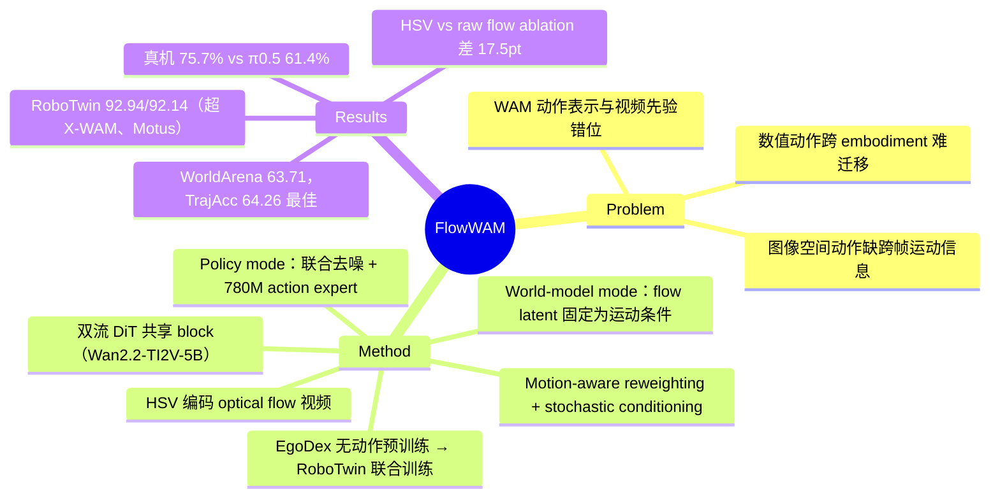

## Summary

FlowWAM 提出用 HSV 编码的 optical flow 视频作为 World Action Model 的统一动作表示：在 Wan2.2-TI2V-5B 上构建 RGB + flow 双流 diffusion，同一模型既能做 policy（联合生成未来 RGB+flow，再由 action expert 解码为动作），也能做 world model（固定 flow latent 作为运动条件生成视频），在 RoboTwin 2.0 上取得 92.94%（Clean）/ 92.14%（Random），WorldArena EWMScore 63.71。

## Problem & Motivation

WAM 复用预训练 video generator 做世界建模 + 动作预测，核心难题是动作表示与视频先验的对齐：

- **数值动作 token** 精确但各机器人动作空间不同，跨 embodiment 迁移难，且与视频生成器的视觉先验错位；
- **learned latent action** 抽象，可能丢失控制所需的稠密、空间 grounded 的运动线索；
- **图像空间动作**（mask、ray map 等）只提供"动作发生在哪"的静态空间线索，不编码跨帧运动的方向和幅度。

作者的核心问题：能否找到一种 video-native、保留稠密跨帧运动信息、且可解码回机器人动作的表示？答案是 optical flow——每像素位移经 HSV 编码映射到 RGB 空间后，就是一段与预训练视频先验天然对齐的"运动视频"，且编码可逆（φ⁻¹ 可恢复数值 flow 场）。

## Method

**基座与双流结构**
- 基座为 Wan2.2-TI2V-5B（image-to-video DiT）。RGB 帧和 HSV-flow 帧由**同一个 frozen VAE** 独立编码为 RGB latents / flow latents。
- 双流 DiT 的 stream-specific 参数只有各自的 patch embedding 和 output head，**所有 transformer block 共享**；两流 token 拼接做 joint attention 后再切分回各流，RoPE 各流独立。

**Flow 的 HSV 编码**：H = (atan2(v,u)+π)/2π 编方向，S = ‖f_t‖/m 编幅度（m 为归一化常数），V ≡ 1。ground-truth flow 用 RAFT 从演示视频提取（伪标签）。

**两种运行模式**
- **Policy mode**：两流的未来帧均从高斯噪声初始化、联合去噪，同时生成未来 RGB rollout 和对应 flow 视频；780M 的 **action expert**（AdaLN diffusion transformer）cross-attend 到双流 per-layer hidden states + 本体感知状态，以 flow matching 目标预测 N 步 action chunk。
- **World-model mode**：flow latents 直接设为期望运动轨迹的 clean VAE 编码并在采样中固定，只对 RGB latents 去噪——flow 变成可控视频生成的运动条件。

**关键训练技巧**
- **Motion-aware reweighting**：操作场景 flow 极稀疏（背景静止占主导），按 flow latent 相对参考帧的 channel-averaged 偏差给 loss 加权（α=2.0），防止背景主导训练信号。
- **Stochastic latent conditioning**：action expert 训练时以 p=0.5 概率向输入 latent 混入噪声（ž = (1−σ)z + σε），对齐训练（clean latent）与推理（去噪中间态）的分布。

**两阶段训练**：Stage 1 在 EgoDex（第一人称人类操作视频，无动作标签）上只用 video loss 预训练双流 DiT（lr 5e-5）；Stage 2 在 RoboTwin 2.0（50 个双臂任务）上联合训练 L = L_video + λ_a·L_action（λ_f=0.1, λ_a=1.0，lr 1e-4）。

## Key Results

**RoboTwin 2.0**（50 任务，每任务 100 rollouts）：
- FlowWAM：**92.94%**（Clean）/ **92.14%**（Random）
- 对比：X-WAM 91.88/91.78，GigaWorld-Policy 89.76/90.68，Motus 88.66/87.02；VLA baseline 含 π0.5、X-VLA

**WorldArena**（121 帧 @24fps 视频世界模型评测）：
- FlowWAM EWMScore **63.71**，其中 Trajectory Accuracy **64.26**（所有方法最佳，相对提升 18.4%），Depth Accuracy 98.97
- 对比 action-conditioned baseline：GigaWorld-1 62.34（TrajAcc 54.27）、Ctrl-World 59.98（48.20）、IRASim 56.15（35.92）

**真机**：单臂 Franka 4 任务 + 双臂 ARX 3 任务，各 100 条遥操作演示、10 trials 评测，平均 **75.7%** vs π0.5 61.4%、Motus 57.1%；双臂任务上差距更大。

**Ablation**（注意：用自建 validation split，与主表数字不可直接比）：
- Policy mode：数值动作 69.8% → 原始 (u,v) flow 72.3% → 去掉 motion-aware reweighting 83.9% → 去掉 stochastic conditioning 82.1% → 完整 89.8%
- World-model mode：text-only 49.31 → 数值动作 54.18 → 原始 flow 56.72 → image mask 57.84 → 完整（HSV flow）65.23

## Strengths & Weaknesses

**Strengths**
- 表示选择的动机链条完整：flow 同时满足 video-native（与视频先验对齐）、稠密时序运动编码、可逆解码三个性质，ablation 也支撑了论点——HSV 编码相比原始 (u,v) 通道在 policy mode 差 17.5pt（72.3→89.8），说明"把 flow 映射进预训练模型见过的 RGB 空间"这一步是真正的关键，而非 flow 本身。
- 一个表示同时服务 policy 和 world-model 两种模式，且两个方向都拿到 SOTA 级数字；Trajectory Accuracy 64.26 vs 次优 54.27 的差距明显，说明 flow conditioning 对运动可控性确有实质提升。
- Motion-aware reweighting（+5.9pt）和 stochastic latent conditioning（+7.7pt）两个技巧针对的都是真实的分布问题（flow 稀疏性、train-test latent 分布错位），不是凑数的 trick。
- 无动作标签的 EgoDex 预训练路径让人类视频可以直接进 flow 表示学习，跨 embodiment 叙事成立（flow 不绑定动作空间）。

**Weaknesses**
- **推理成本只字不提**：policy mode 每次出 action chunk 都要跑 5B DiT 的完整视频去噪，论文没有任何 latency / 控制频率数字，这是 WAM 路线的通病，回避不谈是明显短板。
- **flow 的适用边界未讨论**：optical flow 只编码相机平面内的 2D 运动，深度方向运动、遮挡、相机运动（尤其真机 wrist camera）下 flow 会退化甚至误导；RAFT 伪标签的误差如何传播也没有分析。
- **World-model mode 的条件来源是 GT**：评测时 flow 条件来自参考轨迹的 clean 编码，实际用作 planner 时"期望 flow 从哪来"没有答案——目前它只是一个 motion-conditioned video generator，不是完整的 model-based 决策系统。
- RoboTwin 2.0 上 92.94 vs X-WAM 91.88 的差距在 benchmark 饱和区，边际信息量有限；真机 75.7%（每任务仅 10 trials）置信区间很宽。
- 未讨论 limitation（仅在 future work 提到扩展预训练规模和更长 horizon）。

## Mind Map

## Notes

- 与 [[2512-Motus]]（learned latent action code）、[[2607-DSWAM]]（无显式视频生成、直接 flow-matching 出 action）同属 WAM on RoboTwin 2.0 竞技场；FlowWAM 的差异化在于动作表示本身 video-native 且人类可解释，且同一表示反向可作视频生成条件。
- 值得追问：flow 表示在需要 3D 精细运动（如插孔、拧螺丝）的任务上是否会系统性失效——RoboTwin 的任务分布可能掩盖了这一点。
- 与 optical-flow-as-plan 的早期工作（ATM/Track2Act 一系 point-track 方法）的关系：dense flow vs sparse track 的取舍值得在 survey 中展开。
